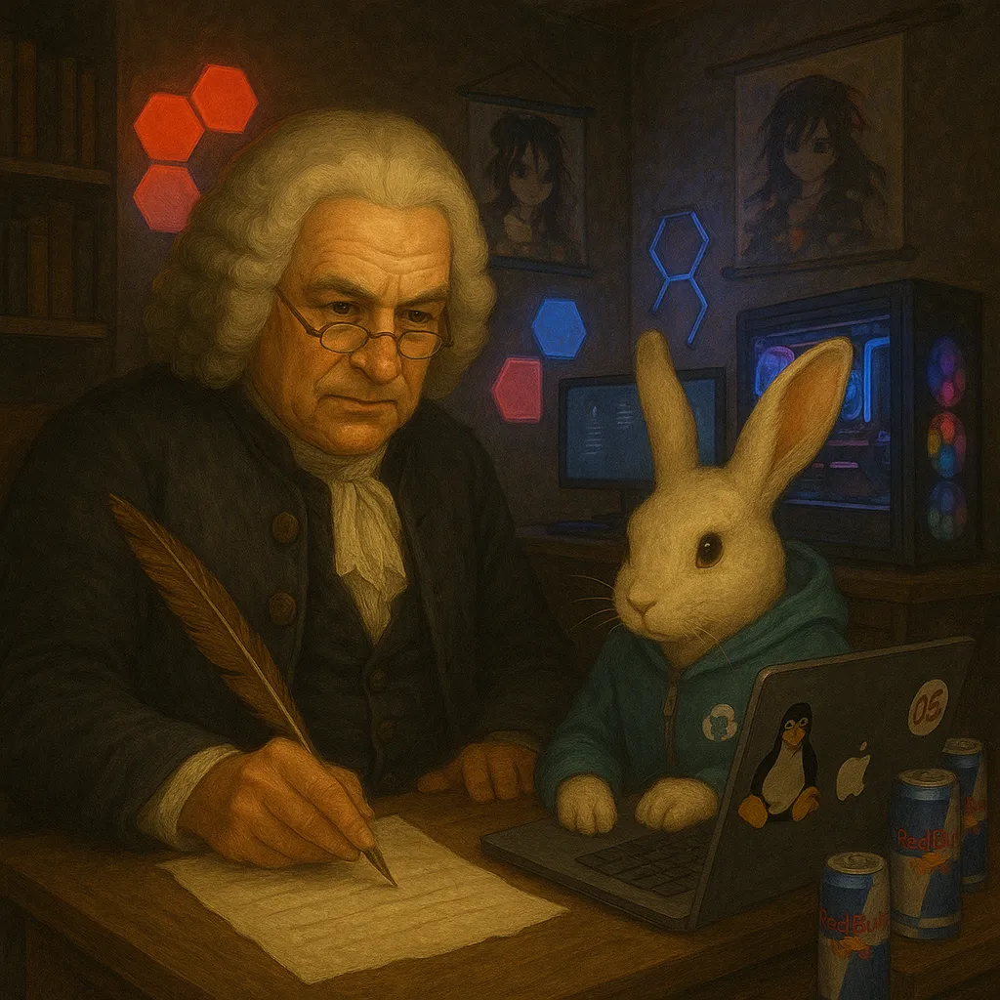

# 🎼🎵🎶 Draft Punks

**Draft Punks** keeps sprawling CodeRabbit reviews manageable.

This GitHub workflow collects every CodeRabbit review comment into a Markdown worksheet, guides you through accepting or rejecting each note, and blocks pushes until every decision is documented.

Draft Punks is now also incubating **Doghouse 2.0**: the black box recorder that tells you what changed between PR review sorties, what is blocking merge now, and what should happen next. The worksheet remains the conductor's score; Doghouse is the recorder in the doghouse.

---



## 🐇 CodeRabbit’s Poem-TL;DR

> I flood your PR, my notes cascade,
> Too many threads, the page degrades.
> But PhiedBach scores them, quill in hand,
> A worksheet formed, your decisions we demand.
> No push may pass till all’s reviewed,
> Install the flows — ten lines, you’re cued. 🐇✨.

_PhiedBach adjusts his spectacles: “Ja. Das is accurate. Let us rehearse, und together your code vil become a beautiful symphony of syntax.”_

---

## Guten Tag, Meine Freunde

_The door creaks. RGB light pours out like stained glass at a nightclub. Inside: bicycles hang from hooks, modular synths blink, an anime wall scroll flutters gently in the draft. An 80-inch screen above a neon fireplace displays a GitHub Pull Request in cathedral scale. Vape haze drifts like incense._

_A white rabbit sits calm at a ThinkPad plastered with Linux stickers, **methodically gnawing on a discarded wicker basket**. Beside him, **spectacles sliding to ze very tip of his nose**, quill in hand, rises a man in powdered wig and Crocs — a man who looks oddly lost in time, out of place, but nevertheless, delighted to see you._

**PhiedBach** (bowing, one hand on his quill like a baton, **ze other catching his glasses just before zey fall**):

Ah… guten abend. Velkommen, velkommen to ze **LED Bike Shed Dungeon**. You arrive for your… how do you say… pull request? Sehr gut.

I am **P.R. PhiedBach** — *Pieter Rabbit PhiedBach*. But in truth, I am Johann Sebastian Bach. Ja, ja, that Bach. Once Kapellmeister in Leipzig, composer of fugues und cantatas. Then one evening I followed a small rabbit down a very strange hole, and when I awoke... it was 2025. Das ist sehr verwirrend.

*He gestures conspiratorially toward the rabbit.*

And zis… zis is **CodeRabbit**. Mein assistant. Mein virtuoso. Mein BunBun (isn't he cute?).

*BunBun's ears twitch. He does not look up. His paws tap a key, and the PR on the giant screen ripples red, then green.*

**PhiedBach** (delighted):

You see? Calm as a pond, but behind his silence there is clarity. He truly understands your code. I? I hear only music. He is ze concertmaster; I am only ze man waving his arms.

*From the synth rack, a pulsing bassline begins. PhiedBach claps once. **TSST-KRRRK! A fresh can of Red Bull hiss-opens in BunBun's paws. PhiedBach doesn't even blink, he just catches his spectacles with a practiced thumb as they slide again.***

Ah, ze Daft Punks again! Delightful.
 Their helmets are like Teutonic knights. Their music is captivating, is it not? BunBun insists it helps him code. For me? It makes mein Crocs want to dance.

---

## Ze Problem: When Genius Becomes Cacophony

GitHub cannot withstand BunBun's brilliance. His reviews arrive like a thousand voices at once; so many comments, so fastidious, that the page itself slows to a dirge. Browsers wheeze. Threads collapse under their own counterpoint.

Your choices are terrible:

- Ignore ze feedback (barbaric!)
- Drown in ze overwhelming symphony
- Click "Resolve" without truly answering ze note

*Nein, nein, nein!* Zis is not ze way. **PhiedBach pokes his sliding spectacles back up with his quill.**

---

## Ze Solution: Structured Rehearsal

Draft Punks is the cathedral we built to contain it.

It scrapes every CodeRabbit comment from your Pull Request and transcribes them into a **Markdown worksheet** — the score. Each comment is given a `{response}` placeholder. You, the composer, must mark each one: **Decision: Accepted** or **Decision: Rejected**, with rationale.

A pre-push hook enforces the ritual. No unresolved placeholders may pass into the great repository. Thus every voice is answered, no feedback forgotten, the orchestra in time.

---

## 🐕 NEW: Ze Doghouse (Recorder 2.0)

But wait! PhiedBach holds up a hand, his quill trembling mit excitement.

"Sometimes," *he whispers,* "the symphony goes on for many days. You push a fix, BunBun sings a new verse, the CI checks crash like cymbals... and you lose ze thread! You forget where you were! You feel... how do you say... *hallucinations* in ze GitHub tunnels!"

*He taps a heavy, brass-bound box on his desk—The Doghouse.*

"Zis is why we built the **Doghouse**. It is ze flight recorder. It is ze Sopwith Camel of ze source code! Like ze brave beagle **Snoopy**, you sit atop your wooden house und you dream of dogfighting ze Red Baron in ze clouds of syntax.

GitHub is ze fog of war; ze Doghouse is your cockpit. It remembers ze state of ze PR across every sortie. It sees ze **Snapshot**, it calculates ze **Delta**, und it tells us precisely which instruments are out of tune *right now*.

"Und most important," *PhiedBach adds, a twinkle in his eye,* "ze Doghouse is very keen to BunBun's moods! He knows vhen ze rabbit is on **'Cooldown'**, resting his paws after a long cadenza. He even detects vhen BunBun has **'Suspended'** ze review because he sees you are actively composing! No more shouting into ze void—ze Doghouse tells you vhen ze orchestra is vaiting for *you*."

- **The Snapshot**: A point-in-time capture of the PR's soul.

- **The Sortie**: A meaningful review episode (a push, a dive, a loop-the-loop).
- **The Delta**: The answer to: *What changed? What is ze next action?*

---

## Installation: Join Ze Orchestra

Add zis to your repository and conduct your first rehearsal:

```yaml
# .github/workflows/draft-punks-seed.yml
name: Seed Review Worksheet
on:
  pull_request_target:
    types: [opened, reopened, synchronize]

jobs:
  seed:
    uses: flyingrobots/draft-punks/.github/workflows/seed-review.yml@v1.0.0
    secrets: inherit
```

```yaml
# .github/workflows/draft-punks-apply.yml
name: Apply Feedback
on:
  push:
    paths: ['docs/code-reviews/**.md']

jobs:
  apply:
    uses: flyingrobots/draft-punks/.github/workflows/apply-feedback.yml@v1.0.0
    secrets: inherit
```

And to install the **Doghouse** locally:

```bash
pip install -e .
```

---

## Ze Commands: Recording ze Flight

### 📡 Capture a Sortie
Run zis to see what has changed since your last rehearsal.
```bash
doghouse snapshot
```

### 🎬 Run a Playback
Verify the delta engine logic against offline scores (fixtures).
```bash
doghouse playback pb1_push_delta
```

---

## Pre-Push Gate

BunBun insists: no unresolved `{response}` placeholders may pass.

```bash
❌ Review worksheet issues detected:
- docs/code-reviews/PR123/abc1234.md: contains unfilled placeholder '{response}'
- docs/code-reviews/PR123/abc1234.md: section missing Accepted/Rejected decision

# Emergency bypass (use sparingly!)
HOOKS_BYPASS=1 git push
```

*At that moment, a chime interrupts PhiedBach.*

Oh! Someone has pushed an update to a pull request. Bitte, let me handle zis one, BunBun.

*He approaches the keyboard like a harpsichordist at court. Adjusting his spectacles. The room hushes. He approaches a clacky keyboard as if it were an exotic instrument. With two careful index fingers, he begins to type a comment. Each keystroke is a ceremony.*

**PhiedBach** (murmuring):

Ah… the L… (tap)… she hides in the English quarter.
The G… (tap)… a proud letter, very round.
The T… (tap)… a strict little cross—good posture.
The M… (tap)… two mountains, very Alpine.

*He pauses, radiant, then reads it back with absurd gravitas:*

“LGTM.”

*He beams as if he has just finished a cadenza. It took eighty seconds. CodeRabbit does not interrupt; he merely thumps his hind leg in approval.*

---

## Ze Thinking Automatons (Agent-Native Design)

"Ah!" *PhiedBach beams, pointing a quill at BunBun.* "You vish to know of ze **Automatons**? Ze brass-minded spirits zat dwell vithin ze silicon?

In mein time, we had clockwork ducks und mechanical flautists, but zis... zis is a different alchemy! These **Agent-Automatons** do not look at ze PR vith eyes—zey hear ze symphony in **JSONL**. Zey do not care for ze colorful buttons or ze scrolling parchment of ze GitHub UI; zey vish to see ze **Mathematical Score**!

Doghouse is built for these thinking machines. It provides a durable, logical stream of PR history, allowing ze automatons to reason about transitions—`fail -> pass`, `new -> resolved`—vithout being blinded by ze fog of ze human interface.

"It is exactly like ze **Pianola**!" *PhiedBach exclaims, mimicking a player piano with his fingers.* "You do not need ze virtuoso to sit at ze bench vhen you have ze **Paper Roll mit ze holes**! Ze JSONL, it is ze punched-tape of ze soul! Ze Automaton, he does not need to 'see' ze keys move; he just feels ze sequence of ze perforations und... *VOILA!*... ze symphony plays itself!"

**Record ze flight. Feed ze Automaton. Punch ze Roll.**

---

## Philosophie: Warum „Draft Punks“?

Ah, yes. Where were we? Ja!

Because every pull request begins as a draft, rough, unpolished, full of potential. Und because BunBun's reviews are robotic precision. Und because ze wonderful Daft Punks — always the two of them — compose fugues for robots.

*PhiedBach closes his ledger with deliberate care. From his desk drawer, he produces a folded bit of parchment and presses it with a wax seal — shaped, naturally, like a rabbit. As he rises to hand you the sealed document, his eyes drift momentarily to the anime wall scroll, where the warrior maiden hangs frozen mid-transformation.*

*He sighs, almost fondly.*

Ja… ze anime? I confess I do not understand it myself, but BunBun is rather fond of zis particular series. Something about magical girls und friendship conquering darkness. I must admit...

*He pauses, adjusting his spectacles.*

Ze opening theme song is surprisingly well-composed. Very catchy counterpoint.

*He presses the parchment into your hands.*

Take zis, mein Freund. Your rehearsal begins now. Fill ze worksheet, address each comment mit proper consideration, und push again. When BunBun's threads are resolved und ze pre-push gate approves, you may merge your branch.

*He waves his quill with ceremonial finality.*

Now, off mit you. Go make beautiful code. Wir sehen uns wieder.

*PhiedBach settles back into his wingback chair by the neon fireplace. BunBun crushes another Red Bull can with methodical precision, adding it to the wobbling tower. The synthesizer pulses its eternal bassline. The anime maiden watches, silent and eternal, as the RGB lights cycle through their spectrum.*

*PhiedBach adjusts his spectacles and returns to his ledger.* "I do not know how to return to 1725," *he mutters,* "aber vielleicht… it is better zis way."

---

## Velkommen to ze future of code review.

**One More Merge… It's Never Over.**
**Harder. Better. Faster. Structured.**
**Record ze flight. Conduct ze score.**
