# 🎼🎵🎶 Draft Punks

**Draft Punks** keeps sprawling CodeRabbit reviews manageable. 

This GitHub workflow collects every CodeRabbit review comment into a Markdown worksheet, guides you through accepting or rejecting each note, and blocks pushes until every decision is documented.

## TL;DR

- Harvest CodeRabbit review threads into a local worksheet with `{response}` placeholders.
- Fill each placeholder with an **Accepted** or **Rejected** response (plus rationale).
- A pre-push hook refuses to let you push until the worksheet is complete.
- The Apply Feedback workflow pushes your decisions back to GitHub once you commit the worksheet.

---


## 🐇 CodeRabbit’s Poem-TL;DR

> I flood your PR, my notes cascade,  
> Too many threads, the page degrades.  
> But PhiedBach scores them, quill in hand,  
> A worksheet formed, your decisions we demand.  
> No push may pass till all’s reviewed,  
> Install the flows — ten lines, you’re cued. 🐇✨. 

_PhiedBach adjusts his spectacles: “Ja. Das is accurate. Let us rehearse, und together your code vil become a beautiful symphony of syntax.”_

---

## Guten Tag, Meine Freunde

_The door creaks. RGB light pours out like stained glass at a nightclub. Inside: bicycles hang from hooks, modular synths blink, an anime wall scroll flutters gently in the draft. An 80-inch screen above a neon fireplace displays a GitHub Pull Request in cathedral scale. Vape haze drifts like incense._

_A white rabbit sits calm at a ThinkPad plastered with Linux stickers. Beside him, spectacles sliding low, quill in hand, rises a man in powdered wig and Crocs — a man who looks oddly lost in time, out of place, but nevertheless, delighted to see you._

**PhiedBach** (bowing, one hand on his quill like a baton):  

Ah… guten abend. Velkommen, velkommen to ze **LED Bike Shed Dungeon**. You arrive for your… how do you say… pull request? Sehr gut.

I am **P.R. PhiedBach** — *Pieter Rabbit PhiedBach*. But in truth, I am Johann Sebastian Bach. Ja, ja, that Bach. Once Kapellmeister in Leipzig, composer of fugues und cantatas. Then one evening I followed a small rabbit down a very strange hole, and when I awoke... it was 2025. Das ist sehr verwirrend.

*He gestures conspiratorially toward the rabbit.*

And zis… zis is **CodeRabbit**. Mein assistant. Mein virtuoso. Mein BunBun (isn't he cute?).

*BunBun's ears twitch. He does not look up. His paws tap a key, and the PR on the giant screen ripples red, then green.*

**PhiedBach** (delighted):  

You see? Calm as a pond, but behind his silence there is clarity. He truly understands your code. I? I hear only music. He is ze concertmaster; I am only ze man waving his arms.

*From the synth rack, a pulsing bassline begins. PhiedBach claps once.*

Ah, ze Daft Punks again! Delightful. Their helmets are like Teutonic knights. Their music is captivating, is it not? BunBun insists it helps him code. For me? It makes mein Crocs want to dance.

---

## Ze Problem: When Genius Becomes Cacophony

GitHub cannot withstand BunBun's brilliance. His reviews arrive like a thousand voices at once; so many comments, so fastidious, that the page itself slows to a dirge. Browsers wheeze. Threads collapse under their own counterpoint.

Your choices are terrible:

- Ignore ze feedback (barbaric!)
- Drown in ze overwhelming symphony
- Click "Resolve" without truly answering ze note

*Nein, nein, nein!* Zis is not ze way.

---

## Ze Solution: Structured Rehearsal

Draft Punks is the cathedral we built to contain it.

It scrapes every CodeRabbit comment from your Pull Request and transcribes them into a **Markdown worksheet** — the score. Each comment is given a `{response}` placeholder. You, the composer, must mark each one: **Decision: Accepted** or **Decision: Rejected**, with rationale.

A pre-push hook enforces the ritual. No unresolved placeholders may pass into the great repository. Thus every voice is answered, no feedback forgotten, the orchestra in time.

---

## Installation: Join Ze Orchestra

Add zis to your repository and conduct your first rehearsal:

```yaml
# .github/workflows/draft-punks-seed.yml
name: Seed Review Worksheet
on:
  pull_request_target:
    types: [opened, reopened, synchronize]

jobs:
  seed:
    uses: neuroglyph/draft-punks/.github/workflows/seed-review.yml@v1.0.0
    secrets: inherit
```

```yaml
# .github/workflows/draft-punks-apply.yml  
name: Apply Feedback
on:
  push:
    paths: ['docs/code-reviews/**.md']

jobs:
  apply:
    uses: neuroglyph/draft-punks/.github/workflows/apply-feedback.yml@v1.0.0
    secrets: inherit
```

Zat ist all! You see? Just ten lines of YAML, and your review chaos becomes beautiful counterpoint.

---

## Ein Example Worksheet

Here est ein sample, taken from a real project!

````markdown
---
title: Code Review Feedback
description: Preserved review artifacts and rationale.
audience: [contributors]
domain: [quality]
tags: [review]
status: archive
---

# Code Review Feedback

| Date | Agent | SHA | Branch | PR |
|------|-------|-----|--------|----|
| 2025-09-16 | Codex | `e4f3f906eb454cb103eb8cc6899df8dfbf6e2349` | [feat/changelog-and-sweep-4](https://github.com/neuroglyph/git-mind/tree/feat/changelog-and-sweep-4 "neuroglyph/git-mind:feat/changelog-and-sweep-4") | [PR#169](https://github.com/neuroglyph/git-mind/pull/169) |

## Instructions

Please carefully consider each of the following feedback items, collected from a GitHub code review.

Please act on each item by fixing the issue, or rejecting the feedback. Please update this document and fill out the information below each feedback item by replacing the text surrounded by curly braces. 

### Accepted Feedback Template

Please use the following template to record your acceptance.

```markdown

> [!note]- **Accepted**
> | Confidence | Remarks |
> |------------|---------|
> | <confidence_score_out_of_10> | <confidence_rationale> |
>
> ## Lesson Learned
> 
> <lesson>
>
> ## What did you do to address this feedback?
>
> <what_you_did>
>
> ## Regression Avoidance Strategy
>
> <regression_avoidance_strategy>
>
> ## Notes
>
> <any_additional_context_or_say_none>

```

### Rejected Feedback Template

Please use the following template to record your rejections.

```markdown

> [!CAUTION]- **Rejected**
> | Confidence | Remarks |
> |------------|---------|
> | <confidence_score_out_of_10> | <confidence_rationale> |
>
> ## Rejection Rationale
>
> <rationale>
>
> ## What you did instead
>
> <what_you_did>
>
> ## Tradeoffs considered
>
> <pros_and_cons>
>
> ## What would make you change your mind
>
> <change_mind_conditions>
>
> ## Future Plans
>
> <future_plans>

```

---

## CODE REVIEW FEEDBACK

The following section contains the feedback items, extracted from the code review linked above. Please read each item and respond with your decision by injecting one of the two above templates beneath the feedback item.

### Broaden CHANGELOG detection in pre-push hook

```text
.githooks/pre-push around line 26: the current check only matches the exact
filename 'CHANGELOG.md' (case-sensitive) and will miss variants like
'CHANGES.md', 'CHANGELOG' or different casing and paths; update the git diff
grep to use the quoted "$range", use grep -i (case-insensitive) and -E with a
regex that matches filenames or paths ending with CHANGELOG or CHANGES
optionally followed by .md, e.g. use grep -iqE
'(^|.*/)(CHANGELOG|CHANGES)(\.md)?$' so the hook correctly detects all common
changelog filename variants.
```

> [!note]- **Accepted**
> | Confidence | Remarks |
> |------------|---------|
> | 9/10 | Regex and quoting are straightforward; covers common variants. |
>
> ## Lesson Learned
>
> Hooks must be resilient to common filename variants and path locations. Quote git ranges and use case-insensitive, anchored patterns.
>
> ## What did you do to address this feedback?
>
> - Updated `.githooks/pre-push` to quote the diff range and use `grep -iqE '(^|.*/)(CHANGELOG|CHANGES)(\.md)?$'` on `git diff --name-only` output.
> - Improved error message to mention supported variants and how to add an entry.
>
> ## Regression Avoidance Strategy
>
> - Keep the hook in-repo and exercised by contributors on push to `main`.
> - Documented bypass via `HOOKS_BYPASS=1` to reduce friction when needed.
>
> ## Notes
>
> Consider adding a small CI job that enforces a changelog change on PRs targeting `main` to complement local hooks.

````

Und, ja, like so: push passes. Worksheet preserved. Orchestra applauds. The bunny is pleased.

---

## Ze Workflow

Perhaps this illustration will help, ja?

```mermaid
sequenceDiagram
    actor Dev as Developer
    participant GH as GitHub PR
    participant CR as CodeRabbit (BunBun)
    participant DP as Draft Punks
    participant WS as Worksheet
    participant HOOK as Pre-Push Gate

    Dev->>GH: Open PR
    GH-->>CR: CodeRabbit reviews\n(leaves many comments)
    GH-->>DP: Trigger workflow
    DP->>GH: Scrape BunBun's comments
    DP->>WS: Generate worksheet\nwith {response} placeholders
    Dev->>WS: Fill in decisions\n(Accepted/Rejected)
    Dev->>HOOK: git push
    HOOK-->>WS: Verify completeness
    alt Incomplete
        HOOK-->>Dev: ❌ Reject push
    else Complete
        HOOK-->>Dev: ✅ Allow push
        DP->>GH: Apply decisions\npost back to threads
    end
```



*PhiedBach adjusts his spectacles, tapping the quill against the desk. You see him scribble on the parchment:*

> “Every comment is a note. Every note must be played.”
> — Johann Sebastian Bach, Kapellmeister of Commits, 2025

Ja, BunBun, zis is vhy I adore ze source codes. Like a score of music — every line, every brace, a note in ze grand composition. My favorite language? *He pauses, eyes glinting with mischief.* C… natürlich.

*BunBun’s ear flicks. Another Red Bull can hisses open.*

---

## Ze Pre-Push Gate

BunBun insists: no unresolved `{response}` placeholders may pass.

```bash
❌ Review worksheet issues detected:
- docs/code-reviews/PR123/abc1234.md: contains unfilled placeholder '{response}'
- docs/code-reviews/PR123/abc1234.md: section missing Accepted/Rejected decision

# Emergency bypass (use sparingly!)
HOOKS_BYPASS=1 git push
```

*At that moment, a chime interrupts PhiedBach.*

Oh! Someone has pushed an update to a pull request. Bitte, let me handle zis one, BunBun.

*He approaches the keyboard like a harpsichordist at court. Adjusting his spectacles. The room hushes. He approaches a clacky keyboard as if it were an exotic instrument. With two careful index fingers, he begins to type a comment. Each keystroke is a ceremony.*

**PhiedBach** (murmuring):

Ah… the L… (tap)… she hides in the English quarter.
The G… (tap)… a proud letter, very round.
The T… (tap)… a strict little cross—good posture.
The M… (tap)… two mountains, very Alpine.

*He pauses, radiant, then reads it back with absurd gravitas:*

“LGTM.”

*He beams as if he has just finished a cadenza. It took eighty seconds. CodeRabbit does not interrupt; he merely thumps his hind leg in approval.*

---

## Philosophie: Warum „Draft Punks“?

Ah, yes. Where were we? Ja! 

Because every pull request begins as a draft, rough, unpolished, full of potential. Und because BunBun's reviews are robotic precision. Und because ze wonderful Daft Punks — always the two of them — compose fugues for robots.

*PhiedBach closes his ledger with deliberate care. From his desk drawer, he produces a folded bit of parchment and presses it with a wax seal — shaped, naturally, like a rabbit. As he rises to hand you the sealed document, his eyes drift momentarily to the anime wall scroll, where the warrior maiden hangs frozen mid-transformation.*

*He sighs, almost fondly.*

Ja… ze anime? I confess I do not understand it myself, but BunBun is rather fond of zis particular series. Something about magical girls und friendship conquering darkness. I must admit...

*He pauses, adjusting his spectacles.*

Ze opening theme song is surprisingly well-composed. Very catchy counterpoint.

*He presses the parchment into your hands.*

Take zis, mein Freund. Your rehearsal begins now. Fill ze worksheet, address each comment mit proper consideration, und push again. When BunBun's threads are resolved und ze pre-push gate approves, you may merge your branch.

*He waves his quill with ceremonial finality.*

Now, off mit you. Go make beautiful code. Wir sehen uns wieder.

*PhiedBach settles back into his wingback chair by the neon fireplace. BunBun crushes another Red Bull can with methodical precision, adding it to the wobbling tower. The synthesizer pulses its eternal bassline. The anime maiden watches, silent and eternal, as the RGB lights cycle through their spectrum.*

*PhiedBach adjusts his spectacles and returns to his ledger.* "I do not know how to return to 1725," *he mutters,* "aber vielleicht… it is better zis way."

---

## Velkommen to ze future of code review.

**One More Merge… It's Never Over.**
**Harder. Better. Faster. Structured.**
