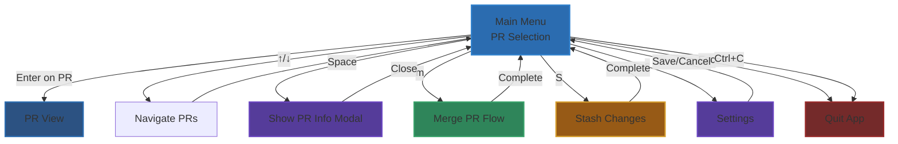
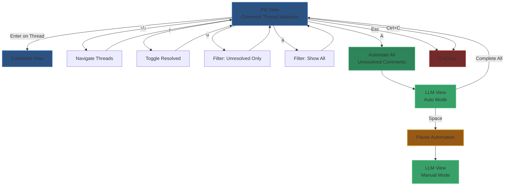
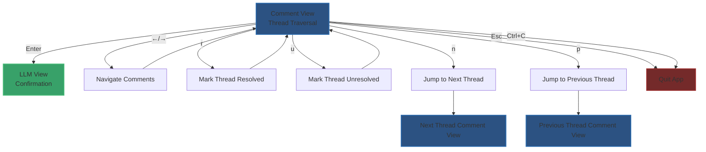
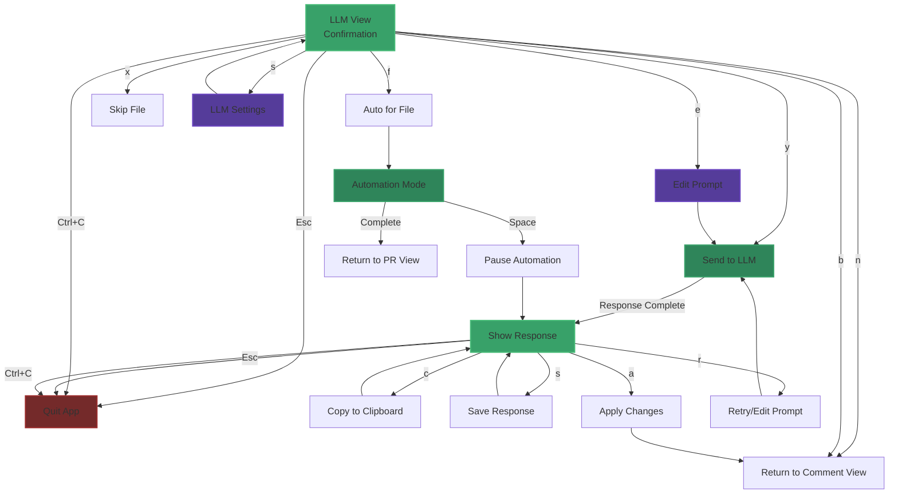

# Draft Punks - TUI Specification

## Navigation Flow

```
Title Screen
└── Main Menu (PR Selection)
    └── PR View (Comment Thread Selection)
        └── Comment View (Thread Traversal)
            └── LLM View (AI Interaction)
```

---

# 0. Scroll View Widget

## Overview

A scroll view looks like:

```
# {title}

{scroll items}

Displaying [{range}] of {total}

↑, ↓ pick
[Enter] select
{item actions}
```

The scroll view is a custom generic widget that can be used to display lists of items that the user should pick from. 

The scroll view displays as many items in the list as it can at once. Items in the scroll view are pickable. The user can press up or down arrow to pick and scroll. Items can have their own key bindings.

The scroll view works by binding to a list of items and an item view. It dynamically figure out how many lines of text can fit, considering the title, spacing, and lines required by `{item actions}`

### Title

`{title}` is a string that indicates what the scroll view contains

### Scroll Items

`{scroll items}` are the items in the scroll views. They are subviews and are configured by items in the scroll view's list.

This view should be scrollable, in case there are many PRs. When there are more PRs than could fit, the "[1-3] of 3" displays the index of the PRs display on the scrolling view

---

# 1. Title Screen

## UX Flow Diagram



```mermaid
graph TD
    A[Title Screen] -->|Enter| B[Main Menu]
    A -->|Esc| Z1[Quit App]
    A -->|Ctrl+C| Z1
    
    style A fill:#2d3748,stroke:#4a5568,stroke-width:2px
    style B fill:#2b6cb0,stroke:#3182ce,stroke-width:2px
    style Z1 fill:#742a2a,stroke:#9b2c2c,stroke-width:2px
```

## Layout

- Full-screen, full-width
- Logo centered
- Git repo info underneath
- Main instructions at bottom

## UX Screen

```
╔══════════════════════════════════════════════════╗
║                                                  ║
║              ██████╗ ██████╗  █████╗ ███████╗   ║
║              ██╔══██╗██╔══██╗██╔══██╗██╔════╝   ║
║              ██║  ██║██████╔╝███████║█████╗     ║
║              ██║  ██║██╔══██╗██╔══██║██╔══╝     ║
║              ██████╔╝██║  ██║██║  ██║██║        ║
║              ╚═════╝ ╚═╝  ╚═╝╚═╝  ╚═╝╚═╝        ║
║                                                  ║
║           ██████╗ ██╗   ██╗███╗   ██╗██╗  ██╗   ║
║           ██╔══██╗██║   ██║████╗  ██║██║ ██╔╝   ║
║           ██████╔╝██║   ██║██╔██╗ ██║█████╔╝    ║
║           ██╔═══╝ ██║   ██║██║╚██╗██║██╔═██╗    ║
║           ██║     ╚██████╔╝██║ ╚████║██║  ██╗   ║
║           ╚═╝      ╚═════╝ ╚═╝  ╚═══╝╚═╝  ╚═╝   ║
║                                                  ║
║           PR Comment Resolution Assistant        ║
║                                                  ║
╠══════════════════════════════════════════════════╣
║                                                  ║
║  Git repo: /Users/james/git/draft-punks         ║
║  Git remote: origin git@github.com:...          ║
║  Git branch: main                                ║
║  Git status: clean                               ║
║                                                  ║
╠══════════════════════════════════════════════════╣
║                                                  ║
║  [Enter] Continue    [Esc] Quit                  ║
║                                                  ║
╚══════════════════════════════════════════════════╝
```

Shows:
- Draft Punks logo/title
- Git repo info:
  - Repo path
  - Remote URL
  - Current branch
  - Status (clean/dirty)
- Clear instructions to press Enter to continue or Esc to quit

## UX Flow

- `Enter` → go to Main Menu (PR Selection)
- `Esc` → terminate app with exit code 0
- `Ctrl+C` → terminate app with exit code 0

---

# 2. Main Menu (PR Selection Screen)

## UX Flow Diagram



## UX Screen

### Git Repo Info Header

```
{repo_path} ⎇ {ref} {dirty}
```

- `{repo_path}` is the /path/to/the/git/repo
- `{ref}` is the current HEAD ref name
- `{dirty}` is either omitted if git repo is clean, or `🚧` if the git repo is dirty

#### Dirty Warning Banner

If git repo is dirty, show an alert banner:

```
┌────────────────────────────────────────────────┐
│ ⚠️  WARNING: Dirty Git Repo                    │
│                                                │
│ Working directory is dirty. You'll be prompted │
│ to stash or discard these changes before we    │
│ can continue.                                  │
│                                                │
│ Press [S] to stash now.                        │
└────────────────────────────────────────────────┘
```

### PR Selection List

A scrollable list view with selection and picking. User uses the up or down arrow to pick, `[Enter]` to select, `[Space]` for more info, `[m]` to merge PR.

#### PR Selection List Item View

Represents an open PR and displays information about its current state:

```
░ {icon} PR #{number} {info} ⎇ {branch}
░ 👤 {author} ⏳ {age}
░ {title}
```

##### Icon

`{icon}` is one of the following:

- `✅` if CI/CD is error-free, there are no unresolved issues, and the user can merge it 
- `🟡` if there are unresolved issues
- `🛑` if there are CI/CD errors
- `🚫` if the user cannot merge this branch and none of the above apply

##### Number

`{number}` is the PR identifier

##### Info

`{info}` is a string like this:

```
{ i: 1, e: 4 }
```

if it is not mergeable and there are no issues or errors, `i` = issue count, `e` = error count.

##### Branch

`{branch}` is the git branch for the PR

##### Author

`{author}` is the username for the person who opened the PR

##### Age

`{age}` is a humanized time delta, like "2 hours ago", or "12 weeks ago"

It should be formatted:

- if age < 1 hour: `{minutes} mins ago` (special case 'just now' if less than 5 mins)
- else if age < 1 day: `{hours} hours ago`
- else if age < 1 week: `{days} days ago` (special case: 'yesterday')
- else `{weeks} weeks ago` (special case: 'last week')

##### Title

`{title}` is the PR title. 

**NOTE:** if longer than 50 characters, truncate by replacing from character 48+ with `[…]` so that it is at most 50 characters long.

Example:

```
This is a really long title that is way longer than 50 characters long
```

becomes:

```
This is a really long title that is way longer […]
```

### Example

If there are 3 open PRs, it might look like (the first one is selected):

```
# Open Pull Requests

→   █ 🟡 PR #22 { i: 1 } ⎇ feat/something-cool
    █ 👤 flyingrobots ⏳ 12 days ago
    █ Adds something cool to the main program […]

    ░ 🛑 PR #33 { i: 12, e: 8 } ⎇ feat/whatever
    ░ 👤 somedude ⏳ 1 hour ago
    ░ Here's another one

    ░ ✅ PR #35 ⎇ fix/some-bug
    ░ 👤 someone ⏳ yesterday
    ░ Finally! We're fixing this bug

Displaying [1-3] of 3 

↑, ↓ pick
[Enter] select 
[Space] info 
[m] merge
[Esc] back
```

For example: if only 3 fit on-screen, but there are 12 total, it might look like this:

```
# Open Pull Requests

    ░ 🟡 PR #12 { i: 4 } ⎇ chore/docs-update
    ░ 👤 contributor ⏳ 2 days ago
    ░ Who knows what this does?

    ░ 🚫 PR #14 ⎇ feat/whatever
    ░ 👤 author ⏳ 1 week ago
    ░ This is a pull request that has a long […]

→   █ ✅ PR #5 ⎇ feat/old-thing
    █ 👤 flyingrobots ⏳ 3 weeks ago
    █ Add box to thing

Displaying [7-9] of 12 

↑, ↓ pick
[Enter] select
[Space] info
[m] merge
[Esc] back
```

## UX Flow

- `↑` / `↓` → pick different PR
- `Enter` → go to PR View (§3) for selected PR
- `Space` → show full PR info modal (title, description, all metadata)
- `m` → trigger merge flow for selected PR (if mergeable)
- `S` → stash working directory changes (if dirty)
- `s` → open settings
- `Esc` → terminate app
- `Ctrl+C` → terminate app

---

# 3. PR View (Comment Thread Selection)

## UX Flow Diagram



## Overview

Shows all comment threads for the selected PR. User can navigate through unresolved threads and choose which one to work on.

## UX Screen

### Header

```
PR #{number}: {title}
⎇ {branch} → {base_branch}
👤 {author} | {status_badge} | 💬 {thread_count} threads ({unresolved_count} unresolved)
```

- `{number}` = PR number
- `{title}` = full PR title (not truncated)
- `{branch}` = source branch
- `{base_branch}` = target branch (usually "main")
- `{author}` = PR author
- `{status_badge}` = visual status (✅ mergeable, 🟡 has issues, 🛑 failing)
- `{thread_count}` = total comment threads
- `{unresolved_count}` = unresolved thread count

### Comment Thread List

A scrollable list of comment threads. Each thread shows:

```
░ {icon} {file_path}:{line}
░ 💬 {comment_count} | 👤 {first_commenter} | ⏳ {age}
░ {first_comment_preview}
```

#### Icon

- `🔴` = unresolved
- `✅` = resolved
- `🤖` = bot comment (CodeRabbit, etc.)

#### File Info

- `{file_path}` = relative file path
- `{line}` = line number or line range (e.g., "42" or "42-45")

#### Thread Metadata

- `{comment_count}` = number of comments in thread
- `{first_commenter}` = username of first commenter
- `{age}` = time since first comment (same format as PR age)

#### Preview

`{first_comment_preview}` = first 60 characters of first comment, truncated with `[…]` if longer

### Example

```
╔══════════════════════════════════════════════════════════════╗
║ PR #22: Adds something cool to the main program              ║
║ ⎇ feat/something-cool → main                                 ║
║ 👤 flyingrobots | 🟡 has issues | 💬 5 threads (3 unresolved) ║
╠══════════════════════════════════════════════════════════════╣
║                                                              ║
║ # Comment Threads                                            ║
║                                                              ║
║ →   █ 🔴 src/main.rs:42                                      ║
║     █ 💬 3 | 👤 coderabbitai | ⏳ 2 hours ago                 ║
║     █ Consider using a more idiomatic approach here […]      ║
║                                                              ║
║     ░ 🔴 src/utils.rs:108-112                                ║
║     ░ 💬 2 | 👤 reviewer_name | ⏳ 1 day ago                  ║
║     ░ This function could be simplified by […]               ║
║                                                              ║
║     ░ ✅ tests/integration.rs:67                             ║
║     ░ 💬 4 | 👤 flyingrobots | ⏳ 3 days ago                  ║
║     ░ Need to add edge case handling for […]                 ║
║                                                              ║
║ Displaying [1-3] of 5                                        ║
║                                                              ║
║ ↑, ↓ pick                                                    ║
║ [Enter] view thread                                          ║
║ [A] automate all unresolved                                  ║
║ [r] toggle resolved                                          ║
║ [u] show unresolved only                                     ║
║ [a] show all                                                 ║
║ [Esc] quit                                                   ║
╚══════════════════════════════════════════════════════════════╝
```

## UX Flow

- `↑` / `↓` → pick different thread
- `Enter` → go to Comment View (§4) for selected thread
- `A` → **Automate all unresolved threads** - enters LLM View in automation mode:
  - Automatically traverses all unresolved comment threads in the PR
  - Sends each comment to the LLM with no user input required
  - Processes comments sequentially, one after another
  - User can press `Space` at any time to interrupt and pause automation
  - After interruption, continues in normal LLM View mode
  - When complete, returns to PR View
- `r` → toggle resolved/unresolved for selected thread (quick action without entering thread)
- `u` → filter to show unresolved threads only
- `a` → show all threads (resolved and unresolved)
- `Esc` → terminate app
- `Ctrl+C` → terminate app

---

# 4. Comment View (Thread Traversal)

## UX Flow Diagram



## Overview

Shows the full comment thread. User can read through comments sequentially, mark as resolved/unresolved, or pass to LLM for assistance.

## UX Screen

### Header

```
Thread: {file_path}:{line}
Status: {status} | 💬 {comment_count} comments
```

- `{file_path}:{line}` = location of thread
- `{status}` = "🔴 Unresolved" or "✅ Resolved"
- `{comment_count}` = number of comments in thread

### Current Comment Display

Shows one comment at a time with full content:

```
┌────────────────────────────────────────────────┐
│ 👤 {username} | ⏳ {age}                        │
├────────────────────────────────────────────────┤
│                                                │
│ {comment_body}                                 │
│                                                │
│ {code_snippet}                                 │
│                                                │
└────────────────────────────────────────────────┘

Comment [{current}] of [{total}]
```

#### Comment Metadata

- `{username}` = commenter's username
- `{age}` = time since comment (same format as before)
- `{comment_body}` = full comment text (wrapped appropriately)
- `{code_snippet}` = any code snippets in comment (syntax highlighted if possible)
- `{current}` = index of current comment (1-indexed)
- `{total}` = total comments in thread

### Context Display (Optional)

If available, show relevant code context above the comment:

```
┌─ Code Context ────────────────────────────────┐
│  40 | fn process_data(input: &str) -> Result {│
│  41 |     let parsed = parse(input)?;          │
│→ 42 |     Ok(parsed.transform())               │
│  43 | }                                        │
└───────────────────────────────────────────────┘
```

### Example

```
╔══════════════════════════════════════════════════════════════╗
║ Thread: src/main.rs:42                                       ║
║ Status: 🔴 Unresolved | 💬 3 comments                        ║
╠══════════════════════════════════════════════════════════════╣
║                                                              ║
║ ┌─ Code Context ────────────────────────────────────────┐   ║
║ │  40 | fn process_data(input: &str) -> Result {        │   ║
║ │  41 |     let parsed = parse(input)?;                 │   ║
║ │→ 42 |     Ok(parsed.transform())                      │   ║
║ │  43 | }                                               │   ║
║ └─────────────────────────────────────────────────────────┘   ║
║                                                              ║
║ ┌────────────────────────────────────────────────────────┐   ║
║ │ 👤 coderabbitai | ⏳ 2 hours ago                       │   ║
║ ├────────────────────────────────────────────────────────┤   ║
║ │                                                        │   ║
║ │ Consider using a more idiomatic approach here. The    │   ║
║ │ transform() method could fail, but we're not handling │   ║
║ │ that case. Suggestion:                                │   ║
║ │                                                        │   ║
║ │ ```rust                                               │   ║
║ │ parsed.transform().map_err(|e| Error::Transform(e))  │   ║
║ │ ```                                                   │   ║
║ │                                                        │   ║
║ └────────────────────────────────────────────────────────┘   ║
║                                                              ║
║ Comment [1] of [3]                                           ║
║                                                              ║
║ [←] [→] navigate comments                                    ║
║ [Enter] pass to LLM                                          ║
║ [r] mark as resolved                                         ║
║ [u] mark as unresolved                                       ║
║ [n] next thread                                              ║
║ [p] previous thread                                          ║
║ [Esc] quit                                                   ║
╚══════════════════════════════════════════════════════════════╝
```

## UX Flow

- `←` / `→` → navigate to previous/next comment in thread
- `Enter` → pass current comment to LLM View (§5)
- `r` → mark entire thread as resolved
- `u` → mark entire thread as unresolved
- `n` → jump to next thread (skip to next unresolved thread in PR)
- `p` → jump to previous thread
- `Esc` → terminate app
- `Ctrl+C` → terminate app

---

# 5. LLM View (AI Interaction)

## UX Flow Diagram



## Overview

The LLM View has two modes:

1. **Manual Mode** - User confirms before sending each comment
2. **Automation Mode** - Automatically processes multiple comments sequentially

## Mode 1: Manual Mode

### Confirmation Screen

When entering LLM View from Comment View, first show a confirmation screen:

```
╔══════════════════════════════════════════════════════════════╗
║ Send to LLM?                                                 ║
║ Thread: src/main.rs:42                                       ║
╠══════════════════════════════════════════════════════════════╣
║                                                              ║
║ ┌─ Comment ─────────────────────────────────────────────┐   ║
║ │ 👤 coderabbitai | ⏳ 2 hours ago                       │   ║
║ ├────────────────────────────────────────────────────────┤   ║
║ │                                                        │   ║
║ │ Consider using a more idiomatic approach here. The    │   ║
║ │ transform() method could fail, but we're not handling │   ║
║ │ that case. Suggestion:                                │   ║
║ │                                                        │   ║
║ │ ```rust                                               │   ║
║ │ parsed.transform().map_err(|e| Error::Transform(e))  │   ║
║ │ ```                                                   │   ║
║ │                                                        │   ║
║ └────────────────────────────────────────────────────────┘   ║
║                                                              ║
║ ┌─ Code Context ────────────────────────────────────────┐   ║
║ │  40 | fn process_data(input: &str) -> Result {        │   ║
║ │  41 |     let parsed = parse(input)?;                 │   ║
║ │→ 42 |     Ok(parsed.transform())                      │   ║
║ │  43 | }                                               │   ║
║ └─────────────────────────────────────────────────────────┘   ║
║                                                              ║
║ What would you like to do?                                   ║
║                                                              ║
║ [y] Yes, send to LLM                                         ║
║ [e] Yes, but let me edit the prompt first                    ║
║ [f] Yes, and automatically process all comments in this file ║
║ [n] No, skip this comment                                    ║
║ [x] No, skip this entire file                                ║
║ [s] I need to change LLM settings                            ║
║ [b] Go back to comment view                                  ║
║ [Esc] quit                                                   ║
╚══════════════════════════════════════════════════════════════╝
```

#### Confirmation Options

- `y` → Send comment as-is to LLM (proceed to Response Screen)
- `e` → Open prompt editor, allow user to modify, then send (proceed to Response Screen)
- `f` → Enter **Automation Mode** for all remaining comments in the current file
- `n` → Skip this comment, return to Comment View
- `x` → Skip all remaining comments in this file, return to PR View
- `s` → Open LLM settings modal, then return to confirmation
- `b` → Return to Comment View without sending
- `Esc` → Terminate app
- `Ctrl+C` → Terminate app

### Prompt Editor (if `e` selected)

```
╔══════════════════════════════════════════════════════════════╗
║ Edit Prompt                                                  ║
║ Thread: src/main.rs:42                                       ║
╠══════════════════════════════════════════════════════════════╣
║                                                              ║
║ ┌─ Prompt ──────────────────────────────────────────────┐   ║
║ │ [Editable text area]                                   │   ║
║ │                                                        │   ║
║ │ File: src/main.rs                                      │   ║
║ │ Lines: 40-43                                           │   ║
║ │                                                        │   ║
║ │ Comment from coderabbitai:                            │   ║
║ │ Consider using a more idiomatic approach here...      │   ║
║ │                                                        │   ║
║ │ Code Context:                                         │   ║
║ │ fn process_data(input: &str) -> Result {             │   ║
║ │     let parsed = parse(input)?;                      │   ║
║ │     Ok(parsed.transform())                           │   ║
║ │ }                                                     │   ║
║ │                                                        │   ║
║ │ [User can edit this entire prompt]                     │   ║
║ │                                                        │   ║
║ └────────────────────────────────────────────────────────┘   ║
║                                                              ║
║ [Enter] send    [Esc] quit                                   ║
╚══════════════════════════════════════════════════════════════╝
```

### Response Screen

After sending to LLM (either from confirmation or after editing):

```
╔══════════════════════════════════════════════════════════════╗
║ LLM Assistant | Model: Claude Sonnet 4.5                     ║
║ Thread: src/main.rs:42                                       ║
╠══════════════════════════════════════════════════════════════╣
║                                                              ║
║ Status: ⏳ Thinking...                                       ║
║                                                              ║
║ ┌─ LLM Response ────────────────────────────────────────┐   ║
║ │                                                       │   ║
║ │ [Streaming response as it arrives...]                │   ║
║ │                                                       │   ║
║ └───────────────────────────────────────────────────────┘   ║
╚══════════════════════════════════════════════════════════════╝
```

Once complete:

```
╔══════════════════════════════════════════════════════════════╗
║ LLM Assistant | Model: Claude Sonnet 4.5                     ║
║ Thread: src/main.rs:42                                       ║
╠══════════════════════════════════════════════════════════════╣
║                                                              ║
║ ┌─ LLM Response ────────────────────────────────────────┐   ║
║ │                                                       │   ║
║ │ CodeRabbit is correct here. The transform() method   │   ║
║ │ returns a Result, so it could fail. Currently, if it │   ║
║ │ fails, we'd get a panic instead of propagating the   │   ║
║ │ error properly.                                      │   ║
║ │                                                       │   ║
║ │ Here's the fix:                                      │   ║
║ │                                                       │   ║
║ │ ```rust                                              │   ║
║ │ fn process_data(input: &str) -> Result {            │   ║
║ │     let parsed = parse(input)?;                     │   ║
║ │     parsed.transform()                              │   ║
║ │ }                                                    │   ║
║ │ ```                                                  │   ║
║ │                                                       │   ║
║ │ The ? operator will handle error propagation for us. │   ║
║ │                                                       │   ║
║ └───────────────────────────────────────────────────────┘   ║
║                                                              ║
║ Status: ✅ Complete                                          ║
║                                                              ║
║ [c] copy to clipboard                                        ║
║ [s] save response                                            ║
║ [a] apply changes to file                                    ║
║ [r] retry with different prompt                              ║
║ [Esc] quit                                                   ║
╚══════════════════════════════════════════════════════════════╝
```

#### Response Actions

- `c` → copy LLM response to clipboard, stay on response screen
- `s` → save LLM response to file (prompt for filename), stay on response screen
- `a` → apply suggested code changes to file:
  - Parse code blocks from response
  - Show diff preview
  - Prompt for confirmation
  - Apply changes to working directory
  - Return to Comment View
- `r` → retry with modified prompt:
  - Open prompt editor
  - Allow user to edit prompt
  - Re-submit to LLM
  - Show new response
- `Esc` → terminate app
- `Ctrl+C` → terminate app

## Mode 2: Automation Mode

### Entering Automation Mode

Automation Mode is triggered by:
1. Pressing `[f]` in the confirmation screen (auto-process all comments in current file)
2. Pressing `[A]` in PR View (auto-process ALL unresolved comments in PR)

### Automation Screen

```
╔══════════════════════════════════════════════════════════════╗
║ LLM Automation Mode | Model: Claude Sonnet 4.5               ║
║ Processing unresolved comments...                            ║
╠══════════════════════════════════════════════════════════════╣
║                                                              ║
║ Progress: [3 / 12] comments processed                        ║
║                                                              ║
║ ┌─ Current Comment ─────────────────────────────────────┐   ║
║ │ File: src/utils.rs:108                                │   ║
║ │ Author: reviewer_name                                 │   ║
║ │                                                       │   ║
║ │ This function could be simplified by using...        │   ║
║ └───────────────────────────────────────────────────────┘   ║
║                                                              ║
║ ┌─ LLM Response ────────────────────────────────────────┐   ║
║ │                                                       │   ║
║ │ ⏳ Thinking...                                        │   ║
║ │                                                       │   ║
║ └───────────────────────────────────────────────────────┘   ║
║                                                              ║
║ [Space] pause automation                                     ║
║ [Esc] quit                                                   ║
╚══════════════════════════════════════════════════════════════╝
```

#### Automation Behavior

1. Automatically fetches next unresolved comment
2. Constructs prompt with comment + code context
3. Sends to LLM without user input
4. Displays response (no streaming, just show when complete)
5. Automatically moves to next comment
6. Repeats until all comments are processed

#### Interrupting Automation

User can press `Space` at any time to pause automation:

```
╔══════════════════════════════════════════════════════════════╗
║ LLM Automation Mode - PAUSED                                 ║
║ Thread: src/utils.rs:108                                     ║
╠══════════════════════════════════════════════════════════════╣
║                                                              ║
║ Progress: [3 / 12] comments processed (9 remaining)          ║
║                                                              ║
║ ┌─ LLM Response ────────────────────────────────────────┐   ║
║ │                                                       │   ║
║ │ [Last completed response shown here]                  │   ║
║ │                                                       │   ║
║ └───────────────────────────────────────────────────────┘   ║
║                                                              ║
║ Automation paused. You can now review this response.         ║
║                                                              ║
║ [c] copy to clipboard                                        ║
║ [s] save response                                            ║
║ [a] apply changes to file                                    ║
║ [Space] resume automation                                    ║
║ [q] quit automation (return to PR View)                      ║
║ [Esc] quit app                                               ║
╚══════════════════════════════════════════════════════════════╝
```

After pausing:
- User can review the current response
- Use standard response actions (`c`, `s`, `a`)
- Press `Space` to resume automation
- Press `q` to exit automation and return to PR View
- Press `Esc` or `Ctrl+C` to terminate app

#### Automation Complete

When all comments are processed:

```
╔══════════════════════════════════════════════════════════════╗
║ Automation Complete! 🎉                                      ║
╠══════════════════════════════════════════════════════════════╣
║                                                              ║
║ Processed 12 comments successfully                           ║
║                                                              ║
║ Summary:                                                     ║
║ • 8 comments with suggested changes                          ║
║ • 3 comments marked as informational                         ║
║ • 1 comment requires manual review                           ║
║                                                              ║
║ [Enter] return to PR View                                    ║
║ [Esc] quit                                                   ║
╚══════════════════════════════════════════════════════════════╝
```

## Error Handling

### LLM Request Failed

```
┌─ Error ───────────────────────────────────────┐
│ ❌ Failed to get LLM response                 │
│                                               │
│ {error_message}                               │
│                                               │
│ [r] retry                                     │
│ [Esc] quit                                    │
└───────────────────────────────────────────────┘
```

In automation mode, if an error occurs:
- Pause automation
- Show error
- Give user option to retry or skip
- If skipped, continue to next comment

---

# 6. Configuration & Settings

## Config File Location

`~/.config/draft-punks/config.toml`

## Config Structure

```toml
[llm]
provider = "anthropic"  # or "openai", "local"
model = "claude-sonnet-4-5-20250929"
api_key_env = "ANTHROPIC_API_KEY"

[ui]
theme = "dark"  # or "light"
show_line_numbers = true
syntax_highlighting = true

[github]
token_env = "GITHUB_TOKEN"
default_remote = "origin"

[behavior]
auto_stash_on_dirty = false
confirm_before_apply = true
mark_resolved_on_apply = false
```

## Settings Screen

Accessible via `[s]` from Main Menu:

```
╔══════════════════════════════════════════════════╗
║ Settings                                         ║
╠══════════════════════════════════════════════════╣
║                                                  ║
║ LLM Provider: [Claude] OpenAI Local             ║
║ Model: claude-sonnet-4-5-20250929               ║
║                                                  ║
║ Theme: [Dark] Light                              ║
║ Show Line Numbers: [✓] Yes [ ] No               ║
║ Syntax Highlighting: [✓] Yes [ ] No             ║
║                                                  ║
║ Auto-stash on dirty: [ ] Yes [✓] No             ║
║ Confirm before apply: [✓] Yes [ ] No            ║
║ Mark resolved on apply: [ ] Yes [✓] No          ║
║                                                  ║
║ [Enter] edit    [s] save    [Esc] cancel        ║
╚══════════════════════════════════════════════════╝
```

---

# 7. Error States & Edge Cases

## No Open PRs

```
╔══════════════════════════════════════════════════╗
║ Open Pull Requests                               ║
╠══════════════════════════════════════════════════╣
║                                                  ║
║               🤷 No open pull requests           ║
║                                                  ║
║         Nothing to do here! Good job! 🎉         ║
║                                                  ║
║ [Esc] back to title screen                       ║
╚══════════════════════════════════════════════════╝
```

## No Unresolved Threads

```
╔══════════════════════════════════════════════════╗
║ PR #22: Comment Threads                          ║
╠══════════════════════════════════════════════════╣
║                                                  ║
║         ✅ All threads resolved! Nice work!      ║
║                                                  ║
║ [a] show all threads                             ║
║ [Esc] back to PR list                            ║
╚══════════════════════════════════════════════════╝
```

## GitHub API Rate Limited

```
┌─ Error ───────────────────────────────────────┐
│ ⚠️  GitHub API Rate Limited                   │
│                                               │
│ Rate limit reset in: 42 minutes               │
│                                               │
│ [r] retry now                                 │
│ [Esc] cancel                                  │
└───────────────────────────────────────────────┘
```

## Dirty Git Repo (blocking action)

If user tries to merge or apply changes with dirty repo:

```
┌─ Warning ─────────────────────────────────────┐
│ ⚠️  Cannot proceed with dirty working tree    │
│                                               │
│ You have uncommitted changes. Please:         │
│                                               │
│ [s] stash changes                             │
│ [c] commit changes                            │
│ [d] discard changes                           │
│ [Esc] cancel                                  │
└───────────────────────────────────────────────┘
```

---

# 8. Keyboard Shortcuts Reference

## Global

- `Esc` → **terminate app immediately** (from any screen)
- `Ctrl+C` → **terminate app immediately** (from any screen)
- `?` → show help / keyboard shortcuts

**Note:** `Esc` and `Ctrl+C` will exit the application from any screen, not just go back. Users should be careful when pressing these keys.

## Main Menu (PR Selection)

- `↑` / `↓` → navigate
- `Enter` → select PR
- `Space` → show PR info
- `m` → merge PR
- `S` → stash changes (if dirty)
- `s` → settings

## PR View (Thread Selection)

- `↑` / `↓` → navigate
- `Enter` → view thread
- `A` → **automate all unresolved comments**
- `r` → toggle resolved
- `u` → show unresolved only
- `a` → show all

## Comment View

- `←` / `→` → navigate comments
- `Enter` → send to LLM (shows confirmation)
- `r` → mark resolved
- `u` → mark unresolved
- `n` / `p` → next/previous thread

## LLM View - Confirmation

- `y` → yes, send to LLM
- `e` → yes, but edit prompt first
- `f` → yes, and auto-process all in this file
- `n` → no, skip this comment
- `x` → no, skip this entire file
- `s` → change LLM settings
- `b` → go back

## LLM View - Response

- `c` → copy response
- `s` → save response
- `a` → apply changes
- `r` → retry

## LLM View - Automation

- `Space` → pause/resume automation
- `q` → quit automation (return to PR View)

---

# 9. Implementation Notes

## Tech Stack Recommendations

- **TUI Framework**: `ratatui` (Rust) or `bubbletea` (Go)
- **GitHub API**: `octocrab` (Rust) or `go-github` (Go)
- **LLM Integration**: Direct HTTP clients for Anthropic/OpenAI APIs
- **Config**: `toml` or `yaml`
- **Syntax Highlighting**: `syntect` (Rust) or `chroma` (Go)

## State Management

The app should maintain:

1. **Current view state** (which screen, selected items)
2. **PR data cache** (avoid redundant API calls)
3. **Thread resolution state** (track what's been resolved in this session)
4. **LLM conversation history** (for context in retries)
5. **Automation state** (current automation mode, progress, file filtering)
6. **LLM confirmation choices** (remember user's choice for "auto for file" mode)

## Performance Considerations

- **Lazy load PR details** until selected
- **Cache comment threads** once fetched
- **Debounce API requests** to avoid rate limits
- **Stream LLM responses** for better UX in manual mode
- **Batch LLM requests** in automation mode for efficiency
- **Interruptible automation** with clean pause/resume state

## Future Enhancements

- Multi-PR batch processing
- Custom LLM prompt templates
- Export conversation logs
- Merge conflict resolution assistance
- Integration with other bots (Copilot, etc.)
- Parallel LLM processing in automation mode
- Smart comment filtering (e.g., "only bot comments", "only from specific reviewer")
- Auto-apply changes with git commit integration