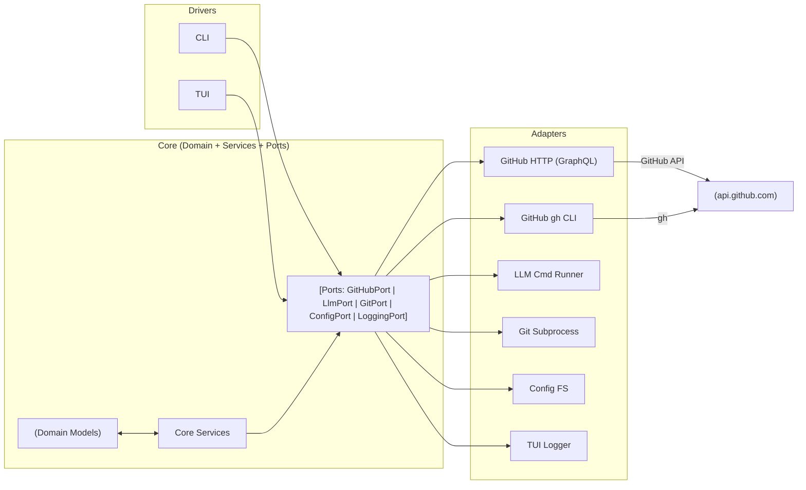
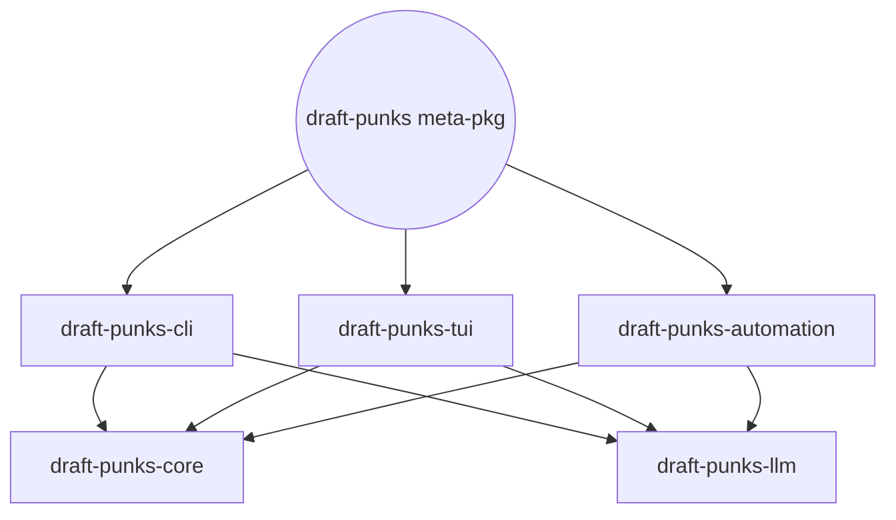
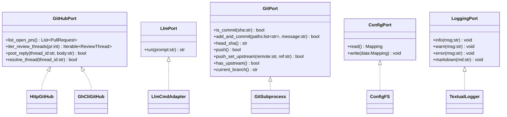
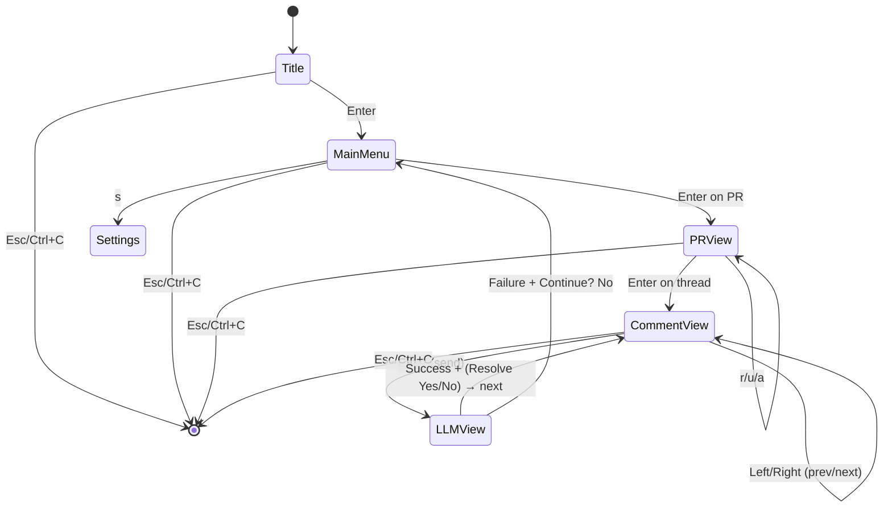
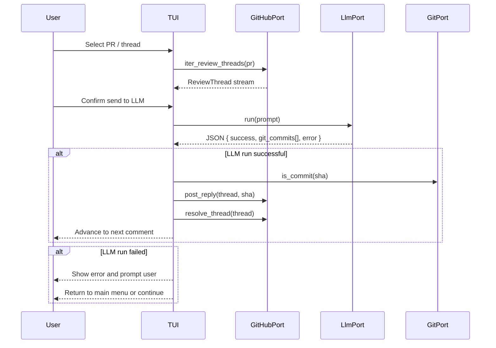
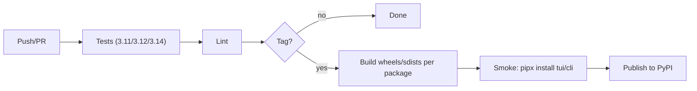

# Draft Punks — Technical Specification

This document describes the system architecture, module boundaries, package layout (monorepo, multi‑package), data/interaction flows, development workflows (run/install/iterate), release policy, and package management practices.

Audience: contributors and maintainers of Draft Punks.

Status: living document — updated per sprint. See SPRINTS.md, FEATURES.md, TASKLIST.md, DRIFT_REPORT.md, and PRODUCTION_LOG.mg for planning and execution details.

---

## 1) Architecture Overview

We use Hexagonal Architecture (aka Ports & Adapters):

- Domain Models (Core): pure data types and business flows
  - GitHub domain: PullRequest, ReviewThread, Comment
- Ports (Interfaces): technology‑agnostic contracts
  - GitHubPort, LlmPort, GitPort, LoggingPort, ConfigPort
- Adapters (Edges): technology‑specific implementations
  - GitHub: HTTP GraphQL, `gh` CLI
  - LLM: provider‑agnostic command runner (and Debug LLM)
  - Git: subprocess wrapper
  - Config: filesystem JSON per repo
  - Logging: Textual logger adapter (and simple console)
- Drivers (UIs): CLI and TUI

High‑level flow:

1. User selects a PR.
2. App loads review threads via GitHubPort.
3. User chooses a thread → confirms sending to LLM.
4. LLMPort produces JSON result (success/failure; commits).
5. On success: optionally reply_on_success; ask to resolve the thread; advance.
6. On failure: show error; user can continue or return to main menu.

### System Context (Mermaid)



---

## 2) Package Layout (Monorepo, Multi‑Package)

We will split the repo into independently buildable packages under `packages/` while keeping a single git repository.

### Planned packages

- `draft-punks-core` (required)
  - Domain models, core services, and all Ports (interfaces).
  - No UI and no external side‑effects beyond Ports.
- `draft-punks-llm` (required)
  - LLMPort implementation(s): command runner; optional provider helpers; Debug LLM utilities.
- `draft-punks-cli` (optional end‑user)
  - Thin CLI entry points over core + llm.
- `draft-punks-tui` (primary end‑user)
  - Textual UI: Title, Main Menu (PR Selection), PR View, Comment View, LLM View, Settings.
- `draft-punks-automation` (optional)
  - Batch/auto mode controllers and flows that orchestrate core + llm + GitHub.

### Compatibility & Migration

- A top‑level shim package `draft_punks` remains during transition, re‑exporting the new package modules (deprecation warning).
- A meta‑package `draft-punks` may depend on the split packages for convenience installs.

### Import policy

- UIs depend on Ports and Core services.
- Adapters depend on Ports only (no UI import).
- No circular dependencies; Core never imports Adapters or UIs.

### Package Dependency Graph (Mermaid)



---

## 3) Current Modules (pre‑split) and Mapping

- Domain: `src/draft_punks/core/domain/github.py` → core
- Services:
  - `src/draft_punks/core/services/review.py` (prompt build, JSON parse) → core
  - `src/draft_punks/core/services/suggest.py` (apply suggestions) → core
  - `src/draft_punks/core/services/voice.py` (bonus mode) → core (optional)
- Ports: `src/draft_punks/ports/*.py` → core
  - github, llm, git, logging, config
- Adapters:
  - GitHub: `adapters/github_http.py`, `adapters/github_ghcli.py` → core/adapters or separate `draft-punks-core-github`
  - LLM: `adapters/llm_cmd.py`, `adapters/llm_port.py` → draft‑punks‑llm
  - Config: `adapters/config_fs.py` → core/adapters
  - Git: `adapters/git_subprocess.py` → core/adapters
  - Logging: `adapters/logging_textual.py` → tui package
  - Utilities: `adapters/util/*` (repo detection, editor) → core utils
  - Voice: `adapters/voice_say.py` → optional adapter
- UI:
  - CLI scripts: `cli/draft-punks`, `src/draft_punks/entry.py` → draft‑punks‑cli
  - TUI: `src/draft_punks/tui/*` → draft‑punks‑tui

---

## 4) Data Contracts

GitHubPort
- list_open_prs() → List[PullRequest]
- iter_review_threads(pr: int) → Iterable[ReviewThread]
- post_reply(thread_id: str, body: str) → bool
- resolve_thread(thread_id: str) → bool

LlmPort
- run(prompt: str) → str (stdout text)

GitPort
- is_commit(sha: str) → bool
- add_and_commit(paths: list[str], message: str) → bool
- head_sha() → str
- push()/push_set_upstream()/has_upstream()/current_branch()

ConfigPort
- read() → Mapping[str, Any]
- write(Mapping) → None

LoggingPort
- info/warn/error/markdown(str) → None

LLM JSON Response (contract)
- success: bool
- git_commits: list[str] (alias: commits)
- error: str
- May be fenced in ```json blocks.

### Port and Adapter Class Diagram (Mermaid)



---

## 5) UI Surfaces (TUI)

Screens
- Title Screen: logo, repo info, Enter→Main Menu, Esc/Ctrl+C quit (global).
- Main Menu (PR Selection): scrollable PRs; actions: info, settings, merge (stub), stash banner.
- PR View (Thread Selection): unresolved/all filters; toggle resolved; automation entry.
- Comment View (Thread Traversal): prev/next, counters, details.
- LLM Interaction View: confirm/edit/send; success→Resolve?; failure→Continue?.
- Settings: provider, reply_on_success, force_json.

Keybindings (global & examples)
- Global: Esc, Ctrl+C = quit; `?` = help overlay.
- Lists: Up/Down (select), Enter (open), Space (info), r/u/a (filters), A (automation).
- Comment view: Left/Right prev/next; Enter send to LLM.

### Screen State Machine (Mermaid)



### End-to-End Sequence (Mermaid)



---

## 6) Configuration & Environment

Per‑repo config path
- `~/.draft-punks/<repo>/config.json`

Fields
- `llm`: codex|claude|gemini|other|debug
- `llm_cmd`: command template with `{prompt}` token for “other”
- `reply_on_success`: bool
- `force_json`: bool (provider‑specific flag enforcement)

Environment variables
- `GH_TOKEN` or `GITHUB_TOKEN` (HTTP adapter)
- `DP_OWNER` / `DP_REPO` (when outside a git repo)
- `DP_TUI_ASCII`, `DP_TUI_ASCII_FILE` (banner overrides)
- `DP_LLM`, `DP_LLM_CMD` (override config at runtime)
- `DP_FAKE_GH_PRS` (test hook for CLI list formatting)

Security
- Never log tokens or prompt contents with secrets.
- Prefer GH CLI auth locally; token only when required.

---

## 7) Development Workflows

### Local dev (fast path)

- `make dev-venv` — create `.venv` and install editable (`-e .[dev]`).
- `make install-dev` — install `~/bin/draft-punks-dev` wrapper that prefers repo `.venv`.
- Run anywhere: `draft-punks-dev tui`.

### Pipx (isolated tool)

- `pipx install .` (monolith) or `pipx install packages/draft-punks-tui` (after split).

### TDD Loop (per user story)

1) Write failing tests (pytest) from FEATURES.md AC + Test Plan; commit.
2) Run to fail.
3) Implement; commit.
4) Re‑run; iterate until green.
5) Update docs (README/TECH-SPEC/FEATURES/SPRINTS/TASKLIST/DRIFT_REPORT); commit.
6) Log incidents in `PRODUCTION_LOG.mg`.

### Testing

- Unit tests for parsing/pagination/formatting.
- TUI smoke/snapshot tests where feasible.
- Adapter tests with fakes or recorded API responses.

### CI (baseline)

- Python 3.11/3.12/3.14 matrix; run tests + lint.
- Package build dry runs for packages under `packages/`.

### CI Pipeline (Mermaid)



---

## 8) Build & Release Policy

### Versioning

SemVer.
- `0.x` while `SPEC` is evolving rapidly; `0.1.0` for first publicized release.

### Release cadence

- Tag from main after Sprint 6 or when story bundles are complete.
- Build wheels/sdists per package.
- Publish to PyPI for `draft-punks-tui` (and others as needed) once green.

### Metapackage (optional)

- `draft-punks` depends on split packages to ease installs; used for `pipx install draft-punks`.

### Change management

- Changelog per package; consolidated `CHANGELOG` at root.
- Backward compatibility guaranteed for public APIs within minor versions.

---

## 9) Package Management

### Tools

- Keep `hatchling` for builds (already in use); consider uv for workspace management later.

### Structure (post‑split)

- `packages/draft-punks-core/pyproject.toml` (build‑backend: hatchling)
- Same for other packages.
- Root Makefile orchestrates common tasks: test, build, lint, pipx smoke.

### Publish workflow

- CI job builds & uploads packages on tag.
- Manual `pipx install` smoke on macOS/Linux runners.

---

## 10) Run/Install How‑To (Developer)

- Quick run from source: `PYTHONPATH=src python cli/draft-punks tui` (monolith only).
- Preferred dev: `make dev-venv && make install-dev` → `draft-punks-dev tui`.
- Test PR listing without GitHub: `DP_FAKE_GH_PRS='{ "prs": [{"number":1,"headRefName":"feat/x","title":"Demo"}] }' draft-punks-dev review --format-list`.

---

## 11) Known Limitations & Risks

- Textual API changes across versions (e.g., OptionList API) — keep shims/fallbacks and pin minimum version.
- GraphQL pagination/rate limits — adapters implement paging and surface progress callbacks.
- Git operations can fail due to local state — add clear messages and dry‑runs where possible.

---

## 12) Roadmap References

- `SPEC` alignment: `SPRINTS.md`, `FEATURES.md`.
- Drift tracking: `DRIFT_REPORT.md`.
- Execution status: `TASKLIST.md`.
- Incident learning: `PRODUCTION_LOG.mg`.
