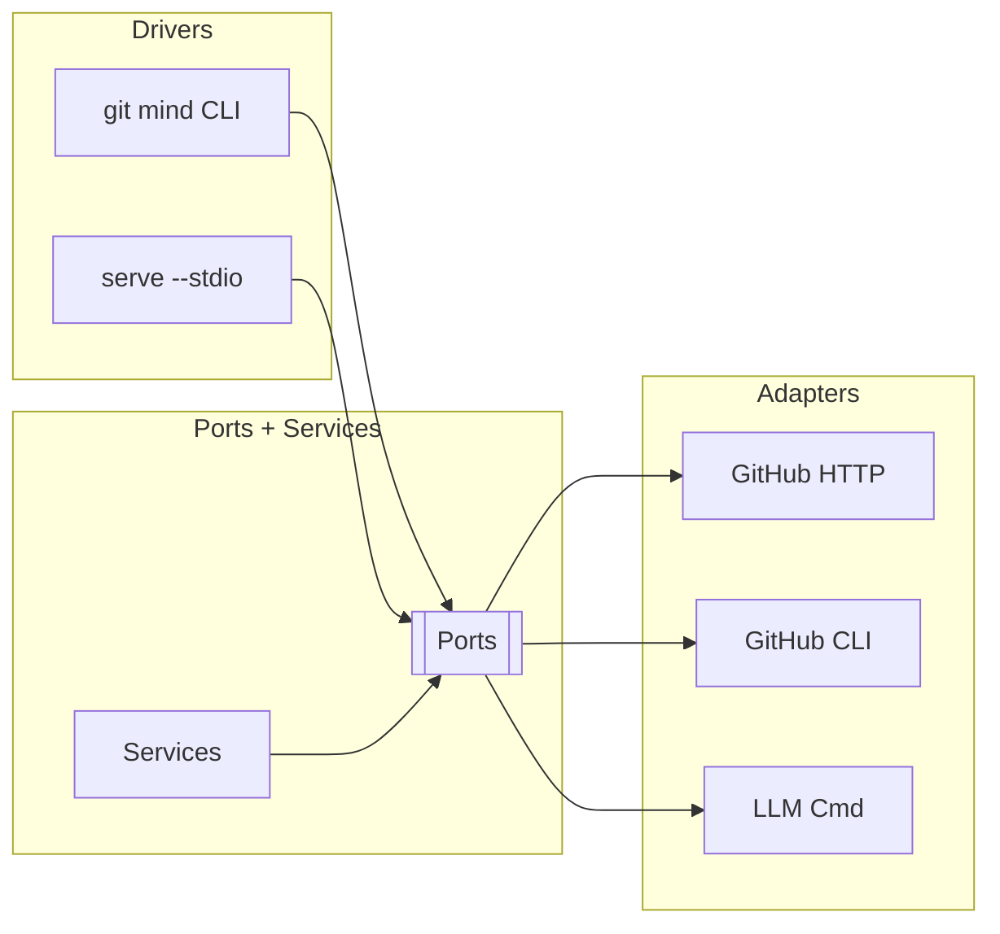

# git mind — Technical Spec (v0.1)

## 1) Architecture (Hexagonal)
- Ports: git_mind/ports/*.py (GitHubPort, LlmPort, later ConfigPort/LoggingPort)
- Adapters: git_mind/adapters/* (HTTP/gh CLI, LLM cmd); reusing Draft Punks where possible.
- Services: git_mind/services/* (review prompt/parse; later policy, jobs, artifacts)
- Drivers: CLI (Typer) + JSONL stdio server; optional fzf pickers.

Mermaid — System Context


## 2) Ref Namespace & Snapshot Commits
- refs/mind/sessions/<name> → HEAD of session snapshots
- Snapshot tree contains state.json (+ small metadata later)
- Trailers: DP-Op, DP-Args, DP-Result, DP-State-Hash, DP-Version
- Pure plumbing (hash-object, mktree, commit-tree, update-ref CAS); no worktree/index churn.

Mermaid — Commit Flow
```mermaid
flowchart LR
  A[Command] --> V[Validate]
  V --> R[CAS guard (expect_state)]
  R --> W[Write blobs]
  W --> T[mktree]
  T --> C[commit-tree]
  C --> U[update-ref --create-reflog]
```

## 3) JSONL Protocol (serve --stdio)
- Request: {id, cmd, args, expect_state?}
- Response: {id, ok, result|error, state_ref}
- v0.1 commands: hello, state.show, repo.detect, pr.list, pr.select
- Errors: BAD_JSON | UNKNOWN_COMMAND | STATE_MISMATCH | INVALID_ARGS | SERVER_ERROR

## 4) Policy & Privacy (Hybrid)
- .mind/policy.yaml: storage.mode, redactions, approvals, locks.
- .gitattributes: mind-local | mind-private | mind-lock | mind-publish=lfs | mind-encrypt.
- Public projection → snapshot; private overlay → ~/.dp/private-sessions/…
- Optional encryption (age|gpg) for private overlay and/or specific artifact classes.

## 5) Artifacts & LFS (Optional)
- Local blob store (~/.dp/private-sessions/.../.blobs/<sha256>) with de-dup.
- Snapshot stores descriptors; never big bytes.
- Optional publish via Git‑LFS: pointer commits under refs/mind/artifacts/*; push with explicit refspecs.

## 6) Locks & Consensus (Future)
- Locks: refs/mind/locks/<lock-id> or git lfs lock/unlock; policy + hooks/CI enforcement.
- Consensus: proposals (refs/mind/proposals/*) → approvals (refs/mind/approvals/*/<who>) → grant (advance target ref).
- Signed approvals (GPG/SSH); trailers record fingerprints.

## 7) Jobs (Future)
- Descriptor/claim/result under refs/mind/jobs/<id>.
- Runner claims via CAS; writes results and optional state advance; shiplog events mind.job.*.
- Maps to go‑job‑system spec (see docs once imported).

## 8) Remotes
- Optional dedicated "mind" remote syncing only refs/mind/*.
- Local bare default: ~/.mind/remotes/<owner>__<repo>.git.

## 9) Integration Points
- shiplog: append events when present; trailers are the fallback journal.
- Draft Punks: adapters and services reused now; migrate sources here later and shim DP to import from git_mind.
- ledger‑kernel / libgitledger: explore ledger-backed approvals/attestations (open design).
