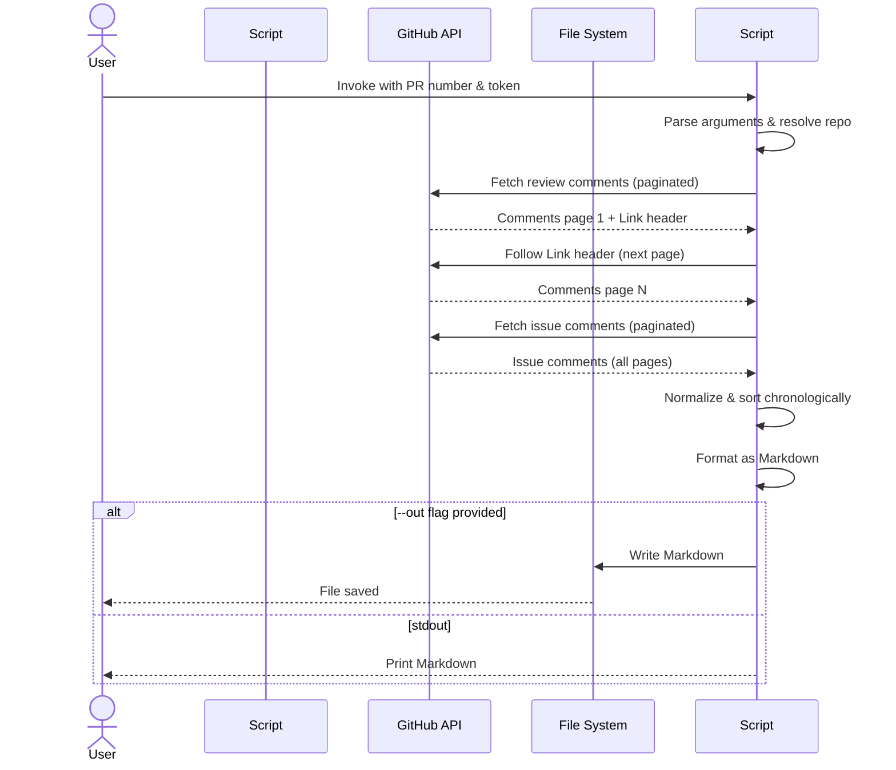

# Code Review Feedback

| Date | Agent | SHA | Branch | PR |
|------|-------|-----|--------|----|
| 2025-11-06 | CodeRabbit (and reviewers) | `f775e24c1d3578c42f823710cd23295d4d90a652` | [chore/security](https://github.com/flyingrobots/draft-punks/tree/chore/security "flyingrobots/draft-punks:chore/security") | [PR#3](https://github.com/flyingrobots/draft-punks/pull/3) |

## CODE REVIEW FEEDBACK

### docs/code-reviews/PR3/25cb2bb4b000cad26fd5fcc02cb5186775827c40.md:113 — coderabbitai[bot]

```text
_⚠️ Potential issue_ | _🟡 Minor_

**Format the bare URL as a proper Markdown link.**

The bare URL violates markdown best practices and accessibility guidelines. Wrap it in proper link syntax for consistency with the rest of the document.


Apply this diff:

```diff
-_Meta_: https://github.com/flyingrobots/draft-punks/pull/3#issuecomment-3495262753
+_Meta_: <https://github.com/flyingrobots/draft-punks/pull/3#issuecomment-3495262753>
```

Based on static analysis.

<!-- suggestion_start -->

<details>
<summary>📝 Committable suggestion</summary>

> ‼️ **IMPORTANT**
> Carefully review the code before committing. Ensure that it accurately replaces the highlighted code, contains no missing lines, and has no issues with indentation. Thoroughly test & benchmark the code to ensure it meets the requirements.

```suggestion
_Meta_: <https://github.com/flyingrobots/draft-punks/pull/3#issuecomment-3495262753>
```

</details>

<!-- suggestion_end -->

<details>
<summary>🧰 Tools</summary>

<details>
<summary>🪛 markdownlint-cli2 (0.18.1)</summary>

113-113: Bare URL used

(MD034, no-bare-urls)

</details>

</details>

<details>
<summary>🤖 Prompt for AI Agents</summary>

```
In docs/code-reviews/PR3/25cb2bb4b000cad26fd5fcc02cb518677c40.md around line
113, a bare URL is present; replace it with proper Markdown link syntax by
wrapping the URL in [anchor text](URL) or using the URL itself as the link
target with descriptive text (e.g., the PR or comment title) so the document
follows Markdown/linking best practices and accessibility guidelines.
```

</details>

<!-- This is an auto-generated comment by CodeRabbit -->
```

_Meta_: https://github.com/flyingrobots/draft-punks/pull/3#discussion_r2497632871

{response}

### tools/review/get_comments_markdown.py:31 — coderabbitai[bot]

```text
_🧹 Nitpick_ | _🔵 Trivial_

**Modernize type hints to use built-in generics.**

With `from __future__ import annotations` already imported, you can use lowercase `dict`, `list`, and `tuple` directly instead of the deprecated `typing` versions per PEP 585 (Python 3.9+).


Apply this diff:

```diff
-from typing import Dict, List, Tuple
+from typing import TYPE_CHECKING
```

Then update all type hints throughout the file:
- `Dict[str, str]` → `dict[str, str]`
- `List[dict]` → `list[dict]`
- `Tuple[str, str]` → `tuple[str, str]`

Based on static analysis.


> Committable suggestion skipped: line range outside the PR's diff.

<details>
<summary>🧰 Tools</summary>

<details>
<summary>🪛 Ruff (0.14.3)</summary>

31-31: `typing.Dict` is deprecated, use `dict` instead

(UP035)

---

31-31: `typing.List` is deprecated, use `list` instead

(UP035)

---

31-31: `typing.Tuple` is deprecated, use `tuple` instead

(UP035)

</details>

</details>

<details>
<summary>🤖 Prompt for AI Agents</summary>

```
In tools/review/get_comments_markdown.py around line 31, the file imports typing
generics (Dict, List, Tuple) but the project uses from __future__ import
annotations and should use built-in generics per PEP 585; replace the import of
Dict, List, Tuple with built-in types (or remove those names from the typing
import) and update all annotations in the file: change Dict[str, str] to
dict[str, str], List[dict] to list[dict], and Tuple[str, str] to tuple[str,
str], ensuring any remaining typing usage is either removed or replaced with the
appropriate lowercase built-in generic types.
```

</details>

<!-- This is an auto-generated comment by CodeRabbit -->
```

_Meta_: https://github.com/flyingrobots/draft-punks/pull/3#discussion_r2497632880

{response}

### tools/review/get_comments_markdown.py:237 — coderabbitai[bot]

```text
_⚠️ Potential issue_ | _🟡 Minor_

**Remove unused variable or prefix with underscore.**

The `known` variable is assigned but never used. Per convention, prefix unused variables with underscore to indicate intentional non-use.


Apply this diff:

```diff
-    known, _ = ap.parse_known_args([])
+    _, _ = ap.parse_known_args([])
```

Based on static analysis.

<!-- suggestion_start -->

<details>
<summary>📝 Committable suggestion</summary>

> ‼️ **IMPORTANT**
> Carefully review the code before committing. Ensure that it accurately replaces the highlighted code, contains no missing lines, and has no issues with indentation. Thoroughly test & benchmark the code to ensure it meets the requirements.

```suggestion
    _, _ = ap.parse_known_args([])
```

</details>

<!-- suggestion_end -->

<details>
<summary>🧰 Tools</summary>

<details>
<summary>🪛 Ruff (0.14.3)</summary>

237-237: Unpacked variable `known` is never used

Prefix it with an underscore or any other dummy variable pattern

(RUF059)

</details>

</details>

<details>
<summary>🤖 Prompt for AI Agents</summary>

```
In tools/review/get_comments_markdown.py around line 237, the variable `known`
is assigned from ap.parse_known_args([]) but never used; either remove the
unused assignment or prefix the variable name with an underscore (e.g.,
`_known`) to signal intentional non-use. Update the line accordingly and run
tests/lint to ensure no unused-variable warnings remain.
```

</details>

<!-- This is an auto-generated comment by CodeRabbit -->
```

_Meta_: https://github.com/flyingrobots/draft-punks/pull/3#discussion_r2497632883

{response}

### tools/review/get_comments_markdown.py:267 — coderabbitai[bot]

```text
_⚠️ Potential issue_ | _🟡 Minor_

**Simplify the owner/repo precedence logic and remove unused variable.**

The precedence determination is overly complex with nested conditionals. Line 257 assigns `repo_name_arg` but never uses it (F841). The conditional logic on lines 263-266 is convoluted.


Apply this diff to remove the unused variable and simplify:

```diff
     remote_arg = args.remote or kv.get("remote")
     slug_arg = args.slug or kv.get("slug")
     repo_kv = kv.get("repo")
     owner_arg = args.owner or kv.get("owner")
-    repo_name_arg = args.repo or (kv.get("repo_name") if repo_kv and "/" not in repo_kv else None)
 
     if remote_arg:
         owner, repo = parse_remote_url(remote_arg)
     elif slug_arg:
         owner, repo = parse_slug(slug_arg)
     elif repo_kv and "/" in repo_kv:
         owner, repo = parse_slug(repo_kv)
-    elif owner_arg and (args.repo or kv.get("repo")) and "/" not in (args.repo or kv.get("repo")):  # owner/repo split
-        owner, repo = owner_arg, (args.repo or kv.get("repo"))
+    elif owner_arg:
+        repo_arg = args.repo or kv.get("repo")
+        if repo_arg and "/" not in repo_arg:
+            owner, repo = owner_arg, repo_arg
     else:
```

Based on static analysis.

<details>
<summary>🧰 Tools</summary>

<details>
<summary>🪛 Ruff (0.14.3)</summary>

257-257: Local variable `repo_name_arg` is assigned to but never used

Remove assignment to unused variable `repo_name_arg`

(F841)

</details>

</details>

<details>
<summary>🤖 Prompt for AI Agents</summary>

```
In tools/review/get_comments_markdown.py around lines 253 to 267, remove the
unused repo_name_arg assignment and simplify the owner/repo precedence: check
remote_arg first (parse_remote_url), then slug_arg (parse_slug), then if repo_kv
contains "/" parse_slug(repo_kv), then if owner_arg is provided and the repo
value (args.repo or kv.get("repo")) exists and does not contain a "/" use
owner_arg and that repo value; otherwise fall through to the existing else
branch. Drop the unused variable and collapse the nested conditionals into this
clear linear precedence.
```

</details>

<!-- This is an auto-generated comment by CodeRabbit -->
```

_Meta_: https://github.com/flyingrobots/draft-punks/pull/3#discussion_r2497632886

{response}

### tools/review/seed_feedback_from_github.py:46 — coderabbitai[bot]

```text
_🧹 Nitpick_ | _🔵 Trivial_

**Improve exception chaining for better debugging.**

The error handling discards the original exception context. Use `raise ... from e` to preserve the traceback chain per PEP 3134, which aids debugging.


Apply this diff:

```diff
     except urllib.error.HTTPError as e:
         msg = e.read().decode("utf-8", errors="ignore")
-        raise SystemExit(f"GitHub API error {e.code} on {url}: {msg}")
+        raise SystemExit(f"GitHub API error {e.code} on {url}: {msg}") from e
```

Based on static analysis.

<!-- suggestion_start -->

<details>
<summary>📝 Committable suggestion</summary>

> ‼️ **IMPORTANT**
> Carefully review the code before committing. Ensure that it accurately replaces the highlighted code, contains no missing lines, and has no issues with indentation. Thoroughly test & benchmark the code to ensure it meets the requirements.

```suggestion
    except urllib.error.HTTPError as e:
        msg = e.read().decode("utf-8", errors="ignore")
        raise SystemExit(f"GitHub API error {e.code} on {url}: {msg}") from e
```

</details>

<!-- suggestion_end -->

<details>
<summary>🧰 Tools</summary>

<details>
<summary>🪛 Ruff (0.14.3)</summary>

46-46: Within an `except` clause, raise exceptions with `raise ... from err` or `raise ... from None` to distinguish them from errors in exception handling

(B904)

---

46-46: Avoid specifying long messages outside the exception class

(TRY003)

</details>

</details>

<details>
<summary>🤖 Prompt for AI Agents</summary>

```
In tools/review/seed_feedback_from_github.py around lines 44 to 46, the except
block for urllib.error.HTTPError discards the original exception context; modify
the raise to preserve exception chaining by re-raising the SystemExit from the
caught exception (use "raise SystemExit(...) from e") so the original traceback
is retained for debugging.
```

</details>

<!-- This is an auto-generated comment by CodeRabbit -->
```

_Meta_: https://github.com/flyingrobots/draft-punks/pull/3#discussion_r2497632892

{response}

### tools/review/seed_feedback_from_github.py:69 — coderabbitai[bot]

```text
_⚠️ Potential issue_ | _🟠 Major_

**CRITICAL: Eliminate code duplication across modules.**

This `parse_link_header` function is duplicated in `tools/review/get_comments_markdown.py` (lines 56-70 as `_parse_link_header`). Both `gh_get_all` functions (this file lines 72-109 and get_comments_markdown.py lines 73-107) are also nearly identical. This violates DRY principles and creates a maintenance nightmare.


**Solution: Extract shared utilities into a common module.**

Create `tools/review/github_api.py`:

```python
#!/usr/bin/env python3
"""Shared GitHub API utilities for review tooling."""

import json
import urllib.error
import urllib.parse as parse
import urllib.request
from typing import Dict, List, Tuple


API = "https://api.github.com"


def http_get(url: str, token: str) -> Tuple[object, Dict[str, str]]:
    """Execute GET request and return (json_data, headers)."""
    req = urllib.request.Request(url)
    req.add_header("Accept", "application/vnd.github+json")
    if token:
        req.add_header("Authorization", f"Bearer {token}")
    try:
        with urllib.request.urlopen(req, timeout=30) as r:
            data = json.loads(r.read().decode("utf-8"))
            headers = {k.lower(): v for k, v in r.headers.items()}
            return data, headers
    except urllib.error.HTTPError as e:
        msg = e.read().decode("utf-8", errors="ignore")
        raise SystemExit(f"GitHub API error {e.code} on {url}: {msg}") from e
    except urllib.error.URLError as e:
        raise SystemExit(f"Network error contacting GitHub: {e}") from e


def parse_link_header(link_header: str) -> Dict[str, str]:
    """Parse GitHub Link header into {rel: url} dict."""
    rels = {}
    if not link_header:
        return rels
    for part in link_header.split(","):
        part = part.strip()
        if not part or ";" not in part:
            continue
        url_part, rel_part = part.split(";", 1)
        url = url_part.strip().strip("<>")
        if "rel=" in rel_part:
            rel = rel_part.split("rel=", 1)[1].strip().strip('"')
            rels[rel] = url
    return rels


def gh_get_all(path: str, token: str) -> List[dict]:
    """GET and paginate GitHub API, returning all items.
    
    Adds per_page=100 and follows Link rel="next".
    """
    url = API + path
    parsed = parse.urlparse(url)
    qs = parse.parse_qsl(parsed.query, keep_blank_values=True)
    qs = [(k, v) for (k, v) in qs if k not in ("per_page", "page")]
    qs.append(("per_page", "100"))
    url = parse.urlunparse(parsed._replace(query=parse.urlencode(qs)))

    items: List[dict] = []
    while True:
        data, headers = http_get(url, token)
        if isinstance(data, list):
            items.extend(data)
        else:
            for key in ("items", "nodes"):
                if key in data and isinstance(data[key], list):
                    items.extend(data[key])
                    break
            else:
                raise SystemExit("Unexpected GitHub response shape during pagination")

        links = parse_link_header(headers.get("link", ""))
        if "next" in links:
            url = links["next"]
            continue
        break
    return items


def normalize_text(s: str) -> str:
    """Normalize line endings and whitespace."""
    return (s or "").replace("\r\n", "\n").strip()
```

Then update both scripts to import from this shared module. Would you like me to generate those refactored imports?

<!-- This is an auto-generated comment by CodeRabbit -->
```

_Meta_: https://github.com/flyingrobots/draft-punks/pull/3#discussion_r2497632896

{response}

### General comment — coderabbitai[bot]

```text
<!-- This is an auto-generated comment: summarize by coderabbit.ai -->
<!-- This is an auto-generated comment: review in progress by coderabbit.ai -->

> [!NOTE]
> Currently processing new changes in this PR. This may take a few minutes, please wait...
> 
> <details>
> <summary>📥 Commits</summary>
> 
> Reviewing files that changed from the base of the PR and between f5312b43b287eaa39375481e5569f25e87acf92f and f775e24c1d3578c42f823710cd23295d4d90a652.
> 
> </details>
> 
> <details>
> <summary>📒 Files selected for processing (2)</summary>
> 
> * `docs/code-reviews/PR3/25cb2bb4b000cad26fd5fcc02cb5186775827c40.md` (1 hunks)
> * `tools/review/get_comments_markdown.py` (1 hunks)
> 
> </details>
> 
> ```ascii
>  _______________________________________________
> < Optimization hinders evolution. - Alan Perlis >
>  -----------------------------------------------
>   \
>    \   \
>         \ /\
>         ( )
>       .( o ).
> ```

<!-- end of auto-generated comment: review in progress by coderabbit.ai -->
<!-- usage_tips_start -->

> [!TIP]
> <details>
> <summary>CodeRabbit can scan for known vulnerabilities in your dependencies using OSV Scanner.</summary>
> 
> OSV Scanner will automatically detect and report security vulnerabilities in your project's dependencies. No additional configuration is required.
> 
> </details>

<!-- usage_tips_end -->
<!-- walkthrough_start -->

<!-- This is an auto-generated comment: release notes by coderabbit.ai -->

## Summary by CodeRabbit

* **Documentation**
  * Added archived code review artifacts and documentation files for comprehensive historical reference and compliance tracking.

* **Chores**
  * Introduced new utility to extract GitHub Pull Request comments and export as formatted Markdown documentation files.
  * Enhanced GitHub API integration with automatic pagination support to reliably retrieve complete comment datasets from pull requests.

<!-- end of auto-generated comment: release notes by coderabbit.ai -->
## Walkthrough

This pull request adds tooling infrastructure for automated code review artifact management. It introduces a new documentation file containing an archived code review, a fresh Python script for extracting GitHub PR comments as Markdown output, and refactors an existing script to support GitHub API pagination via Link headers.

## Changes

| Cohort / File(s) | Summary |
|---|---|
| **Documentation Archive** <br> `docs/code-reviews/PR3/25cb2bb4b000cad26fd5fcc02cb5186775827c40.md` | New archived code review artifact containing metadata, auto-generated feedback, and review notes for PR `#3` |
| **GitHub Comment Extraction Tooling** <br> `tools/review/get_comments_markdown.py` | New script to fetch all review and issue comments from GitHub PRs, paginate results, normalize data, and output as formatted Markdown with timestamps and author info |
| **GitHub API Pagination Enhancement** <br> `tools/review/seed_feedback_from_github.py` | Refactored to introduce `gh_get_with_headers()`, `parse_link_header()`, and `gh_get_all()` for robust multi-page GitHub API pagination; replaced single-page calls with paginated variants |

## Sequence Diagram



## Estimated code review effort

🎯 3 (Moderate) | ⏱️ ~25 minutes

- **`get_comments_markdown.py`**: Requires careful scrutiny of argument parsing logic, GitHub API interaction patterns, error handling edge cases (malformed URLs, missing tokens, API rate limits), and Markdown formatting correctness. Validate that all pagination scenarios are covered and that comment normalization doesn't lose critical metadata.
- **`seed_feedback_from_github.py`**: Verify Link header parsing correctness (RFC 5988 compliance), ensure per_page=100 parameter doesn't cause unexpected behavior, and confirm that refactored `gh_get()` signature change doesn't break existing callers elsewhere in the codebase.
- **Documentation file**: Minimal review; verify metadata fields are consistent with repository conventions.

## Poem

> 🤖 Comments drift through GitHub's API stream,  
> Paginated dreams collected into one,  
> Link headers guide us page by page,  
> Markdown blooms where chaos was before—  
> *Review artifacts, automated and pristine.* ✨

<!-- walkthrough_end -->

<!-- pre_merge_checks_walkthrough_start -->

## Pre-merge checks and finishing touches
<details>
<summary>❌ Failed checks (1 warning, 1 inconclusive)</summary>

|     Check name     | Status         | Explanation                                                                                                                                                             | Resolution                                                                                                                                             |
| :----------------: | :------------- | :---------------------------------------------------------------------------------------------------------------------------------------------------------------------- | :----------------------------------------------------------------------------------------------------------------------------------------------------- |
| Docstring Coverage | ⚠️ Warning     | Docstring coverage is 33.33% which is insufficient. The required threshold is 80.00%.                                                                                   | You can run `@coderabbitai generate docstrings` to improve docstring coverage.                                                                         |
|     Title check    | ❓ Inconclusive | The title 'chore/security' is vague and generic, using non-descriptive branch naming conventions rather than conveying meaningful information about the actual changes. | Revise the title to clearly describe the primary change, such as 'Add pagination to GitHub API seeding and create comments dumper utility' or similar. |

</details>
<details>
<summary>✅ Passed checks (1 passed)</summary>

|     Check name    | Status   | Explanation                                                                                                                                     |
| :---------------: | :------- | :---------------------------------------------------------------------------------------------------------------------------------------------- |
| Description check | ✅ Passed | The description lists multiple objectives (SECURITY.md, code reviews, pagination, comments dumper) that correspond to actual changes in the PR. |

</details>

<!-- pre_merge_checks_walkthrough_end -->

<!-- tips_start -->

---

Thanks for using [CodeRabbit](https://coderabbit.ai?utm_source=oss&utm_medium=github&utm_campaign=flyingrobots/draft-punks&utm_content=3)! It's free for OSS, and your support helps us grow. If you like it, consider giving us a shout-out.

<details>
<summary>❤️ Share</summary>

- [X](https://twitter.com/intent/tweet?text=I%20just%20used%20%40coderabbitai%20for%20my%20code%20review%2C%20and%20it%27s%20fantastic%21%20It%27s%20free%20for%20OSS%20and%20offers%20a%20free%20trial%20for%20the%20proprietary%20code.%20Check%20it%20out%3A&url=https%3A//coderabbit.ai)
- [Mastodon](https://mastodon.social/share?text=I%20just%20used%20%40coderabbitai%20for%20my%20code%20review%2C%20and%20it%27s%20fantastic%21%20It%27s%20free%20for%20OSS%20and%20offers%20a%20free%20trial%20for%20the%20proprietary%20code.%20Check%20it%20out%3A%20https%3A%2F%2Fcoderabbit.ai)
- [Reddit](https://www.reddit.com/submit?title=Great%20tool%20for%20code%20review%20-%20CodeRabbit&text=I%20just%20used%20CodeRabbit%20for%20my%20code%20review%2C%20and%20it%27s%20fantastic%21%20It%27s%20free%20for%20OSS%20and%20offers%20a%20free%20trial%20for%20proprietary%20code.%20Check%20it%20out%3A%20https%3A//coderabbit.ai)
- [LinkedIn](https://www.linkedin.com/sharing/share-offsite/?url=https%3A%2F%2Fcoderabbit.ai&mini=true&title=Great%20tool%20for%20code%20review%20-%20CodeRabbit&summary=I%20just%20used%20CodeRabbit%20for%20my%20code%20review%2C%20and%20it%27s%20fantastic%21%20It%27s%20free%20for%20OSS%20and%20offers%20a%20free%20trial%20for%20proprietary%20code)

</details>

<sub>Comment `@coderabbitai help` to get the list of available commands and usage tips.</sub>

<!-- tips_end -->

<!-- internal state start -->


<!-- DwQgtGAEAqAWCWBnSTIEMB26CuAXA9mAOYCmGJATmriQCaQDG+Ats2bgFyQAOFk+AIwBWJBrngA3EsgEBPRvlqU0AgfFwA6NPEgQAfACgjoCEYDEZyAAUASpETZWaCrI5Ho6gDYkuDWPgoSAHpEUWwKdXlIAwA5RwFKLgBmSGiAVRsAGS5YXFxuRA4goKJ1WGwBDSZmIIAzT1l4DCIKQXxcRCDaKlrcMG5sDABrToHPTyCU9NCKLnrG5taBduRogGV8cIYSSAEqDD9ff0CQsIjceUAkwhhnUlxd/cPIZm0sddxqbEL+bjJUgwAwoFqHR0JxIAAmAAMEIArGAAIwIsBQgBs0DRHARAA4OEkACwALSMABFpAwItxxPgsAAKPyYUjIJoMTzYJS0ACUbigQJIIMgawAogCMgBJaAATQ0zHo0Sg+AGiFptjMEO59hIoMCsH5FEQaE89iYgUg9JYzHUkHxCKh2wJSQAnNjYai0PiGLRam6SAB2L3Y2q0J1JVF+1QCVG+1RoTn/KBpbi0AW0fAMTpMJRgQISeAkADunVsEKCNrtJAdztd7s93rQfoDQZDYejqijMZlcoMCqVKpsao1oW1JF1zgNRsQJp25tYVqhCNRtFRUK9DChAgYSN9sNqUMdSTQtSStF92Ox+OxXtdDAhtAYp99cflkBzefzXG4aFKGAFQ9oTSIABudBaHoao2AwDpIFoRxfgoYDsCTX8zkiHh8E8eAGFkIx9GMcAoDIeh8FqHACGIMhlBoMCLXYD8+EEEQxEkaRdnkTNlFUdQtB0XCTCgOBUFQTBSMIUhyCoKiFFYWiXzQfN7EcF4XFYhQlCoTjNG0XQwEMPDTAMVN0yCdjsxIXMCyLGwkiCOEGAECFVHxAQoRchg0FoCFUSDHcGDXCE7NhHEo23bEIV9Bh8ShTs3AAIjigwLEgABBMVyPEkF6AcJxlOIxhYEZaQjCS0DkDQSByHkwzHHYah4BpSBangbwwWgtMM0UEhTPMwsglsazbPsxznNc9zPO82pfJhAKgt9EKwoiqLZQUSDXgA9AsGcPxmOopQXzMt90AocRajQMQGoCaw7DMJINBgXUGqanYWTZJRkDYD5kw+M1xFwbwABpoPJSlqQwAG0HZPMDhIAHUxeJoAY+IhEABxAPlwL440wegytqbBxjBvBRIoiTQXYvbuoarVaAEU6hk1JiaVusV7hIZgEloUrAY+R76AwdodgETw0zp2pWmYVSOLUbmwcgBBQL+QAcAgAMUe5BQm8MRQVqC7eDTaREAAwBcAgU7LZDBjB6EajAkAQZpIAIbA/BY/MygUogmRB5Btb4QzUYiZpSotyBBitGhUeRng2WQcQCkgMgmHCL81sQNN4ENex8v9ohbpifAJf4PgBkFzDkqsMU8oK0rTSaXBWhg7ZaGA3B7qYSD2BQZABkCBpWoYaqVpBjQjHMSwks8GgJLqjBo7z5udiUVlnFqmlkFykgAA9uACSSdYqDCGDjyD1DzRAcMgXPyBHyAAFlMHgWppHuFXmqSn8GgAL0oIwhVR+AXkksmr4Cxx1qN7cEmR8D5gMHFGKOF9IEHQp0IB+YSgkFwAAfXAuwRA6ClJDFTPmDAGhuCuGgfFRKKU0qUVBFlJS8hcoMmaIVAwxUOboHKsAqwshm71UnMDe2+BEFBGQagjBWDII4LwQQohJD7b5XuA/XATtSrjCkhBKCtJkFqOwetegSAHA7HER0OMosWDsIAOLqAABIVGsHjI0NgSAAEdsCP10fwPAAwoJz3FmgZAt8KD4MgUQu6Ow+HwCpApbgW8jpvTxjHZq+Y0CyBnvYX4DB77yDnntLeBsCDKVpLmMqgRmD80gBkTIKM2REABhvbg+8rTBMoMIkgW8AYXXBmRJQNAGZYCaAbXaZVSj3ECFvTGQdAguPgIETm5iJRWLSAAIXQdAAA8gAaSFDEJm9xPzfhBMgSxuAbECEgDYIUaxoCl3LjMre09pAAz5hQF4GFP6B2xu7QIRADnaIkSjbe0ddTiz8K0PmQtShuXGGbdx3t/6AtZigSCecyoBKCYQ3u/d7gu2bvTT250+D8j8L8+4tJnoQztp044CM/6PzQMwbg5t6AVM5DsyA+ZzgsQIOwxqzV77aU2PcVAutcwcnaXPCgLtQg8H9t4vOqNUx4CZgcF6LElhfBZhQVofB8oWwwnbb2kArHQGgFYIIFS46aoCBHJoEhDTwD0RgLxEcsbPH0WtUZ+A8kBDYjSGg69NCQABAEHY9RIHMmVeyHwh0iCYp4GONatIHDRO3mtZYOL6hfnedKgAvDEGIGdt46q5ADD1XrlIzPQngKeCN8BDD+LajCn1q2UyUbbIgxLkBFMgEQWA6C7joMNJ4AGsLqDiDtl2kdGCpHBMZR4/IeBZZYz1dnYeCVR7j0olPVJ2SF6eCXnitem9t6gl3sXA+7Bj7MKgErQYvSQIci4AAAyUCROGGBaS3AkFwTISBcAAG0/YAF04w6URbgR9iLICPoQZ4JB+0CyiMwTRCRuDnBopkbIR93ZIA3oOCDe9dAn0vu7b2/tg7aSfmblwP2Na60YGo7XEDehIA/tRn+/8YhAMQaaFBmDcHuqIaMZItD0jiGYew7hu97kH1QeI0wcYogxHIY6LSAgdGGMUHaYQxI9ha4ltafgDTANeDoIwPEHTNcmMsd/exzCuAuOQeg4I2DLSBP9qE6hwJomSFYevbe/D0nCOyZICRSdnn0MznUd8Vj/6OP2as37bjWAnNCJEe55TwmvPBLE75nD/mp4EdoERkLcb9QkHQUMCQA6KBIw/TVr91m2NAasySOzAG9O6YoA5njKWXNpbQUh6SKHp2EJy9/X+/9SYdXJgdELYCuDXzoPARwZDYHdngc5/jb5Th0HQQ/OgNMGBDD22LPtZQKhidiuQ0eqUxLUMyopZw9CSKMKZGfMUkE66O1BD2vtA3sW9tHGpZU4RPBGYEepzrcYuVwVhRYoUVyXWBHRhQLAabYBmiECnUGst+TA5Zdhxx9TTqgg3r+tav27gCLZVQbgJG/sYIB+goHlAs3I/CFgGkPdskACk1irPzcsWg8hE3wCID+FHOwSmvGQJTtBFHqCwHB2psgGnOQE6gKw0En4yvoL1cdlnFBaT6+Z3jnTftod5x11Ko5JzrPDFx+5VnYHkXQTs/wEi3ddDMdB0PTX8t6By4weRyjSvOu0dV1D6neymgClt7YpKZc9qIDuaEZ1nySDfLHe2mZ8TSoUk9Z3L8LEvhrTgugvZJBs22ihO4n9DvDflTQLmLPU8/flKQpJN9DUhbyS5V8HYQeB2qINejmbwChPuP0a4jt+nicZLtrwfamw1YAW8P0Yv9OqeQtg+36+TQLqUC1Yu3Va0yA6u2OorgQ+meG+QHzeSus9k/PNTxo/F02CIANEyIew8/N4YK0CyKy33+zKFNyd31FpFB2V1rUjwt0gz41c22z/D2ypkO2O1MWYDO2bguxIQk3y3qkQk+iCyDwVyo3DwhzgMYwQM2yQIQxQP22plphOxYGwPKEqDwP/ykwDw/DHHKxN0N2NyaANzN1mCjx40QJEQYLQOYMwLYNwOwi4ICx4JAOD3GDILDxo0oPo3EKwEkPgxQWkIO1kNO2GXYLE3G3EEmx2ilwMJAXmxY0gVWzgV0j4kPiIhIk6SJnSgAWUy4CoHkloSexUnYnUilm4m0kMDcPAnUHQXtRwWQV21RmcHuFwgMDcNqFhCSARAcnxCSHsmxF9H5DQBDG3AvARBIFhFdEdFqDhBIEKNOlqEdAhBIjSOiItFiPiPQUSNoHQUIkiPSPwmlXKzYBq3KydiOxwWSKOgGIMAAG8DBUgYokBbBFkhYjs6Ag0htcArBPUqIYo5hDRQg/pFjIAYpEB/A8ZaA1jhZbADiGojjoZTjljEBVkpBNV7UlAMB7iTpYMnilj/xaAbBBgSQ0w1ha4AJEAARdQjt7ja5XETiAT7VgSMAPBfoSBoTRAhg4SKAETnjASUSyRwkqQp5MTYSuB4T/izj9c6AxQv9XFEBwSKB7i4pETqS/FcAyShhHEHBx5EB7i/1TjUgFjUhRSziJihgYg6USAWS0TmoJSYo2SxTzi0YvgfjHilTRSYo6k90Jcp5ZT7ofpmoAByPwYNU4Puc4WQY0juSAW1GNHYF1O7CIBgAGUvO2PmDAMAV6CkCJcQKQB4TAIlH8S0O2VuKQI+FeWScVORYScMkgBYdtNgO+ZoXGI0JoSdQA5YBdbJU6dGdOV7aQDQRUoUrUitNkEGFkxxXMKVbJI0nYLlVkPUHuH0iIBIORHYXgP+YIwslGR2DHPxSAY01hONfZfDLlePU5RPcuP8NaF1CkfkGgDtaCWCSgYOcQDCC4G0i6A2S0PdCgYszUpY0pJQFkpJVHACEssUpYwIVuRqGNQIHEvE68s4gIMXWPTwLkqUtgFk+s2BMUgAX01JFOvJiglO/JlK4BiiJN9JJPqgVKPLOOSPRn5IpNxKpOVJ1MwGXm+KgrgHniBj9IKwwnDmeHiQiWagYkU2YmQFpGFFFBsAlGlFlABkAQMIjhjz1JpFYoyxXPpUoGh3kQUE1WkDuXoC5TzOwALJ1SZAQPulsEPNLOPI6jPOcGtmaCvNAtvJpHvPCEgoeL+MQpijfP2U/JhMlOlJZNbKIppH/NFKAtLJAuVPAssqgtBPTAhLtiDXeOL00uVOQrVMOMMqUrOKwq4twrOPcr9jWiYB8tIFtKSBukSoAFI2UEAiVBJp5sBQFMJIYA18K9oplAhxLYAZl/BPA9FkBsQooXJkrFKXyYpyyq1bKoLJRNhGBhJcTksAABUIlQKWLSZ0lMNqTypGCDLlP+YVeeEarOBQOKkgeq0Ck8/SmKc89SogPyrUkyj8r81ys432Ua/k0sgC04wDNkmKPdVGWwGC4GfUqCpQKEX0KEP0aEfEWEEgR0WEJcR0NABcBgVER0WaOo2obENACECsbcAkFyX0R0AQWomETyJyHcAGoogQfEQ8ELCETSi6jk2wOUla/EYMfEKMWgQG7EJIPcG8WEX0fEWofESKPcLIx0N6mo8m/0UCKo/ETyOgR0RcFcPIpIe8R0UQfkOmlm7Gg6rOby5QUgD7CeN+cEkEe4pys4/QgTIwpgo7FgrAswhQ5WkKmKAgD4TwSTT2e41EIy3GAAleAAdTKCisOvuPxGOs1MNtoP6yU22My3QzE31oaqNsNFNq3XuJyMtoIOnjtubgdqzlQshGOtOJOpOsGIgGGNwUoFIEwXMpwX6P0CAA== -->

<!-- internal state end -->
```

_Meta_: https://github.com/flyingrobots/draft-punks/pull/3#issuecomment-3495262753

{response}

