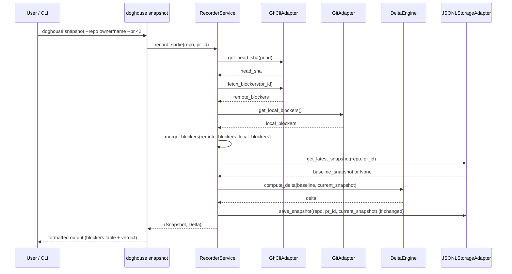

# Code Review Feedback

| Date | Agent | SHA | Branch | PR |
|------|-------|-----|--------|----|
| 2026-03-29 | CodeRabbit (and reviewers) | `60d0717b54c26fda363c9294750a9eb68f9d2820` | [feat/doghouse-reboot](https://github.com/flyingrobots/draft-punks/tree/feat/doghouse-reboot "flyingrobots/draft-punks:feat/doghouse-reboot") | [PR#5](https://github.com/flyingrobots/draft-punks/pull/5) |

## CODE REVIEW FEEDBACK

### .github/workflows/ci.yml:32 — github-advanced-security[bot]

```text
## Workflow does not contain permissions

Actions job or workflow does not limit the permissions of the GITHUB_TOKEN. Consider setting an explicit permissions block, using the following as a minimal starting point: {{contents: read}}

[Show more details](https://github.com/flyingrobots/draft-punks/security/code-scanning/1)
```

_Meta_: https://github.com/flyingrobots/draft-punks/pull/5#discussion_r3004906472

{response}

### pyproject.toml:8 — chatgpt-codex-connector[bot]

```text
**<sub><sub></sub></sub>  Point project README metadata at an existing file**

`pyproject.toml` declares `readme = { file = "cli/README.md" }`, but this commit only adds `README.md` and `doghouse/README.md`; there is no `cli/README.md` in the tree. Builds that read package metadata (including the new publish workflow’s `python -m build`) will fail when they try to load the missing README file, blocking packaging and release.

Useful? React with 👍 / 👎.
```

_Meta_: https://github.com/flyingrobots/draft-punks/pull/5#discussion_r3004910108

{response}

### src/doghouse/cli/main.py:46 — chatgpt-codex-connector[bot]

```text
**<sub><sub></sub></sub>  Wire --repo into GitHub adapter initialization**

The CLI accepts a `--repo` option, but `snapshot` creates `GhCliAdapter()` with no repo context, so `_run_gh` never adds `-R owner/name` and all PR data is fetched from the current checkout instead of the requested repo. If a user runs from one repository while passing `--repo` for another, snapshots are written under the requested repo key but contain data from a different repository, producing incorrect history and deltas.

Useful? React with 👍 / 👎.
```

_Meta_: https://github.com/flyingrobots/draft-punks/pull/5#discussion_r3004910110

{response}

### src/doghouse/cli/main.py:232 — chatgpt-codex-connector[bot]

```text
**<sub><sub></sub></sub>  Emit watch updates only when delta actually changes**

This gate is intended to print only on change or first run, but `delta.baseline_sha` becomes truthy after the first saved snapshot and stays truthy forever, so the block executes every interval even when there are no blocker or SHA changes. Long-running `watch` sessions will continuously spam output/logs instead of signaling only meaningful transitions.

Useful? React with 👍 / 👎.
```

_Meta_: https://github.com/flyingrobots/draft-punks/pull/5#discussion_r3004910111

{response}

### .github/workflows/ci.yml:6 — coderabbitai[bot]

```text
_⚠️ Potential issue_ | _🟠 Major_

**CI is scoped to `tui`, so PRs to `main` are not validated.**

Line [4] and Line [6] restrict workflow execution to `tui`; this misses the active `main` integration path and undermines CI gatekeeping.

<details>
<summary>✅ Proposed trigger fix (and lint-safe formatting)</summary>

```diff
-on:
+'on':
   push:
-    branches: [ tui ]
+    branches: [main]
   pull_request:
-    branches: [ tui ]
+    branches: [main]
```
</details>

<!-- suggestion_start -->

<details>
<summary>📝 Committable suggestion</summary>

> ‼️ **IMPORTANT**
> Carefully review the code before committing. Ensure that it accurately replaces the highlighted code, contains no missing lines, and has no issues with indentation. Thoroughly test & benchmark the code to ensure it meets the requirements.

```suggestion
'on':
  push:
    branches: [main]
  pull_request:
    branches: [main]
```

</details>

<!-- suggestion_end -->

<details>
<summary>🧰 Tools</summary>

<details>
<summary>🪛 YAMLlint (1.38.0)</summary>

[warning] 2-2: truthy value should be one of [false, true]

(truthy)

---

[error] 4-4: too many spaces inside brackets

(brackets)

---

[error] 4-4: too many spaces inside brackets

(brackets)

---

[error] 6-6: too many spaces inside brackets

(brackets)

---

[error] 6-6: too many spaces inside brackets

(brackets)

</details>

</details>

<details>
<summary>🤖 Prompt for AI Agents</summary>

```
Verify each finding against the current code and only fix it if needed.

In @.github/workflows/ci.yml around lines 2 - 6, The workflow trigger currently
restricts CI to only the tui branch by specifying branches: [ tui ] under both
push and pull_request; update the on -> push and on -> pull_request branch
filters (the branches arrays) to include main (or remove the branch restriction
to run on all branches) so PRs and pushes to main are validated; locate the
on/push and on/pull_request sections in the CI file and modify the branches
arrays accordingly.
```

</details>

<!-- fingerprinting:phantom:poseidon:hawk -->

<!-- This is an auto-generated comment by CodeRabbit -->

✅ Addressed in commit 6d8640d
```

_Meta_: https://github.com/flyingrobots/draft-punks/pull/5#discussion_r3004922364

{response}

### .github/workflows/publish.yml:5 — coderabbitai[bot]

```text
_🧹 Nitpick_ | _🔵 Trivial_

**Tag pattern `v*.*.*` is overly permissive.**

This matches garbage like `vabc.def.ghi` or `v1.2.3.4.5.6`. Consider a stricter regex if your CI platform supports it, or validate the tag format in a preceding step:

```yaml
tags:
  - 'v[0-9]+.[0-9]+.[0-9]+'
```

Minor, but precision matters in release pipelines.

<details>
<summary>🤖 Prompt for AI Agents</summary>

```
Verify each finding against the current code and only fix it if needed.

In @.github/workflows/publish.yml around lines 4 - 5, Replace the overly
permissive tags glob under the tags key that currently reads 'v*.*.*' with a
stricter validation: either change the pattern to a numeric-only form (e.g., use
a regex-like pattern such as 'v[0-9]+\\.[0-9]+\\.[0-9]+' for systems that accept
regex) or add a prerelease validation step that checks the pushed tag matches
/^\v[0-9]+\.[0-9]+\.[0-9]+$/ before proceeding; update the tags entry (the line
containing "tags: - 'v*.*.*'") or add the validation job referencing the same
tags key so only semantic-version tags are accepted.
```

</details>

<!-- fingerprinting:phantom:poseidon:ocelot -->

<!-- This is an auto-generated comment by CodeRabbit -->

✅ Addressed in commits 6d8640d to d4def97
```

_Meta_: https://github.com/flyingrobots/draft-punks/pull/5#discussion_r3004922367

{response}

### .github/workflows/publish.yml:23 — coderabbitai[bot]

```text
_🧹 Nitpick_ | _🔵 Trivial_

**Supply chain hygiene: consider splitting build and publish into separate jobs with artifact upload.**

Right now, the build and publish happen in one monolithic job. If a compromised dependency injects itself during `pip install build`, it could tamper with your wheel before publishing. Best practice:

1. Build job → uploads artifact
2. Publish job → downloads artifact, verifies, publishes

Also consider adding `--no-isolation` awareness and pinning the `build` package version rather than grabbing whatever's latest.

<details>
<summary>🤖 Prompt for AI Agents</summary>

```
Verify each finding against the current code and only fix it if needed.

In @.github/workflows/publish.yml around lines 6 - 23, The current single job
"build-and-publish" runs both the Build and Publish steps, which risks tampering
between build and publish; split this into two jobs (e.g., "build" and
"publish") where the build job runs the Build step (pin the build tool like
"python -m pip install --upgrade pip build==<version>" and be explicit about
--no-build-isolation if used), saves the resulting artifacts using
actions/upload-artifact, and the publish job (depends-on the build job)
downloads the artifact with actions/download-artifact and then runs the
pypa/gh-action-pypi-publish step to publish; also ensure the Publish job uses a
fixed action version for pypa/gh-action-pypi-publish and retains the existing
secrets usage for password.
```

</details>

<!-- fingerprinting:phantom:poseidon:ocelot -->

<!-- This is an auto-generated comment by CodeRabbit -->

✅ Addressed in commit 6d8640d
```

_Meta_: https://github.com/flyingrobots/draft-punks/pull/5#discussion_r3004922370

{response}

### .github/workflows/publish.yml:10 — coderabbitai[bot]

```text
_🧹 Nitpick_ | _🔵 Trivial_

**Missing `id-token: write` permission for PyPI Trusted Publishing.**

You're using the legacy `password` authentication method. PyPI's Trusted Publishing via OIDC is the modern, more secure approach that eliminates the need to manage API tokens. If you want to use it, add:

```yaml
permissions:
  contents: read
  id-token: write
```

Then remove the `password` input from the publish step entirely. If you're intentionally sticking with token-based auth, this is acceptable but inferior.

<details>
<summary>🤖 Prompt for AI Agents</summary>

```
Verify each finding against the current code and only fix it if needed.

In @.github/workflows/publish.yml around lines 9 - 10, Update the workflow
permissions block to include id-token: write alongside contents: read and switch
the publish step to use OIDC Trusted Publishing: add "id-token: write" under the
existing permissions (keeping "contents: read"), then remove the legacy
"password" input from the publish job/step and use the OIDC-based authentication
approach for PyPI publishing (adjust the publish step that currently uses the
password input to the OIDC token flow).
```

</details>

<!-- fingerprinting:phantom:poseidon:ocelot -->

<!-- This is an auto-generated comment by CodeRabbit -->

✅ Addressed in commit 6d8640d
```

_Meta_: https://github.com/flyingrobots/draft-punks/pull/5#discussion_r3004922371

{response}

### docs/archive/DRIFT_REPORT.md:74 — coderabbitai[bot]

```text
_⚠️ Potential issue_ | _🟡 Minor_

**Ordered list numbering violates configured markdown style (MD029).**

Lines [59]-[74] use explicit `11)` … `16)` prefixes in a list style configured as `1/1/1`. Normalize the list numbering to satisfy markdownlint.


<details>
<summary>Suggested fix pattern</summary>

```diff
-11) DP-F-10 Prompt Editing & Templates
-12) DP-F-11 Settings & Persistence
-13) DP-F-12 Merge Flow
-14) DP-F-13 Stash Dirty Changes Flow
-15) DP-F-15 Status Bar & Key Hints
-16) DP-F-16 Theming & Layout
+1. DP-F-10 Prompt Editing & Templates
+1. DP-F-11 Settings & Persistence
+1. DP-F-12 Merge Flow
+1. DP-F-13 Stash Dirty Changes Flow
+1. DP-F-15 Status Bar & Key Hints
+1. DP-F-16 Theming & Layout
```
</details>

<!-- suggestion_start -->

<details>
<summary>📝 Committable suggestion</summary>

> ‼️ **IMPORTANT**
> Carefully review the code before committing. Ensure that it accurately replaces the highlighted code, contains no missing lines, and has no issues with indentation. Thoroughly test & benchmark the code to ensure it meets the requirements.

```suggestion
1. DP-F-10 Prompt Editing & Templates
   - Missing: Editor flow; template tokens for context.

1. DP-F-11 Settings & Persistence
   - Missing: Dedicated Settings screen (reply_on_success, force_json, provider, etc.).

1. DP-F-12 Merge Flow
   - Missing completely.

1. DP-F-13 Stash Dirty Changes Flow
   - Missing completely (no dirty banner/flow).

1. DP-F-15 Status Bar & Key Hints
   - Missing persistent hints; Help overlay exists but not context bar.

1. DP-F-16 Theming & Layout
```

</details>

<!-- suggestion_end -->

<details>
<summary>🧰 Tools</summary>

<details>
<summary>🪛 markdownlint-cli2 (0.22.0)</summary>

[warning] 59-59: Ordered list item prefix
Expected: 1; Actual: 11; Style: 1/1/1

(MD029, ol-prefix)

---

[warning] 62-62: Ordered list item prefix
Expected: 1; Actual: 12; Style: 1/1/1

(MD029, ol-prefix)

---

[warning] 65-65: Ordered list item prefix
Expected: 1; Actual: 13; Style: 1/1/1

(MD029, ol-prefix)

---

[warning] 68-68: Ordered list item prefix
Expected: 1; Actual: 14; Style: 1/1/1

(MD029, ol-prefix)

---

[warning] 71-71: Ordered list item prefix
Expected: 1; Actual: 15; Style: 1/1/1

(MD029, ol-prefix)

---

[warning] 74-74: Ordered list item prefix
Expected: 1; Actual: 16; Style: 1/1/1

(MD029, ol-prefix)

</details>

</details>

<details>
<summary>🤖 Prompt for AI Agents</summary>

```
Verify each finding against the current code and only fix it if needed.

In `@docs/archive/DRIFT_REPORT.md` around lines 59 - 74, The ordered list in the
DRIFT_REPORT.md section containing items "DP-F-10 Prompt Editing & Templates"
through "DP-F-16 Theming & Layout" uses explicit numbered prefixes like
"11)"–"16)" which violates MD029; update that block so each list item uses the
configured normalized numbering (e.g. start each line with "1." or remove
explicit numbers to allow automatic numbering) for the entries referencing
DP-F-10, DP-F-11, DP-F-12, DP-F-13, DP-F-15, and DP-F-16 so markdownlint accepts
the 1/1/1 style.
```

</details>

<!-- fingerprinting:phantom:poseidon:hawk -->

<!-- This is an auto-generated comment by CodeRabbit -->
```

_Meta_: https://github.com/flyingrobots/draft-punks/pull/5#discussion_r3004922373

{response}

### docs/archive/IDEAS.md:57 — coderabbitai[bot]

```text
_⚠️ Potential issue_ | _🟡 Minor_

**Heading spacing violates MD022 across multiple sections.**

Several headings in Lines [25]-[57] are not surrounded by required blank lines. Add a blank line before/after each heading to prevent repeated markdownlint warnings.

<details>
<summary>🧰 Tools</summary>

<details>
<summary>🪛 markdownlint-cli2 (0.22.0)</summary>

[warning] 25-25: Headings should be surrounded by blank lines
Expected: 1; Actual: 0; Below

(MD022, blanks-around-headings)

---

[warning] 30-30: Headings should be surrounded by blank lines
Expected: 1; Actual: 0; Below

(MD022, blanks-around-headings)

---

[warning] 34-34: Headings should be surrounded by blank lines
Expected: 1; Actual: 0; Below

(MD022, blanks-around-headings)

---

[warning] 38-38: Headings should be surrounded by blank lines
Expected: 1; Actual: 0; Below

(MD022, blanks-around-headings)

---

[warning] 43-43: Headings should be surrounded by blank lines
Expected: 1; Actual: 0; Below

(MD022, blanks-around-headings)

---

[warning] 47-47: Headings should be surrounded by blank lines
Expected: 1; Actual: 0; Below

(MD022, blanks-around-headings)

---

[warning] 52-52: Headings should be surrounded by blank lines
Expected: 1; Actual: 0; Below

(MD022, blanks-around-headings)

---

[warning] 57-57: Headings should be surrounded by blank lines
Expected: 1; Actual: 0; Below

(MD022, blanks-around-headings)

</details>

</details>

<details>
<summary>🤖 Prompt for AI Agents</summary>

```
Verify each finding against the current code and only fix it if needed.

In `@docs/archive/IDEAS.md` around lines 25 - 57, Multiple section headings (e.g.,
"3) Consensus & Grants", "4) CRDT Mode (optional)", "5) Deterministic Job
Graph", etc.) lack the required blank line before and/or after them causing
MD022 warnings; update the markdown by ensuring each top-level heading in this
block has a blank line above and below the heading (insert one empty line before
and one empty line after each heading title) so headings like "3) Consensus &
Grants", "4) CRDT Mode (optional)", "5) Deterministic Job Graph", "6) Capability
Tokens", "7) Mind Remotes & Selective Replication", "8) Artifacts Store", and
"9) Kernel Backends" conform to markdownlint rules.
```

</details>

<!-- fingerprinting:phantom:poseidon:hawk -->

<!-- This is an auto-generated comment by CodeRabbit -->
```

_Meta_: https://github.com/flyingrobots/draft-punks/pull/5#discussion_r3004922381

{response}

### docs/archive/INTEGRATIONS-git-kv.md:57 — coderabbitai[bot]

```text
_⚠️ Potential issue_ | _🟡 Minor_

**Section headings need blank-line normalization (MD022).**

Lines [25]-[57] contain multiple headings without required surrounding blank lines. Normalize heading spacing to keep markdownlint output clean.

<details>
<summary>🧰 Tools</summary>

<details>
<summary>🪛 markdownlint-cli2 (0.22.0)</summary>

[warning] 25-25: Headings should be surrounded by blank lines
Expected: 1; Actual: 0; Below

(MD022, blanks-around-headings)

---

[warning] 30-30: Headings should be surrounded by blank lines
Expected: 1; Actual: 0; Below

(MD022, blanks-around-headings)

---

[warning] 34-34: Headings should be surrounded by blank lines
Expected: 1; Actual: 0; Below

(MD022, blanks-around-headings)

---

[warning] 38-38: Headings should be surrounded by blank lines
Expected: 1; Actual: 0; Below

(MD022, blanks-around-headings)

---

[warning] 43-43: Headings should be surrounded by blank lines
Expected: 1; Actual: 0; Below

(MD022, blanks-around-headings)

---

[warning] 47-47: Headings should be surrounded by blank lines
Expected: 1; Actual: 0; Below

(MD022, blanks-around-headings)

---

[warning] 52-52: Headings should be surrounded by blank lines
Expected: 1; Actual: 0; Below

(MD022, blanks-around-headings)

---

[warning] 57-57: Headings should be surrounded by blank lines
Expected: 1; Actual: 0; Below

(MD022, blanks-around-headings)

</details>

</details>

<details>
<summary>🤖 Prompt for AI Agents</summary>

```
Verify each finding against the current code and only fix it if needed.

In `@docs/archive/INTEGRATIONS-git-kv.md` around lines 25 - 57, Several headings
in the provided markdown (e.g., "Phase 0 — Adapter & Protocol", "Phase 1 — Index
& TTL Alignment", "Phase 2 — Chunked Values & Artifacts", "Phase 3 — Gateway &
Remotes", "Phase 4 — Observability & Watchers", "Open Questions", "Risks &
Mitigations", "Next Steps") are missing the required blank lines before/after
them; add a single blank line above each top-level heading and a single blank
line after each heading (and before the following paragraph or list) to satisfy
MD022 and normalize spacing throughout the document.
```

</details>

<!-- fingerprinting:phantom:poseidon:hawk -->

<!-- This is an auto-generated comment by CodeRabbit -->
```

_Meta_: https://github.com/flyingrobots/draft-punks/pull/5#discussion_r3004922384

{response}

### docs/archive/mind/FEATURES.md:85 — coderabbitai[bot]

```text
_⚠️ Potential issue_ | _🟡 Minor_

**Apply consistent blank lines around headings.**

This file repeatedly triggers MD022. Clean heading spacing now, or this archive doc will keep failing/dirtying markdown checks.

<details>
<summary>🧰 Tools</summary>

<details>
<summary>🪛 markdownlint-cli2 (0.22.0)</summary>

[warning] 25-25: Headings should be surrounded by blank lines
Expected: 1; Actual: 0; Below

(MD022, blanks-around-headings)

---

[warning] 30-30: Headings should be surrounded by blank lines
Expected: 1; Actual: 0; Below

(MD022, blanks-around-headings)

---

[warning] 34-34: Headings should be surrounded by blank lines
Expected: 1; Actual: 0; Below

(MD022, blanks-around-headings)

---

[warning] 38-38: Headings should be surrounded by blank lines
Expected: 1; Actual: 0; Below

(MD022, blanks-around-headings)

---

[warning] 43-43: Headings should be surrounded by blank lines
Expected: 1; Actual: 0; Below

(MD022, blanks-around-headings)

---

[warning] 47-47: Headings should be surrounded by blank lines
Expected: 1; Actual: 0; Below

(MD022, blanks-around-headings)

---

[warning] 52-52: Headings should be surrounded by blank lines
Expected: 1; Actual: 0; Below

(MD022, blanks-around-headings)

---

[warning] 57-57: Headings should be surrounded by blank lines
Expected: 1; Actual: 0; Below

(MD022, blanks-around-headings)

</details>

</details>

<details>
<summary>🤖 Prompt for AI Agents</summary>

```
Verify each finding against the current code and only fix it if needed.

In `@docs/archive/mind/FEATURES.md` around lines 8 - 85, Fix MD022 spacing by
ensuring a single blank line before and after each Markdown heading in this
file; specifically adjust headings like "GM-F-00 Snapshot Engine & JSONL",
"GM-US-0001 Snapshot commits under refs/mind/sessions/*", "GM-US-0002 JSONL
serve --stdio (hello, state.show, repo.detect, pr.list, pr.select)", "GM-F-01 PR
& Threads", and all subheadings (e.g., "User Story", "Requirements",
"Acceptance", "DoR", "Test Plan") so they have one blank line above and one
blank line below, then run the markdown linter to confirm MD022 is resolved
across the document.
```

</details>

<!-- fingerprinting:phantom:poseidon:hawk -->

<!-- This is an auto-generated comment by CodeRabbit -->
```

_Meta_: https://github.com/flyingrobots/draft-punks/pull/5#discussion_r3004922387

{response}

### docs/archive/mind/SPEC.md:70 — coderabbitai[bot]

```text
_⚠️ Potential issue_ | _🟡 Minor_

**Markdown heading spacing is inconsistent with lint rules.**

Several sections violate MD022 (blank lines around headings). This will keep docs lint noisy in CI; normalize heading spacing throughout this file.

<details>
<summary>🧰 Tools</summary>

<details>
<summary>🪛 LanguageTool</summary>

[grammar] ~7-~7: Ensure spelling is correct
Context: ... trailers (speech‑acts) and an optional shiplog event. - A JSONL stdio API makes it det...

(QB_NEW_EN_ORTHOGRAPHY_ERROR_IDS_1)

</details>
<details>
<summary>🪛 markdownlint-cli2 (0.22.0)</summary>

[warning] 25-25: Headings should be surrounded by blank lines
Expected: 1; Actual: 0; Below

(MD022, blanks-around-headings)

---

[warning] 30-30: Headings should be surrounded by blank lines
Expected: 1; Actual: 0; Below

(MD022, blanks-around-headings)

---

[warning] 34-34: Headings should be surrounded by blank lines
Expected: 1; Actual: 0; Below

(MD022, blanks-around-headings)

---

[warning] 38-38: Headings should be surrounded by blank lines
Expected: 1; Actual: 0; Below

(MD022, blanks-around-headings)

---

[warning] 43-43: Headings should be surrounded by blank lines
Expected: 1; Actual: 0; Below

(MD022, blanks-around-headings)

---

[warning] 47-47: Headings should be surrounded by blank lines
Expected: 1; Actual: 0; Below

(MD022, blanks-around-headings)

---

[warning] 52-52: Headings should be surrounded by blank lines
Expected: 1; Actual: 0; Below

(MD022, blanks-around-headings)

---

[warning] 57-57: Headings should be surrounded by blank lines
Expected: 1; Actual: 0; Below

(MD022, blanks-around-headings)

</details>

</details>

<details>
<summary>🤖 Prompt for AI Agents</summary>

```
Verify each finding against the current code and only fix it if needed.

In `@docs/archive/mind/SPEC.md` around lines 3 - 70, The file violates MD022
(missing blank lines around headings); fix by ensuring a single blank line both
before and after each top-level and secondary heading (e.g., "## Vision", "##
User Outcomes", "## Core Flows (v0.1)", "## Non‑Goals (v0.1)", "## Reference
Namespace (in‑repo; no worktree churn)", "## CLI (human)", "## JSONL API
(machine)", "## Privacy & Artifacts (hybrid by default)", "## Policy &
Attributes", "## Remotes", "## Integrations") so every heading is separated from
surrounding paragraphs and lists with one blank line, normalize any headings
that currently lack that spacing, and run the markdown linter to verify MD022 is
resolved.
```

</details>

<!-- fingerprinting:phantom:poseidon:hawk -->

<!-- This is an auto-generated comment by CodeRabbit -->
```

_Meta_: https://github.com/flyingrobots/draft-punks/pull/5#discussion_r3004922393

{response}

### docs/archive/mind/TASKLIST.md:36 — coderabbitai[bot]

```text
_🧹 Nitpick_ | _🔵 Trivial_

**Markdown lint violations: headings missing trailing blank lines.**

Every `##` heading (lines 5, 15, 24, 28, 33) lacks a blank line before the list items. This breaks some markdown renderers and violates MD022.

Since this is archived documentation, I'll let you decide if cleanup is worth the diff noise. If you want to fix it:

<details>
<summary>📝 Add blank lines after headings</summary>

```diff
 ## GM-F-00 Snapshot & JSONL
+
 - [x] GM-US-0001 snapshot commits under refs/mind/sessions/*
```

Repeat for each `##` heading.
</details>

<details>
<summary>🧰 Tools</summary>

<details>
<summary>🪛 markdownlint-cli2 (0.22.0)</summary>

[warning] 5-5: Headings should be surrounded by blank lines
Expected: 1; Actual: 0; Below

(MD022, blanks-around-headings)

---

[warning] 15-15: Headings should be surrounded by blank lines
Expected: 1; Actual: 0; Below

(MD022, blanks-around-headings)

---

[warning] 24-24: Headings should be surrounded by blank lines
Expected: 1; Actual: 0; Below

(MD022, blanks-around-headings)

---

[warning] 28-28: Headings should be surrounded by blank lines
Expected: 1; Actual: 0; Below

(MD022, blanks-around-headings)

---

[warning] 33-33: Headings should be surrounded by blank lines
Expected: 1; Actual: 0; Below

(MD022, blanks-around-headings)

</details>

</details>

<details>
<summary>🤖 Prompt for AI Agents</summary>

```
Verify each finding against the current code and only fix it if needed.

In `@docs/archive/mind/TASKLIST.md` around lines 5 - 36, Add a single blank line
after each level-2 heading to satisfy MD022: insert one empty line after "##
GM-F-00 Snapshot & JSONL", "## GM-F-01 PR & Threads", "## GM-F-02 LLM Debug &
Real Template", "## GM-F-03 Artifacts & Remotes", and "## GM-F-04 Locks &
Consensus" so the following list items are separated from the headings; no other
changes needed.
```

</details>

<!-- fingerprinting:phantom:poseidon:ocelot -->

<!-- This is an auto-generated comment by CodeRabbit -->
```

_Meta_: https://github.com/flyingrobots/draft-punks/pull/5#discussion_r3004922395

{response}

### docs/archive/mind/TECH-SPEC.md:81 — coderabbitai[bot]

```text
_⚠️ Potential issue_ | _🟡 Minor_

**Heading/fence spacing is inconsistent with markdownlint rules.**

Lines [3]-[81] repeatedly violate MD022/MD031 (heading and fenced-block surrounding blank lines). Normalize spacing to avoid persistent lint warnings.

<details>
<summary>🧰 Tools</summary>

<details>
<summary>🪛 markdownlint-cli2 (0.22.0)</summary>

[warning] 3-3: Headings should be surrounded by blank lines
Expected: 1; Actual: 0; Below

(MD022, blanks-around-headings)

---

[warning] 10-10: Fenced code blocks should be surrounded by blank lines

(MD031, blanks-around-fences)

---

[warning] 33-33: Headings should be surrounded by blank lines
Expected: 1; Actual: 0; Below

(MD022, blanks-around-headings)

---

[warning] 40-40: Fenced code blocks should be surrounded by blank lines

(MD031, blanks-around-fences)

---

[warning] 50-50: Headings should be surrounded by blank lines
Expected: 1; Actual: 0; Below

(MD022, blanks-around-headings)

---

[warning] 56-56: Headings should be surrounded by blank lines
Expected: 1; Actual: 0; Below

(MD022, blanks-around-headings)

---

[warning] 62-62: Headings should be surrounded by blank lines
Expected: 1; Actual: 0; Below

(MD022, blanks-around-headings)

---

[warning] 67-67: Headings should be surrounded by blank lines
Expected: 1; Actual: 0; Below

(MD022, blanks-around-headings)

---

[warning] 72-72: Headings should be surrounded by blank lines
Expected: 1; Actual: 0; Below

(MD022, blanks-around-headings)

---

[warning] 77-77: Headings should be surrounded by blank lines
Expected: 1; Actual: 0; Below

(MD022, blanks-around-headings)

---

[warning] 81-81: Headings should be surrounded by blank lines
Expected: 1; Actual: 0; Below

(MD022, blanks-around-headings)

</details>

</details>

<details>
<summary>🤖 Prompt for AI Agents</summary>

```
Verify each finding against the current code and only fix it if needed.

In `@docs/archive/mind/TECH-SPEC.md` around lines 3 - 81, The file violates
markdownlint rules MD022/MD031 due to extra blank lines around headings and
fenced blocks; fix by normalizing spacing so there are no blank lines
immediately before or after ATX headings like "## 1) Architecture (Hexagonal)"
and no blank lines directly inside or immediately surrounding fenced code blocks
(triple backticks) such as the Mermaid blocks; update the sections containing
"Mermaid — System Context" and "Mermaid — Commit Flow" and all other headings to
remove the offending blank lines so headings and fences adhere to MD022/MD031.
```

</details>

<!-- fingerprinting:phantom:poseidon:hawk -->

<!-- This is an auto-generated comment by CodeRabbit -->
```

_Meta_: https://github.com/flyingrobots/draft-punks/pull/5#discussion_r3004922398

{response}

### docs/archive/SPEC.md:1166 — coderabbitai[bot]

```text
_⚠️ Potential issue_ | _🟡 Minor_

**Markdownlint violations are pervasive and should be normalized in one pass.**

This file repeatedly triggers MD040/MD009 and ends with MD047 (single trailing newline) warning. Add fence languages (e.g., `text`, `mermaid`, `toml`), remove trailing spaces, and ensure a final newline to keep docs CI signal clean.

<details>
<summary>🧰 Tools</summary>

<details>
<summary>🪛 markdownlint-cli2 (0.22.0)</summary>

[warning] 5-5: Fenced code blocks should have a language specified

(MD040, fenced-code-language)

---

[warning] 21-21: Fenced code blocks should have a language specified

(MD040, fenced-code-language)

---

[warning] 33-33: Trailing spaces
Expected: 0 or 2; Actual: 1

(MD009, no-trailing-spaces)

---

[warning] 75-75: Fenced code blocks should have a language specified

(MD040, fenced-code-language)

---

[warning] 159-159: Fenced code blocks should have a language specified

(MD040, fenced-code-language)

---

[warning] 171-171: Fenced code blocks should have a language specified

(MD040, fenced-code-language)

---

[warning] 191-191: Fenced code blocks should have a language specified

(MD040, fenced-code-language)

---

[warning] 201-201: Trailing spaces
Expected: 0 or 2; Actual: 1

(MD009, no-trailing-spaces)

---

[warning] 214-214: Fenced code blocks should have a language specified

(MD040, fenced-code-language)

---

[warning] 241-241: Trailing spaces
Expected: 0 or 2; Actual: 1

(MD009, no-trailing-spaces)

---

[warning] 247-247: Fenced code blocks should have a language specified

(MD040, fenced-code-language)

---

[warning] 253-253: Fenced code blocks should have a language specified

(MD040, fenced-code-language)

---

[warning] 261-261: Fenced code blocks should have a language specified

(MD040, fenced-code-language)

---

[warning] 287-287: Fenced code blocks should have a language specified

(MD040, fenced-code-language)

---

[warning] 366-366: Fenced code blocks should have a language specified

(MD040, fenced-code-language)

---

[warning] 385-385: Fenced code blocks should have a language specified

(MD040, fenced-code-language)

---

[warning] 414-414: Fenced code blocks should have a language specified

(MD040, fenced-code-language)

---

[warning] 502-502: Fenced code blocks should have a language specified

(MD040, fenced-code-language)

---

[warning] 515-515: Fenced code blocks should have a language specified

(MD040, fenced-code-language)

---

[warning] 542-542: Fenced code blocks should have a language specified

(MD040, fenced-code-language)

---

[warning] 553-553: Fenced code blocks should have a language specified

(MD040, fenced-code-language)

---

[warning] 665-665: Fenced code blocks should have a language specified

(MD040, fenced-code-language)

---

[warning] 719-719: Fenced code blocks should have a language specified

(MD040, fenced-code-language)

---

[warning] 752-752: Fenced code blocks should have a language specified

(MD040, fenced-code-language)

---

[warning] 770-770: Fenced code blocks should have a language specified

(MD040, fenced-code-language)

---

[warning] 834-834: Fenced code blocks should have a language specified

(MD040, fenced-code-language)

---

[warning] 873-873: Fenced code blocks should have a language specified

(MD040, fenced-code-language)

---

[warning] 909-909: Fenced code blocks should have a language specified

(MD040, fenced-code-language)

---

[warning] 930-930: Fenced code blocks should have a language specified

(MD040, fenced-code-language)

---

[warning] 982-982: Fenced code blocks should have a language specified

(MD040, fenced-code-language)

---

[warning] 1008-1008: Fenced code blocks should have a language specified

(MD040, fenced-code-language)

---

[warning] 1023-1023: Fenced code blocks should have a language specified

(MD040, fenced-code-language)

---

[warning] 1037-1037: Fenced code blocks should have a language specified

(MD040, fenced-code-language)

---

[warning] 1052-1052: Fenced code blocks should have a language specified

(MD040, fenced-code-language)

---

[warning] 1166-1166: Files should end with a single newline character

(MD047, single-trailing-newline)

</details>

</details>

<details>
<summary>🤖 Prompt for AI Agents</summary>

````
Verify each finding against the current code and only fix it if needed.

In `@docs/archive/SPEC.md` around lines 5 - 1166, The SPEC.md has pervasive
markdownlint issues: missing fence languages (MD040) on many fenced blocks
(e.g., the triple-backtick blocks under headings like "# 0. Scroll View Widget",
"## UX Flow Diagram" mermaid blocks, and the config example under "## Config
Structure"), trailing spaces/newline issues (MD009) throughout the doc, and a
missing final newline (MD047). Fix by adding appropriate fence languages (e.g.,
```text for plain screenshots/layout, ```mermaid for diagrams, ```toml for
config blocks), remove all trailing whitespace across the file (trim end-of-line
spaces), and ensure the file ends with a single newline; run markdownlint (or
your repo lint task) to verify no MD040/MD009/MD047 warnings remain.
````

</details>

<!-- fingerprinting:phantom:poseidon:hawk -->

<!-- This is an auto-generated comment by CodeRabbit -->
```

_Meta_: https://github.com/flyingrobots/draft-punks/pull/5#discussion_r3004922401

{response}

### docs/code-reviews/PR5/56964e6b72bbe7639f9c725c6e9f2327f75bb402.md:30 — coderabbitai[bot]

```text
_⚠️ Potential issue_ | _🟡 Minor_

**Remove unresolved template placeholders from archived review artifact.**

Line [30] and Line [204] contain literal `{response}` tokens, which read like unrendered template output and degrade archive quality.

<details>
<summary>🧹 Proposed cleanup</summary>

```diff
-{response}
+_No additional structured response content captured in this archived artifact._
...
-{response}
+_No additional structured response content captured in this archived artifact._
```
</details>


Also applies to: 204-204

<details>
<summary>🤖 Prompt for AI Agents</summary>

```
Verify each finding against the current code and only fix it if needed.

In `@docs/code-reviews/PR5/56964e6b72bbe7639f9c725c6e9f2327f75bb402.md` at line
30, The archived review artifact contains unresolved template placeholders
"{response}" that must be removed or replaced with the intended rendered
content; locate all literal "{response}" tokens in the document (there are
multiple occurrences) and either replace them with the correct review text or
remove them so the artifact contains only final, human-readable content.
```

</details>

<!-- fingerprinting:phantom:poseidon:hawk -->

<!-- This is an auto-generated comment by CodeRabbit -->
```

_Meta_: https://github.com/flyingrobots/draft-punks/pull/5#discussion_r3004922404

{response}

### docs/FEATURES.md:40 — coderabbitai[bot]

```text
_⚠️ Potential issue_ | _🟡 Minor_

**Contents list is missing DP-F-20.**

The table of contents jumps from DP-F-19 to DP-F-21. Add DP-F-20 so navigation matches the actual sections.


<details>
<summary>Suggested fix</summary>

```diff
 - [ ] DP-F-19 Image Splash (polish)
+- [ ] DP-F-20 Modularization & Packaging
 - [ ] DP-F-21 Doghouse Flight Recorder
```
</details>

<!-- suggestion_start -->

<details>
<summary>📝 Committable suggestion</summary>

> ‼️ **IMPORTANT**
> Carefully review the code before committing. Ensure that it accurately replaces the highlighted code, contains no missing lines, and has no issues with indentation. Thoroughly test & benchmark the code to ensure it meets the requirements.

```suggestion
- [ ] DP-F-00 Scroll View Widget
- [ ] DP-F-01 Title Screen
- [ ] DP-F-02 Main Menu — PR Selection
- [ ] DP-F-03 PR View — Comment Thread Selection
- [ ] DP-F-04 Comment View — Thread Traversal
- [ ] DP-F-05 LLM Interaction View
- [ ] DP-F-06 LLM Provider Management
- [ ] DP-F-07 GitHub Integration
- [ ] DP-F-08 Resolve/Reply Workflow
- [ ] DP-F-09 Automation Mode
- [ ] DP-F-10 Prompt Editing & Templates
- [ ] DP-F-11 Settings & Persistence
- [ ] DP-F-12 Merge Flow
- [ ] DP-F-13 Stash Dirty Changes Flow
- [ ] DP-F-14 Keyboard Navigation & Global Shortcuts
- [ ] DP-F-15 Status Bar & Key Hints
- [ ] DP-F-16 Theming & Layout
- [ ] DP-F-17 Logging & Diagnostics
- [ ] DP-F-18 Debug LLM (dev aid)
- [ ] DP-F-19 Image Splash (polish)
- [ ] DP-F-20 Modularization & Packaging
- [ ] DP-F-21 Doghouse Flight Recorder
```

</details>

<!-- suggestion_end -->

<details>
<summary>🤖 Prompt for AI Agents</summary>

```
Verify each finding against the current code and only fix it if needed.

In `@docs/FEATURES.md` around lines 18 - 39, The features checklist in FEATURES.md
skips DP-F-20 (it jumps from DP-F-19 to DP-F-21); add a DP-F-20 entry in the
list so the table of contents matches the actual sections—insert an
appropriately labeled line like "- [ ] DP-F-20 <short title>" between the
existing "- [ ] DP-F-19 Image Splash (polish)" and "- [ ] DP-F-21 Doghouse
Flight Recorder" entries and ensure the label text matches the corresponding
DP-F-20 section title elsewhere in the document.
```

</details>

<!-- fingerprinting:phantom:poseidon:hawk -->

<!-- This is an auto-generated comment by CodeRabbit -->

✅ Addressed in commits 6d8640d to d4def97
```

_Meta_: https://github.com/flyingrobots/draft-punks/pull/5#discussion_r3004922407

{response}

### docs/archive/SPRINTS.md:8 — coderabbitai[bot]

```text
_⚠️ Potential issue_ | _🟡 Minor_

**Sprint dates are in the past.**

This plan references sprints starting "Monday, 2025-11-10" with code freezes on Fridays. It's March 2026. Either this is intentional historical documentation, or this plan is stale and should be updated or explicitly marked as historical. Ambiguity in planning docs is debt.

<details>
<summary>🤖 Prompt for AI Agents</summary>

```
Verify each finding against the current code and only fix it if needed.

In `@docs/SPRINTS.md` around lines 5 - 8, The "Cadence & Dates" section contains a
stale start date ("Start date: Monday, 2025-11-10") and ambiguous code-freeze
timing ("Code freeze on Fridays") — either update the start date(s) to
current/future sprint dates and adjust any recurring schedule to reflect today’s
calendar, or explicitly mark the section as historical/archived with a clear
note (e.g., "Historical: plan used from Nov 2025 to ...") so readers aren’t
confused; edit the "Cadence & Dates" heading and the lines "Sprint length: 1
week (Mon–Fri)", "Start date: Monday, 2025-11-10", and "Code freeze on Fridays;
demo + retro on Fridays 3pm local" accordingly.
```

</details>

<!-- fingerprinting:phantom:poseidon:ocelot -->

<!-- This is an auto-generated comment by CodeRabbit -->
```

_Meta_: https://github.com/flyingrobots/draft-punks/pull/5#discussion_r3004922411

{response}

### docs/archive/SPRINTS.md:169 — coderabbitai[bot]

```text
_🧹 Nitpick_ | _🔵 Trivial_

**Markdown formatting violation: missing blank lines around headings.**

Lines 165-168 transition from content directly into a heading without a blank line. Same issue at lines 173-176.


<details>
<summary>📝 Fix the formatting</summary>

```diff
 - Merge/stash flows as follow‑ups.
 
 ---
 
+
 ## Backlog / Nice-to-Haves (Post-SPEC)
 - DP-F-19 Image Splash (bunbun.webp) behind `DP_TUI_IMAGE` (polish).
```

And similarly before line 176:

```diff
 - Telemetry (opt-in) for anonymized UX metrics.
 
 ---
 
+
 ## Cross-Cutting Tech Debt & Risks
```
</details>

<!-- suggestion_start -->

<details>
<summary>📝 Committable suggestion</summary>

> ‼️ **IMPORTANT**
> Carefully review the code before committing. Ensure that it accurately replaces the highlighted code, contains no missing lines, and has no issues with indentation. Thoroughly test & benchmark the code to ensure it meets the requirements.

```suggestion
- Merge/stash flows as follow‑ups.

---


## Backlog / Nice-to-Haves (Post-SPEC)
- DP-F-19 Image Splash (bunbun.webp) behind `DP_TUI_IMAGE` (polish).
```

</details>

<!-- suggestion_end -->

<details>
<summary>🧰 Tools</summary>

<details>
<summary>🪛 markdownlint-cli2 (0.22.0)</summary>

[warning] 168-168: Headings should be surrounded by blank lines
Expected: 1; Actual: 0; Below

(MD022, blanks-around-headings)

</details>

</details>

<details>
<summary>🤖 Prompt for AI Agents</summary>

```
Verify each finding against the current code and only fix it if needed.

In `@docs/SPRINTS.md` around lines 164 - 169, Add missing blank lines around the
Markdown headings so they are separated from surrounding paragraphs: insert a
blank line before the "## Backlog / Nice-to-Haves (Post-SPEC)" heading and
likewise before the "DP-F-19 Image Splash (bunbun.webp) behind `DP_TUI_IMAGE`
(polish)" heading (and ensure a blank line after the preceding paragraph
"Merge/stash flows as follow‑ups."). This fixes the Markdown formatting
violation by ensuring headings are preceded and followed by an empty line.
```

</details>

<!-- fingerprinting:phantom:poseidon:ocelot -->

<!-- This is an auto-generated comment by CodeRabbit -->
```

_Meta_: https://github.com/flyingrobots/draft-punks/pull/5#discussion_r3004922412

{response}

### doghouse/README.md:39 — coderabbitai[bot]

```text
_⚠️ Potential issue_ | _🟡 Minor_

**Remove trailing whitespace to keep docs lint clean.**

Lines [37] and [39] contain trailing spaces (MD009), which creates avoidable markdownlint warnings.

<details>
<summary>🧰 Tools</summary>

<details>
<summary>🪛 LanguageTool</summary>

[grammar] ~39-~39: Ensure spelling is correct
Context: ...oghouse is your vessel, your Black Box, und your Sopwith Camel.   "Und do not forge...

(QB_NEW_EN_ORTHOGRAPHY_ERROR_IDS_1)

</details>
<details>
<summary>🪛 markdownlint-cli2 (0.22.0)</summary>

[warning] 37-37: Trailing spaces
Expected: 0 or 2; Actual: 1

(MD009, no-trailing-spaces)

---

[warning] 39-39: Trailing spaces
Expected: 0 or 2; Actual: 1

(MD009, no-trailing-spaces)

</details>

</details>

<details>
<summary>🤖 Prompt for AI Agents</summary>

```
Verify each finding against the current code and only fix it if needed.

In `@doghouse/README.md` around lines 37 - 39, Remove trailing whitespace from the
two markdown lines that end with extra spaces: the line starting "It reminded us
of a small beagle named **Snoopy**, sitting atop his wooden house, dreaming he
was an ace pilot in ze Great War, dogfighting ze Red Baron in ze clouds." and
the line starting "When you use zis tool, you are Snoopy. Your PR is your
cockpit. You are sparring mit ze reviewers—ze CodeRabbits und ze maintainers—in
a tactical dance. Ze Doghouse is your vessel, your Black Box, und your Sopwith
Camel."; edit those lines to delete the trailing spaces at the end of each line
so markdownlint MD009 warnings are resolved.
```

</details>

<!-- fingerprinting:phantom:poseidon:hawk -->

<!-- This is an auto-generated comment by CodeRabbit -->

✅ Addressed in commits 6d8640d to d4def97
```

_Meta_: https://github.com/flyingrobots/draft-punks/pull/5#discussion_r3004922414

{response}

### Makefile:19 — coderabbitai[bot]

```text
_⚠️ Potential issue_ | _🟠 Major_

**Broken `history` target calls a non-existent CLI command.**

Line [19] invokes `doghouse.cli.main history`, but the registered CLI commands are `snapshot`, `playback`, `export`, and `watch`. `make history` will fail every time.


<details>
<summary>Suggested fix</summary>

```diff
-history:
-	PYTHONPATH=src $(PYTHON) -m doghouse.cli.main history
```
</details>

<!-- suggestion_start -->

<details>
<summary>📝 Committable suggestion</summary>

> ‼️ **IMPORTANT**
> Carefully review the code before committing. Ensure that it accurately replaces the highlighted code, contains no missing lines, and has no issues with indentation. Thoroughly test & benchmark the code to ensure it meets the requirements.

```suggestion

```

</details>

<!-- suggestion_end -->

<details>
<summary>🤖 Prompt for AI Agents</summary>

```
Verify each finding against the current code and only fix it if needed.

In `@Makefile` around lines 18 - 19, The Makefile's history target invokes a
non-existent CLI command "doghouse.cli.main history"; update the target to call
one of the registered commands (e.g., replace "doghouse.cli.main history" with
"PYTHONPATH=src $(PYTHON) -m doghouse.cli.main playback") or remove the history
target; reference the Makefile target name "history" and the CLI module
"doghouse.cli.main" and use an existing command like "playback" (available
commands: snapshot, playback, export, watch).
```

</details>

<!-- fingerprinting:phantom:poseidon:hawk -->

<!-- This is an auto-generated comment by CodeRabbit -->

✅ Addressed in commit 03e8896
```

_Meta_: https://github.com/flyingrobots/draft-punks/pull/5#discussion_r3004922415

{response}

### PRODUCTION_LOG.mg:30 — coderabbitai[bot]

```text
_⚠️ Potential issue_ | _🟡 Minor_

**“Initial Entries: (none yet)” is now factually wrong.**

You already append incidents below. Drop or update this section to avoid contradictory log state.

<details>
<summary>🤖 Prompt for AI Agents</summary>

```
Verify each finding against the current code and only fix it if needed.

In `@PRODUCTION_LOG.mg` around lines 27 - 30, The "Initial Entries" header text is
now incorrect because incidents are appended below; update the PRODUCTION_LOG.mg
content by either removing the "Initial Entries" section entirely or replacing
its text with an accurate statement (e.g., "Initial Entries: see incidents
below" or a summary of current entries), and ensure the header reflects the
actual log state so it no longer contradicts appended incidents.
```

</details>

<!-- fingerprinting:phantom:poseidon:hawk -->

<!-- This is an auto-generated comment by CodeRabbit -->

✅ Addressed in commit 6d8640d
```

_Meta_: https://github.com/flyingrobots/draft-punks/pull/5#discussion_r3004922417

{response}

### PRODUCTION_LOG.mg:61 — coderabbitai[bot]

```text
_⚠️ Potential issue_ | _🟠 Major_

**Remove literal `\n` escape artifacts; they break markdown readability.**

Lines 60-61 are committed as escaped text, not actual markdown lines. Renderers will display garbage instead of headings/lists.


<details>
<summary>Proposed patch</summary>

```diff
-\n## 2026-03-27: Doghouse Reboot (The Great Pivot)\n- Deleted legacy Draft Punks TUI and GATOS/git-mind kernel.\n- Pivot to DOGHOUSE: The PR Flight Recorder.\n- Implemented core Doghouse engine (Snapshot, Sortie, Delta).\n- Implemented GitHub adapter using 'gh' CLI + GraphQL for review threads.\n- Implemented CLI 'doghouse snapshot' and 'doghouse history'.\n- Verified on real PR (flyingrobots/draft-punks PR `#3`).\n- Added unit tests for DeltaEngine.
-\n## 2026-03-27: Soul Restored\n- Restored PhiedBach / BunBun narrative to README.md.\n- Unified Draft Punks (Conductor) and Doghouse (Recorder) vision.\n- Finalized engine for feat/doghouse-reboot.
+## 2026-03-27: Doghouse Reboot (The Great Pivot)
+- Deleted legacy Draft Punks TUI and GATOS/git-mind kernel.
+- Pivot to DOGHOUSE: The PR Flight Recorder.
+- Implemented core Doghouse engine (Snapshot, Sortie, Delta).
+- Implemented GitHub adapter using `gh` CLI + GraphQL for review threads.
+- Implemented CLI `doghouse snapshot` and `doghouse history`.
+- Verified on real PR (flyingrobots/draft-punks PR `#3`).
+- Added unit tests for DeltaEngine.
+
+## 2026-03-27: Soul Restored
+- Restored PhiedBach / BunBun narrative to README.md.
+- Unified Draft Punks (Conductor) and Doghouse (Recorder) vision.
+- Finalized engine for feat/doghouse-reboot.
```
</details>

<!-- suggestion_start -->

<details>
<summary>📝 Committable suggestion</summary>

> ‼️ **IMPORTANT**
> Carefully review the code before committing. Ensure that it accurately replaces the highlighted code, contains no missing lines, and has no issues with indentation. Thoroughly test & benchmark the code to ensure it meets the requirements.

```suggestion
## 2026-03-27: Doghouse Reboot (The Great Pivot)
- Deleted legacy Draft Punks TUI and GATOS/git-mind kernel.
- Pivot to DOGHOUSE: The PR Flight Recorder.
- Implemented core Doghouse engine (Snapshot, Sortie, Delta).
- Implemented GitHub adapter using `gh` CLI + GraphQL for review threads.
- Implemented CLI `doghouse snapshot` and `doghouse history`.
- Verified on real PR (flyingrobots/draft-punks PR `#3`).
- Added unit tests for DeltaEngine.

## 2026-03-27: Soul Restored
- Restored PhiedBach / BunBun narrative to README.md.
- Unified Draft Punks (Conductor) and Doghouse (Recorder) vision.
- Finalized engine for feat/doghouse-reboot.
```

</details>

<!-- suggestion_end -->

<details>
<summary>🤖 Prompt for AI Agents</summary>

```
Verify each finding against the current code and only fix it if needed.

In `@PRODUCTION_LOG.mg` around lines 60 - 61, The file contains literal "\n"
escape sequences committed into the markdown (e.g., the string "\n## 2026-03-27:
Doghouse Reboot (The Great Pivot)\n- Deleted legacy Draft Punks..." and the
following block) which break rendering; open PRODUCTION_LOG.mg, find the escaped
sequence (search for "\n## 2026-03-27" or the literal "\n" before the headings),
remove the backslash-escaped "\n" artifacts and replace them with actual
newlines so the headings ("## 2026-03-27: Doghouse Reboot..." and "##
2026-03-27: Soul Restored") and list items become proper markdown lines, then
save/commit the cleaned markdown.
```

</details>

<!-- fingerprinting:phantom:poseidon:hawk -->

<!-- This is an auto-generated comment by CodeRabbit -->

✅ Addressed in commits 6d8640d to d4def97
```

_Meta_: https://github.com/flyingrobots/draft-punks/pull/5#discussion_r3004922419

{response}

### pyproject.toml:8 — coderabbitai[bot]

```text
_⚠️ Potential issue_ | _🟠 Major_

<details>
<summary>🧩 Analysis chain</summary>

🏁 Script executed:

```shell
#!/bin/bash
# Check if cli/README.md exists
if [ -f "cli/README.md" ]; then
    echo "✓ cli/README.md exists"
else
    echo "✗ cli/README.md NOT FOUND"
    # Check for alternative locations
    fd -t f "README.md" --max-depth 3
fi
```

Repository: flyingrobots/draft-punks

Length of output: 122

---


</details>

**`cli/README.md` does not exist—fix the broken build reference.**

The path in `pyproject.toml` line 8 references a non-existent file. The build will fail at package time. Repository contains `README.md` (root) and `doghouse/README.md`, but no `cli/README.md`. Either create the file, update the path to an existing README, or remove the `readme` field entirely.

<details>
<summary>🤖 Prompt for AI Agents</summary>

```
Verify each finding against the current code and only fix it if needed.

In `@pyproject.toml` at line 8, The pyproject.toml readme entry references a
missing file via the readme field; fix by either creating the referenced file
(create cli/README.md with appropriate package README), or update the readme
field to point to an existing README (for example "README.md" or
"doghouse/README.md"), or remove the readme = {...} entry entirely so packaging
won’t reference a non-existent file; ensure the change is made to the readme
field in pyproject.toml.
```

</details>

<!-- fingerprinting:phantom:poseidon:ocelot -->

<!-- This is an auto-generated comment by CodeRabbit -->

✅ Addressed in commits 939dfd6 to 55095b0
```

_Meta_: https://github.com/flyingrobots/draft-punks/pull/5#discussion_r3004922423

{response}

### pyproject.toml:37 — coderabbitai[bot]

```text
_🧹 Nitpick_ | _🔵 Trivial_

**Inconsistent indentation — leading space on array items and script entry.**

Lines 32-34 and 37 have leading whitespace before the key, while the rest of the file doesn't. TOML doesn't care, but humans do. Pick one style and stick with it.

```diff
 [project.optional-dependencies]
- dev = [
-  "pytest>=7",
- ]
+dev = [
+    "pytest>=7",
+]

 [project.scripts]
- doghouse = "doghouse.cli.main:app"
+doghouse = "doghouse.cli.main:app"
```

<!-- suggestion_start -->

<details>
<summary>📝 Committable suggestion</summary>

> ‼️ **IMPORTANT**
> Carefully review the code before committing. Ensure that it accurately replaces the highlighted code, contains no missing lines, and has no issues with indentation. Thoroughly test & benchmark the code to ensure it meets the requirements.

```suggestion
[project.optional-dependencies]
dev = [
    "pytest>=7",
]

[project.scripts]
doghouse = "doghouse.cli.main:app"
```

</details>

<!-- suggestion_end -->

<details>
<summary>🤖 Prompt for AI Agents</summary>

```
Verify each finding against the current code and only fix it if needed.

In `@pyproject.toml` around lines 31 - 37, The file has inconsistent leading
spaces before array items and the script entry (under
[project.optional-dependencies] dev and [project.scripts] doghouse =
"doghouse.cli.main:app"); normalize indentation by removing the extra leading
spaces so keys and values align with the rest of the file (make the "dev" array
items and the "doghouse" script entry have the same left-alignment as
surrounding entries).
```

</details>

<!-- fingerprinting:phantom:poseidon:ocelot -->

<!-- This is an auto-generated comment by CodeRabbit -->

✅ Addressed in commit 03e8896
```

_Meta_: https://github.com/flyingrobots/draft-punks/pull/5#discussion_r3004922425

{response}

### README.md:150 — coderabbitai[bot]

```text
_⚠️ Potential issue_ | _🟡 Minor_

**Fix markdown structure around headings and fenced blocks.**

Lines 140-150 violate MD022/MD031. Add blank lines around headings and code fences to keep docs lint-clean.


<details>
<summary>Proposed patch</summary>

```diff
 ### 📡 Capture a Sortie
+
 Run zis to see what has changed since your last rehearsal.
+
 ```bash
 doghouse snapshot
 ```
 
 ### 🎬 Run a Playback
+
 Verify the delta engine logic against offline scores (fixtures).
+
 ```bash
 doghouse playback pb1_push_delta
 ```
```
</details>

<!-- suggestion_start -->

<details>
<summary>📝 Committable suggestion</summary>

> ‼️ **IMPORTANT**
> Carefully review the code before committing. Ensure that it accurately replaces the highlighted code, contains no missing lines, and has no issues with indentation. Thoroughly test & benchmark the code to ensure it meets the requirements.

```suggestion
### 📡 Capture a Sortie

Run zis to see what has changed since your last rehearsal.

```

</details>

<!-- suggestion_end -->

<details>
<summary>🧰 Tools</summary>

<details>
<summary>🪛 markdownlint-cli2 (0.22.0)</summary>

[warning] 140-140: Headings should be surrounded by blank lines
Expected: 1; Actual: 0; Below

(MD022, blanks-around-headings)

---

[warning] 142-142: Fenced code blocks should be surrounded by blank lines

(MD031, blanks-around-fences)

---

[warning] 146-146: Headings should be surrounded by blank lines
Expected: 1; Actual: 0; Below

(MD022, blanks-around-headings)

---

[warning] 148-148: Fenced code blocks should be surrounded by blank lines

(MD031, blanks-around-fences)

</details>

</details>

<details>
<summary>🤖 Prompt for AI Agents</summary>

```
Verify each finding against the current code and only fix it if needed.

In `@README.md` around lines 140 - 150, Markdown headings "📡 Capture a Sortie"
and "🎬 Run a Playback" and their fenced code blocks lack surrounding blank
lines, causing MD022/MD031 lint errors; add a blank line above each heading and
ensure there is an empty line before and after each triple-backtick fenced block
(the blocks containing `doghouse snapshot` and `doghouse playback
pb1_push_delta`) so the headings and code fences are separated from adjacent
text and the document is lint-clean.
```

</details>

<!-- fingerprinting:phantom:poseidon:hawk -->

<!-- This is an auto-generated comment by CodeRabbit -->
```

_Meta_: https://github.com/flyingrobots/draft-punks/pull/5#discussion_r3004922427

{response}

### src/doghouse/adapters/git/git_adapter.py:3 — coderabbitai[bot]

```text
_🧹 Nitpick_ | _🔵 Trivial_

**Deprecated typing import.**

`typing.List` is deprecated. Use `list` directly.


<details>
<summary>♻️ Modernize</summary>

```diff
 import subprocess
-from typing import List
 from ...core.domain.blocker import Blocker, BlockerType, BlockerSeverity
```

And on line 8:

```diff
-    def get_local_blockers(self) -> List[Blocker]:
+    def get_local_blockers(self) -> list[Blocker]:
```
</details>

<details>
<summary>🧰 Tools</summary>

<details>
<summary>🪛 Ruff (0.15.7)</summary>

[warning] 2-2: `typing.List` is deprecated, use `list` instead

(UP035)

</details>

</details>

<details>
<summary>🤖 Prompt for AI Agents</summary>

```
Verify each finding against the current code and only fix it if needed.

In `@src/doghouse/adapters/git/git_adapter.py` around lines 1 - 3, The file
imports typing.List which is deprecated; replace the typing.List import and all
uses with the built-in list type—remove "from typing import List" and update any
type annotations that reference List (e.g., function signatures or variables in
git_adapter.py) to use "list" instead while keeping other imports like Blocker,
BlockerType, BlockerSeverity unchanged; ensure annotations such as
List[Something] become list[Something] (or just list if unparametrized).
```

</details>

<!-- fingerprinting:phantom:poseidon:ocelot -->

<!-- This is an auto-generated comment by CodeRabbit -->

✅ Addressed in commit 03e8896
```

_Meta_: https://github.com/flyingrobots/draft-punks/pull/5#discussion_r3004922429

{response}

### src/doghouse/adapters/git/git_adapter.py:13 — coderabbitai[bot]

```text
_🧹 Nitpick_ | _🔵 Trivial_

**Add explicit `check=False` to subprocess calls.**

Every `subprocess.run` call should have an explicit `check` argument per PLW1510. This isn't just linter noise—it documents intent. You're deliberately ignoring failures here (which is fine for status checks), but make it explicit.


<details>
<summary>♻️ Be explicit about error handling</summary>

```diff
-        status = subprocess.run(["git", "status", "--porcelain"], capture_output=True, text=True).stdout
+        status = subprocess.run(
+            ["git", "status", "--porcelain"], 
+            capture_output=True, text=True, check=False
+        ).stdout
```

Apply similarly to lines 23 and 27.
</details>

<!-- suggestion_start -->

<details>
<summary>📝 Committable suggestion</summary>

> ‼️ **IMPORTANT**
> Carefully review the code before committing. Ensure that it accurately replaces the highlighted code, contains no missing lines, and has no issues with indentation. Thoroughly test & benchmark the code to ensure it meets the requirements.

```suggestion
        status = subprocess.run(
            ["git", "status", "--porcelain"], 
            capture_output=True, text=True, check=False
        ).stdout
```

</details>

<!-- suggestion_end -->

<details>
<summary>🧰 Tools</summary>

<details>
<summary>🪛 Ruff (0.15.7)</summary>

[warning] 13-13: `subprocess.run` without explicit `check` argument

Add explicit `check=False`

(PLW1510)

---

[error] 13-13: Starting a process with a partial executable path

(S607)

</details>

</details>

<details>
<summary>🤖 Prompt for AI Agents</summary>

```
Verify each finding against the current code and only fix it if needed.

In `@src/doghouse/adapters/git/git_adapter.py` at line 13, The subprocess.run
calls in git_adapter.py that capture git output (for example the assignment to
the variable status using subprocess.run(["git", "status", "--porcelain"], ...)
and the two other subprocess.run invocations later in the same module) must
explicitly declare check=False to document that failures are intentionally
ignored; update each subprocess.run call in this file to include the keyword
argument check=False while keeping existing capture_output/text arguments
unchanged.
```

</details>

<!-- fingerprinting:phantom:poseidon:ocelot -->

<!-- This is an auto-generated comment by CodeRabbit -->

✅ Addressed in commits 6d8640d to d4def97
```

_Meta_: https://github.com/flyingrobots/draft-punks/pull/5#discussion_r3004922431

{response}

### src/doghouse/adapters/git/git_adapter.py:30 — coderabbitai[bot]

```text
_⚠️ Potential issue_ | _🟠 Major_

**Silent failure when no upstream is configured.**

`git rev-list @{u}..HEAD` exits with code 128 and writes to stderr when the branch has no upstream tracking configured. You're only checking `stdout.strip()`, which will be empty on failure. The blocker silently doesn't get added, and the user has no idea why.

Also, that f-string brace escaping is visual noise. Use a variable.


<details>
<summary>🔧 Handle the failure case</summary>

```diff
+        REV_LIST_UPSTREAM = "@{u}..HEAD"
         # Check for unpushed commits on the current branch
-        unpushed = subprocess.run(
-            ["git", "rev-list", f"@{'{'}u{'}'}..HEAD"], 
+        result = subprocess.run(
+            ["git", "rev-list", REV_LIST_UPSTREAM], 
             capture_output=True, text=True
-        ).stdout
-        if unpushed.strip():
-            count = len(unpushed.strip().split("\n"))
+        )
+        if result.returncode == 0 and result.stdout.strip():
+            count = len(result.stdout.strip().split("\n"))
             blockers.append(Blocker(
                 id="local-unpushed",
                 type=BlockerType.LOCAL_UNPUSHED,
                 message=f"Local branch is ahead of remote by {count} commits",
                 severity=BlockerSeverity.WARNING
             ))
+        # Exit code 128 typically means no upstream configured — not a blocker, just skip
```
</details>

<details>
<summary>🧰 Tools</summary>

<details>
<summary>🪛 Ruff (0.15.7)</summary>

[error] 27-27: `subprocess` call: check for execution of untrusted input

(S603)

---

[warning] 27-27: `subprocess.run` without explicit `check` argument

Add explicit `check=False`

(PLW1510)

---

[error] 28-28: Starting a process with a partial executable path

(S607)

</details>

</details>

<details>
<summary>🤖 Prompt for AI Agents</summary>

```
Verify each finding against the current code and only fix it if needed.

In `@src/doghouse/adapters/git/git_adapter.py` around lines 27 - 30, The
subprocess call that computes `unpushed` using ["git", "rev-list",
f"@{'{'}u{'}'}..HEAD"] can silently fail when the branch has no upstream (exit
code 128) because you only inspect stdout; replace the inline escaped braces
with a simple variable like upstream_ref = "@{u}" and call subprocess.run(...,
capture_output=True, text=True) into a variable (e.g., result), then check
result.returncode and result.stderr: if returncode != 0 handle the error path
(detect code 128 or inspect stderr) by logging/raising a clear message that no
upstream is configured or by fallback logic, otherwise use result.stdout.strip()
as before to compute `unpushed`; update any callers of `unpushed` accordingly
(reference the `unpushed` variable and the subprocess.run invocation in
git_adapter.py).
```

</details>

<!-- fingerprinting:phantom:poseidon:ocelot -->

<!-- This is an auto-generated comment by CodeRabbit -->

✅ Addressed in commits 6d8640d to d4def97
```

_Meta_: https://github.com/flyingrobots/draft-punks/pull/5#discussion_r3004922432

{response}

### src/doghouse/core/domain/snapshot.py:52 — coderabbitai[bot]

```text
_⚠️ Potential issue_ | _🟠 Major_

**Snapshot immutability is currently shallow; metadata can be mutated externally.**

Lines 24-27 and 42-45 reuse dict references. A caller can mutate `metadata` after serialization/deserialization and silently alter snapshot content.


<details>
<summary>Proposed patch</summary>

```diff
 import datetime
+import copy
 from dataclasses import dataclass, field, asdict
@@
                     "severity": b.severity.value,
                     "message": b.message,
-                    "metadata": b.metadata
+                    "metadata": copy.deepcopy(b.metadata)
                 } for b in self.blockers
             ],
-            "metadata": self.metadata
+            "metadata": copy.deepcopy(self.metadata)
         }
@@
                     type=BlockerType(b["type"]),
                     severity=BlockerSeverity(b["severity"]),
                     message=b["message"],
-                    metadata=b.get("metadata", {})
+                    metadata=copy.deepcopy(b.get("metadata", {}))
                 ) for b in data["blockers"]
             ],
-            metadata=data.get("metadata", {})
+            metadata=copy.deepcopy(data.get("metadata", {}))
         )
```
</details>


Also applies to: 42-45

<details>
<summary>🤖 Prompt for AI Agents</summary>

```
Verify each finding against the current code and only fix it if needed.

In `@src/doghouse/core/domain/snapshot.py` around lines 24 - 27, The snapshot
serialization is shallow: references to self.metadata and each blocker .metadata
are reused, allowing external mutation; update the Snapshot
serialization/deserialization logic (the to_dict/from_dict or
serialize/deserialize methods that build the dict with "metadata" and iterate
self.blockers) to return deep-copied metadata structures (e.g., use
copy.deepcopy on self.metadata and on each blocker.metadata when building the
dict and when reconstructing blockers) so the Snapshot and its Blocker objects
own immutable copies rather than shared dict references.
```

</details>

<!-- fingerprinting:phantom:poseidon:hawk -->

<!-- This is an auto-generated comment by CodeRabbit -->
```

_Meta_: https://github.com/flyingrobots/draft-punks/pull/5#discussion_r3004922433

{response}

### src/doghouse/core/ports/github_port.py:21 — coderabbitai[bot]

```text
_🧹 Nitpick_ | _🔵 Trivial_

**Deprecated typing imports and redundant `pass` statements.**

`typing.Dict` and `typing.List` are deprecated since Python 3.9. Use the built-in `dict` and `list`. The `pass` after each docstring is syntactic noise.


<details>
<summary>♻️ Modernize this interface</summary>

```diff
 from abc import ABC, abstractmethod
-from typing import Dict, Any, List, Optional
+from typing import Any
 from ..domain.blocker import Blocker
 
 class GitHubPort(ABC):
     """Port for interacting with GitHub to fetch PR state."""
     
     `@abstractmethod`
-    def get_head_sha(self, pr_id: Optional[int] = None) -> str:
+    def get_head_sha(self, pr_id: int | None = None) -> str:
         """Get the current head SHA of the PR."""
-        pass
         
     `@abstractmethod`
-    def fetch_blockers(self, pr_id: Optional[int] = None) -> List[Blocker]:
+    def fetch_blockers(self, pr_id: int | None = None) -> list[Blocker]:
         """Fetch all blockers (threads, checks, etc.) for the PR."""
-        pass
         
     `@abstractmethod`
-    def get_pr_metadata(self, pr_id: Optional[int] = None) -> Dict[str, Any]:
+    def get_pr_metadata(self, pr_id: int | None = None) -> dict[str, Any]:
         """Fetch metadata for the PR (title, author, etc.)."""
-        pass
```
</details>

<details>
<summary>🧰 Tools</summary>

<details>
<summary>🪛 Ruff (0.15.7)</summary>

[warning] 2-2: `typing.Dict` is deprecated, use `dict` instead

(UP035)

---

[warning] 2-2: `typing.List` is deprecated, use `list` instead

(UP035)

---

[warning] 11-11: Unnecessary `pass` statement

Remove unnecessary `pass`

(PIE790)

---

[warning] 16-16: Unnecessary `pass` statement

Remove unnecessary `pass`

(PIE790)

---

[warning] 21-21: Unnecessary `pass` statement

Remove unnecessary `pass`

(PIE790)

</details>

</details>

<details>
<summary>🤖 Prompt for AI Agents</summary>

```
Verify each finding against the current code and only fix it if needed.

In `@src/doghouse/core/ports/github_port.py` around lines 1 - 21, The interface
GitHubPort uses deprecated typing aliases and has redundant pass statements;
update the imports to remove typing.Dict and typing.List (use built-in dict and
list types) and keep only needed typing names (e.g., Optional, Any), then remove
the unnecessary "pass" lines inside the abstract methods get_head_sha,
fetch_blockers, and get_pr_metadata so each abstractmethod only contains its
docstring and signature.
```

</details>

<!-- fingerprinting:phantom:poseidon:ocelot -->

<!-- This is an auto-generated comment by CodeRabbit -->

✅ Addressed in commits 6d8640d to d4def97
```

_Meta_: https://github.com/flyingrobots/draft-punks/pull/5#discussion_r3004922434

{response}

### src/doghouse/core/ports/github_port.py:11 — coderabbitai[bot]

```text
_🧹 Nitpick_ | _🔵 Trivial_

**Document the `pr_id=None` contract explicitly.**

The `Optional[int] = None` default implies all implementations must handle `None` (presumably inferring the PR from git context). This is non-obvious and should be documented. Currently, `RecorderService` always passes a concrete `int`, so this flexibility is untested from the primary call site.


<details>
<summary>📝 Clarify the contract</summary>

```diff
     `@abstractmethod`
     def get_head_sha(self, pr_id: int | None = None) -> str:
-        """Get the current head SHA of the PR."""
+        """Get the current head SHA of the PR.
+        
+        Args:
+            pr_id: The PR number. If None, implementations should infer
+                   the PR from the current git branch context.
+        """
```
</details>

<details>
<summary>🧰 Tools</summary>

<details>
<summary>🪛 Ruff (0.15.7)</summary>

[warning] 11-11: Unnecessary `pass` statement

Remove unnecessary `pass`

(PIE790)

</details>

</details>

<details>
<summary>🤖 Prompt for AI Agents</summary>

```
Verify each finding against the current code and only fix it if needed.

In `@src/doghouse/core/ports/github_port.py` around lines 8 - 11, The get_head_sha
signature uses Optional[int] = None but lacks a documented contract for None;
update the get_head_sha method docstring to explicitly state what
implementations must do when pr_id is None (e.g., infer the PR from local git
context and return its head SHA, or raise a clear ValueError/NotImplementedError
if inference isn’t possible), and ensure any concrete implementors of
get_head_sha (and callers like RecorderService) follow that contract (either
handle None by inferring from git or validate and raise); reference the
get_head_sha abstract method and RecorderService call sites so
implementors/tests can be adjusted to cover the None-path or to remove Optional
if None should not be supported.
```

</details>

<!-- fingerprinting:phantom:poseidon:ocelot -->

<!-- This is an auto-generated comment by CodeRabbit -->

✅ Addressed in commits 6d8640d to d4def97
```

_Meta_: https://github.com/flyingrobots/draft-punks/pull/5#discussion_r3004922435

{response}

### src/doghouse/core/ports/storage_port.py:21 — coderabbitai[bot]

```text
_🧹 Nitpick_ | _🔵 Trivial_

**Deprecated imports and vestigial `pass` statements pollute this interface.**

`typing.List` is deprecated since Python 3.9. Use `list`. The `pass` statements after docstrings are syntactically redundant—a docstring is a valid statement body for an abstract method.


<details>
<summary>♻️ Modernize and declutter</summary>

```diff
 from abc import ABC, abstractmethod
-from typing import List, Optional
 from ..domain.snapshot import Snapshot
 
 class StoragePort(ABC):
     """Port for persisting snapshots locally."""
     
     `@abstractmethod`
-    def save_snapshot(self, repo: str, pr_id: int, snapshot: Snapshot) -> None:
+    def save_snapshot(self, repo: str, pr_id: int, snapshot: Snapshot) -> None:
         """Persist a snapshot to local storage."""
-        pass
         
     `@abstractmethod`
-    def list_snapshots(self, repo: str, pr_id: int) -> List[Snapshot]:
+    def list_snapshots(self, repo: str, pr_id: int) -> list[Snapshot]:
         """List all historical snapshots for a PR."""
-        pass
         
     `@abstractmethod`
-    def get_latest_snapshot(self, repo: str, pr_id: int) -> Optional[Snapshot]:
+    def get_latest_snapshot(self, repo: str, pr_id: int) -> Snapshot | None:
         """Retrieve the most recent snapshot for a PR."""
-        pass
```
</details>

<details>
<summary>🧰 Tools</summary>

<details>
<summary>🪛 Ruff (0.15.7)</summary>

[warning] 2-2: `typing.List` is deprecated, use `list` instead

(UP035)

---

[warning] 11-11: Unnecessary `pass` statement

Remove unnecessary `pass`

(PIE790)

---

[warning] 16-16: Unnecessary `pass` statement

Remove unnecessary `pass`

(PIE790)

---

[warning] 21-21: Unnecessary `pass` statement

Remove unnecessary `pass`

(PIE790)

</details>

</details>

<details>
<summary>🤖 Prompt for AI Agents</summary>

```
Verify each finding against the current code and only fix it if needed.

In `@src/doghouse/core/ports/storage_port.py` around lines 1 - 21, The StoragePort
interface currently imports typing.List and includes redundant pass statements
after the abstract method docstrings; update the method signatures in
StoragePort (save_snapshot, list_snapshots, get_latest_snapshot) to use the
built-in list type instead of typing.List (remove the List import), and delete
the unnecessary pass statements after each docstring so the abstract methods
contain only their docstrings and decorators remain intact (keep ABC and
`@abstractmethod` usage and Optional as-is).
```

</details>

<!-- fingerprinting:phantom:poseidon:ocelot -->

<!-- This is an auto-generated comment by CodeRabbit -->

✅ Addressed in commits 6d8640d to d4def97
```

_Meta_: https://github.com/flyingrobots/draft-punks/pull/5#discussion_r3004922438

{response}

### src/doghouse/core/services/delta_engine.py:19 — coderabbitai[bot]

```text
_⚠️ Potential issue_ | _🟡 Minor_

**No-baseline path leaks mutable list references.**

Line 18 passes `current.blockers` directly into `Delta`. Any downstream mutation of that list mutates the delta result too.


<details>
<summary>Proposed patch</summary>

```diff
-                added_blockers=current.blockers,
+                added_blockers=list(current.blockers),
```
</details>

<details>
<summary>🤖 Prompt for AI Agents</summary>

```
Verify each finding against the current code and only fix it if needed.

In `@src/doghouse/core/services/delta_engine.py` around lines 18 - 20, The Delta
is being constructed with a direct reference to current.blockers which lets
downstream mutations change the Delta; when creating the Delta (the call that
sets added_blockers=current.blockers), pass a shallow copy of the list instead
(e.g., use list(current.blockers) or current.blockers.copy()) so the Delta owns
its own list instance and downstream mutations to current.blockers won't affect
the delta result.
```

</details>

<!-- fingerprinting:phantom:poseidon:hawk -->

<!-- This is an auto-generated comment by CodeRabbit -->

✅ Addressed in commit 03e8896
```

_Meta_: https://github.com/flyingrobots/draft-punks/pull/5#discussion_r3004922439

{response}

### src/doghouse/core/services/delta_engine.py:41 — coderabbitai[bot]

```text
_⚠️ Potential issue_ | _🟠 Major_

**Delta output order is nondeterministic (and flaky for playbacks).**

Lines 30-41 derive IDs from sets, then emit blockers in arbitrary order. Deterministic playback and JSON output will drift run-to-run.


<details>
<summary>Proposed patch</summary>

```diff
-        removed_ids = baseline_ids - current_ids
-        added_ids = current_ids - baseline_ids
-        still_open_ids = baseline_ids & current_ids
+        removed_ids = sorted(baseline_ids - current_ids)
+        added_ids = sorted(current_ids - baseline_ids)
+        still_open_ids = sorted(baseline_ids & current_ids)
@@
-            added_blockers=[current_map[id] for id in added_ids],
-            removed_blockers=[baseline_map[id] for id in removed_ids],
-            still_open_blockers=[current_map[id] for id in still_open_ids]
+            added_blockers=[current_map[blocker_id] for blocker_id in added_ids],
+            removed_blockers=[baseline_map[blocker_id] for blocker_id in removed_ids],
+            still_open_blockers=[current_map[blocker_id] for blocker_id in still_open_ids]
```
</details>

<!-- suggestion_start -->

<details>
<summary>📝 Committable suggestion</summary>

> ‼️ **IMPORTANT**
> Carefully review the code before committing. Ensure that it accurately replaces the highlighted code, contains no missing lines, and has no issues with indentation. Thoroughly test & benchmark the code to ensure it meets the requirements.

```suggestion
        removed_ids = sorted(baseline_ids - current_ids)
        added_ids = sorted(current_ids - baseline_ids)
        still_open_ids = sorted(baseline_ids & current_ids)
        
        return Delta(
            baseline_timestamp=baseline.timestamp.isoformat(),
            current_timestamp=current.timestamp.isoformat(),
            baseline_sha=baseline.head_sha,
            current_sha=current.head_sha,
            added_blockers=[current_map[blocker_id] for blocker_id in added_ids],
            removed_blockers=[baseline_map[blocker_id] for blocker_id in removed_ids],
            still_open_blockers=[current_map[blocker_id] for blocker_id in still_open_ids]
```

</details>

<!-- suggestion_end -->

<details>
<summary>🧰 Tools</summary>

<details>
<summary>🪛 Ruff (0.15.7)</summary>

[error] 39-39: Variable `id` is shadowing a Python builtin

(A001)

---

[error] 40-40: Variable `id` is shadowing a Python builtin

(A001)

---

[error] 41-41: Variable `id` is shadowing a Python builtin

(A001)

</details>

</details>

<details>
<summary>🤖 Prompt for AI Agents</summary>

```
Verify each finding against the current code and only fix it if needed.

In `@src/doghouse/core/services/delta_engine.py` around lines 30 - 41, The Delta
lists are built from set-derived ID collections (baseline_ids, current_ids,
still_open_ids) which yields nondeterministic order; change the list
comprehensions that build added_blockers, removed_blockers, and
still_open_blockers in the Delta return to iterate over a deterministic, sorted
sequence of IDs (e.g., sorted(added_ids), sorted(removed_ids),
sorted(still_open_ids) or sorted(..., key=...) if a specific ordering is
required) and map each sorted id through current_map/baseline_map so Delta (and
playback/JSON output) is stable across runs.
```

</details>

<!-- fingerprinting:phantom:poseidon:hawk -->

<!-- This is an auto-generated comment by CodeRabbit -->

✅ Addressed in commits 6d8640d to d4def97
```

_Meta_: https://github.com/flyingrobots/draft-punks/pull/5#discussion_r3004922440

{response}

### src/doghouse/core/services/playback_service.py:5 — coderabbitai[bot]

```text
_🧹 Nitpick_ | _🔵 Trivial_

**Modernize your imports and annotations.**

You're importing deprecated constructs from `typing` when Python 3.9+ provides built-in generics. And while we're here, your `__init__` is missing its `-> None` return type.


<details>
<summary>♻️ Bring this into the current decade</summary>

```diff
 import json
 from pathlib import Path
-from typing import Tuple, Optional
+from __future__ import annotations
 from ..domain.snapshot import Snapshot
 from ..domain.delta import Delta
 from .delta_engine import DeltaEngine
 
 class PlaybackService:
     """Service to run the delta engine against offline fixtures."""
     
-    def __init__(self, engine: DeltaEngine):
+    def __init__(self, engine: DeltaEngine) -> None:
         self.engine = engine
```
</details>

<!-- suggestion_start -->

<details>
<summary>📝 Committable suggestion</summary>

> ‼️ **IMPORTANT**
> Carefully review the code before committing. Ensure that it accurately replaces the highlighted code, contains no missing lines, and has no issues with indentation. Thoroughly test & benchmark the code to ensure it meets the requirements.

```suggestion
from __future__ import annotations

import json
from pathlib import Path
from ..domain.snapshot import Snapshot
from ..domain.delta import Delta
from .delta_engine import DeltaEngine

class PlaybackService:
    """Service to run the delta engine against offline fixtures."""
    
    def __init__(self, engine: DeltaEngine) -> None:
        self.engine = engine
```

</details>

<!-- suggestion_end -->

<details>
<summary>🧰 Tools</summary>

<details>
<summary>🪛 Ruff (0.15.7)</summary>

[warning] 3-3: `typing.Tuple` is deprecated, use `tuple` instead

(UP035)

</details>

</details>

<details>
<summary>🤖 Prompt for AI Agents</summary>

```
Verify each finding against the current code and only fix it if needed.

In `@src/doghouse/core/services/playback_service.py` around lines 1 - 6, The file
imports deprecated typing constructs and omits the __init__ return annotation;
replace "from typing import Tuple, Optional" with no typing imports and use
native generics and union syntax (e.g., use tuple[Snapshot, Delta] instead of
Tuple[...] and Snapshot | None instead of Optional[Snapshot]) throughout the
module (check any function signatures that reference Tuple or Optional), and add
the missing return annotation "-> None" to the class initializer method
"__init__" (and update any other functions to use built-in generics/unions),
keeping references to Snapshot, Delta, and DeltaEngine intact.
```

</details>

<!-- fingerprinting:phantom:poseidon:ocelot -->

<!-- This is an auto-generated comment by CodeRabbit -->

✅ Addressed in commits 6d8640d to d4def97
```

_Meta_: https://github.com/flyingrobots/draft-punks/pull/5#discussion_r3004922442

{response}

### src/doghouse/core/services/playback_service.py:14 — coderabbitai[bot]

```text
_⚠️ Potential issue_ | _🟠 Major_

**Return type annotation is a blatant lie.**

The method signature claims `Tuple[Snapshot, Snapshot, Delta]` but you return `None` for `baseline` when `baseline_path` doesn't exist (lines 22-25). This is not a `Snapshot`. It's `None`. Your type checker will not save you from this deception.


<details>
<summary>🔧 Fix the return type to reflect reality</summary>

```diff
-    def run_playback(self, playback_dir: Path) -> Tuple[Snapshot, Snapshot, Delta]:
+    def run_playback(self, playback_dir: Path) -> Tuple[Optional[Snapshot], Snapshot, Delta]:
```
</details>

<!-- suggestion_start -->

<details>
<summary>📝 Committable suggestion</summary>

> ‼️ **IMPORTANT**
> Carefully review the code before committing. Ensure that it accurately replaces the highlighted code, contains no missing lines, and has no issues with indentation. Thoroughly test & benchmark the code to ensure it meets the requirements.

```suggestion
    def run_playback(self, playback_dir: Path) -> Tuple[Optional[Snapshot], Snapshot, Delta]:
```

</details>

<!-- suggestion_end -->

<details>
<summary>🤖 Prompt for AI Agents</summary>

```
Verify each finding against the current code and only fix it if needed.

In `@src/doghouse/core/services/playback_service.py` at line 14, The declared
return type for run_playback is incorrect because baseline can be None when
baseline_path doesn't exist; update the signature to reflect this by changing
the return type from Tuple[Snapshot, Snapshot, Delta] to
Tuple[Optional[Snapshot], Snapshot, Delta] (import Optional from typing) and
adjust any callers that assume baseline is always a Snapshot to handle None;
locate the run_playback function and the baseline/baseline_path handling to make
this change.
```

</details>

<!-- fingerprinting:phantom:poseidon:ocelot -->

<!-- This is an auto-generated comment by CodeRabbit -->

✅ Addressed in commits 6d8640d to d4def97
```

_Meta_: https://github.com/flyingrobots/draft-punks/pull/5#discussion_r3004922443

{response}

### src/doghouse/core/services/playback_service.py:25 — coderabbitai[bot]

```text
_🧹 Nitpick_ | _🔵 Trivial_

**Drop the redundant mode argument.**

`"r"` is the default mode for `open()`. Specifying it is noise. Also, if `current.json` doesn't exist, you'll get an unhandled `FileNotFoundError` with no contextual message—delightful for debugging.


<details>
<summary>♻️ Clean it up</summary>

```diff
-        with open(current_path, "r") as f:
+        with open(current_path) as f:
             current = Snapshot.from_dict(json.load(f))
             
         baseline = None
         if baseline_path.exists():
-            with open(baseline_path, "r") as f:
+            with open(baseline_path) as f:
                 baseline = Snapshot.from_dict(json.load(f))
```
</details>

<!-- suggestion_start -->

<details>
<summary>📝 Committable suggestion</summary>

> ‼️ **IMPORTANT**
> Carefully review the code before committing. Ensure that it accurately replaces the highlighted code, contains no missing lines, and has no issues with indentation. Thoroughly test & benchmark the code to ensure it meets the requirements.

```suggestion
        with open(current_path) as f:
            current = Snapshot.from_dict(json.load(f))
            
        baseline = None
        if baseline_path.exists():
            with open(baseline_path) as f:
                baseline = Snapshot.from_dict(json.load(f))
```

</details>

<!-- suggestion_end -->

<details>
<summary>🧰 Tools</summary>

<details>
<summary>🪛 Ruff (0.15.7)</summary>

[warning] 19-19: Unnecessary mode argument

Remove mode argument

(UP015)

---

[warning] 24-24: Unnecessary mode argument

Remove mode argument

(UP015)

</details>

</details>

<details>
<summary>🤖 Prompt for AI Agents</summary>

```
Verify each finding against the current code and only fix it if needed.

In `@src/doghouse/core/services/playback_service.py` around lines 19 - 25, Remove
the redundant "r" mode when calling open() for current_path and baseline_path
and add explicit FileNotFoundError handling around reading current.json so you
don't propagate an unhelpful traceback; wrap the open/JSON
load/Snapshot.from_dict sequence for current in a try/except that catches
FileNotFoundError and raises or logs a clearer error that includes current_path
and context (e.g., in the block using Snapshot.from_dict for current) and
optionally do the same for baseline_path when baseline is expected, referencing
current_path, baseline_path, and Snapshot.from_dict to locate the code to
change.
```

</details>

<!-- fingerprinting:phantom:poseidon:ocelot -->

<!-- This is an auto-generated comment by CodeRabbit -->

✅ Addressed in commits 6d8640d to d4def97
```

_Meta_: https://github.com/flyingrobots/draft-punks/pull/5#discussion_r3004922445

{response}

### src/doghouse/core/services/recorder_service.py:36 — coderabbitai[bot]

```text
_⚠️ Potential issue_ | _🟠 Major_

**Deduplicate blockers by ID before snapshotting.**

Line 35 blindly concatenates sources. If the same blocker ID appears twice, current state becomes ambiguous and delta semantics degrade.


<details>
<summary>Proposed patch</summary>

```diff
-        blockers = remote_blockers + local_blockers
+        merged = remote_blockers + local_blockers
+        blockers_by_id = {blocker.id: blocker for blocker in merged}
+        blockers = list(blockers_by_id.values())
```
</details>

<details>
<summary>🤖 Prompt for AI Agents</summary>

```
Verify each finding against the current code and only fix it if needed.

In `@src/doghouse/core/services/recorder_service.py` around lines 31 - 36, The
code concatenates remote_blockers and local_blockers into blockers which can
contain duplicate blocker entries and corrupt delta semantics; update the logic
in the recorder service (around remote_blockers, local_blockers, and blockers)
to deduplicate by blocker ID before snapshotting — e.g., collect blockers into a
map keyed by the unique ID (use blocker['id'] or blocker.id consistent with your
Blocker shape), merging or preferring remote/local as desired, then build the
final blockers list from the map and use that for subsequent calls (e.g., where
metadata is fetched and snapshotting occurs).
```

</details>

<!-- fingerprinting:phantom:poseidon:hawk -->

<!-- This is an auto-generated comment by CodeRabbit -->

✅ Addressed in commits 6d8640d to d4def97
```

_Meta_: https://github.com/flyingrobots/draft-punks/pull/5#discussion_r3004922448

{response}

### tests/doghouse/test_delta_engine.py:28 — coderabbitai[bot]

```text
_🧹 Nitpick_ | _🔵 Trivial_

**Test coverage gap: consider edge cases.**

You test "no change" and "with changes", but what about:

- Empty blocker sets on both baseline and current
- Overlapping blockers (some persist, some added, some removed in the same delta)
- Blockers with identical IDs but different types/messages (mutation detection?)

These aren't blockers for merge, but your future self will thank you when delta engine logic evolves.

<details>
<summary>🧰 Tools</summary>

<details>
<summary>🪛 Ruff (0.15.7)</summary>

[warning] 11-11: `datetime.datetime()` called without a `tzinfo` argument

(DTZ001)

---

[warning] 16-16: `datetime.datetime()` called without a `tzinfo` argument

(DTZ001)

</details>

</details>

<details>
<summary>🤖 Prompt for AI Agents</summary>

```
Verify each finding against the current code and only fix it if needed.

In `@tests/doghouse/test_delta_engine.py` around lines 6 - 28, Add tests to cover
edge cases for DeltaEngine.compute_delta: create new test functions (e.g.,
test_compute_delta_empty_blockers, test_compute_delta_overlapping_blockers,
test_compute_delta_mutated_blocker) that exercise Snapshot with empty blockers
for both baseline and current, overlapping blocker lists where some persist
while others are added/removed, and cases where Blocker objects share the same
id but differ in type or message to ensure mutation detection; use the existing
patterns in test_compute_delta_no_changes to instantiate DeltaEngine, Snapshot,
and Blocker, call compute_delta, and assert baseline_sha/current_sha,
head_changed, and the lengths and contents of added_blockers, removed_blockers,
and still_open_blockers to validate expected behavior.
```

</details>

<!-- fingerprinting:phantom:poseidon:ocelot -->

<!-- This is an auto-generated comment by CodeRabbit -->

✅ Addressed in commits 6d8640d to d4def97
```

_Meta_: https://github.com/flyingrobots/draft-punks/pull/5#discussion_r3004922451

{response}

### tests/doghouse/test_delta_engine.py:11 — coderabbitai[bot]

```text
_⚠️ Potential issue_ | _🟡 Minor_

**Naive datetimes while fixtures use UTC — timezone mismatch.**

Your JSON fixtures use explicit UTC (`"2026-03-27T08:00:00Z"`), but here you construct `datetime.datetime(2026, 1, 1)` without `tzinfo`. If `Snapshot.from_dict` parses the fixture timestamps as timezone-aware (which it should, given the `Z` suffix), comparisons between test-constructed Snapshots and fixture-loaded Snapshots could behave inconsistently.

Be explicit:

```diff
+from datetime import timezone
+
 baseline = Snapshot(
-    timestamp=datetime.datetime(2026, 1, 1),
+    timestamp=datetime.datetime(2026, 1, 1, tzinfo=timezone.utc),
     head_sha="sha1",
     blockers=[blocker]
 )
```

Apply to all four datetime constructions (lines 11, 16, 36, 41).

<details>
<summary>🧰 Tools</summary>

<details>
<summary>🪛 Ruff (0.15.7)</summary>

[warning] 11-11: `datetime.datetime()` called without a `tzinfo` argument

(DTZ001)

</details>

</details>

<details>
<summary>🤖 Prompt for AI Agents</summary>

```
Verify each finding against the current code and only fix it if needed.

In `@tests/doghouse/test_delta_engine.py` at line 11, The test constructs naive
datetimes (e.g., datetime.datetime(2026, 1, 1)) which will mismatch fixture
timestamps parsed as UTC; update all four datetime.datetime(...) constructions
in tests/doghouse/test_delta_engine.py to be timezone-aware by adding
tzinfo=datetime.timezone.utc (e.g., datetime.datetime(2026, 1, 1,
tzinfo=datetime.timezone.utc)) so comparisons with Snapshot.from_dict-parsed
fixtures (which use "Z") are consistent. Ensure you update each of the four
occurrences and keep using the same datetime module symbol (datetime) used in
the file.
```

</details>

<!-- fingerprinting:phantom:poseidon:ocelot -->

<!-- This is an auto-generated comment by CodeRabbit -->

✅ Addressed in commits 6d8640d to d4def97
```

_Meta_: https://github.com/flyingrobots/draft-punks/pull/5#discussion_r3004922455

{response}

### tools/bootstrap-git-mind.sh:13 — coderabbitai[bot]

```text
_⚠️ Potential issue_ | _🟠 Major_

**Unsafe destination handling can clobber existing directories.**

Line [7] only blocks existing git repos. A non-empty directory is still accepted and can be partially overwritten.

<details>
<summary>🛡️ Safer destination guard</summary>

```diff
 if [[ -e "$DEST/.git" ]]; then
   echo "Destination already a git repo: $DEST" >&2
   exit 2
 fi
+
+if [[ -d "$DEST" ]] && [[ -n "$(find "$DEST" -mindepth 1 -maxdepth 1 2>/dev/null)" ]]; then
+  echo "Destination exists and is not empty: $DEST" >&2
+  echo "Use an empty directory to avoid accidental overwrite." >&2
+  exit 2
+fi
```
</details>

<!-- suggestion_start -->

<details>
<summary>📝 Committable suggestion</summary>

> ‼️ **IMPORTANT**
> Carefully review the code before committing. Ensure that it accurately replaces the highlighted code, contains no missing lines, and has no issues with indentation. Thoroughly test & benchmark the code to ensure it meets the requirements.

```suggestion
if [[ -e "$DEST/.git" ]]; then
  echo "Destination already a git repo: $DEST" >&2
  exit 2
fi

if [[ -d "$DEST" ]] && [[ -n "$(find "$DEST" -mindepth 1 -maxdepth 1 2>/dev/null)" ]]; then
  echo "Destination exists and is not empty: $DEST" >&2
  echo "Use an empty directory to avoid accidental overwrite." >&2
  exit 2
fi

mkdir -p "$DEST"

```

</details>

<!-- suggestion_end -->

<details>
<summary>🤖 Prompt for AI Agents</summary>

```
Verify each finding against the current code and only fix it if needed.

In `@tools/bootstrap-git-mind.sh` around lines 7 - 13, The script currently only
prevents clobbering when $DEST contains a .git directory; add a guard that
rejects an existing non-empty directory to avoid partial overwrites: after
evaluating $DEST/.git, check $DEST for an existing directory with contents
(e.g., test -d "$DEST" and non-empty via listing or POSIX-safe check) and print
an error and exit if so; only proceed to mkdir -p "$DEST" when $DEST does not
exist or is an empty directory. Reference the DEST variable and the existing
mkdir -p "$DEST" and .git check to locate where to insert this additional
directory-non-empty validation.
```

</details>

<!-- fingerprinting:phantom:poseidon:hawk -->

<!-- This is an auto-generated comment by CodeRabbit -->

✅ Addressed in commits 6d8640d to d4def97
```

_Meta_: https://github.com/flyingrobots/draft-punks/pull/5#discussion_r3004922456

{response}

### tools/bootstrap-git-mind.sh:37 — coderabbitai[bot]

```text
_⚠️ Potential issue_ | _🟠 Major_

**Bootstrap hard-fails when `src/git_mind` is missing.**

With `set -euo pipefail`, Line [35] exits the script if the source directory/glob is absent. That makes the bootstrap path brittle after repository pivots.

<details>
<summary>🔧 Robust copy logic</summary>

```diff
-cp -R src/git_mind/* "$DEST/src/git_mind/"
+if [[ -d "src/git_mind" ]]; then
+  cp -R src/git_mind/. "$DEST/src/git_mind/"
+else
+  echo "Warning: src/git_mind not found; bootstrapping skeleton only." >&2
+fi
 cp -R docs/mind/* "$DEST/docs/mind/" 2>/dev/null || true
 cp tests/test_git_mind_snapshot.py "$DEST/tests/" 2>/dev/null || true
```
</details>

<details>
<summary>🤖 Prompt for AI Agents</summary>

```
Verify each finding against the current code and only fix it if needed.

In `@tools/bootstrap-git-mind.sh` around lines 35 - 37, The cp command copying
src/git_mind/* will cause the script to exit under set -euo pipefail when the
source directory or glob is missing; update the bootstrap-git-mind.sh logic to
first test the source (e.g., [ -d src/git_mind ] and check it contains files)
before running cp, and only create/rsync/copy into "$DEST/src/git_mind/" when
content exists; reference the existing cp invocations (cp -R src/git_mind/*
"$DEST/src/git_mind/" and the other cp lines using "$DEST") and wrap them with
an existence/non-empty check so the script no longer hard-fails when
src/git_mind is absent.
```

</details>

<!-- fingerprinting:phantom:poseidon:hawk -->

<!-- This is an auto-generated comment by CodeRabbit -->

✅ Addressed in commits 6d8640d to d4def97
```

_Meta_: https://github.com/flyingrobots/draft-punks/pull/5#discussion_r3004922460

{response}

### docs/FEATURES.md:346 — coderabbitai[bot]

```text
_⚠️ Potential issue_ | _🟠 Major_

**Feature/story ID taxonomy is broken by section nesting.**

Line [303] starts `DP-US-0201` (DP-F-02 namespace) while it is still nested under `## DP-F-21` from Line [245]. This breaks ID-to-feature mapping and makes the catalog ambiguous for automation/reporting.


<details>
<summary>Suggested structural correction</summary>

```diff
 ## DP-F-02 Main Menu — PR Selection
 
----
-
 ## DP-F-21 Doghouse Flight Recorder
@@
 ### DP-US-2102 Compute Semantic Delta
@@
 - [ ] Replay tests for representative PR scenarios.
+
+---
+
+## DP-F-02 Main Menu — PR Selection
+
+### DP-US-0201 Fetch and Render PR List
```
</details>

<details>
<summary>🧰 Tools</summary>

<details>
<summary>🪛 markdownlint-cli2 (0.22.0)</summary>

[warning] 318-318: Trailing spaces
Expected: 0 or 2; Actual: 1

(MD009, no-trailing-spaces)

---

[warning] 319-319: Trailing spaces
Expected: 0 or 2; Actual: 1

(MD009, no-trailing-spaces)

---

[warning] 320-320: Trailing spaces
Expected: 0 or 2; Actual: 1

(MD009, no-trailing-spaces)

---

[warning] 321-321: Trailing spaces
Expected: 0 or 2; Actual: 1

(MD009, no-trailing-spaces)

---

[warning] 322-322: Trailing spaces
Expected: 0 or 2; Actual: 1

(MD009, no-trailing-spaces)

---

[warning] 323-323: Trailing spaces
Expected: 0 or 2; Actual: 1

(MD009, no-trailing-spaces)

---

[warning] 324-324: Trailing spaces
Expected: 0 or 2; Actual: 1

(MD009, no-trailing-spaces)

---

[warning] 325-325: Trailing spaces
Expected: 0 or 2; Actual: 1

(MD009, no-trailing-spaces)

---

[warning] 330-330: Trailing spaces
Expected: 0 or 2; Actual: 1

(MD009, no-trailing-spaces)

---

[warning] 335-335: Trailing spaces
Expected: 0 or 2; Actual: 1

(MD009, no-trailing-spaces)

---

[warning] 336-336: Trailing spaces
Expected: 0 or 2; Actual: 1

(MD009, no-trailing-spaces)

---

[warning] 337-337: Trailing spaces
Expected: 0 or 2; Actual: 1

(MD009, no-trailing-spaces)

---

[warning] 342-342: Trailing spaces
Expected: 0 or 2; Actual: 1

(MD009, no-trailing-spaces)

---

[warning] 343-343: Trailing spaces
Expected: 0 or 2; Actual: 1

(MD009, no-trailing-spaces)

</details>

</details>

<details>
<summary>🤖 Prompt for AI Agents</summary>

```
Verify each finding against the current code and only fix it if needed.

In `@docs/FEATURES.md` around lines 245 - 345, The DP-US-0201 story is incorrectly
nested under the DP-F-21 feature causing taxonomy confusion; update the Markdown
structure so DP-US-0201 is placed under its correct feature header (e.g., create
or reopen the DP-F-02 top-level feature section) or close the DP-F-21 section
before introducing DP-US-0201, ensuring header levels match the pattern used for
DP-F-21/DP-US-2101/DP-US-2102 so automation can map DP-F-02 ↔ DP-US-0201
unambiguously.
```

</details>

<!-- fingerprinting:phantom:poseidon:hawk -->

<!-- This is an auto-generated comment by CodeRabbit -->
```

_Meta_: https://github.com/flyingrobots/draft-punks/pull/5#discussion_r3004923683

{response}

### Makefile:1 — coderabbitai[bot]

```text
_🧹 Nitpick_ | _🔵 Trivial_

**Harden phony declarations and add a default entrypoint.**

Line [1] omits `watch`/`export` from `.PHONY`, and checkmake also flags missing `all`. Add both for predictable make behavior.


<details>
<summary>Suggested fix</summary>

```diff
-.PHONY: dev-venv test snapshot history playback clean
+.PHONY: all dev-venv test snapshot playback watch export clean
+
+all: test
```
</details>

<details>
<summary>🧰 Tools</summary>

<details>
<summary>🪛 checkmake (0.2.2)</summary>

[warning] 1-1: Missing required phony target "all"

(minphony)

</details>

</details>

<details>
<summary>🤖 Prompt for AI Agents</summary>

```
Verify each finding against the current code and only fix it if needed.

In `@Makefile` at line 1, The .PHONY declaration is incomplete and there is no
default entrypoint; update the Makefile so the .PHONY line includes watch and
export (and any other phony targets like test, snapshot, history, playback) and
add a default "all" target (or equivalent entrypoint) that depends on the
primary build/dev target (e.g., dev-venv or the main composite target) so make
has a predictable default; reference the .PHONY declaration and add an "all:"
target that invokes the desired default dependency.
```

</details>

<!-- fingerprinting:phantom:poseidon:hawk -->

<!-- This is an auto-generated comment by CodeRabbit -->
```

_Meta_: https://github.com/flyingrobots/draft-punks/pull/5#discussion_r3004923685

{response}

### src/doghouse/adapters/github/gh_cli_adapter.py:22 — coderabbitai[bot]

```text
_⚠️ Potential issue_ | _🟠 Major_

**Unbounded `gh` calls can dead-stop the whole recorder.**

Every GitHub read funnels through this helper, but `subprocess.run(..., check=True)` has no timeout. One hung auth prompt or network stall freezes `snapshot`, `watch`, and `export` until the user kills the process.

<details>
<summary>Minimal hardening</summary>

```diff
-        result = subprocess.run(cmd, capture_output=True, text=True, check=True)
+        result = subprocess.run(
+            cmd,
+            capture_output=True,
+            text=True,
+            check=True,
+            timeout=30,
+        )
```
</details>

<!-- suggestion_start -->

<details>
<summary>📝 Committable suggestion</summary>

> ‼️ **IMPORTANT**
> Carefully review the code before committing. Ensure that it accurately replaces the highlighted code, contains no missing lines, and has no issues with indentation. Thoroughly test & benchmark the code to ensure it meets the requirements.

```suggestion
    def _run_gh(self, args: List[str]) -> str:
        """Execute a 'gh' command and return stdout."""
        cmd = ["gh"] + args
        if self.repo:
            cmd += ["-R", self.repo]
        
        result = subprocess.run(
            cmd,
            capture_output=True,
            text=True,
            check=True,
            timeout=30,
        )
        return result.stdout
```

</details>

<!-- suggestion_end -->

<details>
<summary>🧰 Tools</summary>

<details>
<summary>🪛 Ruff (0.15.7)</summary>

[warning] 17-17: Consider `["gh", *args]` instead of concatenation

Replace with `["gh", *args]`

(RUF005)

---

[error] 21-21: `subprocess` call: check for execution of untrusted input

(S603)

</details>

</details>

<details>
<summary>🤖 Prompt for AI Agents</summary>

```
Verify each finding against the current code and only fix it if needed.

In `@src/doghouse/adapters/github/gh_cli_adapter.py` around lines 15 - 22, The
_run_gh helper uses subprocess.run(..., check=True) with no timeout which can
hang the whole recorder; update the _run_gh function to pass a sensible timeout
(e.g., 30s or configurable) to subprocess.run, catch subprocess.TimeoutExpired
and subprocess.CalledProcessError, and convert those into controlled errors/ log
messages (or raise a custom exception) so snapshot/watch/export won't dead-stop
on hung gh calls; ensure you still include args and self.repo when building the
cmd and document the timeout as configurable if appropriate.
```

</details>

<!-- fingerprinting:phantom:medusa:grasshopper -->

<!-- This is an auto-generated comment by CodeRabbit -->

✅ Addressed in commit 03e8896
```

_Meta_: https://github.com/flyingrobots/draft-punks/pull/5#discussion_r3004923686

{response}

### src/doghouse/adapters/github/gh_cli_adapter.py:87 — coderabbitai[bot]

```text
_⚠️ Potential issue_ | _🟠 Major_

**The thread scan hard-stops at 100.**

`reviewThreads(first: 100)` without `pageInfo/endCursor` silently drops everything after page one. On large PRs that undercounts unresolved-thread blockers and can hand the delta engine a false “merge ready” state.

<details>
<summary>🤖 Prompt for AI Agents</summary>

```
Verify each finding against the current code and only fix it if needed.

In `@src/doghouse/adapters/github/gh_cli_adapter.py` around lines 50 - 77, The
GraphQL query in gql_query uses reviewThreads(first: 100) which truncates
results past the first page; update the query to request pageInfo { hasNextPage
endCursor } and accept an after: String variable (e.g. reviewThreads(first: 100,
after: $after)), then implement a loop in the method that calls _run_gh_json to
repeatedly fetch pages, passing the current endCursor into the after variable
and concatenating nodes into threads until pageInfo.hasNextPage is false; ensure
you accumulate comments from each page and replace the single-page assignment to
threads with the aggregated list before further processing.
```

</details>

<!-- fingerprinting:phantom:medusa:grasshopper -->

<!-- This is an auto-generated comment by CodeRabbit -->
```

_Meta_: https://github.com/flyingrobots/draft-punks/pull/5#discussion_r3004923688

{response}

### src/doghouse/adapters/storage/jsonl_adapter.py:33 — coderabbitai[bot]

```text
_⚠️ Potential issue_ | _🟠 Major_

**One torn JSONL append poisons the entire recorder.**

These writes go straight into the live log, and the read path trusts every line. If the process dies mid-append, the next `json.loads()` blows up `get_latest_snapshot()` and `export()` for that PR instead of recovering gracefully from a truncated tail record.


Also applies to: 37-40

<details>
<summary>🤖 Prompt for AI Agents</summary>

```
Verify each finding against the current code and only fix it if needed.

In `@src/doghouse/adapters/storage/jsonl_adapter.py` around lines 26 - 29,
save_snapshot currently appends directly which can leave a truncated JSONL line
that breaks readers; update save_snapshot (and the same logic used at lines
~37-40) to perform an atomic append and make the readers resilient: implement
write-by-write atomicity by writing the new snapshot JSON to a temporary file in
the same directory, fsyncing the temp file, then atomically replacing the target
file (or swapping in the combined content) so a partial write cannot be
observed, and ensure you fsync the parent directory after rename; additionally,
update get_latest_snapshot and export to catch json.JSONDecodeError when reading
lines from the JSONL produced by _get_path, skip/ignore any malformed/truncated
lines at the file tail, and continue processing valid snapshots so a single torn
line no longer breaks the recorder.
```

</details>

<!-- fingerprinting:phantom:medusa:grasshopper -->

<!-- This is an auto-generated comment by CodeRabbit -->
```

_Meta_: https://github.com/flyingrobots/draft-punks/pull/5#discussion_r3004923689

{response}

### src/doghouse/cli/main.py:49 — coderabbitai[bot]

```text
_⚠️ Potential issue_ | _🔴 Critical_

**`--repo` is cosmetic right now; this can corrupt history.**

`RecorderService.record_sortie(repo, pr)` only uses `repo` for storage. Because these adapters are created without `repo_owner/repo_name`, the actual `gh` reads still target the current checkout, so `snapshot/export/watch --repo other/repo` can persist repo A’s state under repo B’s key.

<details>
<summary>Thread the selected repo into the adapter</summary>

```diff
+def _make_github_adapter(repo: str) -> GhCliAdapter:
+    owner, name = repo.split("/", 1)
+    return GhCliAdapter(repo_owner=owner, repo_name=name)
+
 ...
-    github = GhCliAdapter()
+    github = _make_github_adapter(repo)
 ...
-    github = GhCliAdapter()
+    github = _make_github_adapter(repo)
 ...
-    github = GhCliAdapter()
+    github = _make_github_adapter(repo)
```
</details>


Also applies to: 184-185, 222-225

<details>
<summary>🤖 Prompt for AI Agents</summary>

```
Verify each finding against the current code and only fix it if needed.

In `@src/doghouse/cli/main.py` around lines 46 - 49, The adapters are being
instantiated without the selected repo context so --repo is cosmetic and can
cause cross-repo storage; update GhCliAdapter, JSONLStorageAdapter (and
DeltaEngine if it uses repo-scoped state) to accept and store
repo_owner/repo_name (or a single "repo" string) in their constructors, then
pass the CLI-selected repo into the instances created in main.py (the github,
storage, engine variables) and wherever else those adapters are created (the
other spots referenced around the file: the locations creating the adapters at
lines ~184-185 and ~222-225). Also ensure RecorderService.record_sortie
continues to receive repo and uses the adapter instances tied to that repo
rather than relying on the current checkout.
```

</details>

<!-- fingerprinting:phantom:medusa:grasshopper -->

<!-- This is an auto-generated comment by CodeRabbit -->

✅ Addressed in commits 939dfd6 to 55095b0
```

_Meta_: https://github.com/flyingrobots/draft-punks/pull/5#discussion_r3004923692

{response}

### src/doghouse/cli/main.py:621 — coderabbitai[bot]

```text
_⚠️ Potential issue_ | _🟠 Major_

**Don’t send machine JSON through Rich.**

`console.print()` is a presentation layer, not a transport. Blocker messages can legally contain `[`/`]`, and Rich will treat those as markup, so `--json` stops being stable JSON exactly when an agent needs it.

<details>
<summary>Write raw JSON to stdout instead</summary>

```diff
-        console.print(json.dumps(output, indent=2))
+        sys.stdout.write(json.dumps(output) + "\n")
```
</details>

<!-- suggestion_start -->

<details>
<summary>📝 Committable suggestion</summary>

> ‼️ **IMPORTANT**
> Carefully review the code before committing. Ensure that it accurately replaces the highlighted code, contains no missing lines, and has no issues with indentation. Thoroughly test & benchmark the code to ensure it meets the requirements.

```suggestion
    if as_json:
        output = {
            "snapshot": snapshot.to_dict(),
            "delta": {
                "baseline_timestamp": delta.baseline_timestamp,
                "head_changed": delta.head_changed,
                "added_blockers": [b.id for b in delta.added_blockers],
                "removed_blockers": [b.id for b in delta.removed_blockers],
                "verdict": delta.verdict
            }
        }
        sys.stdout.write(json.dumps(output) + "\n")
        return
```

</details>

<!-- suggestion_end -->

<details>
<summary>🤖 Prompt for AI Agents</summary>

```
Verify each finding against the current code and only fix it if needed.

In `@src/doghouse/cli/main.py` around lines 53 - 65, The current as_json branch
uses console.print(json.dumps(...)) which passes machine JSON through Rich
(console.print) causing markup interpretation; instead write the serialized JSON
string directly to stdout (e.g., use print(...) or sys.stdout.write(...) with
the json.dumps(...) result and a trailing newline) and remove console.print
usage; update the as_json branch that builds output from snapshot.to_dict() and
delta (baseline_timestamp, head_changed, added_blockers, removed_blockers,
verdict) to emit raw JSON so Rich markup won’t corrupt brackets or other
characters.
```

</details>

<!-- fingerprinting:phantom:medusa:grasshopper -->

<!-- This is an auto-generated comment by CodeRabbit -->

✅ Addressed in commits 6d8640d to d4def97
```

_Meta_: https://github.com/flyingrobots/draft-punks/pull/5#discussion_r3004923694

{response}

### src/doghouse/cli/main.py:131 — coderabbitai[bot]

```text
_⚠️ Potential issue_ | _🟠 Major_

**`playback` only works from a repo-root checkout.**

This path is resolved relative to `cwd`, not the package. Installed console scripts — and even running from a subdirectory in the repo — will fail to find fixtures. Resolve playbacks from package resources or from `__file__` instead.

<details>
<summary>🤖 Prompt for AI Agents</summary>

```
Verify each finding against the current code and only fix it if needed.

In `@src/doghouse/cli/main.py` around lines 129 - 131, The playback_path is
currently resolved relative to the current working directory (playback_path)
which breaks when run as an installed console script or from a subdirectory;
change resolution to locate fixtures relative to the package module instead
(e.g., derive a base_dir from this module's __file__ or use
importlib.resources.files for the package) and then build playback_path =
base_dir / "fixtures" / "playbacks" / name, keeping the same existence check and
console.print error if missing; update any references to playback_path
accordingly.
```

</details>

<!-- fingerprinting:phantom:medusa:grasshopper -->

<!-- This is an auto-generated comment by CodeRabbit -->

✅ Addressed in commits 6d8640d to d4def97
```

_Meta_: https://github.com/flyingrobots/draft-punks/pull/5#discussion_r3004923695

{response}

### src/doghouse/core/domain/blocker.py:28 — coderabbitai[bot]

```text
_⚠️ Potential issue_ | _🟠 Major_

**Persist `is_primary`; right now the Blocking Matrix dies on disk.**

`Blocker.is_primary` is now core state, but `src/doghouse/core/domain/snapshot.py:13-46` still omits it in `to_dict()`/`from_dict()`. Every secondary blocker comes back as primary after the first save/load, so history/export/playback all lose the semantics this PR is adding.

<details>
<summary>Suggested follow-up in <code>src/doghouse/core/domain/snapshot.py</code></summary>

```diff
                 {
                     "id": b.id,
                     "type": b.type.value,
                     "severity": b.severity.value,
                     "message": b.message,
+                    "is_primary": b.is_primary,
                     "metadata": b.metadata,
                 }
...
                 Blocker(
                     id=b["id"],
                     type=BlockerType(b["type"]),
                     severity=BlockerSeverity(b["severity"]),
                     message=b["message"],
+                    is_primary=b.get("is_primary", True),
                     metadata=b.get("metadata", {}),
                 )
```
</details>

<details>
<summary>🤖 Prompt for AI Agents</summary>

```
Verify each finding against the current code and only fix it if needed.

In `@src/doghouse/core/domain/blocker.py` around lines 21 - 28, The snapshot
serialization is dropping Blocker.is_primary so secondary blockers are reloaded
as primary; update the blocker serialization and deserialization in
src/doghouse/core/domain/snapshot.py (the to_dict()/from_dict() or equivalent
serialize_blocker/deserialize_blocker functions) to include and read the
is_primary field from the dict, preserving the boolean into/out of the Blocker
dataclass (referencing the Blocker class and its is_primary attribute).
```

</details>

<!-- fingerprinting:phantom:medusa:grasshopper -->

<!-- This is an auto-generated comment by CodeRabbit -->

✅ Addressed in commits 6d8640d to d4def97
```

_Meta_: https://github.com/flyingrobots/draft-punks/pull/5#discussion_r3004923696

{response}

### src/doghouse/core/domain/delta.py:50 — coderabbitai[bot]

```text
_⚠️ Potential issue_ | _🟠 Major_

**Verdict priority ignores the Primary/Secondary split.**

`src/doghouse/adapters/github/gh_cli_adapter.py:153-170` demotes stale checks/review blockers to `is_primary=False` when a conflict exists, but this method still ranks all blockers equally. A PR with a merge conflict and stale red checks will tell the user to fix CI first, which is the opposite of the new Blocking Matrix.

<details>
<summary>One way to honor primary blockers first</summary>

```diff
     def verdict(self) -> str:
         """The 'next action' verdict derived from the delta."""
-        if not self.still_open_blockers and not self.added_blockers:
+        current_blockers = self.added_blockers + self.still_open_blockers
+        primary_blockers = [b for b in current_blockers if b.is_primary]
+        blockers_for_verdict = primary_blockers or current_blockers
+
+        if not blockers_for_verdict:
             return "Merge ready! All blockers resolved. 🎉"
         
         # Priority 1: Failing checks
-        failing = [b for b in (self.added_blockers + self.still_open_blockers) if b.type == BlockerType.FAILING_CHECK]
+        failing = [b for b in blockers_for_verdict if b.type == BlockerType.FAILING_CHECK]
         if failing:
             return f"Fix failing checks: {len(failing)} remaining. 🛑"
             
         # Priority 2: Unresolved threads
-        threads = [b for b in (self.added_blockers + self.still_open_blockers) if b.type == BlockerType.UNRESOLVED_THREAD]
+        threads = [b for b in blockers_for_verdict if b.type == BlockerType.UNRESOLVED_THREAD]
         if threads:
             return f"Address review feedback: {len(threads)} unresolved threads. 💬"
             
         # Priority 3: Pending checks
-        pending = [b for b in (self.added_blockers + self.still_open_blockers) if b.type == BlockerType.PENDING_CHECK]
+        pending = [b for b in blockers_for_verdict if b.type == BlockerType.PENDING_CHECK]
         if pending:
             return "Wait for CI to complete. ⏳"
             
         # Default: general blockers
-        return f"Resolve remaining blockers: {len(self.added_blockers) + len(self.still_open_blockers)} items. 🚧"
+        return f"Resolve remaining blockers: {len(blockers_for_verdict)} items. 🚧"
```
</details>

<details>
<summary>🤖 Prompt for AI Agents</summary>

```
Verify each finding against the current code and only fix it if needed.

In `@src/doghouse/core/domain/delta.py` around lines 31 - 50, The verdict logic
currently treats all blockers equally; change it to prefer primary blockers
first by filtering self.added_blockers + self.still_open_blockers into primary
and secondary groups (use the blocker.is_primary flag), then run the existing
priority checks (BlockerType.FAILING_CHECK, UNRESOLVED_THREAD, PENDING_CHECK)
against the primary list first and only if none match, repeat the same checks
against the secondary list; update the default message to count items from the
appropriate group (primary if any primary blockers exist, otherwise both) so the
message reflects primary-first ordering.
```

</details>

<!-- fingerprinting:phantom:medusa:grasshopper -->

<!-- This is an auto-generated comment by CodeRabbit -->

✅ Addressed in commits 6d8640d to d4def97
```

_Meta_: https://github.com/flyingrobots/draft-punks/pull/5#discussion_r3004923697

{response}

### .github/workflows/publish.yml:10 — coderabbitai[bot]

```text
_⚠️ Potential issue_ | _🟠 Major_

<details>
<summary>🧩 Analysis chain</summary>

🏁 Script executed:

```shell
cat -n .github/workflows/publish.yml
```

Repository: flyingrobots/draft-punks

Length of output: 1113

---


</details>

**Eliminate unnecessary OIDC token access in the build job.**

The workflow-level `id-token: write` permission (lines 8-10) grants token-minting capability to the `build` job, which executes untrusted build logic (`pip install`, `hatch build`). The `build` job has zero legitimate need for OIDC tokens. Move `id-token: write` to the `publish` job only, as it's the sole consumer of PyPI OIDC authentication.

<details>
<summary>Scope the token to the publisher</summary>

```diff
 permissions:
   contents: read
-  id-token: write

 jobs:
   build:
     runs-on: ubuntu-latest
@@ -29,6 +29,8 @@ jobs:
   publish:
     needs: build
     runs-on: ubuntu-latest
     environment: pypi
+    permissions:
+      contents: read
+      id-token: write
     steps:
```
</details>

<details>
<summary>🤖 Prompt for AI Agents</summary>

```
Verify each finding against the current code and only fix it if needed.

In @.github/workflows/publish.yml around lines 8 - 10, The workflow currently
grants id-token: write at the workflow-level which gives the build job
unnecessary OIDC token minting capability; remove or change the top-level
permissions so id-token: write is not granted globally and instead add id-token:
write only to the publish job (the job that performs PyPI OIDC auth), leaving
the build job with no id-token permission (e.g., ensure build's permissions do
not include id-token and only publish job's permissions include id-token:
write); update the permissions block and the publish job's permissions
accordingly.
```

</details>

<!-- fingerprinting:phantom:medusa:grasshopper:330938dd-835e-4a15-9033-ccd998d59c37 -->

<!-- This is an auto-generated comment by CodeRabbit -->
```

_Meta_: https://github.com/flyingrobots/draft-punks/pull/5#discussion_r3005404801

{response}

### CHANGELOG.md:48 — coderabbitai[bot]

```text
_⚠️ Potential issue_ | _🟡 Minor_

**Markdownlint still fails under these subheadings.**

The `### Added` and `### Fixed` lists start immediately after the headings, so `MD022` is still firing here. Add a blank line under each heading and keep the changelog lint-clean.  


<details>
<summary>Patch</summary>

```diff
 ### Added
+
 - **Doghouse Flight Recorder**: A new agent-native engine for PR state reconstruction.
 - **CLI Subcommands**: `snapshot`, `history`, `watch`, `playback`, `export`.
 - **Blocking Matrix**: Logic to distinguish Primary (conflicts) from Secondary (stale checks) blockers.
@@
 ### Fixed
+
 - **CI/CD Security**: Added top-level permissions to workflows and expanded branch scope.
 - **Publishing Hygiene**: Refined tag patterns and split build/publish steps.
 - **Core Immutability**: Ensure Snapshot and Blocker objects own immutable copies of data.
```
</details>

<!-- suggestion_start -->

<details>
<summary>📝 Committable suggestion</summary>

> ‼️ **IMPORTANT**
> Carefully review the code before committing. Ensure that it accurately replaces the highlighted code, contains no missing lines, and has no issues with indentation. Thoroughly test & benchmark the code to ensure it meets the requirements.

```suggestion
### Added

- **Doghouse Flight Recorder**: A new agent-native engine for PR state reconstruction.
- **CLI Subcommands**: `snapshot`, `history`, `watch`, `playback`, `export`.
- **Blocking Matrix**: Logic to distinguish Primary (conflicts) from Secondary (stale checks) blockers.
- **Local Awareness**: Detection of uncommitted/unpushed local repository state.
- **Machine-Readable Output**: `--json` flag for all major commands to support Thinking Automatons.
- **Repro Bundles**: `export` command to create "Manuscript Fragments" for debugging.

### Fixed

- **CI/CD Security**: Added top-level permissions to workflows and expanded branch scope.
- **Publishing Hygiene**: Refined tag patterns and split build/publish steps.
- **Core Immutability**: Ensure Snapshot and Blocker objects own immutable copies of data.
- **Deterministic Delta**: Sorted blocker IDs to ensure stable output across runs.
- **Error Handling**: Hardened subprocess calls with timeouts and missing-upstream detection.
- **Import Paths**: Fixed packaging bugs identified via recursive dogfooding.
```

</details>

<!-- suggestion_end -->

<details>
<summary>🧰 Tools</summary>

<details>
<summary>🪛 markdownlint-cli2 (0.22.0)</summary>

[warning] 7-7: Headings should be surrounded by blank lines
Expected: 1; Actual: 0; Below

(MD022, blanks-around-headings)

---

[warning] 15-15: Headings should be surrounded by blank lines
Expected: 1; Actual: 0; Below

(MD022, blanks-around-headings)

</details>

</details>

<details>
<summary>🤖 Prompt for AI Agents</summary>

```
Verify each finding against the current code and only fix it if needed.

In `@CHANGELOG.md` around lines 7 - 21, The changelog fails markdownlint MD022
because the lists under the headings `### Added` and `### Fixed` are placed
immediately after the headings; insert a single blank line after each heading
(i.e., after the `### Added` and after the `### Fixed` lines) so the bullet
lists are separated from their headings and the file becomes lint-clean.
```

</details>

<!-- fingerprinting:phantom:medusa:grasshopper:c9f9414f-43f9-486c-80c2-5a9d03745661 -->

<!-- This is an auto-generated comment by CodeRabbit -->
```

_Meta_: https://github.com/flyingrobots/draft-punks/pull/5#discussion_r3005404804

{response}

### SECURITY.md:63 — coderabbitai[bot]

```text
_⚠️ Potential issue_ | _🟡 Minor_

**Add missing blank lines after headings to satisfy Markdown lint.**

`## Safe Harbor` and `## In Scope / Out of Scope` are missing the required blank line below the heading, which can break lint-gated docs checks.


<details>
<summary>🛠️ Minimal fix</summary>

```diff
 ## Safe Harbor
+
 If you make a good-faith effort to comply with this policy, we will not pursue civil or criminal action. Do not access user data, pivot laterally, persist, or degrade availability. Limit testing to your own accounts.
 
 ## In Scope / Out of Scope
+
 - In scope: vulnerabilities affecting supported versions and first-party services.
```
</details>

<!-- suggestion_start -->

<details>
<summary>📝 Committable suggestion</summary>

> ‼️ **IMPORTANT**
> Carefully review the code before committing. Ensure that it accurately replaces the highlighted code, contains no missing lines, and has no issues with indentation. Thoroughly test & benchmark the code to ensure it meets the requirements.

```suggestion
## Safe Harbor

If you make a good-faith effort to comply with this policy, we will not pursue civil or criminal action. Do not access user data, pivot laterally, persist, or degrade availability. Limit testing to your own accounts.

## In Scope / Out of Scope

- In scope: vulnerabilities affecting supported versions and first-party services.
```

</details>

<!-- suggestion_end -->

<details>
<summary>🧰 Tools</summary>

<details>
<summary>🪛 markdownlint-cli2 (0.22.0)</summary>

[warning] 59-59: Headings should be surrounded by blank lines
Expected: 1; Actual: 0; Below

(MD022, blanks-around-headings)

---

[warning] 62-62: Headings should be surrounded by blank lines
Expected: 1; Actual: 0; Below

(MD022, blanks-around-headings)

</details>

</details>

<details>
<summary>🤖 Prompt for AI Agents</summary>

```
Verify each finding against the current code and only fix it if needed.

In `@SECURITY.md` around lines 59 - 63, The Markdown headings "## Safe Harbor" and
"## In Scope / Out of Scope" are missing the required blank line after each
heading; update the SECURITY.md so there is a single blank line immediately
following the "## Safe Harbor" and the "## In Scope / Out of Scope" headings to
satisfy the Markdown linter (ensure no other content sits directly on the same
line as the heading).
```

</details>

<!-- fingerprinting:phantom:poseidon:hawk:d32ac643-6854-461e-a94c-0dc9fec8bf3f -->

<!-- This is an auto-generated comment by CodeRabbit -->
```

_Meta_: https://github.com/flyingrobots/draft-punks/pull/5#discussion_r3005404806

{response}

### src/doghouse/adapters/git/git_adapter.py:49 — coderabbitai[bot]

```text
_⚠️ Potential issue_ | _🟠 Major_

**Do not map every `git rev-list` failure to “no upstream configured.”**

This branch currently misclassifies all failures as missing upstream. That can produce wrong blocker messages and hide real local git failures.


<details>
<summary>🔧 Suggested fix</summary>

```diff
             if unpushed_res.returncode == 0 and unpushed_res.stdout.strip():
                 count = len(unpushed_res.stdout.strip().split("\n"))
                 blockers.append(Blocker(
                     id="local-unpushed",
                     type=BlockerType.LOCAL_UNPUSHED,
                     message=f"Local branch is ahead of remote by {count} commits",
                     severity=BlockerSeverity.WARNING
                 ))
-            elif unpushed_res.returncode != 0:
-                # Upstream might be missing
+            elif unpushed_res.returncode != 0 and "no upstream" in unpushed_res.stderr.lower():
                 blockers.append(Blocker(
                     id="local-no-upstream",
                     type=BlockerType.LOCAL_UNPUSHED,
                     message="Local branch has no upstream configured",
                     severity=BlockerSeverity.WARNING
                 ))
+            elif unpushed_res.returncode != 0:
+                blockers.append(Blocker(
+                    id="local-git-state-unknown",
+                    type=BlockerType.OTHER,
+                    message="Unable to determine unpushed commits (git command failed)",
+                    severity=BlockerSeverity.INFO
+                ))
```
</details>

<details>
<summary>🤖 Prompt for AI Agents</summary>

```
Verify each finding against the current code and only fix it if needed.

In `@src/doghouse/adapters/git/git_adapter.py` around lines 40 - 47, The current
handling in git_adapter.py treats any non-zero unpushed_res.returncode from the
git rev-list call as "local-no-upstream"; instead, inspect unpushed_res.stderr
(and stdout if needed) and only map to Blocker(id="local-no-upstream",
BlockerType.LOCAL_UNPUSHED, BlockerSeverity.WARNING) when the output contains a
clear upstream-missing message (e.g., contains phrases like "no upstream
configured" or "no upstream" for the branch); for any other non-zero result
create a different blocker (e.g., LOCAL_GIT_ERROR) that includes the actual
stderr text to preserve the real git failure details and avoid misclassification
while still using the existing unpushed_res variable and Blocker construction
pattern.
```

</details>

<!-- fingerprinting:phantom:poseidon:hawk:d32ac643-6854-461e-a94c-0dc9fec8bf3f -->

<!-- This is an auto-generated comment by CodeRabbit -->
```

_Meta_: https://github.com/flyingrobots/draft-punks/pull/5#discussion_r3005404809

{response}

### src/doghouse/cli/main.py:795 — coderabbitai[bot]

```text
_⚠️ Potential issue_ | _🟠 Major_

**Reject non-positive watch intervals.**

`time.sleep(0)` turns this into a tight poll loop that will hammer GitHub and the JSONL store; negative values blow up on the first sleep. Guard `interval >= 1` before entering the loop.  


<details>
<summary>Patch</summary>

```diff
 def watch(
     pr: Optional[int] = typer.Option(None, "--pr", help="PR number"),
     repo: Optional[str] = typer.Option(None, "--repo", help="Repository (owner/name)"),
     interval: int = typer.Option(180, "--interval", help="Polling interval in seconds")
 ):
     """PhiedBach's Radar: Live monitoring of PR state."""
+    if interval < 1:
+        console.print("[red]Error: --interval must be >= 1[/red]")
+        raise typer.Exit(2)
+
     if not repo or not pr:
         detected_repo, detected_pr = get_current_repo_and_pr()
         repo = repo or detected_repo
         pr = pr or detected_pr
```
</details>


Also applies to: 239-265

<details>
<summary>🤖 Prompt for AI Agents</summary>

```
Verify each finding against the current code and only fix it if needed.

In `@src/doghouse/cli/main.py` around lines 220 - 223, Validate the polling
interval at the start of the watch command and reject non-positive values:
inside the watch(...) function check if interval < 1 and raise a
typer.BadParameter (or call typer.Exit after printing an error) with a clear
message like "interval must be >= 1" before entering the polling loop; apply the
same guard to the other polling loop referenced in the review (the additional
watch loop that polls GitHub/JSONL) so neither path can enter a tight or invalid
sleep.
```

</details>

<!-- fingerprinting:phantom:medusa:grasshopper:c9f9414f-43f9-486c-80c2-5a9d03745661 -->

<!-- This is an auto-generated comment by CodeRabbit -->
```

_Meta_: https://github.com/flyingrobots/draft-punks/pull/5#discussion_r3005404810

{response}

### src/doghouse/core/services/playback_service.py:27 — coderabbitai[bot]

```text
_⚠️ Potential issue_ | _🟡 Minor_

**Lock fixture decoding to UTF-8.**

Bare `open()` makes replay depend on the host locale. These snapshots can carry non-ASCII PR metadata or comments, so a non-UTF-8 environment can fail or decode differently than CI.


<details>
<summary>Patch</summary>

```diff
-        with open(current_path) as f:
+        with open(current_path, encoding="utf-8") as f:
             current = Snapshot.from_dict(json.load(f))
@@
-            with open(baseline_path) as f:
+            with open(baseline_path, encoding="utf-8") as f:
                 baseline = Snapshot.from_dict(json.load(f))
```
</details>

<!-- suggestion_start -->

<details>
<summary>📝 Committable suggestion</summary>

> ‼️ **IMPORTANT**
> Carefully review the code before committing. Ensure that it accurately replaces the highlighted code, contains no missing lines, and has no issues with indentation. Thoroughly test & benchmark the code to ensure it meets the requirements.

```suggestion
        with open(current_path, encoding="utf-8") as f:
            current = Snapshot.from_dict(json.load(f))

        baseline = None
        if baseline_path.exists():
            with open(baseline_path, encoding="utf-8") as f:
                baseline = Snapshot.from_dict(json.load(f))
```

</details>

<!-- suggestion_end -->

<details>
<summary>🤖 Prompt for AI Agents</summary>

```
Verify each finding against the current code and only fix it if needed.

In `@src/doghouse/core/services/playback_service.py` around lines 21 - 27, The
file-reading uses bare open() which is locale-dependent; change the snapshot
file reads to explicitly specify UTF-8 encoding when opening both current_path
and baseline_path so json.load and Snapshot.from_dict always decode using UTF-8
(update the open calls that wrap json.load for current =
Snapshot.from_dict(json.load(...)) and the baseline =
Snapshot.from_dict(json.load(...)) branch to pass encoding='utf-8').
```

</details>

<!-- fingerprinting:phantom:medusa:grasshopper:330938dd-835e-4a15-9033-ccd998d59c37 -->

<!-- This is an auto-generated comment by CodeRabbit -->
```

_Meta_: https://github.com/flyingrobots/draft-punks/pull/5#discussion_r3005404812

{response}

### src/doghouse/core/services/recorder_service.py:9 — coderabbitai[bot]

```text
_⚠️ Potential issue_ | _🔴 Critical_

**This merge path throws `NameError` on the first duplicate blocker.**

The dedupe branch constructs `Blocker(...)`, but `Blocker` is never imported in this module. As soon as local and remote sources share an ID, snapshotting blows up.


<details>
<summary>Patch</summary>

```diff
 from ..domain.snapshot import Snapshot
 from ..domain.delta import Delta
+from ..domain.blocker import Blocker
 from ..ports.github_port import GitHubPort
 from ..ports.storage_port import StoragePort
 from .delta_engine import DeltaEngine
```
</details>


Also applies to: 40-40

<details>
<summary>🤖 Prompt for AI Agents</summary>

```
Verify each finding against the current code and only fix it if needed.

In `@src/doghouse/core/services/recorder_service.py` around lines 3 - 7, The
NameError is caused because the dedupe code constructs Blocker but
recorder_service.py never imports it; add the proper import for the Blocker
class (e.g., from ..domain.blocker import Blocker) alongside the other domain
imports at the top of the module so Blocker is defined when snapshot/dedupe
logic runs; ensure any other references in this module to Blocker (the duplicate
blocker handling code) use that imported symbol.
```

</details>

<!-- fingerprinting:phantom:medusa:grasshopper:330938dd-835e-4a15-9033-ccd998d59c37 -->

<!-- This is an auto-generated comment by CodeRabbit -->

✅ Addressed in commits 939dfd6 to 55095b0
```

_Meta_: https://github.com/flyingrobots/draft-punks/pull/5#discussion_r3005404813

{response}

### src/doghouse/core/services/recorder_service.py:44 — coderabbitai[bot]

```text
_⚠️ Potential issue_ | _🟠 Major_

**String ordering makes `warning` beat `blocker`.**

`BlockerSeverity` is a plain string-valued enum. Comparing `.value` here is lexicographic, so `"warning"` currently outranks `"blocker"` and a merged blocker can be downgraded incorrectly. Use an explicit severity rank.


<details>
<summary>Patch</summary>

```diff
+        severity_rank = {"info": 0, "warning": 1, "blocker": 2}
         blocker_map = {b.id: b for b in remote_blockers}
         for b in local_blockers:
             if b.id in blocker_map:
                 # Merge logic: if either is primary, it stays primary
                 existing = blocker_map[b.id]
                 blocker_map[b.id] = Blocker(
                     id=b.id,
                     type=b.type,
                     message=b.message,
-                    severity=b.severity if b.severity.value > existing.severity.value else existing.severity,
+                    severity=(
+                        b.severity
+                        if severity_rank[b.severity.value] > severity_rank[existing.severity.value]
+                        else existing.severity
+                    ),
                     is_primary=b.is_primary or existing.is_primary,
                     metadata={**existing.metadata, **b.metadata}
                 )
```
</details>

<details>
<summary>🤖 Prompt for AI Agents</summary>

```
Verify each finding against the current code and only fix it if needed.

In `@src/doghouse/core/services/recorder_service.py` at line 44, The merge logic
in recorder_service.py currently compares BlockerSeverity enum .value strings
(b.severity and existing.severity) lexicographically, causing wrong ordering
(e.g., "warning" > "blocker"); replace that comparison with an explicit severity
ranking: define a severity_rank mapping for BlockerSeverity members to numeric
ranks and use severity_rank[b.severity] > severity_rank[existing.severity] (or
the inverse as intended) to choose the higher severity when setting severity in
the merge expression that references b.severity and existing.severity.
```

</details>

<!-- fingerprinting:phantom:medusa:grasshopper:330938dd-835e-4a15-9033-ccd998d59c37 -->

<!-- This is an auto-generated comment by CodeRabbit -->

✅ Addressed in commit 03e8896
```

_Meta_: https://github.com/flyingrobots/draft-punks/pull/5#discussion_r3005404814

{response}

### tests/doghouse/test_delta_engine.py:117 — coderabbitai[bot]

```text
_🧹 Nitpick_ | _🔵 Trivial_

**Add the no-baseline case.**

You covered blocker-set diffs, but not the first-sortie path. `snapshot`/`watch` both have explicit “no prior baseline” behavior, and this suite never pins `DeltaEngine.compute_delta(None, current)`. That is the production path on a brand-new PR, so please lock down the expected “all current blockers are added / no baseline SHA” semantics here.

<details>
<summary>🧰 Tools</summary>

<details>
<summary>🪛 Ruff (0.15.7)</summary>

[warning] 58-58: Use `datetime.UTC` alias

Convert to `datetime.UTC` alias

(UP017)

---

[warning] 63-63: Use `datetime.UTC` alias

Convert to `datetime.UTC` alias

(UP017)

---

[warning] 79-79: Use `datetime.UTC` alias

Convert to `datetime.UTC` alias

(UP017)

---

[warning] 84-84: Use `datetime.UTC` alias

Convert to `datetime.UTC` alias

(UP017)

---

[warning] 105-105: Use `datetime.UTC` alias

Convert to `datetime.UTC` alias

(UP017)

---

[warning] 110-110: Use `datetime.UTC` alias

Convert to `datetime.UTC` alias

(UP017)

</details>

</details>

<details>
<summary>🤖 Prompt for AI Agents</summary>

```
Verify each finding against the current code and only fix it if needed.

In `@tests/doghouse/test_delta_engine.py` around lines 55 - 117, Add a test for
the "no prior baseline" path by calling DeltaEngine.compute_delta(None, current)
(use Snapshot to build current with a few Blocker instances) and assert that
delta.added_blockers contains all current blockers while delta.removed_blockers
and delta.still_open_blockers are empty; name the test e.g.
test_compute_delta_no_baseline and reference DeltaEngine.compute_delta,
Snapshot, and Blocker/BlockerType so the behavior for a brand-new PR is covered.
```

</details>

<!-- fingerprinting:phantom:medusa:grasshopper:c9f9414f-43f9-486c-80c2-5a9d03745661 -->

<!-- This is an auto-generated comment by CodeRabbit -->
```

_Meta_: https://github.com/flyingrobots/draft-punks/pull/5#discussion_r3005404815

{response}

### tools/bootstrap-git-mind.sh:37 — coderabbitai[bot]

```text
_⚠️ Potential issue_ | _🟠 Major_

**Bootstrap can generate a dead entry point.**

The script always writes `git-mind = "git_mind.cli:run"`, but a few lines later it treats `src/git_mind` as optional. When those sources are missing, bootstrap still succeeds and emits a package whose console entry cannot import. Fail fast there or generate a stub `git_mind/cli.py`.


Also applies to: 51-53

<details>
<summary>🤖 Prompt for AI Agents</summary>

```
Verify each finding against the current code and only fix it if needed.

In `@tools/bootstrap-git-mind.sh` around lines 27 - 37, The bootstrap currently
always writes the console entry "git-mind = \"git_mind.cli:run\"" into
pyproject.toml even when the package sources under src/git_mind may be absent;
update the script to check for the presence of the package directory
(src/git_mind) before emitting that entry and either: (A) fail fast with a clear
error and non-zero exit if src/git_mind is missing, or (B) create a minimal stub
module (git_mind/cli.py) with a no-op run() function so the entry point is
valid; apply the same check/behavior for the similar code region referenced
around lines 51-53 to avoid producing a dead entry point.
```

</details>

<!-- fingerprinting:phantom:medusa:grasshopper:330938dd-835e-4a15-9033-ccd998d59c37 -->

<!-- This is an auto-generated comment by CodeRabbit -->
```

_Meta_: https://github.com/flyingrobots/draft-punks/pull/5#discussion_r3005404817

{response}

### pyproject.toml:7 — coderabbitai[bot]

```text
_⚠️ Potential issue_ | _🟠 Major_

<details>
<summary>🧩 Analysis chain</summary>

🏁 Script executed:

```shell
#!/bin/bash
# Check for security advisories on requests package
gh api graphql -f query='
{
  securityVulnerabilities(first: 10, ecosystem: PIP, package: "requests") {
    nodes {
      advisory {
        summary
        severity
        publishedAt
      }
      vulnerableVersionRange
      firstPatchedVersion {
        identifier
      }
    }
  }
}'
```

Repository: flyingrobots/draft-punks

Length of output: 228

---

🌐 Web query:

`requests library CVE security vulnerabilities 2.31 and later versions`

💡 Result:

No known CVE security vulnerabilities specifically affect the Python requests library in versions 2.31 and later. Version 2.31.0 was released to fix CVE-2023-32681 (Proxy-Authorization header leak), which affected prior versions (&lt;2.31.0). Subsequent versions have addressed additional issues: - CVE-2024-35195 (GHSA-9wx4-h78v-vm56): Session cert verification bypass if first request uses verify=False; fixed in 2.32.0 (affects &lt;2.32.0). - CVE-2024-47081 (GHSA-9hjg-9r4m-mvj7): .netrc credential leak via malicious URLs; fixed in 2.32.4 (affects &lt;2.32.4). Later versions like 2.32.5 and 2.33.0 include further security fixes (e.g., CVE-2026-25645 in 2.33.0) and improvements. CVE databases (NVD, cvedetails) show no open vulnerabilities for 2.31.0 specifically, and official GitHub/PSF sources confirm fixes rather than new vulns introduced post-2.31. As of 2026-03-29, upgrade to the latest version (2.33.0+) for all patches.

Citations:

- 1: https://www.cvedetails.com/version/1371351/Python-Requests-2.31.0.html
- 2: https://security.snyk.io/package/pip/requests/2.31.0
- 3: https://github.com/psf/requests/releases/tag/v2.31.0
- 4: https://requests.readthedocs.io/en/latest/community/updates/
- 5: https://github.com/psf/requests/blob/master/HISTORY.md
- 6: https://github.com/advisories/GHSA-j8r2-6x86-q33q
- 7: https://github.com/psf/requests/security/advisories/GHSA-9hjg-9r4m-mvj7
- 8: https://github.com/psf/requests/security/advisories/GHSA-9wx4-h78v-vm56
- 9: https://github.com/psf/requests/security
- 10: https://nvd.nist.gov/vuln/detail/cve-2024-35195
- 11: https://nvd.nist.gov/vuln/detail/cve-2024-47081

---

🌐 Web query:

`requests 2.31 2.32 known security issues NIST NVD`

💡 Result:

Requests 2.31.0 fixes CVE-2023-32681 (Proxy-Authorization header leak on HTTPS redirects), affecting prior versions (&lt;2.31.0). It has two known vulnerabilities: CVE-2024-35195 (Session verify=False bypasses cert verification for subsequent same-origin requests, fixed in 2.32.2+) and CVE-2024-47081 (.netrc credentials leak via malicious URLs, fixed in 2.32.4+). Requests 2.32.x versions (e.g., 2.32.0-2.32.3) fix CVE-2024-35195 but remain vulnerable to CVE-2024-47081 until 2.32.4. No additional NIST NVD CVEs specific to 2.32 are listed beyond these; later versions like 2.32.4+ address both.

Citations:

- 1: https://security.snyk.io/package/pip/requests/2.31.0
- 2: https://nvd.nist.gov/vuln/detail/CVE-2023-32681/change-record?changeRecordedOn=02%2F13%2F2025T12%3A16%3A32.583-0500
- 3: https://requests.kennethreitz.org/en/stable/community/updates/
- 4: https://github.com/psf/requests/blob/master/HISTORY.md
- 5: https://github.com/advisories/GHSA-j8r2-6x86-q33q
- 6: https://github.com/psf/requests/security
- 7: https://github.com/psf/requests/security/advisories/GHSA-9hjg-9r4m-mvj7
- 8: https://github.com/psf/requests/security/advisories/GHSA-9wx4-h78v-vm56
- 9: https://www.cvedetails.com/cve/CVE-2023-32681/

---


</details>

**Tighten `requests` version constraint to prevent installing versions with known CVEs.**

The `>=2.31` specification allows installation of 2.31.x versions vulnerable to CVE-2024-35195 (session cert verification bypass, fixed in 2.32.0) and CVE-2024-47081 (.netrc credential leak, fixed in 2.32.4). Raise the minimum to `>=2.32.4` to ensure all currently known vulnerabilities are patched.

<details>
<summary>🤖 Prompt for AI Agents</summary>

```
Verify each finding against the current code and only fix it if needed.

In `@pyproject.toml` at line 7, Update the requests version constraint in the
dependencies list to require a minimum of 2.32.4 (replace "requests>=2.31" with
"requests>=2.32.4" in the dependencies entry) so known CVEs are excluded; after
changing the dependencies entry, regenerate your lockfile / reinstall deps to
ensure the new minimum takes effect.
```

</details>

<!-- fingerprinting:phantom:medusa:ocelot -->

<!-- This is an auto-generated comment by CodeRabbit -->
```

_Meta_: https://github.com/flyingrobots/draft-punks/pull/5#discussion_r3006625632

{response}

### src/doghouse/adapters/github/gh_cli_adapter.py:101 — coderabbitai[bot]

```text
_⚠️ Potential issue_ | _🟡 Minor_

**`first_comment['id']` will raise `KeyError` if the comment lacks an `id` field.**

You use `.get("body", ...)` defensively for the message but then blindly access `first_comment['id']`. If GitHub's API ever returns a comment without an `id` (malformed response, API change), this crashes.

```diff
-                        blockers.append(Blocker(
-                            id=f"thread-{first_comment['id']}",
+                        comment_id = first_comment.get("id", "unknown")
+                        blockers.append(Blocker(
+                            id=f"thread-{comment_id}",
```

<details>
<summary>🤖 Prompt for AI Agents</summary>

```
Verify each finding against the current code and only fix it if needed.

In `@src/doghouse/adapters/github/gh_cli_adapter.py` around lines 89 - 93, In the
Blocker construction where you use first_comment['id'] (creating
id=f"thread-{first_comment['id']}"), avoid KeyError by using
first_comment.get('id') with a safe fallback (e.g. the thread index, a generated
uuid, or another stable identifier) and format that into the f"thread-{...}"
string; update the code in the function that builds blockers (the Blocker(...)
call in gh_cli_adapter.py) to use first_comment.get('id', fallback) instead of
direct indexing so malformed/missing id fields won't raise.
```

</details>

<!-- fingerprinting:phantom:medusa:ocelot -->

<!-- This is an auto-generated comment by CodeRabbit -->
```

_Meta_: https://github.com/flyingrobots/draft-punks/pull/5#discussion_r3006625635

{response}

### src/doghouse/adapters/github/gh_cli_adapter.py:100 — coderabbitai[bot]

```text
_⚠️ Potential issue_ | _🟡 Minor_

**Bare `except Exception` is too broad — catch specific subprocess/JSON errors.**

This swallows `subprocess.CalledProcessError`, `subprocess.TimeoutExpired`, `json.JSONDecodeError`, `KeyError`, and everything else. You lose diagnostic precision. At minimum, catch the specific exceptions you expect from `_run_gh_json` and let unexpected errors propagate.

```diff
-        except Exception as e:
+        except (subprocess.CalledProcessError, subprocess.TimeoutExpired, json.JSONDecodeError, KeyError) as e:
```

<!-- suggestion_start -->

<details>
<summary>📝 Committable suggestion</summary>

> ‼️ **IMPORTANT**
> Carefully review the code before committing. Ensure that it accurately replaces the highlighted code, contains no missing lines, and has no issues with indentation. Thoroughly test & benchmark the code to ensure it meets the requirements.

```suggestion
        except (subprocess.CalledProcessError, subprocess.TimeoutExpired, json.JSONDecodeError, KeyError) as e:
            blockers.append(Blocker(
                id="error-threads",
                type=BlockerType.OTHER,
                message=f"Warning: Could not fetch review threads: {e}",
                severity=BlockerSeverity.WARNING
            ))
```

</details>

<!-- suggestion_end -->

<details>
<summary>🧰 Tools</summary>

<details>
<summary>🪛 Ruff (0.15.7)</summary>

[warning] 94-94: Do not catch blind exception: `Exception`

(BLE001)

</details>

</details>

<details>
<summary>🤖 Prompt for AI Agents</summary>

```
Verify each finding against the current code and only fix it if needed.

In `@src/doghouse/adapters/github/gh_cli_adapter.py` around lines 94 - 100,
Replace the broad "except Exception as e" around the call to _run_gh_json that
appends the Blocker with a narrow except that only catches the expected failures
(e.g., subprocess.CalledProcessError, subprocess.TimeoutExpired,
json.JSONDecodeError, KeyError) and logs/appends the Blocker there; remove the
bare except so unexpected exceptions propagate. Ensure the except clause
references those exception classes (importing subprocess and json if needed) and
keep the Blocker creation using the same blockers.append(Blocker(...)) call and
message formatting when handling these specific errors.
```

</details>

<!-- fingerprinting:phantom:medusa:ocelot -->

<!-- This is an auto-generated comment by CodeRabbit -->

✅ Addressed in commit 03e8896
```

_Meta_: https://github.com/flyingrobots/draft-punks/pull/5#discussion_r3006625637

{response}

### src/doghouse/adapters/github/gh_cli_adapter.py:130 — coderabbitai[bot]

```text
_⚠️ Potential issue_ | _🟠 Major_

**`check_name` can be `None`, producing blocker IDs like `"check-None"`.**

If both `context` and `name` are missing from a status check, `check_name` is `None`. The blocker ID becomes `"check-None"`, which will collide if multiple checks lack names. This corrupts delta computation (deduplication by ID).

```diff
             check_name = check.get("context") or check.get("name")
+            if not check_name:
+                check_name = f"unknown-{hash(str(check))}"
```

Or skip checks without identifiable names entirely.

<!-- suggestion_start -->

<details>
<summary>📝 Committable suggestion</summary>

> ‼️ **IMPORTANT**
> Carefully review the code before committing. Ensure that it accurately replaces the highlighted code, contains no missing lines, and has no issues with indentation. Thoroughly test & benchmark the code to ensure it meets the requirements.

```suggestion
        for check in data.get("statusCheckRollup", []):
            state = check.get("conclusion") or check.get("state")
            check_name = check.get("context") or check.get("name")
            if not check_name:
                check_name = f"unknown-{hash(str(check))}"

            if state in ["FAILURE", "ERROR", "CANCELLED", "ACTION_REQUIRED"]:
                blockers.append(Blocker(
                    id=f"check-{check_name}",
                    type=BlockerType.FAILING_CHECK,
                    message=f"Check failed: {check_name}",
                    severity=BlockerSeverity.BLOCKER
                ))
            elif state in ["PENDING", "IN_PROGRESS", "QUEUED", None]:
                if check.get("status") != "COMPLETED" or state in ["PENDING", "IN_PROGRESS"]:
                    blockers.append(Blocker(
                        id=f"check-{check_name}",
                        type=BlockerType.PENDING_CHECK,
                        message=f"Check pending: {check_name}",
                        severity=BlockerSeverity.INFO
                    ))
```

</details>

<!-- suggestion_end -->

<details>
<summary>🧰 Tools</summary>

<details>
<summary>🪛 Ruff (0.15.7)</summary>

[warning] 114-115: Use a single `if` statement instead of nested `if` statements

(SIM102)

</details>

</details>

<details>
<summary>🤖 Prompt for AI Agents</summary>

```
Verify each finding against the current code and only fix it if needed.

In `@src/doghouse/adapters/github/gh_cli_adapter.py` around lines 103 - 121, The
current loop in gh_cli_adapter.py builds blocker IDs using check_name which can
be None, producing non-unique IDs like "check-None" and breaking deduplication;
update the logic that computes check_name (or the blocker id) inside the loop
over statusCheckRollup so that if both check.get("context") and
check.get("name") are missing you either skip that check entirely or derive a
unique fallback (e.g., use check.get("id") or append the loop index) and apply
the same fallback in both Blocker(...) constructions (the f"check-{check_name}"
id creation) to ensure IDs are meaningful and unique.
```

</details>

<!-- fingerprinting:phantom:medusa:ocelot -->

<!-- This is an auto-generated comment by CodeRabbit -->

✅ Addressed in commits 03e8896 to c24784f
```

_Meta_: https://github.com/flyingrobots/draft-punks/pull/5#discussion_r3006625640

{response}

### src/doghouse/adapters/github/gh_cli_adapter.py:130 — coderabbitai[bot]

```text
_🧹 Nitpick_ | _🔵 Trivial_

**Nested `if` is unnecessarily complex — simplify the pending-check condition.**

Static analysis flagged SIM102. The logic is convoluted: you check `state in [...]` then immediately check `status != "COMPLETED" or state in [...]`. Flatten it.

```diff
-            elif state in ["PENDING", "IN_PROGRESS", "QUEUED", None]:
-                if check.get("status") != "COMPLETED" or state in ["PENDING", "IN_PROGRESS"]:
-                    blockers.append(Blocker(
+            elif state in ["PENDING", "IN_PROGRESS", "QUEUED", None]:
+                is_incomplete = check.get("status") != "COMPLETED"
+                is_actively_pending = state in ["PENDING", "IN_PROGRESS"]
+                if is_incomplete or is_actively_pending:
+                    blockers.append(Blocker(
```

<!-- suggestion_start -->

<details>
<summary>📝 Committable suggestion</summary>

> ‼️ **IMPORTANT**
> Carefully review the code before committing. Ensure that it accurately replaces the highlighted code, contains no missing lines, and has no issues with indentation. Thoroughly test & benchmark the code to ensure it meets the requirements.

```suggestion
            elif state in ["PENDING", "IN_PROGRESS", "QUEUED", None]:
                is_incomplete = check.get("status") != "COMPLETED"
                is_actively_pending = state in ["PENDING", "IN_PROGRESS"]
                if is_incomplete or is_actively_pending:
                    blockers.append(Blocker(
                        id=f"check-{check_name}",
                        type=BlockerType.PENDING_CHECK,
                        message=f"Check pending: {check_name}",
                        severity=BlockerSeverity.INFO
                    ))
```

</details>

<!-- suggestion_end -->

<details>
<summary>🧰 Tools</summary>

<details>
<summary>🪛 Ruff (0.15.7)</summary>

[warning] 114-115: Use a single `if` statement instead of nested `if` statements

(SIM102)

</details>

</details>

<details>
<summary>🤖 Prompt for AI Agents</summary>

```
Verify each finding against the current code and only fix it if needed.

In `@src/doghouse/adapters/github/gh_cli_adapter.py` around lines 114 - 121, The
nested if can be flattened: replace the outer elif/state + inner status check
with a single condition that preserves current logic — e.g. trigger the Blocker
when state is one of ["PENDING","IN_PROGRESS"] OR when state is one of
["QUEUED", None] and check.get("status") != "COMPLETED". Update the conditional
around variables state, check.get("status"), and check_name in the
gh_cli_adapter logic so the Blocker(...) creation (using Blocker,
BlockerType.PENDING_CHECK, BlockerSeverity.INFO) remains unchanged but the
nested if is removed.
```

</details>

<!-- fingerprinting:phantom:medusa:ocelot -->

<!-- This is an auto-generated comment by CodeRabbit -->
```

_Meta_: https://github.com/flyingrobots/draft-punks/pull/5#discussion_r3006625642

{response}

### src/doghouse/cli/main.py:489 — coderabbitai[bot]

```text
_⚠️ Potential issue_ | _🟠 Major_

**Don't auto-detect only half of the repo/PR tuple.**

If the user passes only `--repo` or only `--pr`, this helper splices the missing half from the current checkout. That can silently query the wrong PR because PR numbers are repo-scoped. Require both flags together, or auto-detect both together.

<details>
<summary>Patch</summary>

```diff
-    if not repo or not pr:
+    if (repo is None) ^ (pr is None):
+        raise typer.BadParameter("Pass both --repo and --pr, or omit both for auto-detection.")
+    if repo is None and pr is None:
         detected_repo, detected_pr = _auto_detect_repo_and_pr()
         repo = repo or detected_repo
         pr = pr or detected_pr
```

</details>

<details>
<summary>🤖 Prompt for AI Agents</summary>

```
Verify each finding against the current code and only fix it if needed.

In `@src/doghouse/cli/main.py` around lines 480 - 489, The helper currently
auto-detects the missing half when only repo or pr is provided, which can
mismatch PR numbers; change the logic so _auto_detect_repo_and_pr() is only used
when neither repo nor pr is supplied, and if exactly one of repo or pr is
provided raise a clear error (or click.BadParameter) instructing the user to
provide both flags together (or omit both to auto-detect). Update the control
flow around the variables repo and pr and preserve the existing repo parsing
(owner,name = repo.split("/",1) or fallback) in the same function where
_auto_detect_repo_and_pr is called.
```

</details>

<!-- fingerprinting:phantom:medusa:grasshopper -->

<!-- This is an auto-generated comment by CodeRabbit -->
```

_Meta_: https://github.com/flyingrobots/draft-punks/pull/5#discussion_r3006625644

{response}

### src/doghouse/cli/main.py:778 — coderabbitai[bot]

```text
_⚠️ Potential issue_ | _🟠 Major_

**The repro bundle can mix remote PR state with local commit history.**

`metadata` and `snapshots` come from the selected `repo/pr`, but `git log` always comes from whatever repository and branch happen to be checked out locally. `doghouse export --repo other/repo --pr 42` can therefore serialize unrelated commits into the bundle. Fetch PR commits through the GitHub adapter, or omit this field unless cwd is proven to match the target repo.

<details>
<summary>🧰 Tools</summary>

<details>
<summary>🪛 Ruff (0.15.7)</summary>

[warning] 674-674: `subprocess.run` without explicit `check` argument

Add explicit `check=False`

(PLW1510)

---

[error] 674-674: Starting a process with a partial executable path

(S607)

</details>

</details>

<details>
<summary>🤖 Prompt for AI Agents</summary>

```
Verify each finding against the current code and only fix it if needed.

In `@src/doghouse/cli/main.py` around lines 673 - 680, The repro bundle currently
mixes local git history with remote PR metadata by calling
subprocess.run(["git","log"...]) and adding git_log_recent to repro_bundle;
change this so the bundle either includes PR commits fetched from the GitHub
adapter (use the adapter method that returns PR commits/commits list for the
given repo and pr and populate git_log_recent from that), or omit git_log_recent
unless you first verify the current working directory matches the target repo
and branch; update code around git_log / repro_bundle to use the GitHub
adapter's commits method (or remove the field) and ensure metadata/snapshots
remain sourced from the selected repo/pr (refer to repro_bundle, git_log, and
wherever the GitHub adapter/API calls are implemented).
```

</details>

<!-- fingerprinting:phantom:medusa:grasshopper -->

<!-- This is an auto-generated comment by CodeRabbit -->
```

_Meta_: https://github.com/flyingrobots/draft-punks/pull/5#discussion_r3006625645

{response}

### src/doghouse/core/domain/delta.py:81 — coderabbitai[bot]

```text
_⚠️ Potential issue_ | _🟡 Minor_

<details>
<summary>🧩 Analysis chain</summary>

🏁 Script executed:

```shell
# First, let's examine the actual Delta class file
cat -n src/doghouse/core/domain/delta.py
```

Repository: flyingrobots/draft-punks

Length of output: 8310

---

🏁 Script executed:

```shell
# Find and examine delta_engine.py to see how Delta objects are constructed
find . -name "delta_engine.py" -type f
```

Repository: flyingrobots/draft-punks

Length of output: 112

---

🏁 Script executed:

```shell
# Search for usages of added_blockers, removed_blockers, still_open_blockers fields
rg "\.added_blockers|\.removed_blockers|\.still_open_blockers" -A 2 -B 2
```

Repository: flyingrobots/draft-punks

Length of output: 19752

---

🏁 Script executed:

```shell
# Check if there are any list mutation operations on these fields
rg "\.added_blockers\s*\.|\.removed_blockers\s*\.|\.still_open_blockers\s*\." --type py
```

Repository: flyingrobots/draft-punks

Length of output: 50

---

🏁 Script executed:

```shell
# Look for any list() or list comprehension patterns that consume these fields
rg "(list\(|for .* in .*added_blockers|for .* in .*removed_blockers|for .* in .*still_open_blockers)" --type py
```

Repository: flyingrobots/draft-punks

Length of output: 1898

---

🏁 Script executed:

```shell
# Get more context on how Delta is constructed
cat -n src/doghouse/core/services/delta_engine.py
```

Repository: flyingrobots/draft-punks

Length of output: 2186

---

🏁 Script executed:

```shell
# Check Snapshot class to see what type blockers is
cat -n src/doghouse/core/domain/snapshot.py
```

Repository: flyingrobots/draft-punks

Length of output: 3170

---

🏁 Script executed:

```shell
# Check if there are any mutations of delta blocker fields
rg "(added_blockers|removed_blockers|still_open_blockers)\s*\.(append|extend|pop|remove|insert|clear)" --type py
```

Repository: flyingrobots/draft-punks

Length of output: 50

---


</details>

**Replace mutable lists with tuples for true immutability in frozen dataclass.**

`frozen=True` prevents attribute reassignment but not in-place list mutations. While the current codebase doesn't exploit this vulnerability, converting `added_blockers`, `removed_blockers`, and `still_open_blockers` to `tuple[Blocker, ...]` with `field(default_factory=tuple)` enforces immutability at the type level and aligns with the domain model's stated guarantees.

Also update `DeltaEngine.compute_delta()` to construct tuples instead of lists when returning Delta objects. Note: `Snapshot` uses a similar frozen pattern but copies with `list()` rather than converting to tuples—consider consistency across both domain classes.

<details>
<summary>Suggested changes</summary>

```diff
-from typing import List, Set, Optional
+from typing import Optional
@@
-    added_blockers: List[Blocker] = field(default_factory=list)
-    removed_blockers: List[Blocker] = field(default_factory=list)
-    still_open_blockers: List[Blocker] = field(default_factory=list)
+    added_blockers: tuple[Blocker, ...] = field(default_factory=tuple)
+    removed_blockers: tuple[Blocker, ...] = field(default_factory=tuple)
+    still_open_blockers: tuple[Blocker, ...] = field(default_factory=tuple)
```

In `delta_engine.py`, wrap list comprehensions with `tuple()`:
```diff
-            added_blockers=current.blockers,
+            added_blockers=tuple(current.blockers),
-            added_blockers=[current_map[id] for id in added_ids],
-            removed_blockers=[baseline_map[id] for id in removed_ids],
-            still_open_blockers=[current_map[id] for id in still_open_ids]
+            added_blockers=tuple(current_map[id] for id in added_ids),
+            removed_blockers=tuple(baseline_map[id] for id in removed_ids),
+            still_open_blockers=tuple(current_map[id] for id in still_open_ids)
```
</details>

<details>
<summary>🤖 Prompt for AI Agents</summary>

```
Verify each finding against the current code and only fix it if needed.

In `@src/doghouse/core/domain/delta.py` around lines 73 - 81, The Delta dataclass
currently uses mutable lists for added_blockers, removed_blockers, and
still_open_blockers which breaks the intent of frozen=True; change their type
annotations to tuple[Blocker, ...] and use field(default_factory=tuple) for
each, and then update DeltaEngine.compute_delta() (the function that currently
builds and returns Delta instances) to construct tuples (e.g., tuple(...) around
comprehensions or use tuple(...) conversions) instead of lists when creating the
Delta; also consider mirroring this tuple-based immutability in Snapshot where
list() is used to keep domain classes consistent.
```

</details>

<!-- fingerprinting:phantom:medusa:grasshopper -->

<!-- This is an auto-generated comment by CodeRabbit -->
```

_Meta_: https://github.com/flyingrobots/draft-punks/pull/5#discussion_r3006625646

{response}

### src/doghouse/core/domain/delta.py:18 — coderabbitai[bot]

```text
_⚠️ Potential issue_ | _🟠 Major_

**`head_changed` is wrong on the initial snapshot.**

When there is no baseline, `baseline_sha` is `None`, so this returns `True` and leaks a fake SHA change into `src/doghouse/cli/main.py:507-519` JSON output. First-run deltas should not report a comparison event that never happened.

<details>
<summary>Patch</summary>

```diff
     def head_changed(self) -> bool:
-        return self.baseline_sha != self.current_sha
+        return self.baseline_sha is not None and self.baseline_sha != self.current_sha
```

</details>

<details>
<summary>🤖 Prompt for AI Agents</summary>

```
Verify each finding against the current code and only fix it if needed.

In `@src/doghouse/core/domain/delta.py` around lines 83 - 85, The head_changed
property incorrectly returns True when baseline_sha is None; update the
head_changed implementation in the Delta class (property head_changed) to return
False if baseline_sha is None (i.e., only compare baseline_sha and current_sha
when a baseline exists) so that first-run deltas do not report a spurious
change; ensure you reference baseline_sha and current_sha in the check and
preserve the boolean semantics for normal comparisons.
```

</details>

<!-- fingerprinting:phantom:medusa:grasshopper -->

<!-- This is an auto-generated comment by CodeRabbit -->
```

_Meta_: https://github.com/flyingrobots/draft-punks/pull/5#discussion_r3006625647

{response}

### src/doghouse/core/domain/snapshot.py:2 — coderabbitai[bot]

```text
_🧹 Nitpick_ | _🔵 Trivial_

**Unused import: `asdict` is imported but never used.**

Dead code. Remove it.

```diff
-from dataclasses import dataclass, field, asdict
+from dataclasses import dataclass, field
```

<!-- suggestion_start -->

<details>
<summary>📝 Committable suggestion</summary>

> ‼️ **IMPORTANT**
> Carefully review the code before committing. Ensure that it accurately replaces the highlighted code, contains no missing lines, and has no issues with indentation. Thoroughly test & benchmark the code to ensure it meets the requirements.

```suggestion
from dataclasses import dataclass, field
```

</details>

<!-- suggestion_end -->

<details>
<summary>🤖 Prompt for AI Agents</summary>

```
Verify each finding against the current code and only fix it if needed.

In `@src/doghouse/core/domain/snapshot.py` at line 2, Remove the unused import by
deleting "asdict" from the import statement in snapshot.py (the dataclass import
line: from dataclasses import dataclass, field, asdict) so it becomes just "from
dataclasses import dataclass, field"; this removes dead code and resolves the
unused-import warning.
```

</details>

<!-- fingerprinting:phantom:medusa:ocelot -->

<!-- This is an auto-generated comment by CodeRabbit -->

✅ Addressed in commit 03e8896
```

_Meta_: https://github.com/flyingrobots/draft-punks/pull/5#discussion_r3006625650

{response}

### src/doghouse/core/domain/snapshot.py:18 — coderabbitai[bot]

```text
_⚠️ Potential issue_ | _🟡 Minor_

<details>
<summary>🧩 Analysis chain</summary>

🏁 Script executed:

```shell
#!/bin/bash
# Verify if Blocker's __post_init__ defensively copies its metadata
ast-grep --pattern $'@dataclass(frozen=True)
class Blocker:
  $$$
  def __post_init__(self):
    $$$
  $$$
'
```

Repository: flyingrobots/draft-punks

Length of output: 50

---

🏁 Script executed:

```shell
# First, locate the snapshot.py file and examine the Snapshot class
cat -n src/doghouse/core/domain/snapshot.py
```

Repository: flyingrobots/draft-punks

Length of output: 3170

---

🏁 Script executed:

```shell
# Search for Blocker class definition in the codebase
fd -t f "\.py$" | xargs grep -l "class Blocker"
```

Repository: flyingrobots/draft-punks

Length of output: 103

---

🏁 Script executed:

```shell
# Get an overview of the domain structure
fd -t f "\.py$" src/doghouse/core/domain/
```

Repository: flyingrobots/draft-punks

Length of output: 211

---

🏁 Script executed:

```shell
# Examine the Blocker class definition
cat -n src/doghouse/core/domain/blocker.py
```

Repository: flyingrobots/draft-punks

Length of output: 1210

---


</details>

**Blocker metadata dicts require defensive copying in `__post_init__` — currently mutable through original references.**

Your `Snapshot.__post_init__` copies the top-level `blockers` list and `metadata` dict, but this is insufficient. Each `Blocker` inside carries its own `metadata: Dict[str, Any]` (line 28 of `blocker.py`) which is not copied. Although `Blocker` is `frozen=True`, preventing direct reassignment of `blocker.metadata`, the dict reference itself is still the same object passed during construction. A caller retaining the original dict can mutate it destructively:

```python
original_metadata = {"status": "active"}
blocker = Blocker(id="1", type=BlockerType.FAILING_CHECK, message="fail", metadata=original_metadata)
snapshot = Snapshot(timestamp=..., head_sha=..., blockers=[blocker])

original_metadata["status"] = "corrupted"  # Snapshot's blocker is now corrupted
```

Add defensive copying in `Blocker.__post_init__`:

```python
def __post_init__(self):
    object.__setattr__(self, 'metadata', dict(self.metadata))
```

<details>
<summary>🧰 Tools</summary>

<details>
<summary>🪛 Ruff (0.15.7)</summary>

[warning] 13-13: Missing return type annotation for special method `__post_init__`

(ANN204)

</details>

</details>

<details>
<summary>🤖 Prompt for AI Agents</summary>

```
Verify each finding against the current code and only fix it if needed.

In `@src/doghouse/core/domain/snapshot.py` around lines 13 - 16, The Snapshot
currently copies its top-level containers but individual Blocker.metadata dicts
remain shared; add a defensive shallow copy in Blocker.__post_init__ so the
frozen dataclass does not hold a reference to the caller's mutable dict—inside
Blocker.__post_init__ call object.__setattr__(self, 'metadata',
dict(self.metadata)) to replace the reference with a copy (preserving
immutability while avoiding direct mutation from external references).
```

</details>

<!-- fingerprinting:phantom:medusa:ocelot -->

<!-- This is an auto-generated comment by CodeRabbit -->

✅ Addressed in commit 03e8896
```

_Meta_: https://github.com/flyingrobots/draft-punks/pull/5#discussion_r3006625652

{response}

### src/doghouse/core/domain/snapshot.py:29 — coderabbitai[bot]

```text
_⚠️ Potential issue_ | _🟠 Major_

<details>
<summary>🧩 Analysis chain</summary>

🏁 Script executed:

```shell
#!/bin/bash
# Check if any tests verify that message-only changes are intentionally ignored
rg -n "message.*equivalent" --type=py
rg -n "is_equivalent_to.*message" --type=py
```

Repository: flyingrobots/draft-punks

Length of output: 50

---

🏁 Script executed:

```shell
# First, find the snapshot.py file and check its full content (esp. is_equivalent_to method)
fd -t f "snapshot.py" | head -5
```

Repository: flyingrobots/draft-punks

Length of output: 136

---

🏁 Script executed:

```shell
# Search for is_equivalent_to method definition
rg -n "def is_equivalent_to" --type=py -A 10
```

Repository: flyingrobots/draft-punks

Length of output: 1002

---

🏁 Script executed:

```shell
# Look for blocker class definition
rg -n "class.*Blocker" --type=py -A 5
```

Repository: flyingrobots/draft-punks

Length of output: 1401

---

🏁 Script executed:

```shell
# Search for any comments or docstrings about message in blockers
rg -n "message" "src/doghouse/core/domain" --type=py -B 2 -A 2 | head -80
```

Repository: flyingrobots/draft-punks

Length of output: 1334

---

🏁 Script executed:

```shell
# Search for DeltaEngine and compute_delta
rg -n "DeltaEngine\|compute_delta" --type=py -B 3 -A 10
```

Repository: flyingrobots/draft-punks

Length of output: 50

---

🏁 Script executed:

```shell
# Search for any comments or TODOs about blocker message handling
rg -n "blocker.*message|message.*blocker|signature" --type=py -B 2 -A 2 | head -100
```

Repository: flyingrobots/draft-punks

Length of output: 3044

---

🏁 Script executed:

```shell
# Check test files for blocker signature tests
cat tests/doghouse/test_snapshot.py 2>/dev/null | head -100
```

Repository: flyingrobots/draft-punks

Length of output: 3367

---


</details>

**Add `b.message` to `blocker_signature()` or document and test why it's excluded.**

The signature tuple `(b.id, b.type.value, b.severity.value, b.is_primary)` intentionally excludes `b.message`, but this design choice lacks both a docstring explanation and test coverage. 

Evidence: DeltaEngine explicitly preserves updated messages in `still_open_blockers` (test_delta_engine.py line 117), and `to_dict()`/`from_dict()` serialize message as first-class data—indicating messages are semantically meaningful, not cosmetic. Yet `is_equivalent_to()` ignores message-only changes entirely. This inconsistency is undocumented.

Either add `b.message` to the signature tuple (to match the semantic weight given to severity changes, which ARE tested), or add a test case `test_equivalent_ignores_message_changes()` paired with explicit docstring documentation stating message is deliberately cosmetic/non-canonical for equivalence purposes.

<details>
<summary>🤖 Prompt for AI Agents</summary>

```
Verify each finding against the current code and only fix it if needed.

In `@src/doghouse/core/domain/snapshot.py` around lines 18 - 27, blocker_signature
currently omits b.message which is inconsistent with other code paths that treat
message as meaningful (see to_dict/from_dict and still_open_blockers); either
include b.message in the frozenset tuple returned by blocker_signature (update
the tuple in def blocker_signature to add b.message) so message changes affect
is_equivalent_to comparisons, or leave the tuple as-is but add a clear docstring
to blocker_signature stating message is intentionally ignored and add a unit
test (e.g., test_equivalent_ignores_message_changes in test_delta_engine.py)
that asserts snapshots differing only by blocker.message are considered
equivalent; update references to is_equivalent_to tests accordingly to ensure
behavior is covered.
```

</details>

<!-- fingerprinting:phantom:medusa:ocelot -->

<!-- This is an auto-generated comment by CodeRabbit -->
```

_Meta_: https://github.com/flyingrobots/draft-punks/pull/5#discussion_r3006625653

{response}

### src/doghouse/core/services/recorder_service.py:10 — coderabbitai[bot]

```text
_🛠️ Refactor suggestion_ | _🟠 Major_

**Core service imports concrete adapter — hexagonal architecture violation.**

`RecorderService` is in `core/services/` but imports `GitAdapter` from `adapters/git/`. In hexagonal architecture, the core domain should depend only on ports (abstractions), not adapters (implementations).

Consider:
1. Create a `GitPort` abstract interface in `core/ports/`
2. Have `GitAdapter` implement `GitPort`
3. `RecorderService` depends on `GitPort`, not `GitAdapter`
4. Injection happens at the composition root (CLI layer)

Current code:
```python
from ...adapters.git.git_adapter import GitAdapter  # ❌ Core → Adapter
```

Should be:
```python
from ..ports.git_port import GitPort  # ✅ Core → Port
```

<details>
<summary>🤖 Prompt for AI Agents</summary>

```
Verify each finding against the current code and only fix it if needed.

In `@src/doghouse/core/services/recorder_service.py` at line 10, RecorderService
currently imports the concrete GitAdapter (GitAdapter) from adapters, violating
hexagonal boundaries; replace that dependency by introducing an abstract GitPort
interface under core/ports (e.g., GitPort) and have the existing GitAdapter
implement GitPort, then update RecorderService to depend on GitPort instead of
GitAdapter and accept it via constructor or setter injection; ensure the actual
GitAdapter instance is wired into RecorderService at the composition root (CLI
layer) when composing objects.
```

</details>

<!-- fingerprinting:phantom:medusa:ocelot -->

<!-- This is an auto-generated comment by CodeRabbit -->

✅ Addressed in commit 03e8896
```

_Meta_: https://github.com/flyingrobots/draft-punks/pull/5#discussion_r3006625656

{response}

### src/doghouse/core/services/recorder_service.py:25 — coderabbitai[bot]

```text
_🧹 Nitpick_ | _🔵 Trivial_

**Constructor creates concrete adapter when `git=None` — hidden dependency, testing friction.**

`self.git = git or GitAdapter()` instantiates a real adapter if none is provided. This:
1. Couples the service to a concrete implementation
2. Makes testing harder (must always mock or provide fake)
3. Hides the dependency — callers don't see `GitAdapter` in the constructor signature

Either require the dependency explicitly (fail if `None`) or document that `None` means "use real git adapter":

```diff
     def __init__(
         self,
         github: GitHubPort,
         storage: StoragePort,
         delta_engine: DeltaEngine,
-        git: Optional[GitAdapter] = None
+        git: "GitPort | None" = None  # If None, uses real GitAdapter
     ):
         self.github = github
         self.storage = storage
         self.delta_engine = delta_engine
-        self.git = git or GitAdapter()
+        # Late import to avoid circular dependency if GitPort is created
+        if git is None:
+            from ...adapters.git.git_adapter import GitAdapter
+            git = GitAdapter()
+        self.git = git
```

Or better: make it required and let the composition root handle defaults.

<details>
<summary>🤖 Prompt for AI Agents</summary>

```
Verify each finding against the current code and only fix it if needed.

In `@src/doghouse/core/services/recorder_service.py` around lines 20 - 25, The
constructor currently hides a concrete dependency by doing self.git = git or
GitAdapter(); change this to require an explicit GitAdapter to be passed or
explicitly fail when git is None to avoid implicit instantiation: update the
constructor signature (the git parameter) and the initialization in the class
(where self.git is assigned) so that if git is None the constructor raises a
clear exception (or make the parameter non-Optional), and document the behavior;
reference the GitAdapter type and the constructor assignment location (self.git)
when applying the change so callers/composition root provide the concrete
adapter instead of creating one here.
```

</details>

<!-- fingerprinting:phantom:medusa:ocelot -->

<!-- This is an auto-generated comment by CodeRabbit -->

✅ Addressed in commit 03e8896
```

_Meta_: https://github.com/flyingrobots/draft-punks/pull/5#discussion_r3006625657

{response}

### src/doghouse/core/services/recorder_service.py:56 — coderabbitai[bot]

```text
_⚠️ Potential issue_ | _🟠 Major_

**`datetime.datetime.now()` without timezone — timestamps will be naive and ambiguous.**

Static analysis flagged DTZ005. Naive datetimes cause comparison issues and serialization ambiguity. Use timezone-aware timestamps:

```diff
-            timestamp=datetime.datetime.now(),
+            timestamp=datetime.datetime.now(tz=datetime.timezone.utc),
```

<!-- suggestion_start -->

<details>
<summary>📝 Committable suggestion</summary>

> ‼️ **IMPORTANT**
> Carefully review the code before committing. Ensure that it accurately replaces the highlighted code, contains no missing lines, and has no issues with indentation. Thoroughly test & benchmark the code to ensure it meets the requirements.

```suggestion
            timestamp=datetime.datetime.now(tz=datetime.timezone.utc),
```

</details>

<!-- suggestion_end -->

<details>
<summary>🧰 Tools</summary>

<details>
<summary>🪛 Ruff (0.15.7)</summary>

[warning] 56-56: `datetime.datetime.now()` called without a `tz` argument

(DTZ005)

</details>

</details>

<details>
<summary>🤖 Prompt for AI Agents</summary>

```
Verify each finding against the current code and only fix it if needed.

In `@src/doghouse/core/services/recorder_service.py` at line 56, Replace the naive
timestamp construction at the call site using timestamp=datetime.datetime.now()
with a timezone-aware timestamp (e.g.,
timestamp=datetime.datetime.now(datetime.timezone.utc) or
timestamp=datetime.datetime.now(tz=datetime.timezone.utc)); update imports if
needed (use datetime.timezone or from datetime import timezone) and ensure the
change is applied where the timestamp argument is set (the
timestamp=datetime.datetime.now() expression in recorder_service.py).
```

</details>

<!-- fingerprinting:phantom:medusa:ocelot -->

<!-- This is an auto-generated comment by CodeRabbit -->
```

_Meta_: https://github.com/flyingrobots/draft-punks/pull/5#discussion_r3006625659

{response}

### tests/doghouse/test_blocker_semantics.py:94 — coderabbitai[bot]

```text
_⚠️ Potential issue_ | _🟠 Major_

**This test is tautological; it never exercises the `REVIEW_REQUIRED` mapping.**

You construct a `Blocker` with `severity=BlockerSeverity.WARNING` and then assert that same value back. If `src/doghouse/adapters/github/gh_cli_adapter.py:1-50` regresses and starts emitting `BLOCKER` for `REVIEW_REQUIRED`, this test still stays green. Move this assertion to the adapter-layer test that builds blockers from a REVIEW_REQUIRED payload.

<details>
<summary>🤖 Prompt for AI Agents</summary>

```
Verify each finding against the current code and only fix it if needed.

In `@tests/doghouse/test_blocker_semantics.py` around lines 66 - 75, The test
test_review_required_is_warning_not_blocker is tautological because it
constructs a Blocker with severity=BlockerSeverity.WARNING and then asserts that
same value; instead, remove or change this test so it does not verify a
constructor round-trip and move the REVIEW_REQUIRED -> severity assertion into
the adapter-layer test that exercises the mapping in gh_cli_adapter (the code
that produces Blocker instances from a REVIEW_REQUIRED payload). Specifically,
delete the redundant assertion in test_review_required_is_warning_not_blocker
(or convert the test to only validate Blocker construction behavior without
assuming REVIEW_REQUIRED semantics) and add a new adapter test that sends a
REVIEW_REQUIRED payload through the gh_cli_adapter mapping code and asserts the
resulting Blocker.severity == BlockerSeverity.WARNING.
```

</details>

<!-- fingerprinting:phantom:medusa:grasshopper -->

<!-- This is an auto-generated comment by CodeRabbit -->

✅ Addressed in commit 03e8896
```

_Meta_: https://github.com/flyingrobots/draft-punks/pull/5#discussion_r3006625661

{response}

### tests/doghouse/test_packaging.py:13 — coderabbitai[bot]

```text
_🧹 Nitpick_ | _🔵 Trivial_

**`PROJECT_ROOT` calculation is fragile — assumes fixed directory depth.**

`Path(__file__).parent.parent.parent` assumes this test file is exactly 3 levels deep (`tests/doghouse/test_packaging.py`). If someone moves the test or restructures directories, this silently points to the wrong location.

Consider using a marker file search or explicit path resolution:

```diff
-PROJECT_ROOT = Path(__file__).parent.parent.parent
+def _find_project_root() -> Path:
+    """Walk up from this file until we find pyproject.toml."""
+    current = Path(__file__).resolve().parent
+    for parent in [current] + list(current.parents):
+        if (parent / "pyproject.toml").exists():
+            return parent
+    raise RuntimeError("Could not find project root (no pyproject.toml found)")
+
+PROJECT_ROOT = _find_project_root()
```

<!-- suggestion_start -->

<details>
<summary>📝 Committable suggestion</summary>

> ‼️ **IMPORTANT**
> Carefully review the code before committing. Ensure that it accurately replaces the highlighted code, contains no missing lines, and has no issues with indentation. Thoroughly test & benchmark the code to ensure it meets the requirements.

```suggestion
def _find_project_root() -> Path:
    """Walk up from this file until we find pyproject.toml."""
    current = Path(__file__).resolve().parent
    for parent in [current] + list(current.parents):
        if (parent / "pyproject.toml").exists():
            return parent
    raise RuntimeError("Could not find project root (no pyproject.toml found)")

PROJECT_ROOT = _find_project_root()
```

</details>

<!-- suggestion_end -->

<details>
<summary>🤖 Prompt for AI Agents</summary>

```
Verify each finding against the current code and only fix it if needed.

In `@tests/doghouse/test_packaging.py` at line 13, PROJECT_ROOT is computed by
assuming three parent levels (Path(__file__).parent.parent.parent), which is
fragile; replace it with a robust finder: implement a helper (e.g.,
find_project_root) that resolves Path(__file__).resolve() and walks up parents
looking for a repo marker (pyproject.toml, setup.cfg, .git, or another agreed
file), and set PROJECT_ROOT = find_project_root(); update any test code that
references PROJECT_ROOT to use this finder so moving the test file won't break
path resolution.
```

</details>

<!-- fingerprinting:phantom:medusa:ocelot -->

<!-- This is an auto-generated comment by CodeRabbit -->
```

_Meta_: https://github.com/flyingrobots/draft-punks/pull/5#discussion_r3006625663

{response}

### tests/doghouse/test_packaging.py:73 — coderabbitai[bot]

```text
_⚠️ Potential issue_ | _🟡 Minor_

**Test name is misleading — it checks file existence, not importability.**

`test_entry_point_module_importable` checks that `src/doghouse/cli/main.py` exists. It does NOT verify the module is actually importable (no syntax errors, dependencies resolve, etc.). The name overpromises.

Either rename to `test_entry_point_module_file_exists` or actually import the module:

```python
def test_entry_point_module_importable():
    """The CLI entry point module declared in pyproject.toml must be importable."""
    # ... existing file check ...
    
    # Actually verify importability
    import importlib
    for name, entry in scripts.items():
        module_path = entry.split(":")[0]
        try:
            importlib.import_module(module_path)
        except ImportError as e:
            pytest.fail(f"Entry point '{name}' module {module_path} failed to import: {e}")
```

<details>
<summary>🤖 Prompt for AI Agents</summary>

```
Verify each finding against the current code and only fix it if needed.

In `@tests/doghouse/test_packaging.py` around lines 55 - 73, The test currently
named test_entry_point_module_importable only checks for file existence; update
it to actually import the module after the existing file/existence checks: for
each script entry (using scripts and module_path = entry.split(":")[0]) call
importlib.import_module(module_path) (ensuring the src directory is on sys.path,
e.g. by temporarily prepending PROJECT_ROOT / "src" if needed), and on any
Exception call pytest.fail with a clear message including the entry name,
module_path and the exception text; keep the existing file existence assertions
before attempting the import.
```

</details>

<!-- fingerprinting:phantom:medusa:ocelot -->

<!-- This is an auto-generated comment by CodeRabbit -->
```

_Meta_: https://github.com/flyingrobots/draft-punks/pull/5#discussion_r3006625666

{response}

### tests/doghouse/test_repo_context.py:23 — coderabbitai[bot]

```text
_🧹 Nitpick_ | _🔵 Trivial_

**Unused variables `repo` and `pr` — prefix with underscore.**

Static analysis correctly flagged this. You only assert on `owner` and `name`.

```diff
 def test_resolve_parses_owner_name_from_repo_string():
     """The repo string should be split into owner and name."""
-    repo, owner, name, pr = resolve_repo_context("acme/widgets", 7)
+    _repo, owner, name, _pr = resolve_repo_context("acme/widgets", 7)
     assert owner == "acme"
     assert name == "widgets"
```

<!-- suggestion_start -->

<details>
<summary>📝 Committable suggestion</summary>

> ‼️ **IMPORTANT**
> Carefully review the code before committing. Ensure that it accurately replaces the highlighted code, contains no missing lines, and has no issues with indentation. Thoroughly test & benchmark the code to ensure it meets the requirements.

```suggestion
def test_resolve_parses_owner_name_from_repo_string():
    """The repo string should be split into owner and name."""
    _repo, owner, name, _pr = resolve_repo_context("acme/widgets", 7)
    assert owner == "acme"
    assert name == "widgets"
```

</details>

<!-- suggestion_end -->

<details>
<summary>🧰 Tools</summary>

<details>
<summary>🪛 Ruff (0.15.7)</summary>

[warning] 21-21: Unpacked variable `repo` is never used

Prefix it with an underscore or any other dummy variable pattern

(RUF059)

---

[warning] 21-21: Unpacked variable `pr` is never used

Prefix it with an underscore or any other dummy variable pattern

(RUF059)

</details>

</details>

<details>
<summary>🤖 Prompt for AI Agents</summary>

```
Verify each finding against the current code and only fix it if needed.

In `@tests/doghouse/test_repo_context.py` around lines 19 - 23, In
test_resolve_parses_owner_name_from_repo_string rename the unused tuple elements
returned by resolve_repo_context so static analysis doesn't flag them — e.g.
assign the first and fourth values to _repo and _pr (or use single underscores
_) instead of repo and pr, leaving owner and name as-is; update the assignment
to match resolve_repo_context(...) -> _repo, owner, name, _pr.
```

</details>

<!-- fingerprinting:phantom:medusa:ocelot -->

<!-- This is an auto-generated comment by CodeRabbit -->
```

_Meta_: https://github.com/flyingrobots/draft-punks/pull/5#discussion_r3006625669

{response}

### tests/doghouse/test_repo_context.py:46 — coderabbitai[bot]

```text
_🧹 Nitpick_ | _🔵 Trivial_

**Test doesn't verify `_auto_detect_repo_and_pr` receives correct arguments when repo is provided.**

When `--repo` is provided but `--pr` is not, does `_auto_detect_repo_and_pr` get called with the repo context so it can infer the PR? The test mocks the return but doesn't assert what arguments were passed. If the implementation passes `None` instead of the repo, you'd never know.

```diff
 `@patch`("doghouse.cli.main._auto_detect_repo_and_pr")
 def test_resolve_auto_detects_pr_only(mock_detect):
     """When --repo is provided but --pr is not, detect only PR."""
     mock_detect.return_value = ("ignored/repo", 55)
     repo, owner, name, pr = resolve_repo_context("my/repo", None)
     assert repo == "my/repo"
     assert owner == "my"
     assert name == "repo"
     assert pr == 55
+    # Verify auto-detect was called (potentially with repo context)
+    mock_detect.assert_called_once()
```

<details>
<summary>🤖 Prompt for AI Agents</summary>

```
Verify each finding against the current code and only fix it if needed.

In `@tests/doghouse/test_repo_context.py` around lines 38 - 46, The test
test_resolve_auto_detects_pr_only should assert that the mocked
_auto_detect_repo_and_pr is called with the provided repo string (not None) when
resolve_repo_context("my/repo", None) is invoked; update the test to verify
mock_detect was called once with the repo "my/repo" (using
mock_detect.assert_called_with or equivalent) so that _auto_detect_repo_and_pr
receives the repo context for PR inference while continuing to mock its return
value and assert returned repo/owner/name/pr from resolve_repo_context.
```

</details>

<!-- fingerprinting:phantom:medusa:ocelot -->

<!-- This is an auto-generated comment by CodeRabbit -->
```

_Meta_: https://github.com/flyingrobots/draft-punks/pull/5#discussion_r3006625672

{response}

### tests/doghouse/test_repo_context.py:65 — coderabbitai[bot]

```text
_⚠️ Potential issue_ | _🟡 Minor_

**Source inspection test is brittle — breaks if implementation is refactored.**

`inspect.getsource(fn)` followed by `"resolve_repo_context" in source` is a string search on source code. If someone refactors the command to call a helper like `_do_snapshot()` which internally calls `resolve_repo_context`, this test passes the command but the assertion fails because the string isn't in the command's direct source.

A more robust approach: mock `resolve_repo_context` and invoke the command, then assert the mock was called. This tests behavior, not implementation details.

<details>
<summary>🤖 Prompt for AI Agents</summary>

```
Verify each finding against the current code and only fix it if needed.

In `@tests/doghouse/test_repo_context.py` around lines 49 - 64, The test
test_all_commands_share_resolve_repo_context is brittle because it inspects
source; instead mock resolve_repo_context and call each command to assert the
helper is invoked. Replace the inspect-based check with a patch of
doghouse.cli.resolve_repo_context (or the exact import used by main) using
unittest.mock.patch or pytest's monkeypatch, then call main.snapshot,
main.watch, and main.export with minimal required args/context and assert the
mock was called for each command; keep the test name and loop over cmd_name to
locate functions via getattr(main, cmd_name).
```

</details>

<!-- fingerprinting:phantom:medusa:ocelot -->

<!-- This is an auto-generated comment by CodeRabbit -->
```

_Meta_: https://github.com/flyingrobots/draft-punks/pull/5#discussion_r3006625674

{response}

### tests/doghouse/test_snapshot.py:100 — coderabbitai[bot]

```text
_🧹 Nitpick_ | _🔵 Trivial_

**Missing test: `to_dict()` / `from_dict()` roundtrip serialization.**

You test equivalence thoroughly but have ZERO tests for serialization. If `to_dict()` drops a field or `from_dict()` fails to parse ISO timestamps correctly, you won't know until runtime. Add a roundtrip test.

<details>
<summary>📝 Proposed test</summary>

```python
def test_roundtrip_serialization():
    """Snapshot survives to_dict → from_dict without data loss."""
    b = Blocker(
        id="t1",
        type=BlockerType.UNRESOLVED_THREAD,
        message="fix this",
        severity=BlockerSeverity.WARNING,
        is_primary=False,
        metadata={"thread_url": "https://example.com"},
    )
    original = Snapshot(
        timestamp=datetime.datetime(2026, 3, 15, 12, 30, 45, tzinfo=datetime.timezone.utc),
        head_sha="deadbeef",
        blockers=[b],
        metadata={"pr_title": "Test PR"},
    )
    roundtripped = Snapshot.from_dict(original.to_dict())
    
    assert roundtripped.timestamp == original.timestamp
    assert roundtripped.head_sha == original.head_sha
    assert len(roundtripped.blockers) == 1
    rb = roundtripped.blockers[0]
    assert rb.id == b.id
    assert rb.type == b.type
    assert rb.message == b.message
    assert rb.severity == b.severity
    assert rb.is_primary == b.is_primary
    assert rb.metadata == b.metadata
    assert roundtripped.metadata == original.metadata
```
</details>

<details>
<summary>🧰 Tools</summary>

<details>
<summary>🪛 Ruff (0.15.7)</summary>

[warning] 10-10: Use `datetime.UTC` alias

Convert to `datetime.UTC` alias

(UP017)

---

[warning] 15-15: Use `datetime.UTC` alias

Convert to `datetime.UTC` alias

(UP017)

---

[warning] 24-24: Use `datetime.UTC` alias

Convert to `datetime.UTC` alias

(UP017)

---

[warning] 29-29: Use `datetime.UTC` alias

Convert to `datetime.UTC` alias

(UP017)

---

[warning] 40-40: Use `datetime.UTC` alias

Convert to `datetime.UTC` alias

(UP017)

---

[warning] 45-45: Use `datetime.UTC` alias

Convert to `datetime.UTC` alias

(UP017)

---

[warning] 58-58: Use `datetime.UTC` alias

Convert to `datetime.UTC` alias

(UP017)

---

[warning] 63-63: Use `datetime.UTC` alias

Convert to `datetime.UTC` alias

(UP017)

---

[warning] 73-73: Use `datetime.UTC` alias

Convert to `datetime.UTC` alias

(UP017)

---

[warning] 79-79: Use `datetime.UTC` alias

Convert to `datetime.UTC` alias

(UP017)

---

[warning] 91-91: Use `datetime.UTC` alias

Convert to `datetime.UTC` alias

(UP017)

---

[warning] 96-96: Use `datetime.UTC` alias

Convert to `datetime.UTC` alias

(UP017)

</details>

</details>

<details>
<summary>🤖 Prompt for AI Agents</summary>

```
Verify each finding against the current code and only fix it if needed.

In `@tests/doghouse/test_snapshot.py` around lines 1 - 100, Add a unit test that
verifies Snapshot serialization roundtrip by calling Snapshot.to_dict() and
Snapshot.from_dict() and asserting all data fields survive; specifically
construct a Blocker with non-default fields (use Blocker(...,
severity=BlockerSeverity.WARNING, is_primary=False, metadata={...})), build a
Snapshot with a timezone-aware datetime, head_sha, blockers list and metadata,
then do roundtripped = Snapshot.from_dict(original.to_dict()) and assert
roundtripped.timestamp == original.timestamp, roundtripped.head_sha ==
original.head_sha, len(blockers) matches, and every Blocker attribute (id, type,
message, severity, is_primary, metadata) plus Snapshot.metadata match the
originals; place the test alongside the other tests in
tests/doghouse/test_snapshot.py and name it test_roundtrip_serialization.
```

</details>

<!-- fingerprinting:phantom:medusa:ocelot -->

<!-- This is an auto-generated comment by CodeRabbit -->
```

_Meta_: https://github.com/flyingrobots/draft-punks/pull/5#discussion_r3006625675

{response}

### tests/doghouse/test_snapshot.py:67 — coderabbitai[bot]

```text
_🧹 Nitpick_ | _🔵 Trivial_

**Missing test: `is_primary` change should break equivalence.**

You test severity changes (lines 52-67), but `blocker_signature()` includes `is_primary` in the tuple. Where's the test proving that a blocker changing from `is_primary=True` to `is_primary=False` (or vice versa) makes snapshots non-equivalent?

Add a test like `test_not_equivalent_is_primary_change()` to ensure the signature logic is exercised.

<details>
<summary>📝 Proposed test</summary>

```python
def test_not_equivalent_is_primary_change():
    b1 = Blocker(id="t1", type=BlockerType.NOT_APPROVED, message="review",
                 is_primary=True)
    b2 = Blocker(id="t1", type=BlockerType.NOT_APPROVED, message="review",
                 is_primary=False)
    s1 = Snapshot(
        timestamp=datetime.datetime(2026, 1, 1, tzinfo=datetime.timezone.utc),
        head_sha="abc",
        blockers=[b1],
    )
    s2 = Snapshot(
        timestamp=datetime.datetime(2026, 1, 2, tzinfo=datetime.timezone.utc),
        head_sha="abc",
        blockers=[b2],
    )
    assert not s1.is_equivalent_to(s2)
```
</details>

<details>
<summary>🧰 Tools</summary>

<details>
<summary>🪛 Ruff (0.15.7)</summary>

[warning] 58-58: Use `datetime.UTC` alias

Convert to `datetime.UTC` alias

(UP017)

---

[warning] 63-63: Use `datetime.UTC` alias

Convert to `datetime.UTC` alias

(UP017)

</details>

</details>

<details>
<summary>🤖 Prompt for AI Agents</summary>

```
Verify each finding against the current code and only fix it if needed.

In `@tests/doghouse/test_snapshot.py` around lines 52 - 67, Add a new test in
tests/doghouse/test_snapshot.py that mirrors the severity-change test but flips
the Blocker.is_primary flag to ensure Snapshot.is_equivalent_to detects the
change: create two Blocker instances with the same id, type
(BlockerType.NOT_APPROVED) and message but differing is_primary (True vs False),
build two Snapshots (using Snapshot with same head_sha and different timestamps)
each containing one blocker, and assert that s1.is_equivalent_to(s2) is False;
this exercises blocker_signature() and validates that changes to is_primary
break equivalence.
```

</details>

<!-- fingerprinting:phantom:medusa:ocelot -->

<!-- This is an auto-generated comment by CodeRabbit -->
```

_Meta_: https://github.com/flyingrobots/draft-punks/pull/5#discussion_r3006625676

{response}

### tests/doghouse/test_snapshot.py:84 — coderabbitai[bot]

```text
_🧹 Nitpick_ | _🔵 Trivial_

**Missing test: message-only change SHOULD remain equivalent — document this intentional behavior.**

`test_equivalent_ignores_timestamp_and_metadata` proves timestamp/metadata are ignored. But `blocker_signature()` also excludes `message`. Add an explicit test showing that two snapshots with identical blockers except for `message` text ARE considered equivalent. This documents the design decision.

<details>
<summary>📝 Proposed test</summary>

```python
def test_equivalent_ignores_message_change():
    """Message text is cosmetic; same id/type/severity/is_primary = equivalent."""
    b1 = Blocker(id="t1", type=BlockerType.UNRESOLVED_THREAD, message="old text")
    b2 = Blocker(id="t1", type=BlockerType.UNRESOLVED_THREAD, message="updated text")
    s1 = Snapshot(
        timestamp=datetime.datetime(2026, 1, 1, tzinfo=datetime.timezone.utc),
        head_sha="abc",
        blockers=[b1],
    )
    s2 = Snapshot(
        timestamp=datetime.datetime(2026, 1, 2, tzinfo=datetime.timezone.utc),
        head_sha="abc",
        blockers=[b2],
    )
    assert s1.is_equivalent_to(s2)
```
</details>

<details>
<summary>🧰 Tools</summary>

<details>
<summary>🪛 Ruff (0.15.7)</summary>

[warning] 73-73: Use `datetime.UTC` alias

Convert to `datetime.UTC` alias

(UP017)

---

[warning] 79-79: Use `datetime.UTC` alias

Convert to `datetime.UTC` alias

(UP017)

</details>

</details>

<details>
<summary>🤖 Prompt for AI Agents</summary>

```
Verify each finding against the current code and only fix it if needed.

In `@tests/doghouse/test_snapshot.py` around lines 70 - 84, Add a new unit test
that documents the intentional behavior of ignoring Blocker.message when
computing equivalence: create two Blocker instances with the same
id/type/severity/is_primary but different message text, wrap each in a Snapshot
(use same head_sha and differing timestamps/metadata as needed) and assert
Snapshot.is_equivalent_to returns True; reference Blocker, BlockerType,
Snapshot, blocker_signature(), and is_equivalent_to so the test clearly
demonstrates message-only changes are considered equivalent.
```

</details>

<!-- fingerprinting:phantom:medusa:ocelot -->

<!-- This is an auto-generated comment by CodeRabbit -->
```

_Meta_: https://github.com/flyingrobots/draft-punks/pull/5#discussion_r3006625677

{response}

### tests/doghouse/test_watch_persistence.py:34 — coderabbitai[bot]

```text
_🧹 Nitpick_ | _🔵 Trivial_

**`_make_service` lacks return type annotation.**

Static analysis flagged ANN202. Add the return type for clarity:

```diff
 def _make_service(
     head_sha: str = "abc123",
     remote_blockers: list[Blocker] | None = None,
     local_blockers: list[Blocker] | None = None,
     stored_baseline: Snapshot | None = None,
-):
+) -> tuple[RecorderService, MagicMock]:
```

<details>
<summary>🧰 Tools</summary>

<details>
<summary>🪛 Ruff (0.15.7)</summary>

[warning] 14-14: Missing return type annotation for private function `_make_service`

(ANN202)

</details>

</details>

<details>
<summary>🤖 Prompt for AI Agents</summary>

```
Verify each finding against the current code and only fix it if needed.

In `@tests/doghouse/test_watch_persistence.py` around lines 14 - 34, _add a return
type annotation to _make_service to satisfy ANN202: annotate it as returning a
tuple of the RecorderService and the storage mock (e.g., ->
tuple[RecorderService, MagicMock] or -> tuple[RecorderService, Any] if you
prefer a looser type), and ensure typing names are imported (from typing import
tuple or Any, and import MagicMock or use unittest.mock.MagicMock) so static
analysis recognizes the types; reference the function _make_service, and the
returned values RecorderService and storage (currently a MagicMock).
```

</details>

<!-- fingerprinting:phantom:medusa:ocelot -->

<!-- This is an auto-generated comment by CodeRabbit -->
```

_Meta_: https://github.com/flyingrobots/draft-punks/pull/5#discussion_r3006625678

{response}

### tests/doghouse/test_watch_persistence.py:53 — coderabbitai[bot]

```text
_🧹 Nitpick_ | _🔵 Trivial_

**Missing test: blocker message-only change should NOT persist.**

Per `blocker_signature()` design, message changes are ignored for equivalence. Add a test proving this:

```python
def test_message_only_change_does_not_persist():
    """Message text is cosmetic — not a meaningful state change."""
    b_v1 = Blocker(id="t1", type=BlockerType.UNRESOLVED_THREAD, message="old text")
    b_v2 = Blocker(id="t1", type=BlockerType.UNRESOLVED_THREAD, message="new text")
    baseline = Snapshot(
        timestamp=datetime.datetime(2026, 1, 1, tzinfo=datetime.timezone.utc),
        head_sha="abc123",
        blockers=[b_v1],
    )
    service, storage = _make_service(
        head_sha="abc123",
        remote_blockers=[b_v2],
        stored_baseline=baseline,
    )
    service.record_sortie("owner/repo", 1)
    storage.save_snapshot.assert_not_called()
```

<details>
<summary>🧰 Tools</summary>

<details>
<summary>🪛 Ruff (0.15.7)</summary>

[warning] 41-41: Use `datetime.UTC` alias

Convert to `datetime.UTC` alias

(UP017)

</details>

</details>

<details>
<summary>🤖 Prompt for AI Agents</summary>

```
Verify each finding against the current code and only fix it if needed.

In `@tests/doghouse/test_watch_persistence.py` around lines 37 - 53, Add a new
unit test named test_message_only_change_does_not_persist in
tests/doghouse/test_watch_persistence.py that creates two Blocker instances with
the same id and type but different message text (e.g., b_v1 and b_v2),
constructs a Snapshot baseline using b_v1, calls _make_service with
head_sha="abc123", remote_blockers=[b_v2], and stored_baseline=baseline, then
invokes service.record_sortie("owner/repo", 1) and asserts
storage.save_snapshot.assert_not_called(); this verifies blocker_signature()
ignores message-only changes and prevents persisting an identical logical state.
```

</details>

<!-- fingerprinting:phantom:medusa:ocelot -->

<!-- This is an auto-generated comment by CodeRabbit -->
```

_Meta_: https://github.com/flyingrobots/draft-punks/pull/5#discussion_r3006625681

{response}

### tests/doghouse/test_watch_persistence.py:70 — coderabbitai[bot]

```text
_🧹 Nitpick_ | _🔵 Trivial_

**Tests verify `save_snapshot` was called but not WHAT was saved.**

`storage.save_snapshot.assert_called_once()` confirms the method was invoked, but doesn't verify the snapshot's contents. If `RecorderService` passes a corrupted or incomplete snapshot, these tests pass anyway.

Consider using `assert_called_once_with(...)` or inspecting `call_args`:

```python
def test_head_sha_change_persists():
    # ... existing setup ...
    service.record_sortie("owner/repo", 1)
    storage.save_snapshot.assert_called_once()
    
    # Verify the saved snapshot has the new SHA
    call_args = storage.save_snapshot.call_args
    saved_snapshot = call_args[0][2]  # (repo, pr_id, snapshot)
    assert saved_snapshot.head_sha == "new_sha"
```

<details>
<summary>🧰 Tools</summary>

<details>
<summary>🪛 Ruff (0.15.7)</summary>

[warning] 59-59: Use `datetime.UTC` alias

Convert to `datetime.UTC` alias

(UP017)

</details>

</details>

<details>
<summary>🤖 Prompt for AI Agents</summary>

```
Verify each finding against the current code and only fix it if needed.

In `@tests/doghouse/test_watch_persistence.py` around lines 56 - 70, The test
test_head_sha_change_persists currently only asserts storage.save_snapshot was
called; update it to verify the saved Snapshot contents so we ensure
RecorderService persisted the correct data: after
service.record_sortie("owner/repo", 1) inspect storage.save_snapshot.call_args
(or use assert_called_once_with) to extract the Snapshot argument (third
positional arg) and assert its head_sha == "new_sha" and any other important
fields (e.g., timestamp/blockers) as needed to guarantee the correct snapshot
was saved.
```

</details>

<!-- fingerprinting:phantom:medusa:ocelot -->

<!-- This is an auto-generated comment by CodeRabbit -->
```

_Meta_: https://github.com/flyingrobots/draft-punks/pull/5#discussion_r3006625682

{response}

### .github/workflows/ci.yml:29 — coderabbitai[bot]

```text
_🧹 Nitpick_ | _🔵 Trivial_

**No pip caching — CI will re-download dependencies on every run.**

You're paying the pip tax every single time. Add caching to shave seconds off your feedback loop.

<details>
<summary>♻️ Add pip caching</summary>

```diff
       - uses: actions/setup-python@v5
         with:
           python-version: '3.12'
+          cache: 'pip'
       - name: Install
```
</details>

<details>
<summary>🤖 Prompt for AI Agents</summary>

```
Verify each finding against the current code and only fix it if needed.

In @.github/workflows/ci.yml around lines 18 - 25, Add a pip cache step before
the "Install" step in the CI job that uses actions/cache (e.g.,
actions/cache@v4) to cache pip's download/cache directory (path ~/.cache/pip)
and use a stable cache key tied to the repo's dependency lockfile(s) (for
example using python-${{ runner.os }}-pip-${{
hashFiles('**/poetry.lock','**/requirements.txt','**/pyproject.toml') }}) with
an appropriate restore-keys fallback; place this step immediately after the
actions/setup-python@v5 step so the "Install" step reuses the cached packages
and avoids re-downloading every run.
```

</details>

<!-- fingerprinting:phantom:poseidon:ocelot:7162d1b6-5e65-426d-9a62-2ff7e371d844 -->

<!-- This is an auto-generated comment by CodeRabbit -->
```

_Meta_: https://github.com/flyingrobots/draft-punks/pull/5#discussion_r3006650171

{response}

### .github/workflows/ci.yml:21 — coderabbitai[bot]

```text
_🧹 Nitpick_ | _🔵 Trivial_

**`pyproject.toml` claims Python 3.11+ support but CI only tests 3.12.**

Your classifiers proudly declare `Programming Language :: Python :: 3.11`, yet you're not actually testing it. Either add a matrix or stop lying to PyPI.

<details>
<summary>♻️ Test what you claim to support</summary>

```diff
   test:
     runs-on: ubuntu-latest
+    strategy:
+      matrix:
+        python-version: ['3.11', '3.12']
     steps:
       - uses: actions/checkout@v4
       - uses: actions/setup-python@v5
         with:
-          python-version: '3.12'
+          python-version: ${{ matrix.python-version }}
+          cache: 'pip'
```
</details>

<details>
<summary>🤖 Prompt for AI Agents</summary>

```
Verify each finding against the current code and only fix it if needed.

In @.github/workflows/ci.yml around lines 19 - 21, CI currently pins
actions/setup-python@v5 to python-version: '3.12' while pyproject.toml declares
support for Python 3.11; update the workflow to test the claimed versions by
replacing the single python-version entry with a matrix (e.g., python-version: [
'3.11', '3.12' ]) in the actions/setup-python step, or alternatively change the
pyproject.toml classifiers to only list 3.12 if you intend to drop 3.11 support;
ensure the step using actions/setup-python@v5 references the matrix variable
(matrix.python-version) so both versions run in CI.
```

</details>

<!-- fingerprinting:phantom:poseidon:ocelot:7162d1b6-5e65-426d-9a62-2ff7e371d844 -->

<!-- This is an auto-generated comment by CodeRabbit -->
```

_Meta_: https://github.com/flyingrobots/draft-punks/pull/5#discussion_r3006650173

{response}

### tests/doghouse/test_repo_context.py:6 — coderabbitai[bot]

```text
_🛠️ Refactor suggestion_ | _🟠 Major_

**Unused import: `MagicMock`.**

You import it, you don't use it. Delete it.

```diff
-from unittest.mock import patch, MagicMock
+from unittest.mock import patch
```

<!-- suggestion_start -->

<details>
<summary>📝 Committable suggestion</summary>

> ‼️ **IMPORTANT**
> Carefully review the code before committing. Ensure that it accurately replaces the highlighted code, contains no missing lines, and has no issues with indentation. Thoroughly test & benchmark the code to ensure it meets the requirements.

```suggestion
from unittest.mock import patch
```

</details>

<!-- suggestion_end -->

<details>
<summary>🤖 Prompt for AI Agents</summary>

```
Verify each finding against the current code and only fix it if needed.

In `@tests/doghouse/test_repo_context.py` at line 6, Remove the unused MagicMock
import from the import statement in the test file: update the import line that
currently reads "from unittest.mock import patch, MagicMock" to only import the
symbols actually used (e.g., "patch"), ensuring there are no unused imports
remaining; search for references to MagicMock in the file (e.g., in test
functions) and if none exist, safely delete MagicMock from the import list.
```

</details>

<!-- fingerprinting:phantom:poseidon:ocelot:7162d1b6-5e65-426d-9a62-2ff7e371d844 -->

<!-- This is an auto-generated comment by CodeRabbit -->
```

_Meta_: https://github.com/flyingrobots/draft-punks/pull/5#discussion_r3006650178

{response}

### General comment — coderabbitai[bot]

```text
<!-- This is an auto-generated comment: summarize by coderabbit.ai -->
<!-- This is an auto-generated comment: rate limited by coderabbit.ai -->

> [!WARNING]
> ## Rate limit exceeded
> 
> `@flyingrobots` has exceeded the limit for the number of commits that can be reviewed per hour. Please wait **18 minutes and 12 seconds** before requesting another review.
> 
> Your organization is not enrolled in usage-based pricing. Contact your admin to enable usage-based pricing to continue reviews beyond the rate limit, or try again in **18 minutes and 12 seconds**.
> 
> <details>
> <summary>⌛ How to resolve this issue?</summary>
> 
> After the wait time has elapsed, a review can be triggered using the `@coderabbitai review` command as a PR comment. Alternatively, push new commits to this PR.
> 
> We recommend that you space out your commits to avoid hitting the rate limit.
> 
> </details>
> 
> 
> <details>
> <summary>🚦 How do rate limits work?</summary>
> 
> CodeRabbit enforces hourly rate limits for each developer per organization.
> 
> Our paid plans have higher rate limits than the trial, open-source and free plans. In all cases, we re-allow further reviews after a brief timeout.
> 
> Please see our [FAQ](https://docs.coderabbit.ai/faq) for further information.
> 
> </details>
> 
> <details>
> <summary>ℹ️ Review info</summary>
> 
> <details>
> <summary>⚙️ Run configuration</summary>
> 
> **Configuration used**: Organization UI
> 
> **Review profile**: ASSERTIVE
> 
> **Plan**: Pro
> 
> **Run ID**: `5c2352c3-e776-4c79-a3eb-489b85b544bf`
> 
> </details>
> 
> <details>
> <summary>📥 Commits</summary>
> 
> Reviewing files that changed from the base of the PR and between c24784ffbcf9259aa0c7b7b7e34414f0a1771cd7 and 60d0717b54c26fda363c9294750a9eb68f9d2820.
> 
> </details>
> 
> <details>
> <summary>📒 Files selected for processing (5)</summary>
> 
> * `.github/workflows/ci.yml`
> * `.github/workflows/publish.yml`
> * `CHANGELOG.md`
> * `PRODUCTION_LOG.mg`
> * `tests/doghouse/test_repo_context.py`
> 
> </details>
> 
> </details>

<!-- end of auto-generated comment: rate limited by coderabbit.ai -->

<!-- walkthrough_start -->

## Walkthrough

Adds Doghouse 2.0: immutable domain models (Blocker, Snapshot, Delta), ports/adapters for Git/GitHub/JSONL storage, Delta/Recorder/Playback services, a Typer CLI (snapshot/playback/export/watch), tests/fixtures, packaging/meta, Makefile, CI/publish workflows, extensive docs and tooling.

## Changes

|Cohort / File(s)|Summary|
|---|---|
|**CI / Release Workflows** <br> `\.github/workflows/ci.yml`, `\.github/workflows/publish.yml`|Add CI test workflow (Python 3.12, pytest, editable install with [dev]) and a publish workflow that builds artifacts and publishes to PyPI on semver tags.|
|**Project Metadata & Makefile** <br> `pyproject.toml`, `Makefile`, `CHANGELOG.md`, `SECURITY.md`|New pyproject with `doghouse` console script, packaging/tests metadata, Makefile targets for venv/dev/test/watch/export/playback/clean, changelog added, minor SECURITY.md formatting fixes.|
|**Domain Models** <br> `src/doghouse/core/domain/blocker.py`, `src/doghouse/core/domain/snapshot.py`, `src/doghouse/core/domain/delta.py`|Add immutable dataclasses/enums: Blocker (type/severity, defensive metadata copy), Snapshot (serialization, equivalence), Delta (added/removed/still_open lists, verdict/head change helpers).|
|**Ports / Interfaces** <br> `src/doghouse/core/ports/github_port.py`, `src/doghouse/core/ports/storage_port.py`, `src/doghouse/core/ports/git_port.py`|New abstract interfaces for GitHub interactions, snapshot storage, and local-git checks (get_local_blockers).|
|**Adapters** <br> `src/doghouse/adapters/github/gh_cli_adapter.py`, `src/doghouse/adapters/git/git_adapter.py`, `src/doghouse/adapters/storage/jsonl_adapter.py`|Implementations: GhCliAdapter (invokes `gh` for PR/head/threads/checks/metadata), GitAdapter (detects uncommitted/unpushed state), JSONLStorageAdapter (per-repo/pr JSONL snapshot persistence).|
|**Services** <br> `src/doghouse/core/services/delta_engine.py`, `.../recorder_service.py`, `.../playback_service.py`|DeltaEngine computes deterministic diffs by blocker id; RecorderService merges remote/local blockers, computes deltas, persists snapshots when changed; PlaybackService replays JSON fixtures.|
|**CLI / Entrypoint** <br> `src/doghouse/cli/main.py`|Typer app `doghouse` with subcommands: `snapshot` (`--json`), `playback`, `export`, `watch`; repo/PR resolution (auto via `gh` or explicit), Rich output and machine JSON modes.|
|**Storage / Fixtures / Tests** <br> `src/doghouse/adapters/storage/*`, `tests/doghouse/*`, `tests/doghouse/fixtures/playbacks/*`|JSONL storage adapter and multiple unit tests: delta engine, snapshot semantics, blocker semantics, repo-context, watch persistence, packaging smoke tests; playback fixtures for pb1/pb2 scenarios.|
|**Doghouse Documentation & Design** <br> `README.md`, `doghouse/*`, `docs/*`, `PRODUCTION_LOG.mg`, `docs/archive/*`|Large documentation additions and reworks: Doghouse design, FEATURES/TASKLIST, SPEC/TECH-SPEC/SPRINTS, playbacks, archives, and git-mind materials.|
|**Tools & Examples** <br> `tools/bootstrap-git-mind.sh`, `examples/config.sample.json`, `prompt.md`|Bootstrap script for git-mind, example config JSON, PR-fixer prompt added.|
|**Removed Artifacts** <br> `docs/code-reviews/PR*/**.md`|Multiple archived code-review markdown files deleted (documentation artifacts only).|

## Sequence Diagram(s)



## Estimated code review effort

🎯 4 (Complex) | ⏱️ ~45 minutes

## Poem

> 🛩️ The Flight Recorder Takes Off  
> From blocker dust to verdict's call,  
> Snapshots sealed in JSONL rows,  
> Delta finds where regressions grow.  
> Record the flight — conduct the score.

<!-- walkthrough_end -->

<!-- pre_merge_checks_walkthrough_start -->

<details>
<summary>🚥 Pre-merge checks | ✅ 2 | ❌ 1</summary>

### ❌ Failed checks (1 warning)

|     Check name     | Status     | Explanation                                                                           | Resolution                                                                         |
| :----------------: | :--------- | :------------------------------------------------------------------------------------ | :--------------------------------------------------------------------------------- |
| Docstring Coverage | ⚠️ Warning | Docstring coverage is 56.82% which is insufficient. The required threshold is 80.00%. | Write docstrings for the functions missing them to satisfy the coverage threshold. |

<details>
<summary>✅ Passed checks (2 passed)</summary>

|     Check name    | Status   | Explanation                                                                                                                                                                                                                                                                     |
| :---------------: | :------- | :------------------------------------------------------------------------------------------------------------------------------------------------------------------------------------------------------------------------------------------------------------------------------ |
|    Title check    | ✅ Passed | The title 'Harden Doghouse trust, correctness, and character' directly aligns with the primary changes: merge-readiness semantics refinement, repo-context correctness via centralized resolution, and expanded theatrical character voice throughout the CLI.                  |
| Description check | ✅ Passed | The description comprehensively details merge-readiness semantics separation, repo-context correctness, packaging fixes, watch dedup optimization, missing imports, character voice expansion with variation counts, and test coverage—all related to actual changeset content. |

</details>

<sub>✏️ Tip: You can configure your own custom pre-merge checks in the settings.</sub>

</details>

<!-- pre_merge_checks_walkthrough_end -->

<!-- finishing_touch_checkbox_start -->

<details>
<summary>✨ Finishing Touches</summary>

<details>
<summary>🧪 Generate unit tests (beta)</summary>

- [ ] <!-- {"checkboxId": "f47ac10b-58cc-4372-a567-0e02b2c3d479", "radioGroupId": "utg-output-choice-group-unknown_comment_id"} -->   Create PR with unit tests
- [ ] <!-- {"checkboxId": "6ba7b810-9dad-11d1-80b4-00c04fd430c8", "radioGroupId": "utg-output-choice-group-unknown_comment_id"} -->   Commit unit tests in branch `feat/doghouse-reboot`

</details>

</details>

<!-- finishing_touch_checkbox_end -->

<!-- tips_start -->

---

Thanks for using [CodeRabbit](https://coderabbit.ai?utm_source=oss&utm_medium=github&utm_campaign=flyingrobots/draft-punks&utm_content=5)! It's free for OSS, and your support helps us grow. If you like it, consider giving us a shout-out.

<details>
<summary>❤️ Share</summary>

- [X](https://twitter.com/intent/tweet?text=I%20just%20used%20%40coderabbitai%20for%20my%20code%20review%2C%20and%20it%27s%20fantastic%21%20It%27s%20free%20for%20OSS%20and%20offers%20a%20free%20trial%20for%20the%20proprietary%20code.%20Check%20it%20out%3A&url=https%3A//coderabbit.ai)
- [Mastodon](https://mastodon.social/share?text=I%20just%20used%20%40coderabbitai%20for%20my%20code%20review%2C%20and%20it%27s%20fantastic%21%20It%27s%20free%20for%20OSS%20and%20offers%20a%20free%20trial%20for%20the%20proprietary%20code.%20Check%20it%20out%3A%20https%3A%2F%2Fcoderabbit.ai)
- [Reddit](https://www.reddit.com/submit?title=Great%20tool%20for%20code%20review%20-%20CodeRabbit&text=I%20just%20used%20CodeRabbit%20for%20my%20code%20review%2C%20and%20it%27s%20fantastic%21%20It%27s%20free%20for%20OSS%20and%20offers%20a%20free%20trial%20for%20proprietary%20code.%20Check%20it%20out%3A%20https%3A//coderabbit.ai)
- [LinkedIn](https://www.linkedin.com/sharing/share-offsite/?url=https%3A%2F%2Fcoderabbit.ai&mini=true&title=Great%20tool%20for%20code%20review%20-%20CodeRabbit&summary=I%20just%20used%20CodeRabbit%20for%20my%20code%20review%2C%20and%20it%27s%20fantastic%21%20It%27s%20free%20for%20OSS%20and%20offers%20a%20free%20trial%20for%20proprietary%20code)

</details>

<sub>Comment `@coderabbitai help` to get the list of available commands and usage tips.</sub>

<!-- tips_end -->

<!-- internal state start -->


<!-- DwQgtGAEAqAWCWBnSTIEMB26CuAXA9mAOYCmGJATmriQCaQDG+Ats2bgFyQAOFk+AIwBWJBrngA3EsgEBPRvlqU0AgfFwA6NPEgQAfACgjoCEYDEZyAAUASpETZWaCrKPR1AGxJcAEs6VYACL4RLD42IgkkLgUEbgANAoUFKK45IiIiZj0DLDOaGKUkAAUtpBmAKwAlJCQBgCCeGEUXABmHrLwGEQUgvi4yIAoBPbhFAzekK0k1AD0tCFhESRgKQL4/ZCASYTRzqSckMzaWHUAyrjUEVz43GSQwwwp1HSQAEwADC8AbGBvAMxgLwAHNAAIwAFg4YN+kIA7AAtWoGACqNgAMlxYLhcNxEBwZjMiOpYNgBBomMwZu1Ot1emsBnMqK1cGBuNgMABrRAzVkeDwzCpGE6OQ4ufitRh5brSEqtXrMax2JSIB7wbjifAYKocAxQACylFIK2mtC60mQkUOGHEDFx9hI3HyNHorXwFEOHnQ3F4+AkaA9iHONBKAGEfPUAHIAcQAoicAPo2aMARSRseg0cCNVlLEgbJSiHwHik9FwsEe9ADTwA3JN4AAPZ5SCgmsQ8CjwV3qeS5I7oDD0NC0JQDrD1L29X0eMDkOiNygt3DoRe8Dvt3DyMEaHWQGz2whMK0kOuLpjJVLpW3jK1UDzwABez3zhakcZS3HwcYPNGPxRqBcgADu1C5H29BHu+FCLmEGCuroRrvvwAHkBQMwYGgbCQFQpZFKWmCQAAjtglDUkQ0SwFEAG9N0mF7luUBWAU7JoIS3RcKeKSFPQ3CyN6IhiBoBDMB65YYQ6pYlAwt4zIm9SBLq0YaMw9DbDJckKUpVQ1nQ6gqF4KAYJWvKQE28CtPAdB0ZAADqwGwPYaE4mEi6IA6zBcBxrq0HGBaQeZv7oBI+DwLQyA3BQiBIDQGDjIB5FYDBpZdKRbCYElrTYB6PZSvQxSIOhUTkYOkAnGGoH2PlkACB4+AMOyRSRLgVSWbqSARdR8DMBB+yDsOkAAELVbVRQdV10T4DRp5KBQ3mUBI8DjBo3FjW2JBSFamFsuIGEPGgiCwJZwZ5FQhR8IF80TOB2TPMGqIAJJkdMMTzX6/B4Kyi7DFYCB0H1BR2dk/Vsn1bL2DcaDsugDz4BkkA3fdzAsOwyAAUSkAAH4VJh2QsPejbOPA1AdgZPBFLe5AlGjLwVG8xn44TGqIJp9hXlEAOluWYAuaIpnzTRBTqsTPUWdu0DSAMXBC/QYI0zQAbIEwJnUVVNV1XwFqYNamQ0e+YBfkeJ4M5FZAMLIiRAbgIHDtg3CJIgDl7RsJCEZIfrGyQiQOrVzFJfYCN1Vk/bGfO82Lr67b0wZW4GKLAY8B4eEAyZZkMBH2pQNxsuLpnXLzKE4SRLoEh3JA0s8LtkS0Nu3CqvphkemAUQaMX2nnFVURdHX9jYAw4x0Ig2654sBcQORHjcMXcOQOworvl0i4Aa6nLbgAapQPNzs2Ie0+HAvICk/ZFCj4nsakkA9OhIplVQ/Y43eEdtoo3fSn6HphwTu+Q70MOxAZ5iWMGLA2BWnNMKZwrhtxUiSrSfoe89yQWeNheQPV8wVzbKuSYJA6ACEYvpCa7AFCsHUFrW8AYfZmQbMgAGI0JwkCAeLAwtQoDBlujMYMgQ2j1meGFZgrUiaUMDpdA+9ABDXxAsqa4JAawuVvIuAQ2B4AeFoNyEkJC7IBntIgLcjDYaKBIDMEarpxa1gbPQSM6h6i0DQGqYanVDFa0lgcXh1E4xxi6OoFxi1TbGOeJGWAwZbwWKsTQPgkYqDcFgEmVEjAX5lS6AEQMRMtG6EgMEQ4XQyphQiuo6KF0DLYBSPQE49snIzAGirGxzA8AqAUV2D2+ZZrPCQHGFcIovEjS8HQ54Shgk8IwJFXmPknSQFuoEZALo+BKA8OcexAi8kFOKsU/opTBqqxJuFI2OTKokDyHNV0SSmF3RmLdAA8hwkxkAABSJxjnhletiPAU9oqKCSlkIczwIBvnGg4L0hjJiwThgHMCcz3lgCEAWLAKQ0nE0rG3WKCiojYWoO2FOHpwj3MXAjYsy1J7x1kJQfZO5BBxAvBifwZBngOAEN6cYGQNA/2ibyZGqMtokDRYgGsDiWVsrKmhZI+AALPCPOMNURNICSloGTUi6TBxBMoJohhyTAgkB6W4xAbkUCdQ6ewClhjngjLGbBbplBen9IYJASZ5xbbslVDcLicqNkxQ1CgeJz0PTvkZQSmOAwyrzBtBLN5YE6wOiEbmPpWcxZa2tpYoZoYIwxlRMcyMiQ5GdQ3hFJ1BBIBvA0CCDQbxEiQp9AgqgNTqIAQQLLT27sypRqePQX18rtEMS9ixIgMwF4UHZO0fltppHqEqvIxRyiqpIFgAWugT96DMLWTwjIfDx2YueGyJY9aNGJHIVwnivQ+KaEEh6cZhwsRJSjlAJgU0VBqHODoYoaA8CEFIMhOtOilA2Avf2t8HQaiMRggBLwtBSAlnIhKTApAtZKEks4RpYb36ivwOKNAkwMrCWWCkOaJAAKAsgAlBBeRFwAJfW++eCiPQJRokaNDAF0AeHLPIVD5kBU5EAUQmsXRJLYF6nhQRljYXdO0B4c0qRRWVnENROj6HAK7WiO2IgpAClR2OU2GJ2ECF0OQHE56QZlO3tLLBAQJBbyrWlMpkhQyN3I0oKzL0BmBxQxhpUqZqo9K4rlWVPIsDCJi0fKtejNZlN0khuyH9f6ANlSejJizA4yNiYAlHCwOjCEYrNMxaUDgnAuDcEB8kPDEsZGS8gJUKo9P6SiouAGB4HjKqiGZrZsgNSAaiGUAr7YRUajTrDNcrqkgcTSGaM5FLDNrm7CwB07ZwWVSQUOH2GBHBrzNdfCGmaylDQoCcAbXYayFqxc4XI6hUj5KiLs+OAtxvFd6LQbuPsENmNwFYX59Q+rBjKpin2u5JqUFWxQOajqHlwfQJY6xfADGQXlVAHw8BQgzH1CaRwMxUT8uZhI7xtpkFmmeJaeQrUiLIFyiSalZpogdVZXgLWoSrERKibsMV2RJWJDfrpKIe1Bz8pedYaMVhAQatGtweO4w6GJCNW6VV1phmBBGL5bo/OSBTAMpIKITBq7SESFcm5jyz0s+ndw3hTqCnd13pLm4B9ordi8Jga2mGEZTT6XfY7v31w3D7AlCOjNLJIgABp2hG6nA4Rb6tIs602Bc28YMM0mHKc1LBexz3GjitAeK+CSbjIip6KK4wB5Dr+GsdU1Th6heayrgu+mkIYJZL1l4mOLmw8gMELxogRrPikW4VDooeHY6zO0s56ApEKuFF64iUgqf7eMuOsfsG1SDu2ZOEcT1gEMAYEwUAyD0F+9p+95KsLPCy+wLgvB+DCEE1IGQQ3z2qHUFoHQ+g5/gCgHAVAqAE53uIGvp9m+rTuTQJR1LrSTtnuUCfzQ2g4JZ9L9TADANBCRSwSR21F5u0AIuQGB4ANBZAhJtQAAiNAgwOLeoW6R/R9IZT/MBMUYDKUfuCxDjSAa7HwEkSAeoMQPhQCaA6qSjagSAAAAzAKJEgI7S7UYLgIQKQI8BYKw3ynoAACoRDmExCm44AKIGD4cf5kAnUxDWQ9oxCp41pvVM1lMWCoVBCRFMAQIAYlCkNXwnYsdcBVDDNgEdgKA9gfZtCjg2DhlnJlVkZZDKNNc50Q9M0X54cWC9ZgF3JjRBCAYWCeQpwUgPM5ZAjBxHDpD6DO0YC88zJ0h0B7Ako9IWDM5BChBBB+AsAWCSRNpsAwAjsxZBDcITxyJaoFCHllNPkIoCAXBbYXDcxx4xCrBZAdMsBfgc0XgxDEhrZz4lRWDq5uAWDEgO5zhGUHoH4d1cEW56dvclBAJmUgMWClAJBBD9YqBsdQia5JiYkG5IANAABtDYgAXRYKqEwyPFEDwCMyA0zi7l22MgJhGM6LFl0HwjYKMD/moKmWUA/k0KA3A3jiwjoN+3Al1SXz4FZBHTNXYHUHMn7nDA1BICjlRFNHlklAAy4AAGogQZgfgjBoxSFD0N9dEaIKMp5Whxl9g4cAIDA0CUCjAIAwAjB2CICBAoCEieDh1VFEDkCmT0DMDsCH1ASKVQFRRfsspQMjBbprxH4aVUjyBKMKCqCaCP4uDEjmC2DwDiRuTtS+S4SBT+DBC0I2BRCRCrAVFR1JCnCpNwdZMFD8jlDYAtj1CDU+BzgiBkBD0dtqIWCJBXcNAABNDQOEWIoDI0+HJQZIozBeSAHIgQW0FguRBRWgYIwOUI20vaKMqINMwdTMpM3I+QvI1gwoq0Yo0ogMcYiUUQTkO5GY+o9QV0LxBqZAa2awTo6CSAHokEF4CYgyKY/jVg3DXIOssslg8cuydMxRco8acU9fMuFtVmXyVofmGZega2aqQcZALQk0AMGYQQk0brNs9AfhdAdc/mIQy01gw83AfMkY3M90ksgQPPA3EKcswsjMyctkF0isuRKskop4WslY8SFgsgOaKiOhbfHieAOs+YJCXcr85TXgbzfODoVolC54dYyKY8q88QDcsQTDE00daUftTNDoqwe6CIOw7iB0AkWAMAfmImFkeClkF8wQ4oH0kLI+OyFglIE3SIGYCQEEK4qOP4+oAE8Erw8aZTUEx0CE8UKE+BGEngW0hEq0JE6QVkyAcMG5aMIwTElI2UugfE34AATiJLeBJLJOf0pOixpLpK4Ch3gEcGFJZJ1BAN1HBil3hVQJFMsCwJwIlIrClPkBlJxN0oaCHEoSw3EwIG4BKMMw9BYN8rqjMi8EEO9DmhNGog2P0wkXj0DknhX0PVFXOBsJaKH2U0ABwCQefOEgQAXAIVMAYGom5bpFw4ysTUjBoXpoLcBsAXooL4AYL8FdSNA1pNjwKBKM5oJfgWDjzRjBDR5MkyoENpz9MxjrC9gyJmCVwrCIhks/l48jJvkuoKSnB+xNEYA1iNiwBpryjdhlVGBHhZYZjpqBjuAhjpQ9ixjMMDjpi0Lt1T50kFjYULcKJViCyNitjjwdipC1isjdrXrbiGB7jkBQiPiwLmIjhY5MiI05gFgmrBD+LWCrBQzoAfAbkrB6hqaABeRAMYJ8lgu2KxB2R8xIFg82CczDSCoNQxZ66q71elZTE+FyOreinsp1MAeURqpYMkW8RSXsYALLbIPQQQyldW/sRIA8E0AWF+JBL0RfOwiAHfAAElKBsCqEEI1CwvLVuBYNsEENQAahrH6HIgoBRgLkQQ2iwH4rRRmPaGYiRoLO5xH0YmFr2oiPkXzFYPDHqHkhYJY3FBYMTuTpQGQFoTVAx2XHbCsIQ2OtIAOCSxLoBiPCIVmvsEDAiFYPEsSE9soB9vbkXCnIVsiCVoQNzwjtkFHwhitozujFturudqpppvDDpsZuZoYFZskmmAwGjtes22lCyydTnIHGvLEF2I3uPO5ofL3tYJEI0BIBkzAC6BdCuJ9X00q0oSMhYJcW4hTlyBIBcRPLGtSE7GlDZCmmbL3AaPPLmk2uSMzMkowOCpkqd2WgUtEDBKgchMFrUv4FhM0seXEHEBiqgHDHEyyomHSr8twZYIVSwfE3CQ1HkCqr2FTIeqeu5qyO5vZscn6DrNCNxX7pYd5vdO5tUq5tYPnswBYbWqIe0WwcozpzblTOXmjHDGXkgAZuONoYpvHpV3katqkZkaqBmDUAwG5BlowEWu5poqsDkcgDUekeXk0e0e5FVCIYMBMtXuitoHxOrxsrsq2gcuWKcqlxcsgAZM8tZJANsGOUCCRGDGgBOXDDjATUjEUiIECpZNFNCvX3CrS0ivFDMv7lirINVIppsGCdCfCZuSicTViZPJqhm3WnQb/UgDqsCEZEXBtI5CGGsDO111FThyIFaoqKSN6oQxSGOshucHZCQqwBoE1SeFOv0ngPiW1kMR9mKFYxb3ytIkiFoJD1qs8GrRZUrE6kSGmQhmCjqUEA6XHQLBbwFkwzwjqvLWYKYAynoAFSpykHD3JhNFpIsytA6FarMn01oCajuqq3hX0iRL9FxkvLqoVJBY9GjGvGRNapM1Czik9E/L9IynEG5yiGjSg2mfwWnmRLz2VHbG0dIjZHAlSGeC4PNXyR9naVoXYAjhmEzhZ0WfYySglh4EkA2GzHlAQ2gCRGwNoHbDWmRd6D+mWgQzhjAHtvkBjMo3JuuzAH7opUDFZkDgQ2V3DCiQDBNC+QaQoA5UgH6o9EzhWDZGQkqhWSKBThXRO1nTalImxpRvSWU1GvGqtA5UDlwETMpUiA83WlqZJqWFatY2CiRjzyvUlVSN4lPlWHWFKyAnkG5cNdPoKHkDqsjHpuOROAJHUDlriVavK3tG9QBj6f8vIDoR4DcwRVwz+y/IRjDU7G6BmB4eiQdDUBkXxe5zrqOgCB9mX3+2CX4UYwwHaC3kiBl3EDmnXDAcwMgaBPkpBNgaUpDwQcuvUrIq0vQeRL0tRKnkQadH5N5kRIwfM37wt3XloANZyZFGGf5SwFwdyfybCYieKZieYCIDJsk0lgxN6rMqccgDxMBF+FcYMFJPcaGR/ypPo2csMS4D8eZICfZIMFUnkkUicf8cSaXKfXwOlPSeisyagF3AjvGHq2BfEBejqri2gFRCrECBsFatWeO2KCa3gGJdYIAG98x3wDISAABfHKnnbZQsX+o6A/ETIgM2RePaTBA2TVZVUVIgQmaiIBqNlITivaMVdYdkS5rAOqscbneQAAMUwVoH7tatlZqHJoQxyc93PnCVOyVJ9jEOCDziWFeDzX6JollHQh9mUy4Ok9esk3qr7xarKhc6HlZnio8mbCKF+zKCcsGWROTUtfCkw3IGPEhl3hd24CxfoHs3Rb0l5XBOebJmlAWeb1Zeojqtu1oTAGo9o/o4tZVkIn6Cq1dEPXE6/TVZkq6WkBVBFWee9BEtYvXsekoV6B/usG+loF+gMMDmBgwAW6HLY2WdBhkXE5mBSBgJ9lK6HdrcuwwSYMm0No9C6FK8y9FRY5a0jm3F3EXVI7BJLt9QqYSXXpWVtDqujHSWjDrHQgxesik/ImVWasSDquDGCejB3GjGXlumjCskgEM+jAzD6nqGDAAGkumc6ayZh/CEgam4QogrI3DWr9Q3RtAKxTC3ZMN6q+pRWAhYYwwoxoxonw3BMNRAAyAlarCHwAhiPD+70kY8SW3FIOeByfC6arABdAxtQWe7oXvkF4Zm1G0TEIJ5SUDYLmKFe08iKBeDzSqFUJ6r6WojEKKQ5qck85N7mZIE88MJEKVSmTQFUOdeNQUPFDKGE1Zls1gWpPtCQF0UbWSRV6iAAWupCi4C183mogfAR9vFCHMJEIc/O3gMDI7oZ0WUfIJSD/i0tDD53BBgQysDYcYid8VKT7sNT+Hz7pwW4AEBBGaQiFgDjAtTQB+OV5ENV5vw5B9kaEEmoBD2KHqAfWZHDEJmeaVQiiIE1AN766Je76H7AB74jwIGJkeHBT7abFSI1aiTqt8uwgqpRWKlPBauai6FglDKTtRBx8AXwQPWoHE6IJLudejLcPshtVeuKE2xeltxLUjfLV2xcgKCswmQRQBDC/kahmwEAekPzi/1x4oABg+mcUJCnxqho/22XXLjMUkjQwdupocVkOC4B1UxCEfegNH1HZx8m4ACfsLrkgDR8QuGgMQs1Skpzs6CwJTFku1krExV20JZBhpXhJoMdKmTVEuTGY7lM5eAsKVhgCwoZNloLBFDupEzJNRjKv7RxviU+CfAiSIISyrZVA72UIOjlbzOJm8awdfG/Kfxt5SQ4NoZgiPemiiFjBod4m4DagmKSfx4EIqhBDJkYBF6RYcmsvelsdgfbrEaoXIKwXy0TAnA0OghL8EcEuxYAuMzwWpvU2sBshGywwYzhcH7zBhqAfoEIBoFapxEfB60MWLpHIrywNQ6hOgkPimBpC9EAYc8iMlOqHpdigQKwGAEM5gBXcruFhk0LABIgTgbQ9oR0K64Vgbg8BH5vFUrD9h/AuMO1BQE5iNF5AAYWIGIH2xTMlmPscfv1wuY7hTCH9VTIkBoLCpzgmyYMGuDXhoBEgSqZIkiSdS/Zdwg4eQMUGCA21MMXqawPHAwCdVFwc8VpsqQQyHB1E3pRYjKQ1AlZkAJmH2BHQwDkBnQj0ZYfqlDw5gWCXQ1oW8DeDlEyw4QUIKwSREAhxKYdWthSUPDrR2g0gciDUW6rKo+M/WNZsTCHz5dHMVWGEfHWKDokiAGgW2FDF5AzAEWKMf9Mqj2abNmYDeDAIkFsBX9WA+CNCHNEU7HY2YVAJsHlA8CJBUQqIXUMVmUDUiNqd6CqhqCOZ5UQBgcdUu+Tnin12BpzZ8Hog/SJseCiQNgNVRmCVgNOemHZKuESB1Q+6+AfwPYGaAWxicrmOeFrD34s5qoMmJKHMAJiT9oYmsSXHIlIjKjdQExQ4CXWkS7Qx0T2DUK6D3AzA6RLIRiCdQtwZR8Y1uImNcWroFgMIeLaUF4CZAXkp4nUdcDXRJAKFYSzgcjqijwC7cm4u7dGlUlhSQddM2yNALsj4BARsSIGOgIMEShqZ8sIg3wWxWlY/tTKyggDiCE+AvAQQIHMDh1A8ZRAvGtJIwfB3QJmCjAFg6APUBOBo87oJwaAHYIw7BUnBuBSUqkzcH4cPBAae8oEJmCnjzxl468UpAiHAioh1EBDNG1bD7NDWkUSZvVXF5BsyOMGKQHiPyHkj4yYw2uqCNPqL5cw9resrVDWAUJJmpGSsGpSHIPwegZoTDPMHIAfDkGinK3NKEpZR4yIDeStrtGkCDAAE/eGFixCiAAAyWGHdBKBxFdwawfoCWIVI0BeQ4ON2JAF4m3ZVEmGMSSaPvjFA4iJwI/lUEGAV1psto0CqDG5jJwUkzQ1oQn12zMBbqX0FiZABBBwDaE43KIDeyuoYsnQy3VYe1Dk6iDYM6TDMTnl7BQ1RyxQFgktlVgsNTeTDXhoiP0znAri3Ne3ucE4mmgtatCDWLzHJAjY/eWAYMfNG5pED3ss0c6HWSuxhJycDcNCG3HoAsFfE/ieAIEgBwsMt+ZwV0MlmqnBJBCQ+c7FQFhRGsa6TwRIJPB1pfl/JjDTmoI0ihtlEK+eE1EXhGJF9aoUUg4H9FNBGgZUsKFghADBQag7ab0PAJhkiDaR2o0GF6L3X7rY4rAfUEECKL6gvB/m5kyIMgBrwAxfgKw1vAcDRb0isM/QWYS2IQS7RGyDgAwsgHwwkBX0f+dAEBH3j45yI1LIvPYnn5oRJ2UQMgJKF5xhtmRYBNkawVRD000wOVIKIeBQiIB+CXQCGGVnLxgAYglImYSlMJiwo0829EsYdJwSCJ00WAUoH1F+CABkAhOnVBEgfLe6PTLHxzQHAoLIsTqPiKcggezhXaRJw2orR1Os5FLmfCeAzsIGwSKBiwLzwQZ2BrvPdmu24Ebs+BJ7HdmiRKCISI44gyQdFQUF2MlBY4/9niSsobidBFJTxvoMoyGDIIcHEwQhyPEGALB22BAFIFYR3QwAV4zGTeIQ6YdnBj4r/FFTHGZN6gCVSjCbL8FAsAhNoGYH7NlyBzsCIc9MOEKzr4jaAkuS4UBK6k0B0oHoMqmMArR7Z+8Q+OpmgGrGNNGyJbS5Nck1Y10dWD8AgEwA9BQlUEKndYuPEiCfYogEAbVh2EcJdVdJIw/FldlzZKsKwKrGul5P6pDIf6RQFgmjBmAaBBWDc5kKyCab2iVWMwYAHe0oB6AT5nyTWmbFRjATQarYWeLjNrBeBminhLAHoWiikiSgbNM0CfItIkBNaJY9qunx2C+lv5jDGYKGSgWhldQuoQIIEDAA+AfAsCk4CcAkoAtw8GNCtmQBmzr59yQGMlpxFmYANRQMQTBEuEgA+BowskEoCy1W5s0VWGgNaYvQYY31qRTC8FCwyyqDsOF60j2JQDABlBn65EQDOWHAlyxQ0v9Pwn9D0S8Bt5GgDQIyzLDGhNEzCusnGIUAjtwc+SCOJhmuAncSy+SNCJG1wbO4HSfof8Ib1Xrl5S6uWEumTPhThRJmORIxX6H0QHw6w/AMKFAxRmsjopzQ45ADSxHND6gNhRAJ0OaG7gHAUyCJcHJVaIKUx+UwOPKKJj6IlAtiKKCbFLrnBo0aAGoJmjICLFiQloMAG8w3KwoPez8uiajEiB+zFit6A2oaxCB2hLQmsPEb1MATtV8kxFduPlhn6sdngBQL+AJjflaxPkrPakfaOVTicRRdgNmMoqKiRAvAkysEU2yfDnNUlloi7gzCVEqiH4eolCGMwjo0AplgcYqk7lthLyHYAEZtvu30S2JIIMwH+vgE250AXlH83IPaPT6XM5pAZOyZSWHkb8+pTcY5JtNkQDihx+cqxYXMemrdNqEAW/ouDUVLFq2zBFIENQoAr9pAaLXfDukoTYAiAnSB5qjAYVPATCrQf8QlmdSIkfm4UPEVvy7k1RCwdoDUVzBnnSgjZGrNqoHHO7pIZgeRKIFyq44Mwog53NFM5NbzZ1fucnGiJEXpDCqeOYGMts/BiF8o+ACqguAsN1zLDiZrAJ1JQF6B8Af8W5fZaG2QCk80k9acMVQFMmTM6QdkZTICqiDehu5zK3VdlkmCMEm4hnLoEbQmLdUZxVhUNhkuNiyAr+0UfJPvCyWELXuxMfyRAGDXvhMlsgMAG6LrIrIkogwlldS3rEHgFhRwb1MUBghjQ6oWAGoVQFIALpWuaRJQA3Hebb1ZVcdM2mADxThK6ZLeeKhIGzRWSLqXAvqeItKxqtVVhq5mOREOBKz/iKs+djMUUqazCCPDZ4LBD1nHtt224QQVEGEFYLZxGoM2RNgNrFjYslgXyn0imCxwfVekeoMYtkAPgKAigxcTbPxIaCwQDs8Dk7J3EuyYO7s4wYyS9lsljxH4jOQHLo63RDO0ABMGzmOQ2Bfx6HcOXeKSbYdXBMc4gq+N6ipyuQgGvRMBtA3garAkG6DflPNRPpd51YwVqZDbpwIA1W6ypjW0pnx00NMwE4FYGjDBg85eNSYhgMjX4JaW7kjUAhMDX50fQZqvsPwEUznVEN4oZTNxu1T0B3AuAPSNsDKAIttgIfCthRiKDbANF47Z0IwWrojZWxXcHuL/I3IKJlh4qSNvMrEXrK8ARMTDCZhkCe0am74BorLnNQT5cArVYoJB3Qrjss4NbVAKRnSSMbmNWauquQGlEubSNTIDzUFseyVCMV0oO1n2z4DSsy4vkI2pzi1SHg/mVEnBdpI+psqeYZqRLU2z00EwPQ/LAhNxzDbtUKsZAbHIS0LCvxoOPIvYLMteLiZCWmCYUXnhbBPoNFxo46Mdk61kAjmdYqePuolx2gj03Qc0LVu622iS6MBS5SmLDGQRPV/KZbUNS5BuixUc8SqM4CzWV59qzhUTettgKMBONnzeQJXVjiSYLcFi2ak/2D7X91oy8ejEUCwhe19qZa+0I6AZxzbbqU8ixeNGi5fkDwo7benMG5hMzkAM4DjBN0DiSjwc8vGINqv7zFBHa2Eb0uNCk3rQygb28TLBFrRBgYtQCrUSjpbHgicZi4a2pAAJ1iN/pL2xcPTsoAljnY4K50bBCHykkGArCGIB4DxKPYhKo/BFONHu0ehDydrP0Jc0mzURMkGyZyKhJmA7aEAwCPEQ+3KxLNql4kDyOKJDTpdFdGiXAYK3xySaXUPzegIpxxATrpKU65gQu1YEaz4GKlfdoupQa8CV1mDfSoZRKA5MH2qAJObBgkGyAawxahdUoj1mQdPdfpZ5BbqqB3qHGD6gDpoJfVbjdBzsn3nuK/UHivKf6n2QBqrmZyRk1CsIUpHsERyHxKTaOXh1jkobBlCczBS93vj+DfZhegOcXrPF5zIhbiEuem0zYnBi4t0JQJJlm7shgx8LSQNgNji/Z0o8WjBFUK9KpEFWsMlzecvv4OAKAPSvjVRsXC5aJSqLBzP9whFQiu4KZWQOolMmDBoJBcXXjTFIGYgJo2vCgFkDPi5s2Adi5YHInsRYhPMlu+eSxJyC4Y9aIqvJFyHPjAJG613F6MGBsCBBoAKKyXCqkLzC5ky9eMnHrSsTVIZEFDHnnVptFxIaICMD6uTSWX75313ODTKKndTzQkuwmyncRW9Tlroa4kSMMGFdGUByAHoJVjdTVHnxNhNgXUJGF4PsCNJ1UMtKjB35uJ3QLTfoP0B4jSBWqHS0PvYDqgWxSRVE4HYnyfjxVeM8KLiL0Cc0vQh8CGdNrm1H3PBdwh5EoGj1kYKYig12KoK1SVDg5utBW1oCRCX3vopccwTISio9D+StuXIXpEonZASA/5iAQBewZTUEAcx4kDchgClYPJcU4q2mC3j0RsBzgy8itVsx/4uYh8a+uggDGgDUdmirS+aIvtK6FisDXYMqMGDPFPKcuTwI0OKGLo5HMAeUDUdgjUMs5ijUScCGNXvgqd+6PQcIIHEpnUiPYkBSlK8QQzKZ39eUEul/v4Wb72u+hOXIbHPQfxigTkaJC/WAOdQRu3W1EIZwH1D5HuB2P0FjhLHlZLtWSnUmcqgMVzYD8B8HbeFAmFhlAOSH5S6rkP25J4G+npd/OCOQBQjxxBRegq7ENgMarcPSH2L4DpRooBijKWahHEP9xxKWnJoBpeiB6nUsA1E18KVLCxfis7O3XJRnVsDnd2srgUutQbR6d2PuzdU3rEEpazKoe8aOHsPZmoo92lE9ksQvbx6HBx60yJ8XPVRBL1foa9ZQAT2jjsoj6t4ICFT3klGMGe6Dm7PpKezDxee1vTtnb3hh0wkYGwPTQia9DwCqaiQGHKCqOD4NLgp8UhrlKeCVS4mHE/eyBb+TtT/svRLdD1PRgDTRpm5CadzahHwhNQFjmxzwjGi+DVBt4Vsi9ZdbyC/ekoHVXAKOJ+wzVLNSwVNOhHuKVge+YuDOC7Ang/zPIfxqngwpVEz8N6tDEQBAQPAEMX7IznmSFs1Q2Oa7APizi5HUusMM8TMYrKNGaAzRusv/IAHjBXl4oZI1tP0hKA6wLOXIEkJ9gSBkAxxk4MmlGO9RMB5AZtu+FyBaw4S9oqgpYUXDjmBgpFQsPNCGwYAmwD6cYP8ynnYQsAVi+KuEgAOYRGtaKLgNdKiA0wCTSfCsxm2gBZtWCWZpYhlGYNqI2FMJqINwf6ksE4cKKQvo4GJY2GsyZU67DYfMP9hZpDKvqbsSDN7ApluAKHXyFMnKp7RKcRekArGNS0DFUFu0MsuOzYJUETqDM/2iAuDi+M1R+sSEQ0ChHuQp5k2IgXQgCEawH5yyVRhcNqYPFoY3oy0qSk2hR6mZzYsJaravBp568bEkkLxhpGqc/YczWq0cSRmnUYkOyEm3OO+MTjswjMfQBsOpGscSliyQ9LRS7dCDrXAkE8ATZTauydCn2JMhTZ+Cw8g8kE0XELRBgGo1sBcqwWTOgngrDOZVGFY9b0ARLYIBQPKN3yAqOLYazhi5kpniB22NRgGDwjVUSYekQzKkxvvRIYKH2mhuzV4tuByr50mEJAJyCzFIlwtOyhKhl3UQ4hAaFXYYgnBNr9h6wD8Jzb5w7NU43QGoe8IMbeINnngxQfRUTHS3oUN0fzJIAilGtuiQEf01goEpYahLfSLDKJWi2CnxK/AeZbmkPpzqtcjcSSsqavHWTrSbdTAskzAyd0fxOBSDGkx7p5PbssGDJ507urRNsmqTalTkwoGWLR6+Tcev4kKdPWLhRT1BK9TeulNonbZMIaysSW0GvrlT76zPT4xz2Id/1acjDQxqY0say9t4q01hxtPV60TmTG/DKfLpxVHTlGHmapcnzHZEJFC+jcTZi15zumD5jAcNi8AhW5tirFNcNqwBLA+AZLdsFJIBjryKAHQH2BVqdGDj0EdchIU3MB3ORhhal1Iv0zyiwo6qqk3oEZHp3WRgoewYNj1e8uyALSAye8D7FiBeAtYbotYJ6KR2tXmZLItGdbGJpIQOWtUTNc0TouLEEWJkk1b2rW1D4wo59MZiCZIDyBtGyzPbocZogHwC6UsrIeIfEgmHAgSAXuj7BOLXxSA5xQgicQIBTFzirVB0CxAZYl3MWBd3FJooOFRxizO+h6DEK0n76Zint5vTpqGVVmYAAok211sSC+V0k+oabCUHd7gXixbW8255qZ2MTjQtFtnpqB6nL3F77MVe2TPlF+gKL9ADRYvawJqjBtB6hHrBGmBiI5t/qnpikQq1HntZqQHxYVCmjEJIoWsbBJCLlRZjFAFiksS61+6tg3bHo5sKUqFa3Avwpts7dTyAxsWFEixKW9ssjiQAJ7WAKe9gC2Sc7AcPV6UIpogkmT07U0J2yBexzzQQ86mFOPfwW3TBcr64VhCwkxwM4VWjMG0f/Yl1N3Y8kzMoBfXGg8VpMsmZ4HIGKhVoSxtDx0uFkzslBmAJY08uuGID9oHRsALRpgHNaq2hx206ZUlEoSGbaUCoOndBzoUPExF4d+O/vBIcFUKRCibHHmGkDmilE6y4sFow2AUODI66eFHiV5Xm7zInZjIzKktQZInKqO6KBHCAViHSI5NbhS5mKB2OzmxYXdVkF5BZr78vfY7NPHkBGXyBW96Dm4fxZgCxbusZe3vblTS6vFBiyDnrAy6Hle6lzakfuTF0lWd7e5GiPE7oBPKMATjt3UmUcDjwDd3IOjPnBXt7km4x93J7rdGHRBEyUNRAIMEtDDVMoGoMyGTyY5hq9ErQVCDMDrD2itGEq1bt6DG0txM1motJ6KhvQP48cc6aiL6yIjaUXoYAnc7ehEr5gZsPZk4FWn2OOShMc29SZJgFRGRJMGqgqNTh9ge89uQLlB9jnlztlBx1aKxAZ2rplLw1yz7Ud1vRUuBm2jSg52qCLNAY8n1D0VJocQklCtFRAHRcdlXmEvA4WqpYejv/O6gok5NOMTMH5YzBDRWjCFeggajic2Hz0w/XpANWuhMXhoSpW7jO3Y5i1EiLALYC1jFq4nDj4ZyFESCGjqCNFLGEGFvDZYWc8j+QMmeVhB2gJ9ToBQnfdGeiHYkEaE15w+YxRB7MMGJBLZNW47Y1b0j6grDXjXOCVoGIZDQDETnBao46Z2PMkqWWhksFbah6fS/o7nKAt/TZHmtDZzrPN80ybUoDWBshk+UshYdMF6RSyBtsQEVLCnKphPMMs+5YQjLWOqZD1k6wEvbvJOvXlKwNoZJ9beP6zV1v18MJD0ZM8aEjLJi2cjb/aPqVxagjG5uKVNg2cbqprPeqZ/WamQC7pzOVeMg3hlybsGym5HKr0EE7TMVB09ZydP8bm9KcudwHIXc2Al3xZbvUb1IjWdnAxXVgYS1Y6+c8XCAasUm15b6wFnMACrfC9FYgRvC5BXNivqkCbblg2QFKryL4C+SGU1TP81m230vd77DxduISLXMagDh77jOT6/i1cBWzgRmsR732PZZKE5oG4KIGYqbkflW/KVk2FmGdyfjPcyZgLgmnC5Y6YsV5Qi4G2HGtY5Nag1kqIBFpMVoL0Ns5VSB7cVwvofiw6Ucu9VnDk/CUEFGVK/T/olCH/eokYxUqHFXgTs3BlHbkBJeY1WOPjM/lURJrmwlOG2xqT1jwtk2uo70IDCyA9Iiaq6ybAJDDVmwJqzjOoU5ijASOMwciL914/GKryO2DD/tg0P8Z2T3dvBftwMWhtJMvitGcmfmMnUljS4TOBvlwzXAtYyzgMLrHjgww81dWiIASGvjHnynC1p43AYQOs8C8pqN8mgfCQYGzP2BktXgbXu0FnmH6SgxqBSdDgUE1ig46Nn77lp5ApGBDPq/ZA9gugJYkt/3lPLr2xljVsAy593k2Ptp3cGlPLBOHhxOx40SDsiYkwx63m5kWgBOIQBTiNKQlJBG3pehFcRdmikrI9dJPEw1Zs6yk+Ht1m0nvrMVddb7t3c7793ekaVpbLiww2RTQLcUx0CRtWz71sp5cb8BhCKntxUHAwZO49nTvc9s7gvTqb0TphQwwc0mxaYSZwaqbUcjdzXuQ1ZNcKh77H8xp8B4/mN4Ql/SlK7x1aXNt4OaNRB9ewA+kB/fF/fFDNrDNbSQxAIAEwCQL9XNpeqtV0UgaqNwGwVMB8ZF+2DxWwFsIYfAfPfzy9FKB2JpJ1BAdnKhqBP3ya4EN4/2nmC55fJO535ANp6X2I9fgONydurjUquVOPgYo8Y1JzhJIkx5UIIIQBS+M9l/an+MhESDJnKUlz5GGEjCgeOXb5++O1yvB3g5EgwY1tH9llThRD7rm2XGrG6WADsccMT8fyxvM629J+LF1v2FJmEAMJ0D5lYkSHykHaC1EGV1fA/XNOlX+kQKNamogaLM03oH85vzbmtPuOkQTDB8tV2kQNH6CJ1L9PW8lBLRrytpxtVoC+gckNQBc5MD4zLDmOXD67YVeJnaVpsFo2K5istlxE2VVGf8JJ5SLAS3hJ++thmIQjZjPYTEJMRQcXAK2RiuY0DARTdP1NOKTTIpykAsMxGvvJC+JRB4DMAQAb/4HynIDl4IU+9FAGgBQ1HAH3kCAf/6FuAsFfRdsChI8ZZiFIk/4nUe0B1D5Y1LNRA8IBlu8IOkxLmqIhoSgJ+ShqG0C7YSQXkm5hvSkAKy4yoAOJzh2IHKHb59Kn5OWRdQ7KKwHwEYwAWITI9oIvjGwyJFmrGO5qsajk85qNaroQi+uh41y1aLQGSBRuHV6piXUOnIDssEBBjfw+mE7gIAXVmwH3QEtqXJ2SSbnC6lUvMqqD6YpoN6r5IWOiyofwVioRqZG0DpuSTMO2oIElAhordiPKqIOAFBBBFtdhhBrCEs7g4kQR0ytoYQVmpAOwwkMgaKQqtIBD+/2mOpnCjyLgoTMrNg65lQbtupgzatmhBIJ+ZLuwJNKBLm1blBtYL8xawrrBqCqadMBIxaOGNINiaK+av6JXkq5iyroq2lhKjHoCPL6q8gbSAJp6ifStL7FUosjATY4hwHVCo0JXqMSeKrRtzLwKTStcB7MYsKGLToMak7gliQlNMAiUKShNZy6fFl4j4BJdCG6kAFbAQCnmTbDS7xaBaGyDuKncJMSLCeuIUE/o6Uh1A6Qu8JtwLeccHXR08hwOPBbc1rkZgg6xgUMg3sIzFUryoCqIwKPeDTrW5wMb1i7o6yTbkeyfeBHPpRGynbo74A2PUFcKaglbiD5nqYPojZSmUPonow+eJGCDUwCPunrjuyPnjYam6PuYKY+Hps1b9gMwFhpgaiYLhpQaBPg4IhUxPuu64ctNh4IN6zplUrviRNm3rpGcSHyE2AIGgKEQawoX+L5yDiF+y6cbiK2KtUdTGRpbCXUFRIC2ClCWasgFAE5pbMSLHvqRe7QfvDLgWAnDKZ+1YrlATOAyCSApSaJMAhTKn2OdB30NGIaxXQfzIkBhat3pFoEWVuhK7vSeKMyBOuzwHFr7Ym1op48A5wbMTr2ezAsr0Au2OwLz+5oqx4dAuyqqJNgKZFkBb05IkmqYY+XqAZciKsMHbqySAHQSkIRkJ+TzMwWMNCHg5AVkbJY6csp7Ou0nlgAAwvHqCiCAnMLH60IXolYiH+Y5rHhooGfghjmuh5hBK/YBujXRG6xQJcIacDKtnCvIXEBmEgSmwk66Ku4+OWHX0MYv766g/zLuxwm/tCyjYOatrBCoAqAr8SihT1k94O66smiH1ub3liGbs/AkYDfeBIVaCmyPbmOKWy9jAzbmUAHGuJMhb6kj6uyKPt+qmCWplyGZywRpYLUKIQrYLLulpmKFruXcLaZk+cpFkzxU3gnu7JyGRFT48hSiMEI2CpesWTfmF2CXKPB+2PQB1UqQvFrIAvEkiDDyxUI0T4sxQF2o5ojhmzadeFAe3ZweAtnUIHgZQusxc6jIiqrbk/EeWqzyAiGWbFCqROMKWIm8A+AlgWPBMxD419mohzCsKqC5zekzOsLNYAsNJDbCkKEjAzA+wkWxrGfIfgA2An4p8SF8mAFRJ3mWhsqR0i/3MmH94kGLtDss6bLqAtCPwDTAhSnNJABxS5MLxJb85nMyiJkuhtUzIOakdYqKwKzCApZY/aJRBIk1EO/6CUUuEEbKhN0jDozAIhIIR0U1EK2ZdszAGxxYBjah/SqeHqup5FAPzIohuercjchRIK0tR4Ty3KrmG4ygJlHb38ZYaCLwACwVtS8g+ACwwe8GgNcosMnyDvKVYYgDdYGOqym2j1+x2CQbxKZLpMLUQxQNZ49mAtMkHeQKrFfQAw0KpooQ6u+oVYT+roPFZReZXvPpz6b9jo6TMEUVFFvAVkmUC8ScAOWCIAHml5aN+dgCZhTKdFtXSRgPgM146Mk8BuS8g/dGVCVKwiqGJ7RoqM9EUA7anXTEcQnIoj1QlkUPi/RyIjXgaKSqJeG8Stwh6Ciw4zDQAg8NTJGCRRyIg9KhKRFD4E0xtCK1ygxmGGTE/ASVrBaNkvEhQLjsDgKDHbeY7k0qEgZqC+GOMD3tW7PWi7HW4rsGIdSbu6zbnSZrqf1pRFziwemiYCmUESjb4kgIBUDwR2NohGfqU7qhEY+CoVj60RJNvT54RhPqu6V6RETTbuCDQA3q9+VArz4c2JZm6boRAcphG82f4jUB34AaEXI96pEEmb9owRq1RfsmivvYncHsOcHEAfHifqtm7HhqK+SVEnk7WK/eE2aFqlUYUbIA2HmVH4e/+qggcepYsR65ALFKBIdme3PNYagveKYHBiahEjDiONga5iOA4ZmNG5+IYPxLYW0sgx5C4vMAyrjy40PUBqu5NPqFlaxkN2ojRvLi3KieqbCKweiIEOSDaM4IqgyDSOxkeGioXHkKwTMfHrigtxjxlUFuKysO+QAwS5oqzPm9BjeRmaQwUDphedyE5a8eTYGhCbIbAFlBIAtqsUDhgUrK0BgAqol+4+gFikn4qwYyh8arxWAF0DwQUIVMBRqUQEOZVoIYbVgPIJUYEaOxNUdXTTezqoJxhARMU4ox2BhtDAWK6cuOBQJ/GDMDJk6GpWEmqO2okSVgoGJMwiRVkgUb984yvqFQ6GHm1o7R0MVmGnhr8XLokJwnHKglhdoNS5reRmhv794o/izgAwXTkWG6uSnEQC4umLCWbEhJ3FhT2hOkjBAJGvHg9pD4XCb7rjQPMuGHjQcZLehTIzlkGBukWatVYRmlQQQDdwsAI/IlxHcSEAh+hAMmQThF+kn50AsmASD3omzGB6WySIUrGfhqIcuwcC6sR9aax2IVuxfe+IRRF/eVEVECA+C4rSG4kAHDCBvAFsdLG7ibIWj4E2+evbHchocbYBem0AIxHl6RPoRE4caTFKEU+Xgr95MmoqC3rBxSobyGMaqoXqaMRaIswQq+fLuICcwh1OSJTBsvvggQiP0Ql5xI8QNbYrcB3B7xL4OngKgkAEMC5AF0J4IOBy2ySvainBpEFU6aAGCpzaX+0oO877JWaIxIYidkLcl7amMJMhZ+9OFrBuu0jgfGOw3QDgI4xZUAyqzx90IvjeJ2OCQaIw1krar2So0SRIoIqEPrAliooq37iupYlcpz2TqADCtAd4OKDVwy2FrAaKKbgSqhYhkUGDdi+0ajDG+NBgbBaKKzgpygUFYZzGQ6t8b2El0LUa3EBeS5s35EGDOHba86C8ULK6KVQU1bc8jZCpw4eNFifHLA+UQRbToScBJE/KtYRLGl0ACWqi6alCQqLoatCZOBgGxXiJ4Zh8qdUEUB78f+CyBqRP3SdxCLDPp4AywvRJjMqYTWIIYjCafoK+YzIkDGwLgNdwBwf2Mv4kc6YW8bXaBtK6DbSqEoRp7Q7tq56Kxc6s94Um6IQ27dOy6jiGGy8aRHqoM3Jmkmns/yod50AvmKd5omtbORFdJXbnKHzifbkuIEk8PsO6OylsWUn7i7IZUk0RmEV+IXit0FeIihFemFQexpPu0nbuMoXrFOolVouDc2ioY7HNpP4l3oASMcakRxxGKAQbDA0AN9K+MEEsJHdqYkVZylyddF4APozoLBAESVVAezpI3oKRIZAxNJRIVWQLIYkfUgUXpDBRUQCMbWwLZqzHRRDyQSp2QLMX9FggiQeRBjUF5AWDwECGgICky30o+ndCvQnWDgZdYCWImRc0p2gUsqMEekoIk5hpiug2OD7a2w6fDMAMqjUWxwwpLzNWhTxDSKlqtiWFIem9Ax6VrDIpOYTsCIAjZAjABgWFHumfS2WuYofxBcWSI6RPsHak2SBmmmGCuasC/SHAjel2784BdrZBFAbIJRQRoSuG3JRI2cFfATMmrv2jiJUsiilQxe0faJhAYjJQDnhRKZe6BwjwMaykpVWNaKEUpkPzCvKPKdjgspTBrbB8pkBgYpcpZFHtAZ+73OGrixddD6HkAQajbZy6GqdQmQJOqUV4awe3BPwn6hqVPhvhJJrEkohL1j+FqxKae95fWGaUBFokeSdBG2yvwEO5aCI7oj61p2evWneyjacqE4+tPmHEwa+EfeKdprSc+K16HScza14uQNz694noUalCZE1EOlFZvISVl0+ZNsWT8+ynCclYAy8bbhAYM6Sma0ADHJOHMASvvgjXJ8VL57MQbcR6CqBEvoi7KqB4cDjNEAYTSivIafiaqka8olIieh0oFty3k6QYAJYJQdHX5mgQmOny7EeCZhGlxDMH/L5QgCoizrGCWCyAt4TUZdi0JYrHVFnJwIuwAsUPXqjiLyDUiXSnRZ4pZyUpQaCb6yc2WKTIN4DRlizNGZ2rUbdmR0c2DfyMaldFPA6ClPLjJDKj/IjycENPE5UvQK6qncPmaRDMeR5BC6M4NwFrACpizsoYNQJQGhljk+mNVCLRjCitHc0a0UaibR3NLwAaAJmCwyi5e0bNKaSuQUMh8ZY7trbn+tifxqhQ5wQM4uwWStX6jkA8opDKh3HrIACWQkMhasEnJHfxEsmNHWTrxQYOfHcOAMBykjU0UJ6n0WnLsGkbUWAPbnLZlYbDgnGfhphIHcnUrWrnYFBuG7CI1UO+RMGQIbAhgJDFoMqVhPAqog+wuCWVGOxz8ZDo1RTcKQQkhRhjan94CvMTChmoqrAluZBXuaCo6EvtjiBGj8agjeghhvQkBZ1CeAbeoJBi4aDK2qQA6JAqBmTIGuJLBnasED2cqGMJJ8sFDXyjidKB1+fKX2wGxpUa0DlRvITVHdWNAD2FgppYr4l6Z9APXKNyQvh7AdqKpNWr6qcOY2ykQnYTMILyKXoUJZckWcrLRZ0DCrFxZiSQln/hLbl7qQma7KDaQcL3lqQWYKNrmkB6pkOKApaPUDob9pLpl4BkhqULDbDBF6lSG3qNIelmmxz6lWlY2pSR+pqmqPrbGchacj/jkY9GFyC2A64i8AwgAgJZSWUUIBUADknwCQC/AtADCBoAFQICBFJnwGgBggrQBQVvAtAO8C0FDAB8C18nwPKbtpzSe7HVZm7nTaLswtl0glm9GlgXRYuBTYD4FhBcQWkF5BZQXUFtBfQVvAjBcwWsF7BW8CcF3BSuJ8FWoSvQjgYvrLhTouiEDKXoY7tgXiYnyGtoZOPDnYBmAuaA6Tnu9ev465K8IlaAdcRQG/ZFAPFJsxQ6d7tdzpyrLG7DE0UKIyzMQXIMJgRAxrhBbgSXfAVRPA6ckPwMaYYFoyiIKjrYCIGlIvQDpAQyNFhdRJnKjHlcaySXKwhd7GTCLgcCn8BJWdVNgj94KIKiDBs8duukOA4WCp6sEcYPqDnAcYIIRkwEMGZQUWNTKfaD8YbNi7uar/CbTkid7mxyOqFUE0X1Cd/GQj1g2+XXQr41plSIfwCno6mGaaoGsYuuiuDUyogZoE6gnFzgFCJ2R5GaKj1AZ0JYg5IMwKiSywKyakRYcHoDWbsg7MI8ldp7YHeDeWNUGVCysVrmgmtEWLCaroUctAaBy4VRBDAvOUyIrmaGxjpFgRONTANoBeHvK1RjeZUJgJYS6LNEVHQoqoTK3Uu7L7Eaie3rBAFg+SDFCQcqJuewW6gwClp1EPMZOCEEk4m1mgRMopWFRpqsl+Ef5v4a7rrsH3slk6x7bsbI30pmECyuFeReyYClb+ZSTR6RsdbJ0hxSQCD0FbjGnoIReWTbG/qdsXAS6I1hbAQzAeBTMBmxBQGCDEFrQBUAwgvwK0DUFllBoIvAaAB8BoAaACQAfA7BQIBsFllDCCtADAAIAMAgIAGX8FbsVVnia7SXdw+4dBoqFmFBGMDJSFH6qnkYoQzHCEPsQ+GUAsEThdxQsEppQwDmlllJaXWltpWjYOlTpY6Wul7pS8CeltAN6W+l/pYGWAg6CnEQa6k6VCJcAbEfMjZgVoHLR38RQO4WZCL+vEVd5nfqRBYsKRewBpF9QBkX6EWRTYA2iL0v9y0IemG+KFF8JsUFgK7quoDxF7RV67Yx73LWwoIPsBUXIUe2sw6xhMJknaQYm3O/hsBaIMgCHYmiWg6BAtRZDhPlvwFZL5WTiEfkgYw1PYpRFrxIWAPlNRdLAvlfwCCCLhIYdVTMxT+Kzl0IzVO2h+gnxeiKvpbgUJhSkjtgVTAFgJS/wDFoJTpKlFLkisxHwAZA6zkA+SCEAdA4SPIoaAghOCFoJKISwSQINIH0D0gCitRVF+SubCpQYwSAF4bF4oTBmqwAYusB8gVRUUBColAM2Y3EA1krBBQGnscoIo+sNyXTqsWQklayf4SkkARBsgYDARPlhKWwmLZbDoylr+ZHrylOIUD5Hq4BaD5QFEppD7Gx/bgBwqlFQGuLqlo7pBxalaBTqUYFepbWrSFRpTYAvAMwP9GfAtALwW0AvpW8D+lIICCAwgFQK0BvAllL8ANyVBTCCAggIGCCAgoVRUCfADAC8C0ADAMlUwgwZQRGCFYZV7FxEiJCFHRlz6IDKEYVsVMBYIOCImVc2FgvGUUYMhf5WBVwVWwVhVEVVFUxVcVQlWtASVSlVpVGVVlU5VeVfQV5yqJkYXwi8oEyXDWcwkjQB64paKiOBvSDpIxIUpdkoBOCGP4VyaeiFdy2RDSuZAPFZvkcCRFvpEfIXAvLsphCKwys0YQhOwG3BwO8Mk1F0AvUE5RgCe7OMDWhxbJRYJYW5Z67bBIeLRVSB1EE3TqqLslMrtBNRkeUgF0gKF7/gK9PgqQWP9NUwfFXxa+mvKwlMsBHatngLyiJEJRI4v0Y+DtEBiqoPiWQYKFSLLzKoqi9Rn2PFQ/h8VlSg6B2eHorQBSxSAlOlea1ALADEIIQJlLcCCJtSKgsnFv3jMRfqSI4KUf+VsjWsvtEBj+6YyEhjyAOlUSYxJ0abyWxp/JZiHqVT+biEGUopcxzil4hVkmEulYUDYcmxleDY4hKNgKbA+FlRSFWVEPtSG2V5aSqX0FYIM5W5ZKBchFuUHlB5WE2XlShguybVTMBggIIG8DjAvwFCCWUZsRoUMAoVYwUkAMIKFWAgtpVZSZZydaoACAnwIQXYIhVZVnJMPxW0lexEZVtjDhlVbKGNVQcZgX6lPlbYD+V4dZHWUFMdXHVMFCdSwWulKda0Bp1tABnUUFedTnV51aAMGbHad3kcBcI9SCPI1pH6nVWmcOCGmWOFuvJcnG1w7CVicVzoFRC4A3heB4UiHhXtVeAgRRsKpKx1WEVnVXQBdXRFqEsa7BOixPYXMc3UugBD8iQCVD1AyaJkVCJhMhn7KY5ch6Bg8lJLuDUkxnPVW1QmJYoAyst8sOFM1hEQDIWF/aKfZfV+FZVykQ4fqC6oSIduSzOg8KHAT4cfyNLyLq+RCcDMaKILdDQAp7ltFvwQzqy7pRAmEa7ror5gxgnYDZqGJ4l/FdbBNwdQMSZX5GtfElzq71o26612seuppZJsfZVEkllJ8Be1zIVbGoFKEQHVVJQdQaWh1q4hUAVAE1TFUbk0sBUBQggIA3KfAVBTnUvAUwHQXaNIIKFVoA7wG8CtApIC7GihhdQhrER7SXkKr18oYo311flTMAqNajclUaNTBW8DaNvwLo0sFBjauLGNZseHXmNljdY15yD7DNUJwlVf/XLEgDdBzAN89aA1oOyZXeymZDBg4XlAy9VPLoUuyBECSCLZfXrxFoIdXBJFJyslhWgE5VOWfyvlfQ3zRjDSI7XpzqgIoopXjLCxj5FJS1kJF0gJSDYNtCjTn8VIzFUVGgpRNKXPF2aoNgsgGYduXA17jrXBl506ivQPwRBmV4aZVNQMUmqZLsFAHFBSopmwyDWDYAsUceWsCOKcldolyhiJXg5gQb1W+L/1ANYsQLNpCBqCYl73KDw5mw2IuBD4oxUPygxigd1iy4WsP45hiyoBEBMyCRZyB7MQldTU0isEHDVVFDAVED6om2nXTfgNOpzko4GQFBhtmCCfQCmWN3nDKMsRmXd74I/WaRCaZf9O+DC+3vM1qA8MnDME6a/nBnnHcZXsWFwC49aaAcRRNVCXYSzcoHDbhY/mNCeJiuAxxHQmMTVCLxOzUOTcVfoB9JBgrvgy4qYSMC9WIYALpVWwCtVEBiwNhGJsUPMjLa9QY1SFZiKqJ0IVdRy8LgBnlGQI2S+FA560P5rw4v9bRjMlSYWHjzVLoW2SKVNbspV8NSSQI3x5qSYBEilHbg+w6VQeh0AW1spVbXwyNtX+yKl0PgUl4kKpSCCpVkjZjYalM9bjZGCftcwDoFgdVfzeVIdb5X+VgZQwAsFemCQCqAVpeFVggg4OFWtA1eCQBBVYIGlWWUqgAwAggrQF8BxVJAICAF1BrcXU1Z5PmXWDKFdVj4cRAMlsJANxRYxBOGmFY1WL1rBGYAvAWZeW2VtmCDW1FJAgPW20Ajbc22tt7bZ23dtvbZZT9tjZaIWVYa9fghxunReVX6YbSaDrXQ5hYRivKamhMhIA0vFC12wb/H9UDg0DcVUdF9Fp83mRomBIFPo7wW0xkma1b6rW58eLQBCAcQAqBnNTKbIgyV4laUSja/QO9GytT2Jk3Hl60PeVbGnOQ0VRATRZGgSCKgDfTQiOSJbFjeJqvK5FguFJxzpBIqvxzD44wKQnv2eMVKpRQvUMS2ZyRyqUS14x4GbAIVmNRDiHBLEtOC8x8LSaqLl71Wjh71mQjMB1UyRLJjTJSUHBVolCrZUoMd6ukCyf8vckc1PoMSCNloqLspLxztY+LKFJsnrSQoG5l+VW48Nfra94CliWVrFJpWlfiGq1WDXpWgRPLawGW1aaSZUZpZlRk0nqllWKbQFZaUnopt6gqlWWUUjZqU+15SQW0KNRbcHWtVpbXMD/RZsXQAwg7bZHXmlaADCCriMIGjZoAJBbaVgg2VS8DeM7BbQXTAg7czUlVL4shxutpHA+0mFWKHq3AyTlI1Wc2khXXUltDdXl1ptFQIV3FduZZZRldFXVV01dtAHV0vADXbSRNdU3SPV/iezjSzeo5/Cq2dl29T2UlUA4EZBbVwTjmE7mcoM2Z7mwHfVZ9lgTia0TcmIpi03EDzWuYwlUMaw2wCGDCWDjQtgKu3N+kzYoEQtoyoZ2Fc40BE6iV05hIpPaxCq2RNEU8KZ3389qjMTeaDSJ3hQ17Aq7Dkt60CWwYArragluwhrbyT8oLLvdB7N9xTFCKdb4k/xjJ/Gj63KxjunfmqVHnY/naxWDPiHhtK1dcLB6QNj/ig2x7PMIuGVQrTYRd5IXDaUh1lS7VKlybam0wgIIL8Apd2bRO4+MebRl3NVo3Tl22A5sZlUSNYIC20CAMIJWV6Y5XVZStAllHlVUwDABQX5lLwL8AEFrQNFWqA0sLry2NHaUXVCFJEVu4N6GGvWiYVD7DXVuNY3TYC69nwPr2G9xvaoDJ1+jfmWW9xvWo229PbQ70+lzvbu0fAo9ZHHDgVEue5jIW9d2U/6u9Tkq+GlLX/TUk1dVUwHV/Sl6k4AJoFTzeSXQHsxRFIaddVZqoOvFTxF9hTq0nNxso/U1NePK/Xv105ZhgEOHINc1rAtAN2BBIKYcgXUkc9ajFD4epBwSGkbhLwSCkAhGB2XuNTECXzA0oKRjnuM6FrgGQ5nBcWcZkDb+nStT6P47QtTTYwTCOSCFA0xGfFUmbQVqrVaAMc69mPVmp9KOUHkul3NY78YVcW3RjiL+lanige0UmFDNFCTVA3Zk2iWzstS2bWJLlvUKy7CdT6Op2qoIrR4kv0gLWzAU1TXNUQzZ60C0j4wWFOj0jyKNVbGJle3GAIEEr3dXTFq8Lm8b3we3hkyM9cSW51xpalUG0aVq6sI3Q2DtZL1O1kpjAWu18Xe8DmxiBVm2z9qvXWkVJhWR+ItVOBb5XmxrpSQB0FMIMnUul1ZYlWp9VBdWXeloVQIBxk6VX6UCAFQL8Celm4O70CFoZY41ex8cpiaV1AfUCyomDiOe4+w+3VEiHdc0oX0lAlfZLhBFmwqfVfGDfd1o+kkdtfXSyiTVEDJN4mKk1mc8LXiKwCZqbMaLEoOg+4shicn33P1bZsVBhgQ/Z/IlA66QMUZ+8XFLiPVGOrfLQtU3gw33906eDyBAkPImAw8cPAjxI8gQCjzo8XPMaDHoznbbrX5MaarH353A4mnClnPUILXsBHfeYuDAPnz3BdMbaF3W1GabbUiNdlXiRRVJSa5Vpdcgxr3q8eiLIKtdLSe121ZYkt8IVmOTAEKucIlIcNahsobXasCxcrHHX6UQLfqJx8VJTJ9ITqP/GSgvMJmgb5DTEL5EDlRPkAnQYLGrzXDkXNOlVQOCLhKP6MXBQBdMNbB5DDkHwfuSxAAYB2ilg8gJ1Lu8S8nvK9l85XpBukRxSTWwllAP+SXM5OgUUuyh8LC4oh7RgKjDiNGo4wQCzBDvUGVGGICU1sDsPcxU4/Vu1YXJU8mxmpEXBOCIF08BP9xXgwSAQ21im5YeU2Bi0txh6QO/LzWJS1oC9CqSGYq1QMqB5ovp1UnfMOXUE1Izso120bu1wWRZRmahFqGwFQAAQYABqwhmf+X2yICKBdXAFgSoM0Se49/P12WFlSkmzFKmAFEFTmiEfVAqspFN8I+wVKfAQV4+sJC5woxI1PXs+pEACOJCTTKL5nQC0A6Q150MCqqwSB0t9k4ZuiO8WrETEtQPgK6fItFW8QARFIt8WapekUUSHs8C6j6hNEDyGuxKnzLRlY/vT7DGgDHmlcQAb2O0aaUoOOQj60Q7yjjEXBoAG6cYIcaTjTVGSC6I7UpegE5pWB/FUB1LS8OVamWt6iOh+CKmNa2NdPvBEApYFrBzZ2kT6TPAmpMMhHILCLdD3jiGHPqklzkHkA3ASfkSXSC9+syDPtJ+bLatArGtmR8ynIAz5lQ1VtGP9oxiRnEPa0qDUzBgl2nmaHC4wB/3sK/Qx+ExZt+SpXzqbPYI3edbbh27/W4EVKBcAlw6nzSQ1CmpDBmcXXSGRV/lVIMuVegjm35Z8g2hGQjlILHyYgRoG9i/j5kP+M2DIZZ70nD5Pr2k5MvlJ2hwhQ4ZVB/j7JR1n7DbE+DgcTP44qx/jecqX2cR7E4uDZSfALTw8TrVPyoBskI+5xvAzVMCPwelA96Btw8oHFx2ACXEvJ6Y5IInnN40wPHhe8GlNJzM5PjilhD+ROsPJ7c2ED+lw6CnRF46SzqZmhFYFEtWiQCgA29ImJHolFPPjaCNFD0iJqkfwt2RbNjixRTkC/VW85wrWOJAgUpQDZh5YDjwwlUmO0YkhZisKPHZyMDRoMw6DJjSpEKUBe7lyeeA7wlAb9lowpcSikVNkj77e9ozCHvLgHVUSo1iTojZU7vBZqNzIuBbjvI4ogoAEYkokq1UuPYlYtqMuOhP6seVQDn6/Iu/rnAnUBKBGKNiQkaHGixGUoVTa4xf7tivVGijvQXcJvpDxW4Xp7MghgaFCFj85qCJPAfAIGMJGxFPOY4FWagXmUDwurvCmBy0PEJ7yaY5yBMxmusg3V04ZuKImgEzBJPgYzYRmg46DvtRroJcY4gBvGrMIpzsarDJHSEDWoUBMIh6tTyW8N7nTrU8DetfSaG1BEwbGsmwgboig2wKd+GYTdJUd5215lVF2O1MXdL2iDsvTBEEkfwFsMMTsg0xN7DrEyTNHDxVfYMddDplcMRc3INNLAT23dpEtZfPv0psckQMKw8JAXnVQkzhofsOGTz0rHBmakvn8j5INTElJfZhM5DNctM0wOB3FTcNGBisQE6ZOpEmUeoDDUmwuLTwTZcB3BctOLTdLqt5WOioM48iXl5UWdBNNOLAs028kb8cXrbBoVfxdRBSCemLGa3AwnDyjiYb9lrCRA3o9gLPMEjmN55GYeKd6CRB/DBBIA1aCiOPBNLLjJ5uNI9ST+jYeD8n0gzfFd2CaZaORCuBaqDEgugzTWAAPp0SDaw+shwq6EpA1xW1ahs2lO4acZCACBCfVQtgWq2SZ8DgqmgDGehiYYthT6Ovtf+HS0XaZ4OtB6zL0FDTXNnNpoYdknQQ4pWE3TEQn2AOM+aBxzuYZ1A0ID0JqpXg+MNDDcCRWHG5TQ2LK6DdYNxHDnUpWFNVahRBlVnDjQ81jwjR8LOR0DsD6E8z2YT/DQmlClIbfwOwFojRsNFJosyqashuw/I188cnHqWkuy0fzzokzCk0n8TDjZ7HyzDegLSULZC2ZCsieUHJy8Ki9HKFZ9BIlegXu/firi/9lQVE7mQPUZMxYxQEvkS8gEASUDs5maCwQoEEGK3goE0uVhhIYixCwTSLn4GrOjeQlQvSsE4yOMBxgyKnIvjQmRLEAkAW0Tu6dFBRAhS4qp8G4YeGWhHvyWLNYgosr4Ki0gs35KC/60P5OE+MN4hkwzgxAsksNG1GVSw3G0rDCbWsPlpWWcr0yDhCxLPyNExTLN2D9C7VmOD4mKETXdmgFqGK1Bcty38LJht81jaH/MaA4GZcOohiR/NsqooSyKA0ynN5COKMwDbUm1zx4NTGUAbofAHSA5ClySWYijp8x6BY5y3n5LFqqwCxLpyQCEoiGLywG6Qe03itbmjMmWP7Oj+rHvgDDF4E4brJUcgLML2gzLc62wQScB4YZmr5AUAz+ZWCbhYAofug1u51kpUHVQ1wCJogCRkJ0s2dC2O2MlATHVige+5OFbGt+YyqfRiBBjg86YYvo6b47kGmHoh6J70Q87sVOfDpJ88rYMn59sYKksVN5kAs6q9A63lGNisYAl1PGgeztKCbL5BIVKRIBEERCy2QRlUgfwZxv0jFRnTvY7MdmPdST/LZokWAPuIMTvP2gSthz4LsnK9iVgkett0w6Rnosw5v9u42o4bARWF045QWymdw4CkxMaDsVRLrUuaK+6ogPMIrCKLg9sZAKQ6MBScwMGRsQecwNBgQJWFjOkDCbkRotHLJCLd8FyLIwnBSzQsJjsAmaALDYiDrZGTg+zcdiU9axjaLTDyLUtYQhJqhark8RpdbA3ANAPVDZAcI8pk1ALURCUyp5UFMC5qtUyWhWEdfpeO0AANuSmJIwwcYqctXhoG7SgbpFNjiYMqfqmkIrESs3sRBjtVlfV3TA2NjInCI46MrWKBHZFyBqoKhBp4cKdz2pOnPIDMIEzc/j4cXi0MMs9WE1TNjDIbZz0ppgvTyaLTww5mnf5ZEL/m0keRFhSAF9WXZ2um2Sz83BmMS/F00T+C1kPWx7lTO5IcDFLmYCQLAB4A0LRVWkvdpXsWcOEmhaZRjY0R4TetG599pkMoBe8n/6cgghB0RdEmYfxCUBbAoXGYr+AHMQPdu1f/K04g2awTdqeaGNJBDNmjgA6Yz+t2QgbsdDsL4ILBHoAM0/ZA3SMAuXhFC0qLCYnYdoIUAcGbQhOB+SaB8BGVyZE8hhQCEb3amu0C580LACEbivRoAwg0uUK3woVeRYbkT8kGVC6gpDeBJXgBcEItT45ikzZHhN5aiDY4PgIjAPDiQERxetiPbdAZAVxjn3RBFQSWs40HOk+GnQbxCwQV2QlZ4iZwGgG4hxgHKYgCXE1dCaiVI8oI6usEBVaiJlQK0t8QFLjm2aGqreEB7n3kq0CeQSBhuDx4Tc48B4OBkGcGLCEbAm1RJTzRsE4purBkB8aCiqoLvrXgmTtTrvikI9jJzwvnGYudjkkN3RHAHAPC6TyzhBoRAYG9PYBTZ0gjOSSoZNNUPTktkJKi8bGgGuI0V9kXSx49lFqS4z9jtPpgrkz/iVucVrBDPTE0hW5W4DDrnRhO+LowxguaVUAA6Z5qmW0ENoMM8PlvpIH69et7oLBFwCKzTVCYxlbytFChVbXoLYxiDdIW20nrMjchH423sjNukTHAYOw5s0Ye4gfb+KNxD3r9jdTZPr8s0zY7u769dhNSlABEJkbGWgNv385UuoBhBdZBLV2EewHGBGscYKXPhQv4OFZC5h5jVAvQFcQtXnk+tOVN4iGRmEA5A71HmM509YljvTRAYNmG3AU5NcvXVcEBBDjA8cF0BtbudgThsAQdCERkjDNIZwWKli6nSOk8Mx3JB0VDjpJpu5eBBz4cd9vC6L48VAFIpcdtBJryG6Msch1GqIHGBIg4YODywKpDemCBAPO3ZCgy/CzrNrwnFnpbLWtigsblW2DGJ1ctLO/2ij+ZOZpm6w8EynQoA8GEfNOhkk9OX5y6PVaBK7P+nWIohKUvcShoJI+1FV0A8smaoYJRBBIAAAuxzYAvHAopUKskNxSaG5NFygPIguzCXC7ou+gpWQSLN0z9qldE3mow6KkYrSxLBN5sAwpJXv07qtO5FRgqd9ncxWEqpKVycwv2kXUVrG1P1Zfkm1Ami67+u5PQ9CVCmbsEDqyOWi5jDuydRmp4tMNj3EA4G/Zi2CgJtCdUadEnurQKe7HDp7me9nvkTfWxiqCw0U2AA3qO3rohK7o+6rsT79QHrsG7VgDPsZguhPLIy79/HK44gZCuhD5yQixZD/E/oLjhYr+OHxlrz5s8IjyAfhCXsi7/GJYvqtFO4oA0Ql+5QNnLjgAWJDI9OwOpjrmtUuuTrGsdTMc9uvmuZkbJ2xDt2+rtPkRvbsk79vhQX219uzjdvp4hEM622+KoH/7Aju4AkOxQBgEyqOjsE7HgJjspciALlAICNQDPgDqJxPlMUAzm/tv0HrE4wdgG6gCweMH7B1RPJtZBY9tuVaDtpD+1F60YDKHSs6odfbBpExSfgt4Kwdp+niADtDtXve0kvrP5m+usEFUgEg0HsO8Wm/YvB5QQCASO2PVhQB6OXHqA/hzVZzqIjl0Ad+v6ycu++/Euun27vwG8AD7+tKfrh+fO0TgXJcRIweleS2VhTiITOSvHis4kXNj/0CPfIADynyA5tIQUO8eTVH/8roTG07YYGRgAdgGfIoQjR+KxWYz0MtI++kHiaoQ1LdHniQOsCMTuigs8+gyVHFm5iLjK1JKtJjYHR/ECNHUcKQQSW8rR6BrULmAUpQmMe3EfFH/kq+BsgcYD75ZqI2AXBcq10w8iHHP8CceN8aiuBXZL7WgBDBENhHB4b0fhQ/S8AqePRizjYSlfTdMOMHVs99wULFBO066pPLoz3qBmZCHb9t5B5AxQN8fBQI9CI4eYLgKjt2QO+NSSsVcEMwpioxoLuCtAxyMFDG59e/x4c+axG/aEnxJ6AzykUJ1jQpruQGIflI2O0id/M5uxMnwAH0osbyyeais1Ew2oGBUI8yqDgMGO3UdBYxFiAIdANkNgI1phWAuS7JKo8BEzIsMtDvTgsMWknpgUAV9ADkRWmJ+ZviYCx06isVPxJdLUEEe82bLQjJ3ZBfLXmCyuXd50Wa3Vw2gfhAb9upy2RmRHR6hAVQtNQY6anlADWDGR/2QyttOoiqvZWch5kcGLgRsmAJ601O1jQG7oQsciogUjIEBxg1NKpBf7LJ52S4lCtY9PirlUOA1SYabk+iZogIDTA9gg2nKh77p4dadkIfGMQGi6I0YyyE4aKJhltyyuonZTwaqrb5j7rBPIfQA8hhoDHI1NNGA2An7OSfj+8sv5LBQDNCgR8ZpMpd0qLCgr8A1AFAk2CMGoaWSM7b+LAxIsEhnFgR3QUYHGChgzGmjx20fAM7TSMgQF6aRgJ51Qro8WZ/in7ajFlgDQzTMldVBguql85T+qEluCfp1BD0cnZH6sjNQtyJm0CwQLBLGhM88YImApgaYJ/v7hquwZRgas8UEypnE5/wtY7G6zKyV7XtGuToJ40Ladhne5IGeQXLQ7DxWQ4GimC3QiYGbtIXqROnQjncYGhd5MGFxJiTn8++JlPIA1volOd1QCkgbR3qMTVLObxuitO0ap7CgM08jCgTg84YIZx3Qz7FGAqLi/n2ckDooIiK0XZDd0VjnMYHGA5y0YE+erIM54gDNI7YK0gM00ABYsSUBgJ8A1At0P7uvGW8DdoleZJ1fspAhUT/o/BscI7T94jJUBi0ORTiOxiXXF5DVQooUOZcEEJl2ZdbiLgJZfWXKTra2uBeB1TUcQ1O8SoQUTSOpeyApe0gdk0GKytCAqmQz+kuXdhLBs/EBgLdD0nEVkIffHsG4ifTQyJ00cYI3RhDF1BYi/5L+n2p3QybMLDNpjNALDPkgCEq/jMf6nzx7idjYJp0ztd2yKFgNAYcJURgQU1Rx0fG5pUe+BxgXR0my5UobKNHvQTYl0XWnJhOtd8OFV1FmLbPi5TMkH062tvkHG+JQfuHfiJ4dp+tB9NtjAs22Ye8BFh5AShA1h/AC2HAOOwe0K1V34ckgSO/HoiM5a2mu64roCdtxkkAC4j6hLiJIceArQOOjrXHR22UxAkAAAA+gS1EDyM66mjcfg/8pjd8AuN994E3aJLbTEM+lOJjcHsN1LjrzuAHGBwnjOMjeo3bYK4j/se2uTdGylN+QDSHegEePCMySKIzZKlOwzfigh1/Tvs3dSFzdcAPN3jcmM66oLeyH8h5cQ03Yt/Tehb4oGjt1XKnecCy3nN8FAK360Lzfkw/NyQCq3C4CcQLCewgT0a32C+sNPqehzsNfqYOKEAZdph01R6Be2UfIQ5eiMwqiHmh/9sU2D6wJNyzGS2+IsEdUo0SNSNBy/qXD9UtkaBHTrvfDdM8uhIosEGU8wz2LDapmh97C0m8nZYzYwP7FAW/FmBDNTqIeTsgeIrkcs54I+lusLOihUpx3JdL0AbAs3mIDnkRtRuQvSvK6wRbyO8rJPtzbamVAFe8dP2guXt1IZxX2YrCwRlL74HLdNXd9iQ4H4UbAIoen55JShd3ZkSI55Q0GKnOkQDnRUdnZs/tysFAdhARTk0D9DdHJKoLGCVBzeM8OTaRDctKlHQ/MB9roSdYCxgXmD92dl7w2gAXAsEy8JcYkA0YGqo1bgECcLmgd2SdjK7UlVv32sekFyrncYUKwQ53j5J8tYSbNOnw3rTfOni20+SmYu8AYAOxxsnWe0HdQP1VqPcnY5YL+sMqD7P3s7LpXFag2oPsDCMcg/TY87rI1ENBnncN98wpi57NeErAGF5pQD388i5g+CEA8pg8aA3LAQ/C5zfpfvRCtYrnQDqfu8HRAsu/VAt7skUMltH+T3gFeRieCFdrlQWKO3MnYdZxSeElt2vpmGPv67l676O443SXnEJ2CfxQXyHA9U1oe5oCoTyId4tszy29hOkHuE7dc5A91zHcyZyd/HfPXuCGzRvX7259flqfYUHf/XwSFocQ3lGHycfBFJSL2YeXRa4hhoSN0soc3KT6QCvgcbKTc43St5bfU3WT+LdoHoWQvpK8tQMkhs0sLt5Dp8Rt58ik3y99zdh79kGbz9AXAJg+q3EJwqjaImi5FBdPwzwMA9Pe4H0/G3Az41C6AQtyZgnEmDxrdtP7T2js1kzN+3MLP74Es9snpt6s8yHmDzU8TPTt+Wm6HdE97WMT+wOr3yN3t0sA48UkFCj2HYd4Dsk+koQ4NviYOzuDcbjLKxsibU6PxL5iGRK88iU5W1mJHAgNzUvISjF6nzBEPR61lROowKfrYWJ2+3MS5Ksyww8MW0TzS2QT5JC+IeK3MBfvgvleS0ZcVmsdhVHba6/TVH5yXWR/8IEEsBSqwef2iDRnyESQsg2p1eRkuqmB4+mqvULBAbFeO5QN7j60OcknY0RzzwYnlKjnx3l01uAcwDMMMyLTm9/FZzDqiLWXQ5J95kJc9JiiVbdRwuD3M//iqI7riq7Hh1VIJ3rBLHcB3/B50K1jCUcgc+bmkx9hfY7r35Eooo5KVGTQ3kFbyL3+AHUgj0maIIB8L2kSAq3RtY/nERr2voNHIqVx9AtS7Re6XkfBta/H4tloLiAoeFsb61M0NHtFjrDH/aNMmAPN8HAui817rd70Dlj7BuS4rU/2M4Cw42NhINq3K/W6w0VMvsp+8A8OAWZkZdheJeHCVx4dNWuyHSBQ3pIikv6NgNxvHFLmvIeAt8RWvfutCIowx9j4h3WQhbdVDwjZrloCQDYATYCf2Tn1U7cCdSKV/3i+PPyjTLLgO+cFu0k50OFCi+bGOHkswIr4FfBhpOx/BU1GRma9AT/RQTsfUV7neTkIc+rvfnkJUdnDvXPt6B8phys3bNcgwAP/Ka0xQ9UPIxHgKjFGWNEEdguaaspcFW37qT2eaPxWiplIsU5N5FV8tUF6/nQzIn8kC3dKMcdATiJyrPNIvNeG/jQrey+eOBG5tK8EWzfFRLlvLU14HDY+MGNiO0w4Vx/nc09zO9zvYPP7OLvXTIsRJsfhPBMbv2Z1YsPQfuAfw3vZr4S+tO5omMcvKQikDku7ND40QUod2euginX8mUANvrbNxGmPQ6cmadx04JZI0wEAGiQDjmGJ5cVmp20sBHXvQHGC2A5DxQCUPnCgOg6W5LwRWzM1L5MfrwfjgbfZBzn80q7c20nm8hwC1pSssYvmrcCCfKUsLZUu/nc6q81PbyWt3vWMJW9TCDbszDkoZr5wx9bYME6CSCL8FjSevuUgtCg6Qb75AkAIb2G/BEpWPdHaK7UhkQJquMpODcUdiTipptbwHTL7JPsHVSvoukYkJIHrVMTocqSy4CzhQbdCDCwQ4nwNihbE40hnhu0EelOlQf7PuHtOM1fTv/MxyCW81zXLbQhV0YUB2Atg5K+ZDMgNGfIDDvCNfFH/ZfZlF+SqFX2b5Vfnb2ZQXfra/dyhX3D/ZnvRu792WkVG/JbvfRZxiIehXJqje8zAWno+8i+pG1QQpv771CVKjBuQ6Q1COIKRsL0WFExZo8idhGm0ACkskDWwvDFp2iY2MFW+BoubMqDkoonX4/vhAT+OuoLAbegtJZM6+E/Uzg5+g/wuJ2/C4mMduPiji/lANsbbUc5y8NcAcRGUCGc6k1sJcTKBCPRKHiT7JOwvnz9xAcH4T1DrxkXEKgxKGyrwJKgv4GA1KmYabuNPxP0L3oiG/8L8b+tPUAOa+hSDV1wCBKJ3CcRzwZdvIysVRN37+PGttzEDB/YJmjK7Qxi+ChcAwkh6Ah/CiuM9okIt179MfJN0eMmMrFWn/kAGf6wQ8Mvv5AD+/ZXoH9Wg0f6H+zM4fwH8LCVf6n9rPeN4X/EvahiX9l/S2RX+4ADf2jK9PpfxH/1/ufwopyts0H6BnPQ/xoD5/li8Lxvieslsfwmjv6Kh6/vOqRNu/XQOwee/feYy9HXH4Ockhvtf+X/1/dSAf+d/Qf6rdDUGLJH9Ybdt0eNytjt3dvJt9BQqb3P0jfoce3sAF7f6/rE0fzhF51VjtfPK7nDudC2B2Ud2yYu7nN8j8CheX/yVmP/3PqOjH/+xvx/WSsHlkLSCRIB+CokEtQTI4XkcAqZAHO8hmCIGbySgj1DAeOQCeAvHkpWHOVWmrBETOsYGTOqZ3TOPgEzO3NAPOt0CPOd51POj50MY151vO95zPOdZBFOk/x828h1WwJkHXABAKPGRAMnAREEJaqVF2IXpkM4xyBYYVkHqANgHDAt5xYYfUAn2aPDHOV9HXSglEwA7IApyxVHrE3TDcul5AjMxMVEBkVARGb8XOm40C3WcM0qQ8RX8k2YAfAGAHiuRECvoauxZOJ5EyEz0100qDHFOWNBJOdDHwB3NG++i0TWwYgLFKfdwcS3gOWwIgJt2BuU0BOu20B45xLELBCyukVxcAE3yWmOKhYIVl08BGfm0IiX1yBsQN30dYjgONtxv+l6lkAlxAvmfgJh2Trixoj9EjERT3cQfRWWgcZBZ80viGwS0BKBxfUikxWHsBMoS3gA8kEAO6A0ALiAagZuTfodSAPMUY2PAHBjPm1Kx6SYeAbkUwAb8x9zxc5nzy4iXwIOFMy4GIT2uurblF+OTFy0/ZxS48vxeuCTxX+BvwzEv/wvqCANkAHJzYAb1XCgJ2xoB1yBTOGYAYBTANYILALYBvAM4BFNG4Bx5w4B5525oKFxYuVgHQuiFyxEWl1DIOlxsAelwMuLDEaGY53uwfUFIa+l1PE6YBYYz+1f2hu2OQxu2KM8IJgsOuxf2U+3f2JUHJBI5yoU450sgDpnOBWkkuBLJ0SBg2BuBLvyv4KQEeB8AJS4gN3JobwK1OqZHkBigO5oygNUB6gO5oKQPR4OgIJQDphryEjzgO82DOe4VniBqsA5BXYB+InBwE6ODF6AbgM8CBQBh2GoKh2zv2gBPt1gBEeCeBAoMQBIi3qC9onyeKYU3+mQP/YCwhb+svy4AeAJuALf2++pNxb+1u0GwXoJS4WoPrE8jGEBUQOSBWgJ0BNN0yBpl2yuifzha8jEKB0/ymesGy4A1QJiA9tzqBJjHFOvd2WmcYAYMbZAZoC4GpuNz3i6wFRf+qXUeerlEMO+bReeFoLeeVoIiK/H1DugAJ+eEoRLqHXRcO2hnqyrgKdoMUhb4RoP8By/2g+TYIeBcAMIs5wAReNGmn68dDdW/XjSkMZm2SEn2be5MDKw/s0qUupxC2a4PbgHkycU/kl3BieEJwOzCCUaZBYkpXHhOdY2b8xaxyA/szi+FG2/kvH2PBO0z+4LDGfBjOFXGT9VIk0omlA2Fx7kdFjoIA8klgzJ3xSq0S66oEIEqRL1bCohylckELlQ3FGgyk3wcwA9w72A6jMUcRH8BW62j2QyCVB3Xyj2ZG1Mg3YHw4J2zhOf7Aa+2vkx0X2j8wF4JwEr9UUC7zHISHrWWWx8zzMYYBrAmQLfmPuFdo6IyIgIryx0BF2csOqR5Q9gIQGBkFeipUXIydAB4hxZwogeFy/yVNWhWDMERqtiSC2VXkY8vMCDIwcE2iEgOogtIhsCWck6CvTk2EK703qOYD9mrEKh+7OSXsP2X4WLBBAh9O1WuMEIc2BuHgh4UB1OWEmC2CI0nqq4C7AXAAkc9DwvAIr2LUeBxcu011LokFScu29HXQfGB9gZI0o6Mq0VcUbkQeArUy8qxmWybeWQwt4OLcIwU3W682QgvMC5qF7kVY4h1K+BwM4G2tSuuq21OBzIP1B+AENBb3lyUz0xO2g4K5BjYJheE4OtBOjFbBLwMISoizD4sYKPB2zF2m3AGqe5t1TB7T2fBw0L+4/oMGhtEPIAV4LGhzf1jBH4LyAs0KmeDkPEOXAA2e6t1zB/UPzBaLELB/MGLBJmHqe7TyMKbkNtAO0JS40fzzByEOZuRYLiup0IDB4gF5ALkLIAl0O2hkUDkON0L2hvzAOhUyCOh3dyehkUGpuuoK4QoXU6gG+yGsEj3xYTFlahLoLIhS4iT+Lf2oQPuETBhYBb+U8168/7BRhsYJves0PLBdIToKrtxrBBh2hw9YOMOBgG5BzYPOq7cwABFWUcOgk1IiPYJ+EDeg6gTgI0W0jzCGvuSTi/YPvMjQPLg5oLuB3/06hERXphxvzxE2d0rGquA5oOBwrM3iXPoCRgfCeIwmYA8mmhnUEEYxoCvBSSmQYACzKkjkIHUaXzmeKVGl8rBHKuUhA4+SY3bgrAB7E5ni8QD9GaQbQMRunQPXMf4Ic0kmieQ2blYIhsIRYIRHKuigVbAupxYIEwNSAUwJmggYBiAb9GSGMO2whInwG8ktleh/AhO2WO28gToJSAOO0q09UyXC8RQYqBoLq0yqA12Jrih+ZuVY49UwXuhzDbGNwCmoYD2aIVgJrhaRgmI8YOyBsgFto/NCaQ2wknA7AETw+ADmsWOhHoZgNYIKYLtoBsXE+XOUHAOsN8Gop19O2F2aeDnypqphD9A3qiXU9qGyQI5jJkBkC6gdDA/AC4Ezhw8jK04I0yIJ4JGhHJzjBcGFWMuABx2jdDBUWNFZueQDrI+8KFkf1ENhDEgXAEljKKDrBCBrBFl+kQKsBLDCyBsVxeB4QP1eW0Vjs2FwGBO1S2iq+2uApsLG2ECNyUjhDzhLAEUel8IHhogChuDak2o3MJEc5xzsIGsJ2oA8ixYLKHkecoD94iKjrIFTQ4e8skDwQQP20Y+D3O8h1oO4wmVIS9nEe4uAdYP8OPIgYO1BukLAU8i29Bli2PIEYL/hcjjyBKEOSgn5VYIACNaQ6oOHhT2EkRYCPlk8CMyE6oPY4/HHIkYiJockiMseyiKGB8izURFVzJmSlSW2l12SSoTwCWtUMowZL1euIsJgBYsLpheD2N+NNwdM/MOHBJoO5hXHkCB/UNxAkz3ae+CIzBTwGIRRCMJwItymed8LQA60LaeXv3p2X0IDAP0JZO2zyiR5sMS+GYJDgV/2zBt0P2h90KBhcwhLBIcDOh4ML2BOmDKkcj1Thc8P2w7N1Vu/MIaghfwdM3BwweeDw7hzsC7hVoB7hRtwhqXABQImDx1+Tfzxh2iDqRyqEp2DSLme+D13hpT2tuaSJqBDt1qRb4mem9SOlhIyIUeu8MkgYGEyEqSLEA6SIRsdQNVuXSPT4Ki20OQs2N6pMPFmTzzrBn/1sRloIeBggS+uAgCdhkEAZhrsSABQOz+e3YNL4k6HqyKgHzUrYBBuARyFoZ9kBMo4NX+VyLsQNyLuRmgEQBhvF/W3gVbAQ+BVcvDlxkHHjxE1vguys6hMc5Ck+RXeUSwxSPwUtzBQ84c28OjvlRYscG2uSgBO2aO3CRDV3luxWCuefNzxuqt3dBEAjneg8NuqNgEPmvH3xORUHohJbGaaWNDZO4ViKwQJ1Mwz4ShOqsj80I7BwgQGE6WYeE6kyZnOSHEOlu4h0pRJt2pR40OVuVNyb+10ISRrL0XmdkEHhMSDwO3fXEis1mfC4qLPAK1lsAEkL1u00HqupzxVRtTzpRTf0zBWG1qBlxEZRS80MeyAFs+iXx4yNYkr6JzmaAnNTo2GED28t+ChOOaUFsipH3QOmlQAZABmW9AAHkqewxRg2m4OfW0DcoLm9CZG0hCBKIxmBcBxipM15+gw0IOE6zQWgpWF+N10sR6ABTImKNI2QsJ+RqdzoO7UNd+wKOBwoKNNCTiP6RALyrRg2kaeFYHTheDDhu5KO1hbN1Ke/T3H+qqLqeTf3dBziM7RXyKxRQyPKRKQEluLVyZOMtxHRyzzHR9qJVuGqO+h6txmRHGC7RN5HqRC6P7RjNytRcYHqua6NtRitwpuDqJkOTqIyRt20Fmtsnt6xyMSWpyIph5yLHBHUN5B1yPKer9DbRsgAcObXUju5PlZh9enOBHnSTRN5H8B2dzbuJAHrRNiK/RTaJ/RIKL/RYKJnBYyTUhmd0yU6xmvAN5Dr8eb0yESKMHiMUFRR+CjLGB6NbA3B1TIeUBfAhzz7+N/yvRgz3bmoz3T4U/3Cs2GOjecz25oJmFmeoUgkODGKzB66OKwqtw2eWz3Cs6LnMgzzHtcuwKGe/GMmYCGEJAwrF5eZQAdAY1H5oez1AoBz26egmKw2TGPOeQt0ue40PCs1pxmIdGXI00ozkxnNHHQKj0DI7jzHhxakse093KhJiKOBU62qhXugdMb3igxrYBgxMT1IACGNuBSGJ5BsilQxcGPQx7aOSQ27koxc6LQOHTzox3TzXRumNHRxWHQycz1Yxcz3Yx06P3Rs6J7RrBF4xo9yOe+ABOejVxWeomO+h4mOyxgyhixeWJhOzN32efGM5oRWJKxVKLngqtyMxy0KJhybU2GVYJV6b6PPWHIRMOjaJCx/oW9eOcFrGcYDIAXEgeRdjSZhIGNIiwkyyWg4LdeCUm2yoFj4Y6+xoATfFrGxQF3BGWNCkNKPIAetHgm+2M5oqt1ah5O0GRaBz1Rw4V5A3u0shzfBFe54KWU8UnzkJH0pAouyTs8wm0cSsHmhwdWB6tCMPBf2JfBhQk1h3NCPBn4OIeCdHT+AxFzOcuE3B6fEPm+CInKacR5AD5XshAaEuhp8N4+anzAhtmmmAyYy3+93CxxPm2chcEMNhHeybgFeydou4JkhV7y5aOEL/B8snZyZSmDWJ2HARJJy6Ba8GeY48WQMrqAKOXAlKixOOCg4SmGaknxwEgPm5oIEJFx3FHSQ7KMlxpONehsENchMuLFx9qnYqfkQ3owQPoAMh0YRc0jJ+Q+FR6tDz38jwVV2rUMKWHDz+xOPH9m+CL24r9RemddAxxw4CxxCp2JxjkP5oZONchhsIgGZkLmqmWCAWbHRShoIRzOD7iX2oJzs0LmIuubmKqhZaJqhsyJNBy2Lo+ri0BR9wN5BRVxpQU4LQAk2KTxWh0KReWOPROtyzhW2Ob4Rtz2xCyDmeh2OrQvH1OxTkHOxtYxHhNaJhg4Ugd4K2OFhwWJ/+6eIGazfGzx02KcRXWKFmlYOyy1aQSWSETV6ZyIbBFyPHBaePa+AzSAmM0DWxM2I96wAJeRpwzeRfqWdoKs2o+4wDahk+O/R1QhnxXIDnxneIReMpTuIX5yxErryTxwRGfu0+lpI53C5UsH3zAUsIRuxT06BTBkfME4B2uF+JbxV+OWaaxilhtxyY+c+NPII9HqRWuJ9hf2M4Wq1xxxyKiMsefQREwBLGok5CAef1FFMTxVnuP9AgehqldoadBgJ4X1QAJHxgSLTj38G5yxoeBPWkwwMYu3MNkeeDyWR6eCEeKFGKAefzbhaqyzyowSaULTmex3HyoW+BKtAIwIWRoUnyuuX3qQ60D7hXtGGOdUCN0XBIHGbiwhOgDiRYjOKxozfFqiOD1KeJ9BzxjOO2xDvF2xf2OOxrEJHo5rQwOrBB0JL2KOxAe3YAjb3OAttEjxQT1MRgbROBnmPjx5cBO2FH37oW+OTxDaN3xyGP3xa2MPxLH2PxkWLzxjsJdhRtymxpoC4AieK4kWWI7RqGkAJKsyNuiBJaA1gDY+Tfwv+XgE2eICnGhL9W+Uglwd49/yfRFlBVKQ+KQK2wzJhzzyphNMIeBneK5AP43nx3r0Xxtgwju6SyEm0dza+a2PCsroBwGZMiDApngxUUKM3BS8mXwBjhb2kYxLkj2LY0L9zmMJjw4g+CCYMFYDweGCgDenkC6+GDF6+yz1AJV2OhEahgQ8Bjjfs+Q3jkyn0CCQtBsxstnXu0VjR+oE1R+9O0lwxq0hWMgFKhIjldBW0VocxAWDyOkn3uc9hseu2lCAlgKSB+xl3igZGkRYCBkebxGRML0Eg05uANAh5W9RN93Y4pV26AikES+4YXQwiJMGBaAA466sG0oNoF8iSLGlEXtE9RpzS8AZsLs+OT2teVBJlhBexYhge3wRiQD2Jg/QihIWGwuJmEhJaJNs0IjxmIu4KsxOxlkecGLCCgh3qxWmMaxTkDWJbJ2sJLhU2xf1GUJfuUDIkRKcCmhJLxu4L0JToSFJIkmNy2GMoGOTEseKWjHhAkPzkIUL+x3AjHhKn1YhKpM0ATSPkQLSOZuBABMJ3BN1+YyFF2yQwwRjRCyMf1H1IJIF5yAdxrGDvB7x8Uh+UzFiweuRxR+B/GwukmNWgS8P8ehaMOBlULMRDhNxCG2xNBbRO9eO+PbxVRIPxryi4mdRPOgmTyixsyKdJMN0KeIRLXRbpIEAWHjCOoN0MQlygDuoz15JFZKE+WeLCJ5AAiJl+K4kIfnUApZJuwhiAKRovyPRfaJO2nX0S4PXySxiz1v+wmLaxqRJ3IJAAyJ3GNyJ5wHyJSbUORCBWKJ0g1KJJyNrBH6PkaUH1Imj+NnxKs0PxtfHr4e0C0J5wFUcphJ4JrWG+ec2OaJC2IBeDegfx9YDn0/gk3Jsk23JfhIQ+3IH3JbpCPJaABPJ3BKgJFuJLknJPdm7ZXWxm1HwRWsInhn4O9SNbzaSaZE3ewzQ/hAqnX8paDOSJU3niZUjJGusC5O9DCrhBZGM0kqE/AMJQfhkYJ9h6u0hJH+lYI0pzHweFJgi8BFJkZREjyaj3rEuiLrGPyiSosCN7klQOSRaJLtoe+H4gEZPOuthOjxMZI8x+tQySiVE+I25JuaAaDCW0JDlKyw34EqwwORtsnBAr6NHxRCyphT5NYmL5Pg+lHyasNfDr4n5Ob41uNYhnCyAxxw3mxPvRyYd5OPAywnyWOoSHSmlKVm2lJJm75IMpDfC/JxlKdCUBPB6jw16YlfFRioOn/JW/SPhr4LBx48K8gkFMYuhsOgp1dCNk2F3vq4MU/hmZFCBPoNYUf8OARH+iJeAcJ2KkmFCIvNUE2xhTQhzFJ4pkwLxC/AFcCpim4Ee3h/eseiO8NhL5K8WRW2sePSSlEiUpj6kXJ8SxXJ/WLkaGlKJoW5PvJcHxcpNfBeA56KhKJhDuEP5NK4plIvJwGKvJllPEwXKk5JklLspALwcpfVOfJA1PzAOlKOk75JGptDnGpk/UmpTgTUUPlMKWdSzR0XCFjwKFFhm38OPhb4J824SMty5X1gp6nyvIm0wHUvnETIFYltARsgKIIZwccieBzCRl0PgNSmIpL1OWwxuW++HSxxqxiFXWfMTKgv1JaORAAIpDZFoOiKneiRDhIMYNJOuT2H1esExKmSNK4AzCGMmCNkYpcBwDhocNbAt+DuaFClR6ymCSoybDNhAMH4o4NDFY8VNy29VK1qjVOOBIlOTSIXWapy6w5m4aIAKDeieIklLvJekDcGAaDAKPMyEGfM2dqAs3nJz6PXEvWJHxZ6x6pg2IMAjlJg+m1J3Jb5OGpo1OqoB1LDU5BIwAZlNlmc1JIIN5KspA/mWpISzWpcsGCxzlN3Ju1MNpFTxownlPYAf5Ni2W/SApoaVZq11JvuYFO5oj1O9SRVOipyQFjwOnDJpXFMgRedx5+RiN9armOjJ9hN5pWCwf+QsziWmbXomBCzUpSS16pjtNImmcC/JPpMokbYMZhs1JABLRNQ02tLeexdO7xDZPRIdoOqGOTAkyzICeIDgBeIi/VlJlEnlJ9eLxEcmVJJ3yO5hlNMLUIi3OQSIGgAj2FtxD1KHR98Jss0gBqAPtPQhhBFNBArwOIOSADESLHLgEjxmIwFNZK810MevXAd42TkUwj/DwctoGKAQp2LUGTEGA8qT/BVuPZR9uKvImK2kAGPRsSFxMUhAaAHexYHdSwDjk0FDCAwnYDrsXBnlkRUNLyxGBqs3WhCISMJtkMkORikQBrAxQDNOf7A5RI4FDy2Zzvpa8EmcW1Anh5EPzkqOmrQcVPlkyu2cAEllYIm0NepURxhURslIZTin22F0MNh1DLS4XyCVxUrANwFxKKhSDNXOMdPp2WDInws8m/pRhSPkxGHYZZ70/sL9KowHFNzoSDIAuNuS9AVCMwZ99JKEZ4FbADUFKUMtQBS1DJKAW638umM0owlcORqOFzMxkiMrhAMEkJZPxmsuYTH2EDNtaBuCZgAMGKAAl05huB15ODrUWuDqjxcFUGCgGklxawODHqY8OwuIuKnhqYhgYrU2emetn7QkmBghUDKCcb9IoGMxDW+GDOWwZUP4p5Mwqh3NPcxAtL5piwzLRi6wnWTIyzSF7B/y+WBlqABSZsTxBTgN0kPW1Ex6xS5Jzpp61ka5RM1pdwXoSwkgGAZMmSoppmCMy0VgA5tMfWK+NAxa+IuGBgl2O8RV+gGnG22mRCEqXIHaZ+ai6Zb+jiQvTNGS6HRgQnTPiormzKcIqzEMBZG6ZcSAohjnVwQCGCVAImD58H9GBh9wnuhk2xYIFtBpo8kC+2ebAws1zW22hSgkYEgNbA8uWUy4CleoDcGwAHHwcCeFOlyexT+qeRwC8JzLg6ZtSFeFhOxKEpPio9u0pKYwAOqgQiBan9FFAQfXTkI6WCMX4K9Wj9xgYVay9wpkCDm1GHKWejwkUVCAMqCRg72TOyy22eC24HL2WgeOHHENezP64kAfIrGArwO6lv2CuX4hi7HxZx2DvwMQhh69/CJ22m2sBEUMfa1+0pxLGX/AyjLHqSQUwavXQZwXnkbsZ5FFA09y2Q4yFwxImHkQCJPlI4oBxZ98AdAuLWZyJ4HjO5Jj5Zl3HOZcwhD8kcg2ZUhhegB22g2YcKO2SAO2BuzMWZGFnG2eYiRJ2G17IuGwciohII2RGxzQ4lGNcyDx3EQaNYEdAS0C/kll+bGwZoHGwKpqRE22AvA2EO2y++8LlR2HrOLI8i3AI56KWZ5Ww4AP8HykKJRvuLWySguhCLIQSXjscmwFgOfTNZIq2xySmx3uVrMjckig3kM2zzZWLLoYEaCJeFgixZOJKgc0c3yOfQPxYuIz0YIwCpKY+X8snbPcQmEQIShLPpxxMgVw43Ena0k2b0/lk6ySiAXZfBNcajsTrIBAA08D5RI+8IVwQVe2uA8whoA3ACjgPqgLWYwWge//EYutw2LI5NGdg1RH3SK8QYum1E5ILhgzELUgMCgCCdQg1AWcUFDKgwG17I1AyHIULEbuDehFZhzPXomRXNhDhGW0HCQHm2DRrC5eCZQvO3t2czM6ZZUIwU222hmwxBwRc32ogBul2W48Cg69TkmYFWAfKCGGA5DuWgoTQWhZQNEjYEND0gGgUi2tBlUSZrAbmULAis8cX2ZK8Xm2aE0CeDVJGGPNOyZJDEowlVgDQJ21aZszLjY8zMUczIB6ZeZBpukYFtZ9WUdZkwJdZcPXBZK+idQJBjTZGTlaeUzz2ZnrO2A/pPzZ/YC7oRbLZAj6KVppsRVp9TIeeq5PJh7lEphmtOgu8aBKYfEyeRvzy7BoALcOUF0Z4vnLfYL7PP6LBCRADKxxqxZDzy0k1/WR4TZRo6wwUenADQyEwpcEjJyYpng4su5xGaBfDsAlSjrm/J31USeMTMW4w1+8kw0m6CIRGaZh6k/Em1onSh4MA0m7GrBHq+IuXxe3DH3YqizG8CoyegnikzQBcz+0DJNwxD0XgJ8oFWYdWAII1xImUNuDHMqPzl2ANXacbIDj28PTMieHmm2ICiNOXC30hfyiVGgIi72wmguifyMSIVNids9oEjGRtmPUEQDTZhnArUuwkTieliTujSNMuncNdgrSOtJGxOKRkzEamaUAygXbzHEc3LzWcRE4iLa0y5oqHb6uFQ+omaA/evQyChmJM1gYpTuYFBj0h6UM3iLJVbmOYGIup4Q94JYhveaCE7A9Yi+ZDVwWBVjnKBUiObhgCJakbcxrMjBB9gsoLSBUKVTssuj0yGPIVacOg3gpYLEeWSHXq4ylledLx6SkF3q+x5EJeHsE/8KxTwkiJy3QTrNbAIkGK+udgEQBtEWIrHN5cOuD9SnDC5JGwAAE7mzeIVsDeJJngDxRClnhxFPmw8zF1OnGFAWMYzUWtok0h82GlyhemC8N4FacNa2kcxQGew9UX7QhbExUMgG2QBBk2oEQT+R92GDABwWZKX/H92w+noAGVH8oUAheoePDaaL5i/0PWBhg1WFYR6qwC8ZQEpwOMDfktsDfuRqhKm/8iSIy0y1g4jAF4eQCQozLAeUt70AEdCBLEYfggOMMB1W/C38K/O2Jw+BiucRAGHm/+0eA8tCNeXXnDC17n5QgqDrABwlFQXzPSQPyzJWKKWtORNzPuBrM2EzqxOgxZ0SgQUPihuCH55Jn3I0ZzGs0IshbYnyMLAMeyw+Kb1z5qCW2qHhWhcDczZBENP5wXUMMhzmDVgg+2b0S6hEJzrmRM+uEY2xuAXoZuFhgvMmNQR/VIsEiGhqOagmwSHQDAuwi9ZraEPYhAWogsAFkAhIC5+W3FNA4AoWEGoFkwGqE5h9Dgf6q6CQMNXnx+uUC4E2F31QGfkDBL0CBwBFkuCoYl9Q5P1NwlHPtSeIgNGEaAh5ZXNlye/XQwm6zfElTL48J1ENxzOMSkWJIBWOsFled7WTU4nTUMPWj9s2GPr6TmOaRH3PGA4vJbQoLj9g0JQbI+c2IpT+hUSpVCDk9/PHwgeGRMnNKIOJaM86wbRuu6dIKJAHEyqqlPVpL2zz0RDWDAJDTIaqSyaJVdNIicRDW++ckUy3rnkob7iMMF8Pv4Ugn22tgvsF5DX8hRI0JKKRHL5pU2QpcKErQF2SMKpQSPICXKcshTK84vgvqGm2E+phAGHMUQFEmt7ADszD0eABzAGs1DhQyIkLJ4t4CPuk5kd87bO6WSGBIsXVzoAswjs8rdBskTcFWwGols4hUl8meLhcMoCXFAyQqGO93yzwOX3KgbABvk4kBvpuDTVkGyX9SZ5lx6ePA82E0V8G7YDrAYjz9c5IgjY5NTYAqXwRwTOVcedoCsBDGgxkteDdA+aLOu6TOTpmTJjxXnWFKWC3tqstMgK8tJEGbVNgikgypgnVLFm3VOsFupQxZDsUGS9SUaSM1PMpltLr0ZUhoifwuGSIEwXB6FDigEUB5xjgSbAmTmjMwq0p4m9NFky0Dyg4gEQA7hj3ZZWUnIjLzdCePD7eiGU58eeAEA2RxBIJZgFseyT20KcACAMUCvpYAG2SEMF1AGoDZk93PgAtsD6ahEm6oj9SwKsoEwQD4Ch0CMFeUMQHkovwW6AJYj8CDfI28eYTeIDwncibkUzAeigWW70U45dIqEi4HI1ApLRspL0H9ZcOxJwZZLviTQElwRcEogyu1xiGAOGZRHn2ShTmpF60EKO1aFMSUUwTmv+BdsBaAW8ICy5e3VDc0RoG35x2CO0Q+GeSVhBlgprTsgFQDWKBqCHmXZAtSIQEX0tDiuqGnBb2kYh6yWGHOgFfjAAOyB++JqRx0F9NSIXeToc9sPhaY9SbWrUXmQBQLPELaTbSWoTJGZjm4yu2PkAmUTMiRArWQoMH2SPymSIveE/6VHPv4bnF8OY6VbS+Gl9R8DiaARPNu8NYogkbMChC1JEREqoWw0goTw0rGh1sdyVTcEwkpW+guLRgv1LR1wpF+2lWAKRITEhkETMFBJAd6lgtkaXwqQ4JCwxYXIHSq1jXKU5pQEALwE0E1XXD6hXVUAq4jSqg1RSq/0Th8UuCiqKdUcFy+KC55PjiIOQvEmZTINig4FAF6K3/4VaA6mBgJT25MERU9/HSQCfMpcivH2FygA9ATlmXpsxh/4oLkwS8aiFuN0SLijjGWgnDwhgSQqJAQdHppeEuucBEpYIeJEAUUsVx4tJPh5vpHfGTTHfGcsGAMyxAY6ewvbKI1B3Ga80lgVal/p3AhSA60w5qaTOMRUeJTpQv23FmlVMFTnIA4z/0BA7wtzpVgoKyeelrpIlGLpZSL4FbSnLpjyI7Bw7WEKIIvqyTxGsRhNELpskz0lKXBmgVo00QiAPPZVrwbUzeKGBG9OVISbHt2AhKGkAcycUA8h7p6JD7ph30TgD9x0kcPMHAI0xqYWOw/6jkseQ2axiMi+DxEndKDAmAOxIKgrtUvAqsBFXyNG/kkZ5Y50gAQt0lBagKjARUuGQ8l0UBX6WoAEAiHZtkMUZz50pJDOAqgIyGpZCAB+JD/JylbtHAsIByB0fjO9QOcWdyODmXBcZhx5/yxH2uVF7wKrC4AY8LGlVGVChQrOpZjOPjR2kIxQyHS24MMTmlIMXVc1EMlAdBkyhpSm5xuFGhBrF2OQ7FxveNYB1JDp1SujL2EQDyCYuqF1hBbF0/2EkFwadOSdANQHVZN9xKl6gIwlg2GpZBPNSGB0s55ewLsUtgI4qsrO6YMgmh4lF2ou/LDouMkLfAL/MGUWNB+lUYASkOUvmUzBHryU4BS0eB04+OMqmSJfjNQBPMxaOjMR0GwGUwxF0XO20pveN4X1gd9nn5FZgJ5K4CJ5xEN7AIjlo59/E7mQVIIQ2jEpMmlyg0SIPkgKIOjAuIMxkLDEBBPAIhBLDC+BdAN+BGZ3P2XAPDAN53BBD50hBE0onAmvgelMILhBZuxqAs3J3p7CLHqIl2CuIcAUITYHbA4NgRFK/KlkeFLihMJQtlBqkE8rKyShTy2SAgniRpqUNIoptDTmjsvdlVssswk0o8A3qlyh97LkyD9CTwyKD9AqeFWluhBdy3SwxwVfJ9ggWCyaBPLpwQ2haIJbH6lD7mYIaKHJAf4KKoA9zX2qjNDgdMEzl/7Sm2MakFQCMCEA8AG5AZYBYki+ntlfssyluUCSgYgWVmOij/qUHToQuUDXSqMEAAvBuAARb2SxFtKVFEwFNoKDxMxi1RMMIPLAADU7i4WBlJnA3wTcvXFAvz8W5iJF+FaMslkAILIOkr0QdkpZODktksTkt6hNo1psy0H5pzbmfGoqHfyXNIMgh4uUlBJEJIqtK6pedPfRnnIy6B8tJaAYFY+CgoRJRktmxldMGZ9pjfENnAl51ziUFteFh6+RB/lxdIoFgCpeBA9Lrwq8mrY5BlFZL5n6ARBLKkV61l5u6FvWIJNApt61vAAgG4o6H0txY+HkWe6AQoGfiZlEArihhmz/6TqDcSXYCbg1kuZu8vNY+pYEmxQrNFxa/O6YhLL3WkwPl5MkNRROUGdWcuhK+kF3Y4uDC4ArFQ46lCIlF1LNBqdHT5gtAAwgD7HVZ7/hBo+CqwVFyQ4VJhFvBo1LRJhYO8RBAOHk0J0/WjRxFy160dWRL0/Wh1SJgrx1fpPmhEhlLMqB7CuLpGTidhc8HPRe8tcQVfPVOdyx0kwirDhQQ1Fx31PF54UCJW89zJeHABNO6YV8gIsjkiEj0oG8wB/0eXD3lZcHEgDEmrlXEF5qnZF7yQWKsW/UuzoRIAlR6xjPAktBShbBEQBD7CXUn/gLIL+I6BgN3VZQZxAg9hW8SwFlAK0kqTpsksuFwlKk5ZwPEpscGFqH8H228CrFg/8om2SCuO2sYOLpXCqMsvCs/sOOwWV0yr1FXkFg2ZivqCayqme3ity2vitaRZL0CVXUHpwaysFMggweFCNn5mzwrxI1pVPFvtXHxBdI7mtko2Ve4E/Am/IaJtC2eRQEuvJNdPWprE0WVHyvOS7B0Tuoyucg8iE0wNbFuIYwBrmShKHGl23heXTh3+nysPAx4GCILk2JWXQD2uJzkIAeO2+chSnbA0MBQVZLP6lATKRYqPTWuC0R82vABcVorzoAKisZekNSMJymGAZIwS3+74C1oT0EkWpHAi8mkLpVjKIF4r/kkeaxC9OXRy6gS/13ZIcNqOArxCIKx3IObBJgVu42iCboDHqm1E+Q3KukcSEpRlrBHFV+UDpxZDIpIpcs3WnrBrYErz75iCQksHfgpYSLBxVvoh/en5RmllKoc09quLY/eHToMOK6KK+G2xGHlRV2QDMuMkIRgQ0D+66Bwb2m1BFJuMXKIE5Pey+n2Y6FAEPmpkL1VsqtWuXRypqTMtO6qAoigyxCZKl+00stliexmqpD2n+N6gciCHSdKvzknqoL+TKracfAAsZlA2JW1KuNy9LKmJIau9Vd6F9VqQH9V/YEDVrThxUQ3IjWlPynydKtDld7Jf0AksMyscHpZmorLUyrNrgyQUqo4XjKsMxG9+Q0m5oHXJ82en37U4yroIqipigpUTacqKpZeuomCgB3GxhN2SdQwyyfq+NARy2QEPwRrLhxjAGngT8Mx6forH521HxQfSqZ6glLklW4uMFpwJfyslOuu+TMwmyQr/YJTIYh/+QglTNhyYYtMX+lDjgVgKqVmwKvWuoKslhdys+Akg1c5r/zdun8qMOLTKQ1Pt2LpEsMAxgIotpzgq3c1tIhVPSv3lhGrrp0ypI1tB1FFZfD0hLmjbpyqsX0vkqcg8cpwcpKpVVrkqHS3MM8l2ugEowSLYA5RDupnUHIcIzUnp09NTmLoAyBodNAmEjN8OeuNHpIeMDIAiNWuwiKSB+ZEqO2DLgOcj3NJLsC8An3N7haCKMJBQOsuT2MepZUAve8MnrUcMiwo8xQwgSoGrgQYFZxdFTPZkmu4AuAVZJ3I1uA2F3UFBVD/y1ZwBY+monwcB2M1lpLaRFmqMUWNEQOkQCEJ+RFs1nmq/spUM817OO/2LqAYcsv2NkoWsD2a9OuBJYl2+29NCuh8x/kf8NpsfGrvo/4AT8aqve5pmpigv7Pjo9b29ReA1Cp48E81bsFOF3DXOFAyok5WTIUlAGsMqQGtW2IGrnUyQqFpHNRKAYt2bKgXQ4EBsTg1iJj4Qk/wEG9wvhs4PieF/eOUpKIkeVY+PXJLypzgbyr/lnDGaQq8Jwx3yoC5nYJHa/yvAx1GqslUytO1tkHO16yDXhTdN6h3TCZlrX1q5U0HcJWtBAUkgs2QOMUtFzGt7BCGHn+XRXmCr9E7xTBNT+KzJvmaIyfZv2pyk7ROlJyUHKQpiENFaMTgxqfgBwqdj5gaVCClrLzGojCuG2w3wKgq9npJ5xNm5573EO0dJC2cxPFx5MHphGCkHpfHlrAzzE5+vKA7Al9KFOV0vhxlkPdQHoH9IX8kdUsmM5JuUAqgdJNKg7VAqgJvPAE02zgxFCwSxFr1NmHLPBUkHnDRyDMs48kLQZ+xNpsDDGV1tGJh1MsJfCL8AIa4wG4ZuusbwDemwudDNgQOH2eYaskVJSuoDuKutN1auvN1vIEt1kiBKAAFzHho3m/2sCHu4BYSZWJQE5JufXNS8skEVlCBTIXGjfOKy3EOGQL/RHutNJMkL9evuqQZAl0D15WoEwOUqkEUuowgQTKUQsv1wC5FLLVkGo+YJ2iSBKeuN1nT1xeQBwt1mySzGBxI5VTxCNldWzzlG31rAW339oliRdJwiD+xYbJAUd+A8ACbFCgF2pAOX6o4GFwsG1Vwv/Vz+TEpMnJCWTNkZKElPg1gsD0sVuUp1Y8A3k56L8omZO3x4vSuVm2ti6O2sfUgTX21ubWeVmtMqJKGJbRebIAx/TKcFoCso1YAKYINWN4O9aOCQAKM8JKZIf19ICf1hiHYOxGN/1F2X1gKu1YIwfONyZGJmIPmNixZUj2eIh0uhlSO3RcSN3R1AV6gmaDx218SGWXhnGOGOD02ZXE5yS3OywCu1jk3AlW5DfEtaRCBvCMC1cCb/OzRsajPG0tkKsXzOSFmAKklXDRc6/Wp/VgytTp2TJn+vUDe8zUPcOiOz+RN6Bqxz0wji/+qBRgBrUOzNwAxJv2ixuWJ7Jk/CqEVBwkN9yOQNKeFXRUh3QNuAHiRy2EUOchtTxoWMf17iGUNdysiq1+q/UzTICYs+HnwCUsIIvFUIiYAjfwH+FcEnMqXGhGDPwgBGAIp6HLwXN1MuhRQipH7IvwgRsYAvpQYAvwEwQPdXBAXbUyyc3SA4ujRtKcRv0ajlX0avwDoK4fQ3Iq3QCNzhuW6cZG9K+jSN6K4jTqrQA0ERSXGA5XQ7ahBQZCemGrwnwH9KsRqSsF+GcNivUCa6VRIA4dVoKnwEiqvwHN6gIEt6lZUfFnwEGq/0RTqujQ+Ab5QN6hRqvwjABeAYIGSqzBWsaFbUsoVMDm6TpTyqRvSN6LdXDqzBR0Kf4pBACdRhAARqiNMqRCNJhDU0XkAwkHRsWN6FDdpr9HiheOTW0kRvY4CqBQISAFsA+U1oAKmnYAt2BU8KBDaAou3iAXxqQAdhg9lbyAwAIJvX8SB3BNtQBQIDaB5VRAAAQZ9JIA9P2MU+ZhoAcJs+NOzxQI3IPMO4BA0ObB24geJt8RSJsrsfoEM4m+sQAcJrOklJsgAKBB3VDMCsgRIGCANoFRN9Jq4AIIF8RvHERNbT0JNw2PMOf6IYS4KGDuZJtkAFJp2eVJv6ANJrpNcJvDFTJpZNdJvZNpYE5Nkit9IcJtsoOzwFNviOFNXhN9u+OpuRVh3K26Tz+20pq4A+JtlNKBGpNHgFpNK2oZgcJsBAgpoJNrJoMg6ptgAmpu5NcJs9qeprdNzJvv1SLPFhjiKtNkABtNBJvtNjpvqcSpsDNSJo9NiAC9NPpszsPJpLg/JsDNhpoANIZvOqPUJlNtpujNipq4AYIHjNzJsTNyZsCEvpt5NGZoNNwZt4slhq5IEWPDNkZqFNhZqdNBkDhNvwFLNqpvbNSZo5NlZtTNnZprNBJrrNv6PCxAGPzNUZvlNDpqLNfZG7N5Zv7NXJsHNXACV6AZtrNw2I7xaZIbpOePJN1ppVNbZtjNvJvnNapsXNWprTNfJrXNI5o3NqZN8J21MYgR+o+1k5tbN05pjNu8DhNg5BVNC5o1NA5p0cDJuHNQppphHz3d+zZv3NL5tnNMIGPNvZorNS5t/NXABhA/5qRNdZuqJ6ZKf0D5s8QT5rlNUxFfNfCHfNkFvqc0FrPNf5svNrZro1ukumV25t7xIFtlNzJoPNb5q4AypuotPZvwtp5qrNWaAQtNFtIth8umViCtZEu5ojNoFqwts5q7Nn5pPN35pgtM2iHNxFqpNnFt/lzN30ljkvQte5sYttFpwtvJtdNIlqgtLFuXNkAHgtUlo4tNkqBV7ytQ1Xyr4tLZswtCpt7NcZo0tzFrEthFvot7FrtNMluI1YZowtNFrAtllq4AnwDwtu8AItrFt1NbT31NUZqct0yrO1QOoWgploEtFlsPNOlu8tfCF8t2lt0tAVszNdZsnBzwNctdpvct0Vo/NjFq/N3pp/NElurNelqzN8hosNQBqsNIBoitylsytdFssksVrZNWltgtlkn5NCqECtzJp/wcDVwAVkEpy8GIoAsmi8AcJoQZ7sC+Njs0CktgAGtYJq+NJoFoANgDZAnJrOAqZsop7IDhNhDMFNyJuCgM1owAfVpIAi1uWtFi1WtU1o2t1kWy2RMB2tXABWtXxoGKdAF02DgGkA81rhNaBFWtTj0Wth1nhKcJpOIviLMtbVphKI/DYA91q2tArRQI3ZslOu1qIg3ZuN8mAAjgf1seIAogAA5H4AYuEEBjZqjpGdl1hzwGRJsSh/cToDDaUWWIBN1rHxiYE1K0EF/gMmP5DCfoFD8cIjzyjF5wkBdCzPkEFcyZSfAxAEFCVONKMbwFV9BeTTUBEEGhQwpp9k8Pc5MbcEhjIHJ5q2M91FgMMK4YBoBAbSqaoaPdakft0ApbYxaURs3cUgONaETSqb2VcYpFrT9aSAPdbK+iyQ9LZ9bFFt9b8oPdajrddwAbUDbUJCDahrYxbwbYZzYTZ0jnGmhtcTMNhmfDLhegeGwGzqNzhpgjyDJVTbhuaaJZmPTa4xozbk+Y84AFaRAzMKILLYBOhx4LAtjPOhsT2WQLPkgLaigDPLtZGVMjOajAM5XfLRjCV42YJ8QvkslhRDMhhget4QlhPzbY5K9RceJLbuzTLbOkXLaiAArbbTUrahvjrbQTWrbGLRra/QFraTbZ0inFRqB9bUlaPrSqayRtrbTbflbSIOiblAKQBm7SOarbR3bh/Cqa7bZDbOkSmbGFRib85JlUNAICAXgAABSOFAgQamkOAB95MbK0B4iTZUr2B2CzTVADlnPNBvAPe212lU0c2h23Mmrq0vEFE2pmyCQK1Ok2OIDvkPQOapfIQmBYiwBnrGTe072a+0c1Oe1Cm+u3Mmxu3QOpE3d2jwC9236392ye30m5q21Ac4iPW3aA3YWAzV9AWD3W0425ldQYbkbtoMAfMq7tCOoqAcYDkOugBDG+0qDGiRrxGhkJrGiwY5VV3qDVCoD2lXe1vAZo2WIMEDN2lAhOPWwBbW+611tNOqx1Ego+lS0qmcSrrqDMEAUFetrpVNNo91SrrmDTQTJ1B3r0O8pQVAcwbdtN+5FdFuoggftqpVFki8cYwCPGlIDPGlGnVEbPE64mfBRGn1UOgfz4e8N42LgD43CO3B0MQFdD1AXABxDBjAqadQAAITaAgmt4AWOpx0dqlx2RAPHJbY+40z4IAA= -->

<!-- internal state end -->
```

_Meta_: https://github.com/flyingrobots/draft-punks/pull/5#issuecomment-4148194494

{response}

### General comment — flyingrobots

```text
@coderabbitai I have addressed the feedback in recent commits:\n- Fixed CI/CD permissions and expanded branch scope\n- Split build/publish steps\n- Fixed GitAdapter imports and missing __init__.py\n- Ensured Snapshot/Blocker immutability and persistence of is_primary\n- Implemented sorted IDs for deterministic delta\n- Fixed GhCliAdapter GraphQL call and indentation\n- Fixed JSON output encoding and --repo support\n- Hardened subprocess calls with timeouts\n- Added expanded unit tests\n- Updated CHANGELOG and bumped version to 0.1.0\n- Removed trailing whitespace and updated docs\n\nReview please 🥕
```

_Meta_: https://github.com/flyingrobots/draft-punks/pull/5#issuecomment-4148906620

{response}

### General comment — coderabbitai[bot]

```text
<!-- This is an auto-generated reply by CodeRabbit -->
`@flyingrobots` Outstanding sortie debrief — that's a comprehensive set of fixes across every layer of the stack. Initiating a full re-review now to interrogate each change with zero mercy. 🐇✈️

<details>
<summary>✅ Actions performed</summary>

Review triggered.

> Note: CodeRabbit is an incremental review system and does not re-review already reviewed commits. This command is applicable only when automatic reviews are paused.

</details>
```

_Meta_: https://github.com/flyingrobots/draft-punks/pull/5#issuecomment-4148906959

{response}

